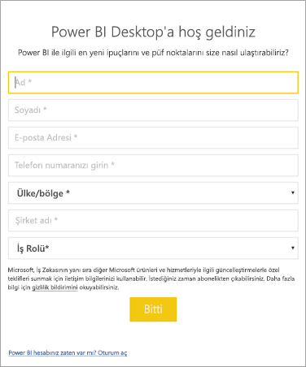

# <a name="administrators-manage-the-power-bi-desktop-sign-in-form"></a>Yöneticiler: Power BI Desktop oturum açma formunu yönetme
Power BI Desktop uygulaması ilk kez açıldığında bir oturum açma formu görüntülenir. Devam etmek için, istenen bilgiler girilebilir veya Power BI'da oturum açılabilir. Yöneticiler bu formu kayıt defteri anahtarı kullanarak yönetir. 



Yöneticiler aşağıdaki kayıt defteri anahtarını kullanarak oturum açma formunu devre dışı bırakır. Bu, genel ilkeler kullanılarak kuruluşun tamamına da gönderilebilir.

```
Key: HKEY_CURRENT_USER\SOFTWARE\Policies\Microsoft\Microsoft Power BI Desktop
valueName: ShowLeadGenDialog
```
Ayrıca, yapılandırmalarına bağlı olarak bazı müşteriler için başarılı olan aşağıdaki anahtarı da deneyebilirsiniz:

```
Key: HKEY_CURRENT_USER\SOFTWARE\Microsoft\Microsoft Power BI Desktop
valueName: ShowLeadGenDialog
```

0 değeri girildiğinde iletişim kutusu devre dışı bırakılır.


Başka bir sorunuz mu var? [Power BI Topluluğu'na sorun](https://community.powerbi.com/)

