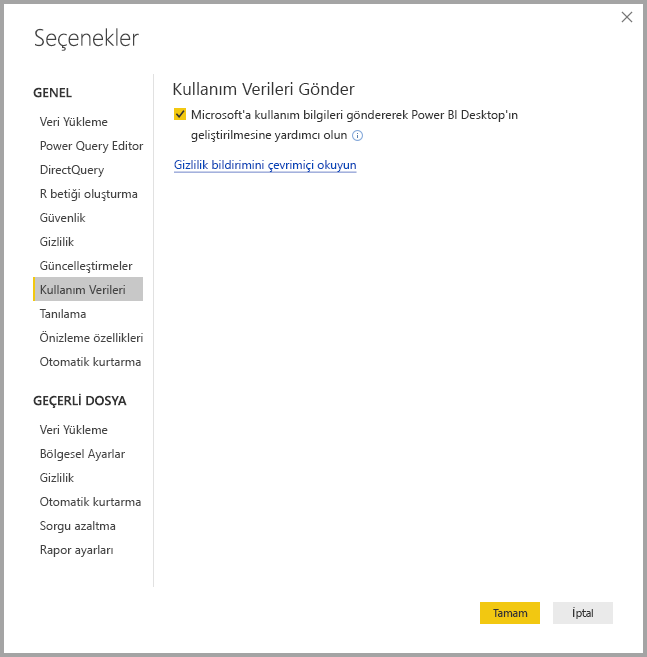
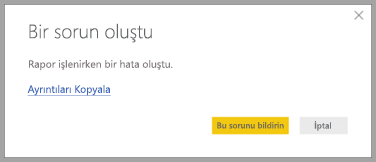

# Power BI Desktop Gizliliği

Microsoft olarak ihtiyacınız olan performansa, güce ve kolaylığa sahip ürünleri kullanımınıza sunarken gizliliğinizi korumak için de çok çalışıyoruz. Microsoft, sorunların tanılanmasına ve ürünün iyileştirilmesine yardımcı olmak için Power BI Desktop kullanımınızla ilgili belirli bilgileri toplar. Microsoft’un gizlilik uygulamaları hakkında daha fazla ayrıntı için lütfen Microsoft Gizlilik Bildirimi’ni gözden geçirin. Bu, **Power BI Desktop** kullanımınızdan topladığımız veriler için geçerlidir.
 
**Power BI Desktop** kullanıcılarından topladığımız bilgiler, işletim sistemi, Power BI Desktop bilgileri ve Internet Explorer sürümleri ile ilgili verileri içerebilir. 
 
Bu veri toplama işlemini iptal etmek istiyorsanız, aşağıdaki görüntüde gösterildiği gibi **Dosya > Seçenekler ve Ayarlar > Seçenekler** bölümüne gidip **Kullanım Verileri** sekmesinde **Kullanım Verileri Gönder** onay kutusunun işaretini kaldırabilirsiniz.

## Ek bilgiler gönderme

Kilitlenme veya başka bir sorunla karşılaşırsanız, hata raporları ve gelecek sürümde sorunu düzeltmemize yardımcı olabilecek ek bilgileri göndermeyi seçebilirsiniz. Ayrıca belge yerel ayarı, etkinleştirilen önizleme özellikleri ve depolama modu gibi üzerinde çalıştığınız **Power BI Desktop** dosyasının durumu hakkında da bilgi toplarız. Bunlar arasında, modelinizdeki formüller, hata iletileri ve ekran görüntüleri yer alabilir. Bu öğeler arasında, bir hata oluştuğunda kullanmakta olduğunuz dosyaların içerikleri yer alabilir. Göndermeden önce bunları gözden geçirmeniz gerekir. Göndermeden önce, Microsoft’a hangi bilgilerin gönderildiğini seçebileceğinizi size hatırlatırız.  
 
Bu bilgileri göndermek istemiyorsanız, bir hata oluştuğunda **Kapat**’a tıklayabilir veya yukarıda açıklandığı gibi kullanım verilerini gönderme işlemini iptal edebilirsiniz.

