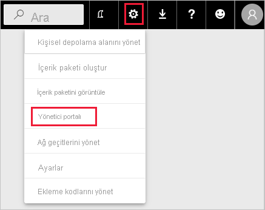
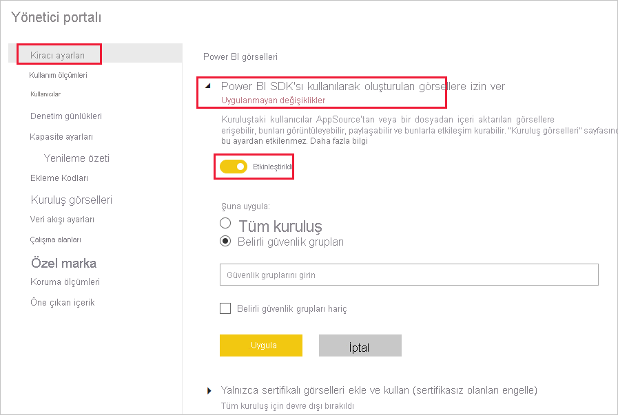
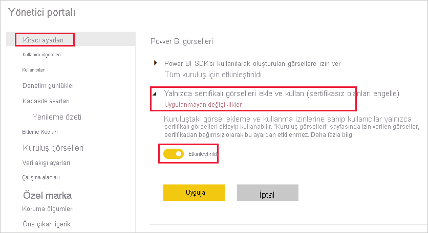
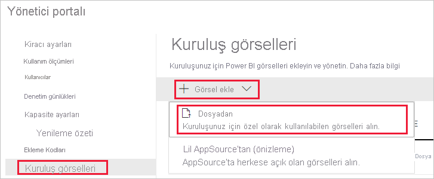
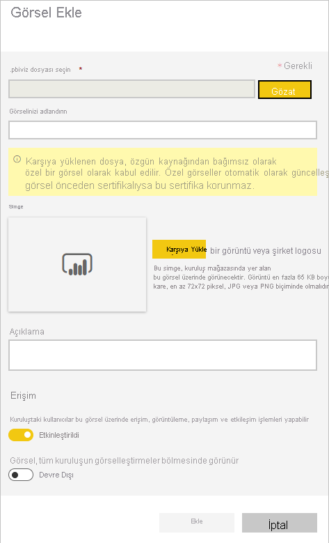
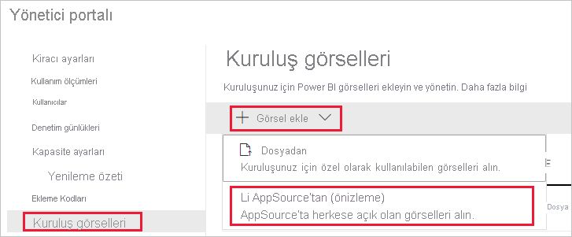
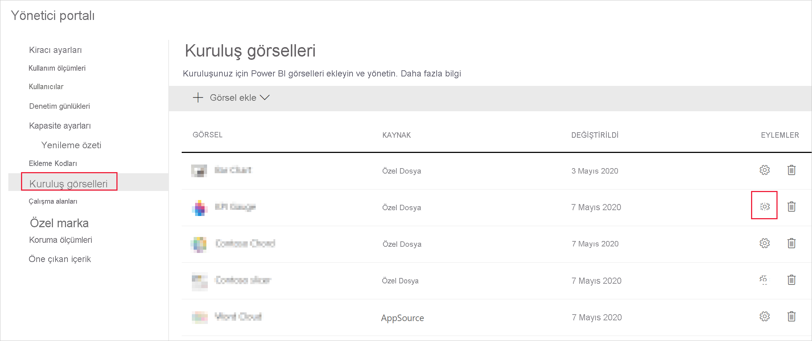

# Power BI görselleri yönetici ayarlarını yönetme

Kuruluşunuzun Power BI yöneticisi olarak, kullanıcıların kuruluş genelinde hangi tür Power BI görsellerine erişebileceğini kontrol edebilirsiniz.

Power BI görsellerini yönetmek için, Office 365’te Genel Yönetici olmanız veya size Power BI hizmet yöneticisi rolü atanmış olması gerekir. Power BI hizmet yöneticisi rolü ile ilgili daha fazla bilgi için bkz. [Power BI yönetici rolünü anlama](service-admin-role.md).

## Yönetici portalına erişme

Makalede açıklanan ayarları etkinleştirmek için yönetici portalına erişmeniz gerekir.

1. Power BI hizmetinde **Ayarlar**’ı seçin.

2. Ayarlar açılan menüsünden **Yönetici portalı**’nı seçin.

    

## Power BI görselleri kiracı ayarları

Kuruluşunuzun Power BI yöneticisi olarak, kullanıcıların kuruluş genelinde hangi tür Power BI görsellerine erişebileceğini kontrol edebilirsiniz.

UI kiracı ayarları yalnızca Power BI hizmetini etkiler. Bu ayarların Power BI Desktop’ta geçerli olmasını istiyorsanız grup ilkelerini kullanın. Her bölümün sonundaki tabloda, Power BI Desktop’ta ayarı etkinleştirmeye yönelik ayrıntılar sağlanır.

>[!NOTE]
>Kiracı ayarlarındaki değişiklikler, [kuruluş görselleri](#organizational-visuals) sekmesinde listelenen Power BI görsellerini etkilemez.

### AppSource veya bir dosyadaki görseller

Aşağıdaki türde Power BI görselleri için kuruluş erişimini yönetme:

* Geliştiriciler tarafından oluşturulan ve .pbiviz dosyası olarak kaydedilen görseller.

* AppSource’da bulunan görseller.

Kuruluşunuzdaki kullanıcıların .pbiviz dosyalarını karşıya yüklemesini ve AppSource’dan raporlarına ve panolarına görseller eklemesini sağlamak için aşağıdaki yönergeleri izleyin.

1. **Power BI SDK’sı kullanılarak oluşturulan görsellere izin ver** ayarlarını genişletin.

2. **Etkin**’e tıklayın.

3. Kimlerin .pbiviz ve AppSource görselleri yükleyebileceğini seçin:

    * Kuruluşunuzdaki herkesin .pbiviz dosyalarını karşıya yüklemesine ve AppSource’dan görseller eklemesine izin vermek için **Tüm kuruluş** seçeneğini belirleyin.

     * .pbiviz dosyalarını karşıya yüklemeyi ve güvenlik gruplarını kullanarak AppSource’dan görseller eklemeyi yönetmek için **Belirli güvenlik grupları** seçeneğini belirleyin. *Tüm güvenlik grupları* metin çubuğuna yönetmek istediğiniz güvenlik gruplarını ekleyin. Belirttiğiniz güvenlik grupları varsayılan olarak dışlanır. Bu güvenlik gruplarını dahil etmek ve kuruluştaki diğer herkesi dışlamak istiyorsanız, **Belirli güvenlik grupları hariç** seçeneğini belirleyin.

4. **Uygula**'ya tıklayın.

Kiracı ayarlarındaki UI değişiklikleri yalnızca Power BI hizmeti için geçerlidir. Kuruluşunuzdaki kullanıcıların, .pbiviz dosyalarını karşıya yüklemesini ve AppSource’dan Power BI Desktop’taki görselleştirme bölmesine görseller eklemesini sağlamak için [Azure AD Grup İlkesi](/azure/active-directory-domain-services/manage-group-policy)‘ni kullanın.

|Anahtar  |Değer adı  |Değer  |
|---------|---------|---------|
|Software\Policies\Microsoft\Power BI Desktop\    |EnableCustomVisuals    |0 - Devre Dışı Bırak  1 - Etkinleştir (varsayılan)         |
|

### Sertifikalı Power BI görselleri

Bu ayar etkinleştirildiğinde, kuruluşunuzun raporlarında ve panolarında yalnızca [sertifikalı Power BI görselleri](../developer/visuals/power-bi-custom-visuals-certified.md) işlenir. AppSource veya dosyalardaki, sertifikalı olmayan Power BI görselleri bir hata iletisi döndürür.

1. Yönetici portalından **Yalnızca sertifikalı görseller ekle ve kullan** seçeneğini belirleyin.

2. **Etkin**’e tıklayın.

3. **Uygula**'ya tıklayın.

Kiracı ayarlarındaki UI değişiklikleri yalnızca Power BI hizmeti için geçerlidir. Power BI Desktop’ta sertifikalı görseller kiracı ayarını yönetmek için [Azure AD Grup İlkesi](/azure/active-directory-domain-services/manage-group-policy)’ni kullanın.

|Anahtar  |Değer adı  |Değer  |
|---------|---------|---------|
|Software\Policies\Microsoft\Power BI Desktop\    |EnableUncertifiedVisuals    |0 - Devre Dışı Bırak  1 - Etkinleştir (varsayılan)         |
|

## Kuruluş görselleri

Power BI yöneticisi olarak, kuruluşunuzun [kurumsal deposunda](../developer/visuals/power-bi-custom-visuals.md#organizational-store) bulunan Power BI görsellerinin listesini yönetebilirsiniz. *Yönetici portalındaki* **Kuruluş görselleri** sekmesi, görseller eklemenize ve kaldırmanıza, kuruluşunuzun kullanıcılarının görselleştirme bölmesinde hangi görsellerin otomatik olarak görüntüleneceğine karar vermenize olanak sağlar. Kuruluşunuzun [kiracı ayarları](#power-bi-visuals-tenant-settings) çelişse bile, sertifikasız görseller ve. .pbiviz görselleri dahil olmak üzere herhangi bir görsel türünü listeye ekleyebilirsiniz.

Kuruluş görselleri ayarları otomatik olarak Power BI Desktop’a dağıtılır.

>[!NOTE]
>Kuruluş görselleri, Power BI Report Server’da desteklenmez.

### Bir dosyadan görsel ekleme

Bir .pbiviz dosyasından yeni bir Power BI görseli eklemek için bu yöntemi kullanın.

> [!WARNING]
> Bir dosyadan karşıya yüklenen Power BI görseli, güvenlik veya gizlilik riski taşıyan kodlar içerebileceğinden, bu görseli kuruluş deponuza dağıtmadan önce görselin yazarına ve kaynağına güvendiğinizden emin olun.

1. **Görsel ekle** > **Dosyadan** seçeneğini belirleyin.

    

2. Şu alanları doldurun:

    * **Bir .pbiviz dosyası seçin** - Karşıya yüklenecek bir görsel dosyası seçin.

    * **Görselinizi adlandırın** - Görsele kısa bir başlık verin, böylece rapor yazarları bu görselin ne işe yaradığını kolayca anlayabilir.

    * **Simge** - Görselleştirme bölmesinde görüntülenmesi için bir simge dosyasını karşıya yükleyin.

    * **Açıklama** - Kullanıcıya daha fazla bağlam sunmak için görselin kısa bir açıklamasını sağlayın.

    * **Erişim** - Bu bölümde iki seçenek vardır:
    
        * Kuruluşunuzdaki kullanıcıların bu görsele erişip erişemeyeceğini seçin. Bu ayar varsayılan olarak etkindir.

        * Bu görselin kuruluşunuzdaki kullanıcıların görselleştirme bölmesinde görünüp görünmeyeceğini seçin. Bu ayar varsayılan olarak devre dışıdır. Daha fazla bilgi için bkz. [Görselleştirme bölmesine görsel ekleme](#add-a-visual-to-the-visualization-pane).

    

3. Karşıya yükleme isteğini başlatmak için **Ekle**’yi seçin. Karşıya yüklendikten sonra görsel, kuruluş görselleri listesinde görüntülenir.

### AppSource’dan görsel ekleme (önizleme)

AppSource’dan yeni bir Power BI görseli eklemek için bu yöntemi kullanın.

AppSource Power BI görsellerini otomatik olarak güncelleştirilir. Kuruluşunuzdaki kullanıcılar her zaman görselin en son sürümüne sahip olur.

1. **Görsel ekle** > **AppSource’dan** seçeneğini belirleyin.

    

2. **Power BI görselleri** penceresinde, eklemek istediğiniz AppSource görselini bulup **Ekle**’ye tıklayın. Karşıya yüklendikten sonra görsel, kuruluş görselleri listesinde görüntülenir.

### Görselleştirme bölmesine görsel ekleme

Kuruluşunuzdaki tüm kullanıcıların görselleştirme bölmesinde otomatik olarak göstermek için kuruluş görselleri sayfasından görselleri seçebilirsiniz.

1. Eklemek istediğiniz görselin satırında **ayarlar**’a tıklayın.

    kuruluş bölmesi

2. Görselleştirme bölmesi ayarını etkinleştirip **Güncelleştir**’e tıklayın.

    

### Dosyadan karşıya yüklenen bir görseli silme

Bir görseli kalıcı olarak silmek için depoda görsele ait çöp kutusu simgesini seçin.

> [!IMPORTANT]
> Silme işlemi geri alınamaz. Görsel silindikten hemen sonra mevcut raporlarda gösterilmemeye başlar. Aynı görseli yeniden yükleseniz dahi silinmiş olanın yerini almaz. Ancak kullanıcılar yeni görseli yeniden içeri aktararak raporlarındaki örneği yenisiyle değiştirebilir.

### .pbiviz görselini devre dışı bırakma

.pbiviz görselini bir yandan kuruluş görselleri listesinde tutarken, diğer yandan [kuruluş deposunda](../developer/visuals/power-bi-custom-visuals.md#organizational-store) bulunmasını devre dışı bırakabilirsiniz.

1. Devre dışı bırakmak istediğiniz .pbiviz görselinin satırında **ayarlar**‘a tıklayın.

2. **Erişim** bölümünde şu ayarı devre dışı bırakın: *Kuruluştaki kullanıcılar bu görsel üzerinde erişim, görüntüleme, paylaşım ve etkileşim işlemleri yapabilir*.

Devre dışı bıraktığınız .pbiviz görselleri var olan raporlarda işlenmez ve aşağıdaki hata iletisi görüntülenir:

*Bu özel görsel artık kullanılamıyor. Ayrıntılar için lütfen yöneticinizle iletişime geçin.*

>[!NOTE]
>Yer işareti eklenen .pbiviz görselleri, devre dışı bırakıldıktan sonra çalışmaya devam eder.

### Karşıya görsel yükleme

AppSource görselleri otomatik olarak güncelleştirilir. AppSource’tan yeni bir sürüm kullanılabilir olduktan sonra, kuruluş görselleri listesi aracılığıyla dağıtılmış daha eski bir sürümün yerini alır.

Bir .pbiviz görselini güncelleştirmek için bu adımları izleyerek görseli değiştirin.

1. Eklemek istediğiniz görselin satırında **ayarlar**’a tıklayın.

2. **Gözat**’a tıklayıp geçerli görseli değiştirmek istediğiniz .pbiviz dosyasını seçin.

3. **Güncelleştir**’e tıklayın.

## Sonraki adımlar

> [!div class="nextstepaction"]
>[Yönetim portalında Power BI’ı yönetme](service-admin-portal.md)

> [!div class="nextstepaction"]
>[Power BI’daki görseller](../developer/visuals/power-bi-custom-visuals.md)

> [!div class="nextstepaction"]
>[Power BI’da kuruluş görselleri](../developer/visuals/power-bi-custom-visuals-organization.md)