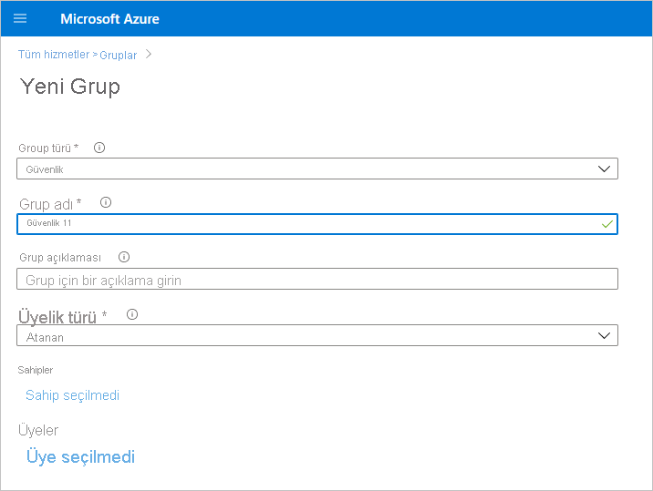

# Salt okunur yönetici API’leri için hizmet sorumlusu kimlik doğrulamasını etkinleştirme (önizleme)

Hizmet sorumlusu, bir Azure Active Directory (Azure AD) uygulamasının Power BI hizmet içeriğine ve API’lerine erişmesine izin vermek için kullanılan bir kimlik doğrulaması yöntemidir.
Bir Azure AD uygulaması oluşturduğunuzda, bir [hizmet sorumlusu nesnesi](/azure/active-directory/develop/app-objects-and-service-principals#service-principal-object) oluşturulur. Yalnızca hizmet sorumlusu olarak da bilinen hizmet sorumlusu nesnesi, Azure AD’nin uygulamanızın kimliğini doğrulamasına olanak sağlar. Kimlik doğrulandıktan sonra uygulama, Azure AD kiracı kaynaklarına erişebilir.

## Yöntem

Power BI salt okunur API'leri için hizmet sorumlusu kimlik doğrulamasını etkinleştirmek için aşağıdaki adımları izleyin:

1. [Bir Azure AD uygulaması oluşturun](/azure/active-directory/develop/howto-create-service-principal-portal). Kullanmak istediğiniz hazır bir Azure AD uygulamanız varsa bu adımı atlayabilirsiniz. App-Id değerini sonraki adımlar için not edin. 
2. Azure Active Directory'de yeni bir **Güvenlik Grubu** oluşturun. [Azure Active Directory kullanarak basit bir grup oluşturma ve üye ekleme adımları hakkında daha fazla bilgi edinin](/azure/active-directory/fundamentals/active-directory-groups-create-azure-portal). Kullanmak istediğiniz hazır bir güvenlik grubu varsa bu adımı atlayabilirsiniz.
    Grup türü olarak **Güvenlik** seçeneğini belirlediğinizden emin olun.

    

3. App-Id değerini oluşturduğunuz güvenlik grubuna üye olarak ekleyin. Bunun için:
    1. **Azure portalı > Azure Active Directory > Gruplar** sayfasına gidip 2. adımda oluşturduğunuz güvenlik grubunu seçin.
    1. **Add Members (Üye Ekle)** seçeneğini belirleyin.
    Not: Kullandığınız uygulamanın Azure portalında ayarlanmış Power BI yönetici rolüne sahip olmadığından emin olun. Bunu denetlemek için: 
       * **Azure portalında** Genel Yönetici, Uygulama Yöneticisi veya Bulut Uygulaması Yöneticisi olarak oturum açın. 
        * **Azure Active Directory**'yi ve ardından **Kurumsal uygulamalar**'ı seçin. 
        * Power BI erişimi vermek istediğiniz uygulamayı seçin. 
        * **İzinler**'i seçin. Uygulamaya verilmiş Power BI admin-consent-required izinleri olmadığından emin olun. Daha fazla bilgi için bkz. [Uygulama onayını yönetme ve onay isteklerini değerlendirme](/azure/active-directory/manage-apps/manage-consent-requests). 
4. Power BI hizmeti yönetici ayarlarını etkinleştirin. Bunu yapmak için:
    1. Power BI yönetim portalında oturum açın. Kiracı ayarları sayfasını görmek için Power BI yöneticisi olmanız gerekir.
    1. **Yönetici API'si ayarları** bölümünde **Hizmet sorumlularının salt okunur Power BI yönetici API'lerini kullanmasına izin ver (Önizleme)** seçeneğini göreceksiniz. Ayarı Etkin duruma getirin ve ardından **Belirli güvenlik grupları** radyo düğmesini seçerek aşağıdaki resimde gösterildiği gibi 2. adımda oluşturduğunuz güvenlik grubunu altında açılan metin kutusuna girin.

        

 5. Salt okunur yönetici API'lerini kullanmaya başlayın. Desteklenen API'ler için aşağıdaki listeye bakın.

    >[!IMPORTANT]
    >Hizmet sorumlusunun Power BI ile kullanımını etkinleştirdikten sonra uygulamanın Azure AD izinleri artık geçerli olmaz. Bundan sonra uygulamanın izinleri Power BI yönetim portalı üzerinden yönetilir.

## Önemli noktalar ve sınırlamalar
* Hizmet sorumlusunu kullanarak Power BI portalında oturum açamazsınız.
* Power BI yönetim portalındaki Yönetici API'si ayarlarında hizmet sorumlusunu etkinleştirmek için Power BI yönetici hakları gereklidir.
* Hizmet sorumlusu şu an için aşağıdaki API'leri desteklemektedir:
    * [GetGroupsAsAdmin](/rest/api/power-bi/admin/groups_getgroupsasadmin) ile $expand; panolar, veri kümeleri, raporlar ve veri akışları için 
    * [GetDashboardsAsAdmin](/rest/api/power-bi/admin/dashboards_getdashboardsasadmin) ile $expand kutucukları
    * [GetDatasourcesAsAdmin](/rest/api/power-bi/admin/datasets_getdatasourcesasadmin) 
    * [GetDatasetToDataflowsLinksAsAdmin](/rest/api/power-bi/admin/datasets_getdatasettodataflowslinksingroupasadmin)
    * [GetDataflowDatasourcesAsAdmin](/rest/api/power-bi/admin/dataflows_getdataflowdatasourcesasadmin) 
    * [GetDataflowUpstreamDataflowsAsAdmin](/rest/api/power-bi/admin/dataflows_getupstreamdataflowsingroupasadmin) 
    * [GetCapacitiesAsAdmin](/rest/api/power-bi/admin/getcapacitiesasadmin)
    * [GetActivityLog](/rest/api/power-bi/admin/getactivityevents)
    * [GetModifiedWorkspaces](/rest/api/power-bi/admin/workspaceinfo_getmodifiedworkspaces)
    * [WorkspaceGetInfo](/rest/api/power-bi/admin/workspaceinfo_postworkspaceinfo)
    * [WorkspaceScanStatus](/rest/api/power-bi/admin/workspaceinfo_getscanstatus)
    * [WorkspaceScanResult](/rest/api/power-bi/admin/workspaceinfo_getscanresult)