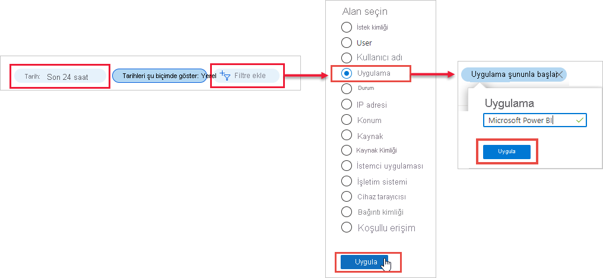
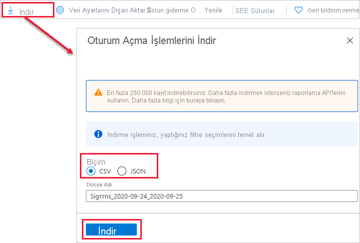

# Oturum açmış Power BI kullanıcılarını bulma

Kuruluşunuzda yöneticisiyseniz ve Power BI'da kimin oturum açtığını görmek istiyorsanız [Azure Active Directory erişim ve kullanım raporlarını](/azure/active-directory/reports-monitoring/concept-sign-ins) kullanın.

> [!NOTE]
> **Oturum açma işlemleri** raporu yararlı bilgiler sunar ancak her kullanıcının sahip olduğu lisans türünü tanımlamaz. Lisansları görüntülemek için Microsoft 365 yönetim merkezini kullanın.

## Gereksinimler

Kullanıcılar, kendi oturum açma işlemlerinin raporunu görüntüleyebilir. Tüm kullanıcılarınızı kapsayan raporu görmek için şu rollerden birinde olmanız gerekir: Genel Yönetici, Güvenlik Yöneticisi, Güvenlik Okuyucusu, Genel Okuyucu veya Rapor Okuyucusu.

## Oturum açma işlemlerini görüntülemek için Azure Active Directory yönetim merkezini kullanma

Oturum açma etkinliğini görüntülemek için aşağıdaki adımları izleyin.

1. [Azure Active Directory yönetim merkezinde](https://aad.portal.azure.com) oturum açın ve ardından portal menüsünden **Azure Active Directory**'yi seçin.

1. Kaynak menüsünden **İzleme** > **Oturum açma işlemleri**'ni seçin.
   
    

1. Varsayılan olarak tüm kullanıcıların ve uygulamaların son 24 saat içindeki oturum açma işlemleri gösterilir. Farklı bir zaman aralığı seçmek için çalışma bölmesinde **Tarih**'i seçip uygun zaman aralıklarından birini belirleyin. Yalnızca son yedi güne ait bilgiler kullanılabilir. Yalnızca Power BI ile ilgili oturum açma işlemlerini görüntülemek için filtre ekleyin. **Filtre ekle**'yi seçin, filtreleme ölçütü olarak **Uygulama**'yı ve ardından **Uygula**'yı seçin. Çalışma bölmesinin üst tarafından **Uygulama şununla başlar**'ı seçip uygulama adını girin. **Uygula**’yı seçin.

    **Microsoft Power BI** filtresi, hizmetle ilgili oturum açma etkinliğini gösterir. **Power BI Gateway** filtresi, şirket içi veri ağ geçidiyle ilgili oturum açma etkinliğini gösterir.
   
    

## Verileri dışarı aktarma

[Bir oturum açma raporunu](/azure/active-directory/reports-monitoring/quickstart-download-sign-in-report) iki biçimden biriyle indirebilirsiniz: CSV dosyası veya JSON dosyası.

1. **Oturum açma işlemleri** raporunun komut çubuğundan **İndir**'i seçip aşağıdaki seçeneklerden birini belirleyin:

   * O sırada filtrelenmiş veri için bir CSV dosyası indirmek için **CSV**.

   * O sırada filtrelenmiş veri için bir JSON dosyası indirmek için **JSON**.

2. Bir dosya adı yazın ve **İndir**'i seçin.

## Veri saklama

Azure AD premium lisansına sahip olan kuruluşların haricinde oturum açma işlemleriyle ilgili veriler en fazla yedi gün saklanır. Azure AD Premium P1 veya Azure AD Premium P2 kullanıyorsanız son 30 güne ait verileri görebilirsiniz. Daha fazla bilgi için bkz. [Azure Active Directory rapor saklama ilkeleri](/azure/active-directory/reports-monitoring/reference-reports-data-retention).

## Sonraki adımlar

[Kullanıcı etkinliğini denetleme](service-admin-auditing.md)

Başka bir sorunuz mu var? [Power BI Topluluğu'na sorun](https://community.powerbi.com/)