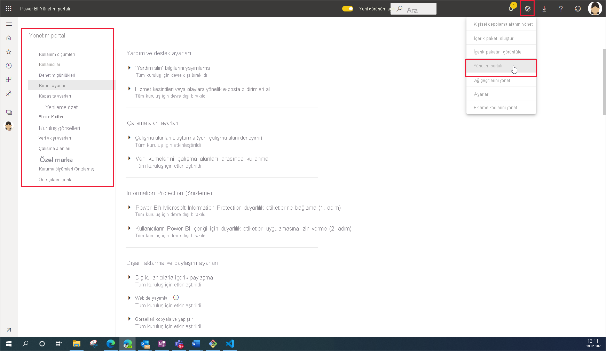

# Power BI yönetimi nedir?

Power BI yönetimi, Power BI’ın nasıl çalıştığını denetleyen kuruluş genelindeki ayarların yönetimidir. Yönetici rollerine atanan kullanıcılar kuruluş kaynaklarını yapılandırır, izler ve sağlar. Bu makalede çalışmaya başlamanıza yardımcı olacak yönetim rolleri, görevleri ve araçlarına ilişkin genel bir bakış sunulmaktadır.

## Power BI ile ilgili yönetici rolleri

Kuruluşunuz için Power BI’ı yönetmek üzere birlikte çalışan birkaç rol vardır. Çoğu yönetici rolü Microsoft 365 yönetim merkezinden veya PowerShell kullanılarak atanır. Kapasite oluşturulduğunda, Power BI Premium Kapasitesi ve Power BI Embedded Kapasitesi yönetici rolleri atanır. Yönetici rollerinin her biri hakkında daha fazla bilgi edinmek için bkz. [Yönetici rolleri hakkında](https://docs.microsoft.com/microsoft-365/admin/add-users/about-admin-roles?view=o365-worldwide). Yönetici rollerini atamayı öğrenmek için bkz. [Yönetici rolleri atama](https://docs.microsoft.com/microsoft-365/admin/add-users/assign-admin-roles?view=o365-worldwide).

| **Yönetici türü** | **Yönetim kapsamı** | **Power BI görevleri** |
| --- | --- | --- |
| Genel yönetici | Microsoft 365 | Kuruluşun tüm yönetim özelliklerine sınırsız erişimi vardır |
| | | Diğer kullanıcılara roller atar |
| Faturalama yöneticisi | Microsoft 365 | Abonelikleri yönetme |
| | | Lisans satın alma |
| Lisans yöneticisi | Microsoft 365 | Kullanıcılara lisans atayıp kaldırma |
| Kullanıcı yöneticisi | Microsoft 365 | Kullanıcıları ve grupları oluşturup yönetme |
| | | Kullanıcı parolalarını sıfırlama |
| Power BI yöneticisi | Power BI hizmeti | Power BI yönetim görevlerine tam erişim|
| | | Power BI özelliklerini etkinleştirip devre dışı bırakma |
| | | Kullanım ve performans raporu oluşturma |
| | | Denetimi gözden geçirip yönetme |
| Power BI Premium Kapasitesi yöneticisi | Tek bir Premium kapasite | Kapasiteye çalışma alanları atama|
| | | Kapasitenin kullanıcı izinlerini yönetme |
| | | Bellek kullanımını yapılandırmak için iş yüklerini yönetme |
| | | Kapasiteyi yeniden başlatma |
| Power BI Embedded Kapasitesi yöneticisi | Tek bir Embedded kapasitesi | Kapasiteye çalışma alanları atama|
| | | Kapasitenin kullanıcı izinlerini yönetme |
| | | Bellek kullanımını yapılandırmak için iş yüklerini yönetme |
| | | Kapasiteyi yeniden başlatma |

## Yönetimsel görevler ve araçlar

Power BI yöneticileri çoğunlukla Power BI yönetici portalında çalışır. Yine de, ilgili araçları ve yönetici merkezlerini tanımanız gerekir. Burada listelenen araçları kullanarak görevleri yapmak için gereken rolü belirlemek amacıyla yukarıdaki tabloya bakın.

| **Araç** | **Tipik görevler** |
| --- | --- |
| [Power BI Yönetici Portalı](https://app.powerbi.com/admin-portal) | Premium kapasite edinme ve birlikte çalışma |
| | Hizmet kalitesi sağlama |
| | Çalışma alanlarını yönetme |
| | Power BI görsellerini yayımlama |
| | Power BI’yı diğer uygulamalara eklemek için kullanılan kodları doğrulama |
| | Veri erişimi ve diğer sorunları giderme |
| [Microsoft 365 yönetim merkezi](https://admin.microsoft.com) | Kullanıcıları ve grupları yönetme |
| | Lisansları satın alıp atama |
| | Kullanıcıların Power BI’ya erişmesini engelleme |
| [Microsoft 365 Güvenlik ve Uyumluluk Merkezi](https://protection.office.com) | Denetimi gözden geçirip yönetme |
| | Veri sınıflandırma ve izleme |
| | Veri kaybı önleme ilkeleri |
| | Bilgi idaresi |
| [Azure portalında Azure Active Directory (AAD)](https://aad.portal.azure.com) | Power BI kaynaklarına koşullu erişimi yapılandırma |
| | Power BI Embedded kapasitesi sağlama |
| [PowerShell cmdlet'leri](https://docs.microsoft.com/powershell/power-bi/overview) | Betikler aracılığıyla çalışma alanlarını ve Power BI’ın diğer yönlerini yönetme |
| [Yönetim API’leri ve SDK’sı](service-admin-reference.md) | Özel yönetici araçları oluşturun. Örneğin, Power BI Desktop bu API’leri kullanarak yönetimle ilgili verileri temel alan raporlar oluşturabilir. |

## Sonraki adımlar

Power BI yönetimine dahil olan özellikler hakkında temel bilgilere sahip olduğunuza göre, daha fazla bilgi edinmek için aşağıdaki makalelere başvurabilirsiniz:

- [Power BI yönetim portalını kullanma](service-admin-portal.md)
- [Kiracı yöneticisi ayarları rehberi](../guidance/admin-tenant-settings.md)
- [PowerShell cmdlet’lerini kullanma](https://docs.microsoft.com/powershell/power-bi/overview)
- [Power BI yönetimi SSS](service-admin-faq.md)
- [Kuruluşunuzdaki kullanıcılar için Power BI hizmetini lisanslama](service-admin-licensing-organization.md)
- Sorularınız mı var? [Power BI Topluluğu'na sorun](https://community.powerbi.com/)
- Önerileriniz mi var? [Power BI'ı geliştirmek için fikirlerinizi paylaşın](https://ideas.powerbi.com/)
