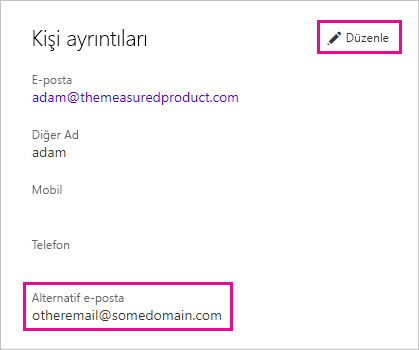

# <a name="use-an-alternate-email-address"></a>Alternatif e-posta adresi kullanma

Power BI'a kaydolurken bir e-posta adresi belirtirsiniz. Power BI, hizmet etkinlikleriyle ilgili güncelleştirmeleri göndermek için varsayılan olarak bu adresi kullanır. Örneğin size gönderilen paylaşım davetiyeleri bu adrese yönlendirilir.

Bazı durumlarda bu e-postaların kayıt sırasında kullandığınızdan farklı bir e-posta adresine teslim edilmesini isteyebilirsiniz. Bu makalede Microsoft 365 ve PowerShell'de alternatif e-posta adresi belirtme adımları anlatılmaktadır. Makalede ayrıca Azure Active Directory'nin (Azure AD) bir e-posta adresini nasıl çözümlediği açıklanmaktadır.

> [!NOTE]
> Alternatif bir e-posta adresinin belirtilmesi, Power BI’ın e-posta abonelikleri, hizmet güncelleştirmeleri, bültenler ve diğer tanıtım amaçlı yazışmalar için kullandığı e-posta adresini etkilemez. Bu yazışmalar her zaman Power BI'a kaydolurken kullandığınız e-posta adresine gönderilir.

## <a name="use-microsoft-365"></a>Microsoft 365’i kullanma

Microsoft 365'te alternatif adres belirtmek için aşağıdaki adımları izleyin.

1. Hesabınızın [kişisel bilgiler](https://portal.office.com/account/#personalinfo) sayfasını açın. Uygulamada sorulursa, Power BI için kullandığınız e-posta adresini ve parolayı kullanarak oturum açın.

1. Soldaki menüden **Kişisel bilgiler**'i seçin.

1. **Kişi ayrıntıları** bölümünde **Düzenle**'yi seçin.

    Bilgilerinizi düzenleyemiyorsanız e-posta adresiniz yöneticiniz tarafından yönetiliyor demektir. E-posta adresinizi güncelleştirmek için yöneticinize başvurun.

    

1. **Alternatif e-posta** alanına Microsoft 365’in Power BI güncelleştirmeleri için kullanılmasını istediğiniz e-posta adresini girin.

## <a name="use-powershell"></a>PowerShell'i kullanma

PowerShell'de alternatif adres belirtmek için [Set-AzureADUser](/powershell/module/azuread/set-azureaduser/) komutunu kullanın.

```powershell
Set-AzureADUser -ObjectId john@contoso.com -OtherMails "otheremail@somedomain.com"
```

## <a name="email-address-resolution-in-azure-ad"></a>Azure AD'de e-posta adresi çözümlemesi

Power BI için bir Azure AD ekleme belirteci yakalamak istiyorsanız üç farklı türde e-posta adresi kullanabilirsiniz:

* Bir kullanıcının Azure AD hesabıyla ilişkili ana e-posta adresi

* UserPrincipalName (UPN) e-posta adresi

* *Diğer e-posta adresi* dizisi özniteliği

Power BI, kullanılacak e-posta adresini şu sıralamaya göre seçer:

1. Azure AD kiracısının kullanıcı nesnesindeki posta özniteliği mevcutsa Power BI, e-posta adresi için söz konusu posta özniteliğini kullanır.

1. UPN e-postası bir **\*.onmicrosoft.com** etki alanı e-posta adresi ("\@" sembolünden sonra gelen bilgiler) *değilse* Power BI, e-posta adresi için bu posta özniteliğini kullanır.

1. Azure AD kullanıcı nesnesinde *diğer e-posta adresi* dizisi özniteliği mevcutsa Power BI söz konusu listedeki ilk e-posta adresini (bu öznitelikte e-postalardan oluşan bir liste olabileceği için) kullanır.

1. Yukarıdaki koşulların hiçbiri mevcut değilse Power BI, UPN adresini kullanır.

Başka bir sorunuz mu var? [Power BI Topluluğu'na başvurun](https://community.powerbi.com/)
