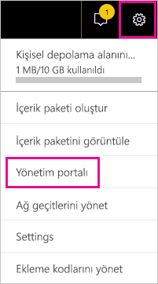
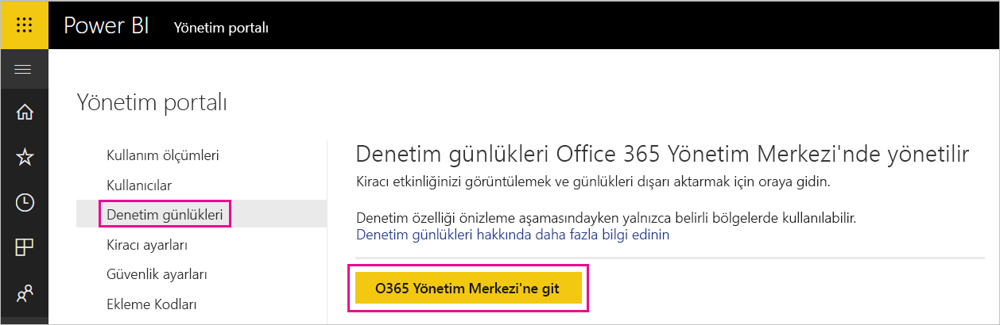
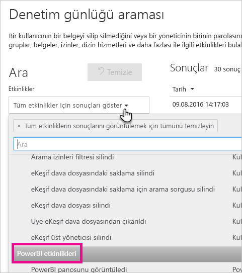
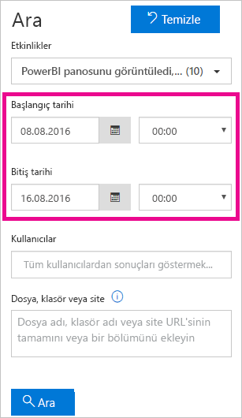
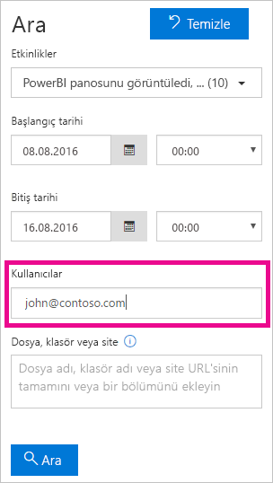
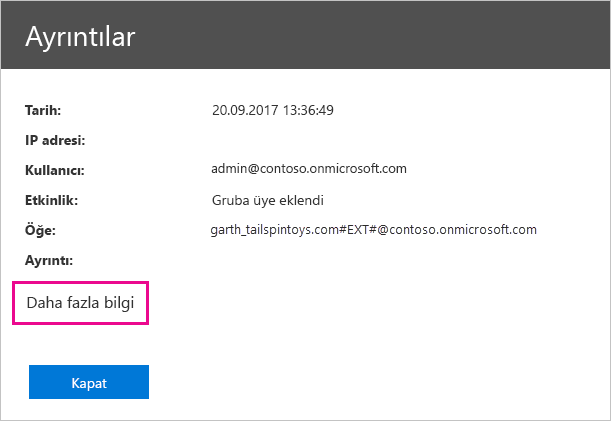
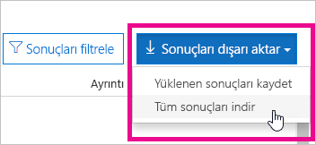

# <a name="track-user-activities-in-power-bi"></a>Power BI'da kullanıcı etkinliklerini izleme

Power BI kiracınızdaki öğeler üzerinde gerçekleştirilen eylemleri ve bunları kimin yaptığını bilmek kuruluşunuzun mevzuata uygunluk ve kayıt yönetimi gibi gereksinimleri karşılamasına yardımcı olması konusunda kritik öneme sahip olabilir. Power BI'la kullanıcı etkinliğini izlemek için iki seçeneğiniz vardır: [Power BI etkinlik günlüğü](#use-the-activity-log) ve [birleşik Office 365 denetim günlüğü](#use-the-audit-log). Bu günlüklerin her ikisi de [Power BI denetim verilerinin](#operations-available-in-the-audit-and-activity-logs) eksiksiz kopyasını içerir ama aşağıdaki tabloda özetlendiği gibi bazı önemli farklılıklar vardır.

| **Birleşik Office 365 denetim günlüğü** | **Power BI etkinlik günlüğü** |
| --- | --- |
| Power BI denetim olaylarına ek olarak SharePoint Online, Exchange Online, Dynamics 365 ve diğer hizmetlerden olayları içerir. | Yalnızca Power BI denetim olaylarını içerir. |
| Yalnızca genel yöneticiler ve denetçiler gibi Yalnızca Görüntülenebilir Denetim Günlükleri ve Denetim Günlükleri izinleri olan kullanıcılar erişebilir. | Genel yöneticilerin ve Power BI hizmeti yöneticilerinin erişimi vardır. |
| Genel yöneticiler ve denetçiler Office 365 Güvenlik ve Uyumluluk Merkezi'ni, Microsoft 365 Güvenlik Merkezi'ni ve Microsoft 365 Uyumluluk Merkezi'ni kullanarak birleşik denetim günlüğünde arama yapabilir. | Henüz etkinlik günlüğünde arama yapmaya yönelik kullanıcı arabirimi yoktur. |
| Genel yöneticiler ve denetçiler Office 365 Yönetim API'lerini ve cmdlet'leri kullanarak denetim günlüğü girdilerini indirebilir. | Genel yöneticiler ve Power BI hizmeti yöneticileri Power BI REST API'sini ve yönetim cmdlet'ini kullanarak etkinlik günlüğü girdilerini indirebilir. |
| Denetim verilerini 90 gün süreyle tutar | Etkinlik verilerini 30 gün süreyle tutar (genel önizleme). |
| Kiracı farklı bir Azure bölgesine taşınsa bile denetim verilerini korur. | Kiracı farklı bir Azure bölgesine taşındığında etkinlik verilerini korumaz. |


## <a name="use-the-activity-log"></a>Ekinlik günlüğünü kullanma

Power BI hizmeti yöneticisi olarak, Power BI etkinlik günlüğüne dayalı özel raporları kullanarak tüm Power BI kaynakları için kiracı düzeyinde kullanımı analiz edebilirsiniz. REST API veya PowerShell cmdlet'i kullanarak etkinlikleri indirebilirsiniz. Ayrıca etkinlik verilerini tarih aralığına, kullanıcıya ve etkinlik türüne göre filtreleyebilirsiniz.

### <a name="activity-log-requirements"></a>Etkinlik günlüğü gereksinimleri

Power BI etkinlik günlüğüne erişmek için şu gereksinimleri karşılamanız gerekir:

- Genel yönetici veya Power BI hizmeti yöneticisi olmalısınız.
- [Power BI Yönetim cmdlet'lerini](https://www.powershellgallery.com/packages/MicrosoftPowerBIMgmt) yerel olarak yüklediniz veya Azure Cloud Shell'de Power BI Yönetim cmdlet'lerini kullandınız.

### <a name="activityevents-rest-api"></a>ActivityEvents REST API'si

Etkinlik olaylarını blob deposuna veya SQL veritabanına aktarmak için Power BI REST API'lerine dayalı bir yönetim uygulaması kullanabilirsiniz. Ardından dışarı aktarılan verilerin üzerinde özel bir kullanım raporu oluşturabilirsiniz. **ActivityEvents** REST API çağrısında başlangıç tarihiyle bitiş tarihini ve isteğe bağlı olarak etkinlikleri etkinlik türüne veya kullanıcı kimliğine göre seçmek üzere bir filtre belirtmeniz gerekir. Etkinlik günlüğü çok büyük miktarlarda veri içerebildiğinden **ActivityEvents** API'si şu anda istek başına yalnızca bir günlük verileri indirmeyi destekler. Diğer bir deyişle, aşağıdaki örnekte olduğu gibi başlangıç tarihiyle bitiş tarihinde aynı gün belirtilmelidir. DateTime değerlerini UTC biçiminde belirttiğinizden emin olun.

```
https://api.powerbi.com/v1.0/myorg/admin/activityevents?startDateTime='2019-08-31T00:00:00'&endDateTime='2019-08-31T23:59:59'
```

Girdi sayısı çok fazlaysa **ActivityEvents** API'si yalnızca 5.000 - 10.000 dolayında girdi ve bir devamlılık belirteci döndürür. Sonraki girdi kümesini almak için devamlılık belirteciyle **ActivityEvents** API’sini yeniden çağırın. Tüm girdileri alana kadar ve artık devamlılık belirteci almadığınız aşamaya kadar bu şekilde devam edin. Aşağıdaki örnekte devamlılık belirtecinin nasıl kullanılacağı gösterilir.

```
https://api.powerbi.com/v1.0/myorg/admin/activityevents?continuationToken='%2BRID%3ARthsAIwfWGcVAAAAAAAAAA%3D%3D%23RT%3A4%23TRC%3A20%23FPC%3AARUAAAAAAAAAFwAAAAAAAAA%3D'
```

Döndürülen girdilerin sayısından bağımsız olarak, sonuçlar devamlılık belirteci içeriyorsa kalan verileri almak için bu belirteci kullanarak API’yi yeniden çağırın ve devamlılık belirtecinin döndürülmediği aşamaya kadar bunu sürdürün. Hiçbir olay girdisi kalmadığında bile devamlılık belirtecinin döndürüldüğü durumlar olabilir. Aşağıdaki örnekte yanıtta döndürülen devamlılık belirteciyle nasıl döngü yapıldığı gösterilir:

```
while(response.ContinuationToken != null)
{
   // Store the activity event results in a list for example
    completeListOfActivityEvents.AddRange(response.ActivityEventEntities);

    // Make another call to the API with continuation token
    response = GetPowerBIActivityEvents(response.ContinuationToken)
}
completeListOfActivityEvents.AddRange(response.ActivityEventEntities);
```
> [!NOTE]
> Tüm etkinliklerin görünmesi 24 saate kadar beklemeniz gerekebilir. Ancak genelde tüm veriler çok daha erken sunulur.
>
>
### <a name="get-powerbiactivityevent-cmdlet"></a>Get-PowerBIActivityEvent cmdlet'i

PowerShell için Power BI Yönetim cmdlet’lerini kullanarak etkinlik olaylarını indirin. **Get-PowerBIActivityEvent** cmdlet’i devamlılık belirtecini sizin için otomatik olarak işler. **Get-PowerBIActivityEvent** cmdlet'i **ActivityEvents** REST API'siyle aynı kısıtlamalarla StartDateTime ve EndDateTime parametrelerini alır. Diğer bir deyişle başlangıç tarihi ile bitiş tarihi aynı tarih değerine başvurmalıdır çünkü bir kerede yalnızca bir günlük etkinlik verilerini alabilirsiniz.

Aşağıdaki betik Power BI etkinliklerinin nasıl indirileceğini gösterir. Tek tek etkinlik özelliklerine kolay erişim için komut sonuçlar JSON'dan .NET nesnelerine dönüştürür. Bu örnekler, hiçbir etkinliği kaçırmamanız için bir güne ilişkin en küçük ve en büyük zaman damgalarını gösterir.

```powershell
Login-PowerBI

$activities = Get-PowerBIActivityEvent -StartDateTime '2019-08-31T00:00:00' -EndDateTime '2019-08-31T23:59:59' | ConvertFrom-Json

$activities.Count
$activities[0]

```

### <a name="filter-activity-data"></a>Etkinlik verilerini filtreleme

Etkinlik verilerini etkinlik türüne ve kullanıcı kimliğine göre filtreleyebilirsiniz. Aşağıdaki betik yalnızca **ViewDashboard** etkinliğine ilişkin olay verilerinin nasıl indirileceğini gösterir. Desteklenen parametreler hakkında daha fazla bilgi edinmek için `Get-Help Get-PowerBIActivityEvent` komutunu kullanın.

```powershell
Login-PowerBI

$activities = Get-PowerBIActivityEvent -StartDateTime '2019-08-31T00:00:00' -EndDateTime '2019-08-31T23:59:59' -ActivityType 'ViewDashboard' | ConvertFrom-Json

$activities.Count
$activities[0]

```

## <a name="use-the-audit-log"></a>Denetim günlüğünü kullanma

Göreviniz Power BI ve Office 365'te kullanıcı etkinliklerini izlemekse, Office 365 Güvenlik ve Uyumluluk Merkezi'deki denetim özelliğiyle çalışır veya PowerShell'i kullanırsınız. Denetim, Power BI'ı desteklemek için otomatik olarak sağlanan Exchange Online'ın işlevselliğine dayanır.

Denetim verilerini tarih aralığına, kullanıcıya, panoya, rapora, veri kümesine ve etkinlik türüne göre filtreleyebilirsiniz. İsterseniz etkinlikleri csv (virgülle ayrılmış değer) dosyası halinde indirerek çevrimdışı analiz gerçekleştirebilirsiniz.

### <a name="audit-log-requirements"></a>Denetim günlüğü gereksinimleri

Denetim günlüklerine erişmek için şu gereksinimleri karşılamanız gerekir:

- Denetim günlüğüne erişmek için genel yönetici olmanız veya size Exchange Online'da Denetim Günlükleri veya Yalnızca Görüntülemeli Denetim Günlükleri rolü atanmış olması gerekir. Varsayılan olarak, bu roller Exchange yönetim merkezinin **İzinler** sayfasında Uyumluluk Yönetimi ve Kuruluş Yönetimi rol gruplarına atanır.

    Yönetici olmayan hesapların denetim günlüğüne erişmesini sağlamak için kullanıcıyı bu rol gruplarından birine üye olarak ekleyin. Bunu başka bir şekilde yapmak isterseniz, Exchange yönetim merkezinde özel bir rol grubu oluşturabilir, bu gruba Denetim Günlükleri veya Yalnızca Görüntülemeli Denetim Günlükleri rolünü atayabilir ve sonra da yönetici olmayan hesabı yeni rol grubuna ekleyebilirsiniz. Daha fazla bilgi için bkz. [Exchange Online'da rol gruplarını yönetme](/Exchange/permissions-exo/role-groups).

    Microsoft 365 yönetim merkezinden Exchange yönetim merkezine erişemiyorsanız, https://outlook.office365.com/ecp adresine gidin ve kimlik bilgilerinizi kullanarak oturum açın.

- Denetim günlüğüne erişiminiz varsa ancak genel yönetici veya Power BI hizmeti yöneticisi değilseniz Power BI Yönetim portalına erişemezsiniz. Bu durumda doğrudan [Office 365 Güvenlik ve Uyumluluk Merkezi](https://sip.protection.office.com/#/unifiedauditlog) bağlantısını kullanın.

### <a name="access-your-audit-logs"></a>Denetim günlüklerinize erişme

Günlüklere erişmek için öncelikle Power BI'da günlüğe kaydetme özelliğini etkinleştirdiğinizden emin olun. Daha fazla bilgi için yönetici portalı belgelerinin [Denetim günlükleri](service-admin-portal.md#audit-logs) bölümüne bakın. Denetimi etkinleştirdikten sonra denetim verilerini görüntülemek için 48 saate kadar beklemeniz gerekebilir. Verileri hemen göremiyorsanız denetim günlüklerini daha sonra denetleyin. Denetim günlüklerini görüntüleme izni alma ile günlüklere erişebilme arasında da benzer bir gecikme olabilir.

Power BI denetim günlüklerine doğrudan [Office 365 Güvenlik ve Uyumluluk Merkezi](https://sip.protection.office.com/#/unifiedauditlog)'nden erişebilirsiniz. Power BI yönetici portalında doğrudan bir bağlantı da mevcuttur:

1. Power BI'da sağ üst köşedeki **dişli simgesini** ve ardından **Yönetici portalı**'nı seçin.

   

1. **Denetim günlükleri**'ni seçin.

1. **O365 Yönetim Merkezi'ne git** seçeneğini belirleyin.

   

### <a name="search-only-power-bi-activities"></a>Yalnızca Power BI etkinliklerinde arama yapma

Aşağıdaki adımları izleyerek sonuçları yalnızca Power BI etkinlikleriyle sınırlayabilirsiniz. Etkinlik listesi için bu makalenin devamındaki [Power BI tarafından denetlenen etkinlikler](#operations-available-in-the-audit-and-activity-logs) listesine bakın.

1. **Denetim günlüğü arama** sayfasının **Ara** bölümünde **Etkinlikler** açılan menüsünü seçin.

2. **Power BI etkinlikleri**'ni seçin.

   

3. Dışındaki herhangi bir alanı seçerek seçim kutusunu kapatın.

Aramalarınız yalnızca Power BI etkinliklerini döndürür.

### <a name="search-the-audit-logs-by-date"></a>Denetim günlüklerinde tarihe göre arama yapma

**Başlangıç tarihi** ve **Bitiş tarihi** alanlarını kullanarak günlüklerde tarihe göre arama yapabilirsiniz. Son yedi gün varsayılan seçimdir. Ekranda tarih ve saat Eşgüdümlü Evrensel Saat (UTC) biçiminde gösterilir. Belirtebileceğiniz maksimum tarih aralığı 90 gündür. 

Seçilen tarih aralığı 90 günden fazlaysa bir hata alırsınız. 90 gün olan maksimum tarih aralığını kullanıyorsanız **Başlangıç tarihi** için içinde bulunduğunuz saati seçin. Bunu yapmamanız halinde başlangıç tarihinin bitiş tarihinden daha erken olduğunu belirten bir hata alırsınız. Denetimi son 90 gün içinde etkinleştirdiyseniz tarih aralığının başlangıç tarihi, denetimin etkinleştirildiği tarihten önceki bir gün olamaz.



### <a name="search-the-audit-logs-by-users"></a>Denetim günlüklerinde kullanıcılara göre arama yapma

Denetim günlüğü girişlerinde, gerçekleştirilen etkinlikler için belirli kullanıcılara göre arama yapabilirsiniz. **Kullanıcılar** alanına bir veya daha fazla kullanıcı adı girin. Kullanıcı adı bir e-posta adresine benzer. Bu, kullanıcıların Power BI’da oturum açtığı hesaptır. Kuruluşunuzdaki tüm kullanıcılara (ve hizmet hesaplarına) ait girişleri döndürmek için bu kutuyu boş bırakın.



### <a name="view-search-results"></a>Arama sonuçlarını görüntüleme

**Ara**’yı seçtikten sonra arama sonuçları yüklenir. Birkaç dakika sonra **Sonuçlar** altında gösterilir. Arama tamamlandığında bulunan sonuç sayısı ekranda gösterilir. **Denetim günlüğü araması** en fazla 1000 olay gösterir. Arama ölçütlerine uyan 1000’den fazla olay varsa, uygulama en yeni 1000 olayı gösterir.

#### <a name="view-the-main-results"></a>Ana sonuçları görüntüleme

**Sonuçlar** alanı bu arama sonucunda döndürülen olaylar hakkında bilgiler içerir. Sonuçları sıralamak için **Sonuçlar** bölümündeki sütun başlıklarından birini seçin.

| **Column** | **Tanım** |
| --- | --- |
| Tarih |Olayın gerçekleştiği tarih ve saat (UTC biçiminde). |
| IP adresi |Günlüğe kaydedilen etkinlik için kullanılan cihazın IP adresi. Uygulama, IP adresini IPv4 veya IPv6 adresi biçiminde gösterir. |
| Kullanıcı |Olayı tetikleyen eylemi gerçekleştiren kullanıcı (veya hizmet hesabı). |
| Etkinlik |Kullanıcı tarafından gerçekleştirilen etkinlik. Bu değer, **Etkinlikler** açılan listesinde seçtiğiniz etkinliklere karşılık gelir. Exchange yönetimi denetim günlüğünden bir olay için bu sütundaki değer Exchange cmdlet olur. |
| Öğe |İlgili etkinlik nedeniyle oluşturulmuş veya değiştirilmiş olan nesne. Örneğin, görüntülenen veya değiştirilen dosya ya da güncelleştirilmiş kullanıcı hesabı. Etkinliklerin hepsi için bu sütunda değer görüntülenmez. |
| Ayrıntı |Bir etkinlikle ilgili ayrıntılı bilgiler. Bu sütunda da tüm etkinlikler için değer görüntülenmez. |

#### <a name="view-the-details-for-an-event"></a>Olay ayrıntılarını görüntüleme

Bir olay hakkında daha fazla ayrıntı görüntülemek için arama sonuçlarında olay kaydını seçin. Olay kaydının ayrıntılı özelliklerini içeren **Ayrıntılar** sayfası görüntülenir. **Ayrıntılar** sayfasında, olayın gerçekleştiği Office 365 hizmetine bağlı olarak özellikler gösterilir.

Bu bilgileri görüntülemek için **Daha fazla bilgi**'yi seçin. Tüm Power BI girişlerinin RecordType özelliği 20 değerine sahiptir. Diğer özellikler hakkında bilgi için bkz. [Denetim günlüğündeki ayrıntılı özellikler](/office365/securitycompliance/detailed-properties-in-the-office-365-audit-log/).

   

### <a name="export-search-results"></a>Arama sonuçlarını dışarı aktarma

Power BI denetim günlüğünü CSV dosyası biçiminde dışarı aktarmak için aşağıdaki adımları izleyin.

1. **Sonuçları dışarı aktar**'ı seçin.

1. **Yüklenen sonuçları kaydet**'i veya **Tüm sonuçları indir**'i seçin.

    

### <a name="use-powershell-to-search-audit-logs"></a>Denetim günlüklerinde arama yapmak için PowerShell'i kullanma

Oturum açma bilgilerinize göre denetim günlüklerine erişmek için PowerShell'i de kullanabilirsiniz. Aşağıdaki örnekte Exchange Online PowerShell'e nasıl bağlanılacağı ve Power BI denetim günlüğü girdilerini çekmek için [Search-UnifiedAuditLog](/powershell/module/exchange/policy-and-compliance-audit/search-unifiedauditlog?view=exchange-ps/) komutunun nasıl kullanılacağı gösterilir. Betiği çalıştırmak için, [Denetim günlüğü gereksinimleri](#audit-log-requirements) bölümünde açıklandığı gibi bir yöneticinin uygun izinleri size ataması gerekir.

```powershell
Set-ExecutionPolicy RemoteSigned

$UserCredential = Get-Credential

$Session = New-PSSession -ConfigurationName Microsoft.Exchange -ConnectionUri https://outlook.office365.com/powershell-liveid/ -Credential $UserCredential -Authentication Basic -AllowRedirection

Import-PSSession $Session
Search-UnifiedAuditLog -StartDate 9/11/2018 -EndDate 9/15/2018 -RecordType PowerBI -ResultSize 1000 | Format-Table | More
```

### <a name="use-powershell-to-export-audit-logs"></a>Denetim günlüklerini dışarı aktarmak için PowerShell’i kullanma

Denetim günlükleri aramanızın sonuçlarını dışarı aktarmak için PowerShell de kullanabilirsiniz. Aşağıdaki örnekte [Search-UnifiedAuditLog](/powershell/module/exchange/policy-and-compliance-audit/search-unifiedauditlog?view=exchange-ps/) komutundan nasıl gönderebileceğiniz ve [Export-Csv](/powershell/module/microsoft.powershell.utility/export-csv) cmdlet’ini kullanarak sonuçları nasıl dışarı aktarabileceğiniz gösterilmektedir. Betiği çalıştırmak için, [Denetim günlüğü gereksinimleri](#audit-log-requirements) bölümünde açıklandığı gibi bir yöneticinin uygun izinleri size ataması gerekir.

```powershell
$UserCredential = Get-Credential

$Session = New-PSSession -ConfigurationName Microsoft.Exchange -ConnectionUri https://outlook.office365.com/powershell-liveid/ -Credential $UserCredential -Authentication Basic -AllowRedirection

Import-PSSession $Session
Search-UnifiedAuditLog -StartDate 9/11/2019 -EndDate 9/15/2019 -RecordType PowerBI -ResultSize 5000 |
Export-Csv -Path "c:\temp\PowerBIAuditLog.csv" -NoTypeInformation

Remove-PSSession $Session
```

Exchange Online’a bağlanma hakkında daha fazla bilgi için bkz. [Connect to Exchange Online PowerShell (Exchange Online PowerShell’e bağlanma)](/powershell/exchange/exchange-online/connect-to-exchange-online-powershell/connect-to-exchange-online-powershell/). Denetim günlükleriyle PowerShell kullanımı üzerine başka bir örnek için bkz. [Power BI Pro lisanslarını atamak için Power BI denetim günlüğünü ve PowerShell'i kullanma](https://powerbi.microsoft.com/blog/using-power-bi-audit-log-and-powershell-to-assign-power-bi-pro-licenses/).

## <a name="operations-available-in-the-audit-and-activity-logs"></a>Denetim ve etkinlik günlüklerinde kullanılabilen işlemler

Hem denetim hem de etkinlik günlüklerinde aşağıdaki işlemler kullanılabilir.

| Kolay ad                                     | İşlem adı                              | Notlar                                  |
|---------------------------------------------------|---------------------------------------------|------------------------------------------|
| Power BI ağ geçidine veri kaynağı eklendi             | AddDatasourceToGateway                      |                                          |
| Power BI klasörüne erişim eklendi                      | AddFolderAccess                             | Şu anda kullanılmıyor                       |
| Power BI grup üyeleri eklendi                      | AddGroupMembers                             |                                          |
| Yönetici, veri akışı depolama hesabını kiracıya ekledi | AdminAttachedDataflowStorageAccountToTenant | Şu anda kullanılmıyor                       |
| Power BI veri kümesi çözümleme                         | AnalyzedByExternalApplication               |                                          |
| Power BI raporu analiz edildi                          | AnalyzeInExcel                              | Kullanıcılar hizmetle etkileşim kurduğunda oluşturulur. `*.odc` dosyasının indirilmesi bir denetim olayı oluşturmaz                                         |
| Ekli veri akışı depolama hesabı                 | AttachedDataflowStorageAccount              |                                          |
| Ağ geçidine bağlanmış Power BI veri kümesi                | BindToGateway                               |                                          |
| Veri akışı yenileme iptal edildi                        | CancelDataflowRefresh                       |                                          |
| Kapasite durumu değiştirildi                            | ChangeCapacityState                         |                                          |
| Kapasite kullanıcı ataması değiştirildi                  | UpdateCapacityUsersAssignment               |                                          |
| Power BI veri kümesi bağlantıları değiştirildi              | SetAllConnections                           |                                          |
| Power BI ağ geçidi yöneticilerinin değiştirilmesi                   | ChangeGatewayAdministrators                 |                                          |
| Değiştirilen Power BI ağ geçidi veri kaynağı kullanıcıları        | ChangeGatewayDatasourceUsers                |                                          |
| Kurumsal Power BI içerik paketi oluşturuldu      | CreateOrgApp                                |                                          |
| Power BI uygulaması oluşturuldu                              | CreateApp                                   |                                          |
| Power BI panosu oluşturuldu                        | CreateDashboard                             |                                          |
| Power BI veri akışı oluşturuldu                         | CreateDataflow                              |                                          |
| Power BI veri kümesi oluşturuldu                          | CreateDataset                               |                                          |
| Power BI e-posta aboneliği oluşturuldu               | CreateEmailSubscription                     |                                          |
| Power BI klasörü oluşturuldu                           | CreateFolder                                |                                          |
| Power BI ağ geçidi oluşturma                          | CreateGateway                               |                                          |
| Power BI grubu oluşturuldu                            | CreateGroup                                 |                                          |
| Power BI raporu oluşturuldu                           | CreateReport <sup>1</sup>                                |                                          |
| Veri akışı dış depolama hesabına geçirildi     | DataflowMigratedToExternalStorageAccount    | Şu anda kullanılmıyor                       |
| Veri akışı izinleri eklendi                        | DataflowPermissionsAdded                    | Şu anda kullanılmıyor                       |
| Veri akışı izinleri kaldırıldı                      | DataflowPermissionsRemoved                  | Şu anda kullanılmıyor                       |
| Kurumsal Power BI içerik paketi silindi      | DeleteOrgApp                                |                                          |
| Power BI açıklaması silindi                          | DeleteComment                               |                                          |
| Power BI panosu silindi                        | DeleteDashboard                             | Şu anda kullanılmıyor                       |
| Power BI veri akışı silindi                         | DeleteDataflow                              | Şu anda kullanılmıyor                       |
| Power BI veri kümesi silindi                          | DeleteDataset                               |                                          |
| Power BI e-posta aboneliği silindi               | DeleteEmailSubscription                     |                                          |
| Power BI klasörü silindi                           | DeleteFolder                                |                                          |
| Power BI klasörüne erişim silindi                    | DeleteFolderAccess                          | Şu anda kullanılmıyor                       |
| Power BI ağ geçidi silme                          | DeleteGateway                               |                                          |
| Power BI grubu silindi                            | DeleteGroup                                 |                                          |
| Power BI raporu silindi                           | DeleteReport                                |                                          |
| Power BI veri kümesi veri kaynakları keşfedildi          | GetDatasources                              |                                          |
| Power BI raporu indirme                        | DownloadReport                              |                                          |
| Veri akışı özellikleri düzenlendi                        | EditDataflowProperties                      |                                          |
| Power BI sertifika izni düzenlendi          | EditCertificationPermission                 | Şu anda kullanılmıyor                       |
| Power BI panosu düzenlendi                         | EditDashboard                               | Şu anda kullanılmıyor                       |
| Power BI veri kümesi düzenlendi                           | EditDataset                                 |                                          |
| Power BI veri kümesi özellikleri düzenlendi                | EditDatasetProperties                       | Şu anda kullanılmıyor                       |
| Power BI raporu düzenlendi                            | EditReport                                  |                                          |
| Power BI veri akışı dışarı aktarıldı                        | ExportDataflow                              |                                          |
| Power BI raporu görsel verileri dışarı aktarıldı              | ExportReport                                |                                          |
| Power BI kutucuk verileri dışarı aktarıldı                       | ExportTile                                  |                                          |
| Veri akışı izinleri eklenemedi                | FailedToAddDataflowPermissions              | Şu anda kullanılmıyor                       |
| Veri akışı izinleri kaldırılamadı             | FailedToRemoveDataflowPermissions           | Şu anda kullanılmıyor                       |
| Power BI veri akışı SAS belirteci oluşturuldu             | GenerateDataflowSasToken                    |                                          |
| Power BI Ekleme Belirteci oluşturuldu                    | GenerateEmbedToken                          |                                          |
| Dosya Power BI'a aktarıldı                         | İçeri Aktar                                      |                                          |
| Power BI uygulaması yüklendi                            | InstallApp                                  |                                          |
| Çalışma alanı bir kapasiteye geçirildi                  | MigrateWorkspaceIntoCapacity                |                                          |
| Power BI açıklaması gönderildi                           | PostComment                                 |                                          |
| Power BI panosu yazdırıldı                        | PrintDashboard                              |                                          |
| Power BI rapor sayfası yazdırıldı                      | PrintReport                                 |                                          |
| Power BI raporu web'de yayımlandı                  | PublishToWebReport <sup>2</sup>                         |                                          |
| Key Vault'tan Power BI veri akışı gizli dizisi alındı  | ReceiveDataflowSecretFromKeyVault           |                                          |
| Veri kaynağını Power BI ağ geçidinden kaldırma         | RemoveDatasourceFromGateway                 |                                          |
| Power BI grup üyeleri kaldırıldı                    | DeleteGroupMembers                          |                                          |
| Çalışma alanı kapasiteden kaldırıldı                 | RemoveWorkspacesFromCapacity                |                                          |
| Power BI panosu yeniden adlandırıldı                        | RenameDashboard                             |                                          |
| Power BI veri akışı yenileme isteği gönderildi               | RequestDataflowRefresh                      | Şu anda kullanılmıyor                       |
| Power BI veri kümesi yenileme isteği gönderildi                | RefreshDataset                              |                                          |
| Power BI çalışma alanları alındı                     | GetWorkspaces                               |                                          |
| Çalışma alanı için veri akışı depolama konumu ayarlandı     | SetDataflowStorageLocationForWorkspace      |                                          |
| Power BI veri akışı üzerinde zamanlanmış yenileme ayarlandı        | SetScheduledRefreshOnDataflow               |                                          |
| Power BI veri kümesi üzerinde zamanlanmış yenileme ayarlandı         | SetScheduledRefresh                         |                                          |
| Power BI panosu paylaşıldı                         | ShareDashboard                              |                                          |
| Power BI raporu paylaşıldı                            | ShareReport                                 |                                          |
| Power BI uzatılmış deneme sürümünü başlatma                   | OptInForExtendedProTrial                    | Şu anda kullanılmıyor                       |
| Power BI deneme sürümü başlatıldı                            | OptInForProTrial                            |                                          |
| Power BI veri kaynağı devralındı                   | TakeOverDatasource                          |                                          |
| Power BI veri kümesi devralındı                        | TakeOverDataset                             |                                          |
| Power BI veri akışı devralındı                     | TookOverDataflow                             |                                          |
| Power BI uygulaması yayımdan kaldırıldı                          | UnpublishApp                                |                                          |
| Kapasite kaynağı idare ayarları güncelleştirildi      | UpdateCapacityResourceGovernanceSettings    | Şu anda Microsoft 365 yönetim merkezinde değil |
| Kapasite yöneticisi güncelleştirildi                            | UpdateCapacityAdmins                        |                                          |
| Kapasitenin görünen adı güncelleştirildi                     | UpdateCapacityDisplayName                   |                                          |
| Veri akışı depolama alanı atama izinleri güncelleştirildi   | UpdatedDataflowStorageAssignmentPermissions |                                          |
| Kuruluşun Power BI ayarları güncelleştirildi          | UpdatedAdminFeatureSwitch                   |                                          |
| Power BI uygulaması güncelleştirildi                              | UpdateApp                                   |                                          |
| Power BI veri akışı güncelleştirildi                         | UpdateDataflow                              |                                          |
| Power BI veri kümesi veri kaynakları güncelleştirildi             | UpdateDatasources                           |                                          |
| Power BI veri kümesi parametreleri güncelleştirildi               | UpdateDatasetParameters                     |                                          |
| Power BI e-posta aboneliği güncelleştirildi               | UpdateEmailSubscription                     |                                          |
| Power BI klasörü güncelleştirildi                           | UpdateFolder                                |                                          |
| Power BI klasörüne erişim güncelleştirildi                    | UpdateFolderAccess                          |                                          |
| Power BI ağ geçidi veri kaynağı kimlik bilgileri güncelleştirildi  | UpdateDatasourceCredentials                 |                                          |
| Power BI panosu görüntülendi                         | ViewDashboard                               |                                          |
| Power BI veri akışı görüntülendi                          | ViewDataflow                                |                                          |
| Power BI raporu görüntülendi                            | ViewReport                                  |                                          |
| Power BI kutucuğu görüntülendi                              | ViewTile                                    |                                          |
| Power BI kullanım ölçümleri görüntülendi                     | ViewUsageMetrics                            |                                          |
|                                                   |                                             |                                          |

<sup>1</sup> Power BI Desktop’tan hizmette yayımlama işlemi, hizmette bir CreateReport etkinliğidir.

<sup>2</sup> PublishtoWebReport, [Web’de yayımla](../collaborate-share/service-publish-to-web.md) özelliğine başvurur.

## <a name="next-steps"></a>Sonraki adımlar

[Power BI yönetimi nedir?](service-admin-administering-power-bi-in-your-organization.md)  

[Power BI Yönetici Portalı](service-admin-portal.md)  

Başka bir sorunuz mu var? [Power BI Topluluğu'na sorun](https://community.powerbi.com/)
