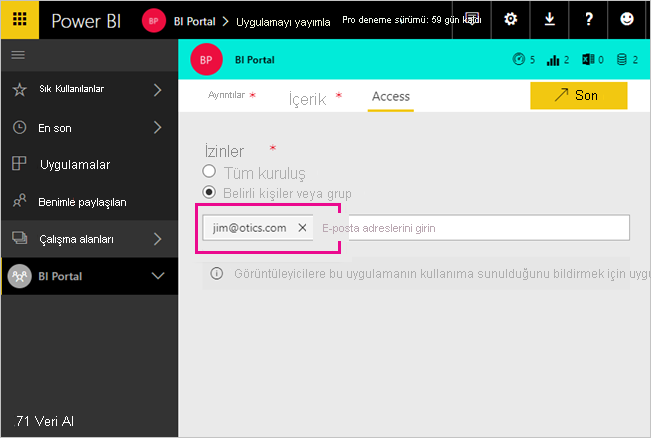

# Azure AD B2B ile Power BI içeriklerini dış konuk kullanıcılara dağıtma

Power BI, İşletmeler Arası Azure Active Directory (Azure AD B2B) aracılığıyla dış konuk kullanıcılarla içerik paylaşma imkanı sunar. Kuruluşunuz Azure AD B2B'yi kullanarak dış kullanıcılarla paylaşım yapılmasını tek bir yerden etkinleştirir ve yönetir. Dış kullanıcılar varsayılan olarak yalnızca tüketim izinlerine sahiptir. Ayrıca, kuruluşunuzun dışından konuk kullanıcılara kuruluşta bulunan içeriği düzenleme ve yönetme izni verebilirsiniz.

Bu makalede Power BI'da Azure AD B2B'ye temel giriş bilgileri sağlanır. Daha fazla bilgi için bkz. [Azure Active Directory B2B'yi kullanarak Power BI içeriğini dış konuk kullanıcılara dağıtma](../guidance/whitepaper-azure-b2b-power-bi.md).

## Erişimi etkinleştirme

Konuk kullanıcıları davet etmeden önce Power BI yönetim portalında [Dış kullanıcılarla içerik paylaşma](service-admin-portal.md#export-and-sharing-settings) özelliğini etkinleştirdiğinizden emin olun. Bu seçenek etkinleştirildiğinde bile kullanıcının konuk kullanıcılar davet edebilmek için Azure Active Directory’de Konuk Davet Eden rolüne sahip olması gerekir.

[Harici konuk kullanıcıların kuruluş içeriklerini düzenlemelerine ve yönetmelerine izin ver](service-admin-portal.md#allow-external-guest-users-to-edit-and-manage-content-in-the-organization) seçeneği, konuk kullanıcılara çalışma alanlarındaki içeriği görme ve oluşturma imkanı tanımanızı sağlar ve kuruluşunuzun Power BI'ına göz atmak da buna dahildir.

> [!NOTE]
> [Dış kullanıcılarla içerik paylaşma](service-admin-portal.md#export-and-sharing-settings) ayarı, Power BI'ın kuruluşunuza dış kullanıcı davet edilmesine izin verip vermeyeceğini denetler. Daveti kabul eden dış kullanıcı kuruluşunuzda Azure AD B2B konuk kullanıcısı olur. Power BI deneyiminin her tarafındaki kişi seçicilerde bu kullanıcılar gösterilir. Ayar devre dışı bırakılırsa kuruluşunuzdaki mevcut konuk kullanıcılar zaten erişim sahibi oldukları tüm öğelere erişmeye ve kişi seçici deneyimlerinde listelenmeye devam eder. Buna ek olarak, [planlanmış davet](#planned-invites) yaklaşımıyla eklenen konuklar da kişi seçicilerde gösterilir. Konuk kullanıcıların Power BI’a erişimini engellemek için Azure AD koşullu erişim ilkesi kullanın.

## Kimleri davet edebilirsiniz?

Gmail.com, outlook.com ve hotmail.com gibi kişisel hesaplar da dahil olmak üzere çoğu e-posta adresi konuk kullanıcı davet etmek için desteklenir. Azure AD B2B'de bu adresler *sosyal kimlik* olarak adlandırılır.

[Power BI for US Government](service-govus-overview.md) gibi kamu bulutuyla ilişkilendirilmiş kullanıcıları davet edemezsiniz.

## Konuk kullanıcı davet etme

Konuk kullanıcıları kuruluşunuza davet ederken ilk seferinde davet göndermeniz yeterlidir. Kullanıcıları davet etmek için planlı veya geçici davetleri kullanın.

Geçici davetleri kullanmak için aşağıdaki özellikleri kullanın:

* Rapor ve Pano paylaşımı
* Uygulama erişimi listesi

Geçici davetler, çalışma alanı erişim listeleri için desteklenmez. Bu kullanıcıları kuruluşunuza eklemek için [planlanmış davetler yaklaşımını](#planned-invites) kullanın. Dış kullanıcı kuruluşunuza bir konuk olarak dahil olduktan sonra onu çalışma alanı erişim listesine ekleyin.

### Planlanmış davetler

Hangi kullanıcıları davet edeceğinizi biliyorsanız planlı davetleri kullanın. Azure portalı veya PowerShell aracılığıyla davet gönderebilirsiniz. Kişileri davet etmek için kullanıcı yöneticisi rolüne atanmanız gerekir.

Azure portalda davet göndermek için aşağıdaki adımları izleyin.

1. [Azure portalda](https://portal.azure.com)**Azure Active Directory**'yi seçin.

1. **Yönet** bölümünde **Kullanıcılar** > **Tüm kullanıcılar** > **Yeni konuk kullanıcı**'yı seçin.

    

1. **E-posta adresini** girin ve **kişisel ileti** ekleyin.

    

1. **Davet et** seçeneğini belirleyin.

Birden fazla konuk kullanıcıyı davet etmek için PowerShell’i kullanın veya Azure AD’de toplu davet oluşturun. Toplu davet amacıyla PowerShell’i kullanmak için [Öğretici: Azure AD B2B işbirliği kullanıcılarını toplu davet etme](/azure/active-directory/b2b/bulk-invite-powershell/) adlı öğreticideki adımları izleyin. Toplu davet amacıyla Azure portalını kullanmak için [Öğretici: Azure AD B2B işbirliği kullanıcılarını toplu davet etme](/azure/active-directory/b2b/tutorial-bulk-invite/) adlı öğreticideki adımları izleyin.

Kullanıcının, aldığı e-posta davetindeki **Get Started** (Başlayın) seçeneğini belirlemesi gerekir. Konuk kullanıcı, bu işlemden sonra kuruluşa eklenir.

### Geçici davetler

Dilediğiniz zaman dış kullanıcıyı davet etmek için, onu paylaşım kullanıcı özellik aracılığıyla panonuza veya raporunuza ya da erişim sayfası aracılığıyla uygulamanıza ekleyin. Bir uygulamayı kullanması için bir dış kullanıcıyı davet ederken ne yapılacağına ilişkin bir örnek burada verilmiştir.

Konuk kullanıcı, uygulamayı kendisiyle paylaştığınızı belirten bir e-posta alır.

Konuk kullanıcının, kuruluşuna ait e-posta adresi ile oturum açması gerekir. Oturum açtıktan sonra daveti kabul etmesine yönelik bir istem alır. Oturum açma işleminden sonra konuk kullanıcı için uygulama açılır. Kullanıcının uygulamaya dönmek için bağlantıya yer işareti eklemesi veya e-postayı kaydetmesi gerekir.

## Lisanslama

Paylaştığınız içeriği görüntüleyebilmesi için konuk kullanıcının düzgün lisansa sahip olması gerekir. Kullanıcının düzgün lisansı olduğundan emin olmanın üç yolu vardır: Power BI Premium'u kullanma, bir Power BI Pro lisansı atama veya konuğun Power BI Pro lisansını kullanma.

[Kuruluştaki içeriği düzenleyebilen ve yönetebilen konuk kullanıcıların](service-admin-portal.md#allow-external-guest-users-to-edit-and-manage-content-in-the-organization) çalışma alanlarına içerik eklemek veya içeriği başkalarıyla paylaşmak için Power BI Pro lisansına sahip olması gerekir.

### Power BI Premium kullanma

Çalışma alanının [Power BI Premium kapasitesine](service-premium-what-is.md) atanması, konuk kullanıcının uygulamayı bir Power BI Pro lisansına ihtiyaç duymadan kullanabilmesine olanak sağlar. Power BI Premium uygulamaların artırılmış yenileme sıklığı, ayrılmış kapasite ve büyük model boyutları gibi başka özelliklerden de yararlanmasına izin verir.

### Konuk kullanıcıya Power BI Pro lisansı atama

Konuk kullanıcıya kuruluşunuzdaki bir Power BI Pro lisansının atanması, konuk kullanıcının kendisiyle paylaşılan içeriği görüntülemesine olanak sağlar. Lisansları atama hakkında daha fazla bilgi için bkz. [Lisanslar sayfasında kullanıcılara lisans atama](/office365/admin/manage/assign-licenses-to-users#assign-licenses-to-users-on-the-licenses-page). Konuk kullanıcılara Pro lisansları atamadan önce, Microsoft'la aranızdaki lisans sözleşmesinin koşullarına uyduğunuzdan emin olmak için [Ürün Koşulları sitesine](https://www.microsoft.com/licensing/terms) bakın.

### Konuk kullanıcının kendi Power BI Pro lisansına sahip olması

Konuk kullanıcının, kendi kuruluşları aracılığıyla zaten onlara atanmış bir Power BI Pro lisansı olabilir.

## İçeriği düzenleyebilen ve yönetebilen konuk kullanıcılar

[Harici konuk kullanıcıların kuruluş içeriklerini düzenlemelerine ve yönetmelerine izin ver](service-admin-portal.md#allow-external-guest-users-to-edit-and-manage-content-in-the-organization) özelliğini kullanırken, belirtilen konuk kullanıcılar kuruluşunuzun Power BI'ına ek erişim elde eder. İzin verilen konuklar izne sahip oldukları içeriği görebilir, Giriş’e erişebilir, çalışma alanlarına göz atabilir, uygulamaları yükleyebilir, erişim listesinde bulundukları yeri görebilir ve çalışma alanları içeriğine katkıda bulunabilir. Yeni çalışma alanı deneyiminin kullanıldığı çalışma alanları oluşturabilir ve bu çalışma alanlarının Yöneticisi olabilir. Bazı sınırlamalar geçerlidir. Önemli Noktalar ve Sınırlamalar bölümünde bu kısıtlamalar listelenir.

İzin verilen konukların Power BI'da oturum açmalarına yardımcı olmak için onlara Kiracı URL'sini sağlayın. Kiracı URL'sini bulmak için şu adımları izleyin.

1. Power BI hizmetinde üst bilgi menüsünden yardım simgesini ( **?** ) ve ardından **Power BI Hakkında**’yı seçin.

2. **Kiracı URL'si** öğesinin yanındaki değere bakın. Kiracı URL'nizi izin verilen konuk kullanıcılarınızla paylaşın.

    

## Önemli Noktalar ve Sınırlamalar

* Varsayılan olarak, dış Azure AD B2B konukları yalnızca içeriğin tüketimiyle sınırlandırır. Dış Azure AD B2B konukları uygulamaları, panoları ve raporları görüntüleyebilmenin yanı sıra panolar ile raporlara yönelik olarak verileri dışarı aktarabilir ve e-posta abonelikleri oluşturabilir. Çalışma alanlarına erişemez veya kendi içeriklerini yayımlayamazlar. Bu kısıtlamaları kaldırmak için [Harici konuk kullanıcıların kuruluş içeriklerini düzenlemelerine ve yönetmelerine izin ver](service-admin-portal.md#allow-external-guest-users-to-edit-and-manage-content-in-the-organization) özelliğini kullanabilirsiniz.

* Konuk kullanıcıları davet etmek için bir Power BI Pro lisansı gerekir. Pro Deneme kullanıcıları Power BI’da konuk kullanıcı davet edemez.

* Bazı deneyimler [kuruluştaki içeriği düzenleyebilen ve yönetebilen konuk kullanıcılar](service-admin-portal.md#allow-external-guest-users-to-edit-and-manage-content-in-the-organization) tarafından kullanılamaz. Raporları güncelleştirmek veya yayımlamak için, konuk kullanıcıların Power BI Desktop dosyalarını karşıya yüklerken Veri Al’ı kullanmak da dahil olmak üzere Power BI hizmetini kullanmaları gerekir.  Aşağıdaki deneyimler desteklenmez:
  * Power BI Desktop'tan Power BI hizmetine doğrudan yayımlama
  * Konuk kullanıcılar Power BI hizmetindeki hizmet veri kümelerine bağlanmak için Power BI Desktop kullanamaz
  * Microsoft 365 Gruplarına bağlanan klasik çalışma alanları
    * Konuk kullanıcılar bu çalışma alanlarını oluşturamaz ve bunların Yöneticisi olamaz
    * Konuk kullanıcılar üye olabilir
  * Çalışma alanı erişim listeleri için geçici davet gönderme desteklenmez
  * Konuk kullanıcılarda Excel için Power BI Publisher desteklenmez
  * Konuk kullanıcılar Power BI Gateway yükleyemez ve bunu kuruluşunuza bağlayamaz
  * Konuk kullanıcılar kuruluşun tamamına yayımlayan uygulamalar yükleyemez
  * Konuk kullanıcılar kurumsal içerik paketlerini kullanamaz, oluşturamaz, güncelleştiremez veya yükleyemez
  * Konuk kullanıcılar Excel'de Çözümle özelliğini kullanamaz
  * Konuk kullanıcılar yorumlarda @mentioned olarak yer alamaz
  * Konuk kullanıcılar abonelikleri kullanamaz
  * Bu özelliği kullanan konuk kullanıcıların iş veya okul hesabı olmalıdır

* Sosyal kimliklerini kullanan konuk kullanıcılar oturum açma kısıtlamalarından kaynaklanan daha fazla sınırlamayla karşılaşır.
  * Power BI hizmetindeki tüketim deneyimlerini bir web tarayıcısı aracılığıyla kullanabilirler
  * Power BI Mobil uygulamalarını kullanamazlar
  * Bir iş veya okul hesabının gerekli olduğu durumda oturum açamazlar

* Bu özellik şu anda Power BI SharePoint Online raporu web bölümüyle kullanılamaz.

* Dış konuk kullanıcıların kuruluşunuz genelinde yapabileceklerini sınırlayabilen Azure Active Directory ayarları vardır. Bu ayarlar Power BI ortamınıza da uygulanır. Aşağıdaki belgelerde bu ayarlar açıklanır:
  * [Dış İşbirliği Ayarlarını Yönetme](/azure/active-directory/b2b/delegate-invitations#configure-b2b-external-collaboration-settings)
  * [Belirli kuruluşlardan B2B kullanıcılarına gönderilen davetlere izin verme veya engelleme](https://docs.microsoft.com/azure/active-directory/b2b/allow-deny-list)
  * [Erişime izin vermek veya erişimi engellemek için Koşullu Erişim kullanma](/azure/active-directory/conditional-access/concept-conditional-access-cloud-apps)

* GCC gibi bir kamu bulutundaki içeriği bir dış ticari bulut kullanıcısıyla paylaşabilirsiniz. Ancak, konuk kullanıcı kendi lisansını kullanamaz. İçeriğin, erişimin etkinleştirilmesi için Premium’a atanmış bir kapasitede bulunması gerekir. Alternatif olarak, konuk hesabına bir Power BI Pro lisansı atayabilirsiniz.

* Kuruluşunuzun dışında paylaşma Almanya ve Çin bulut örnekleri gibi ulusal bulutlarda desteklenmez. Bunun yerine kuruluşunuzda dış kullanıcıların içeriğe erişmek için kullanabilecekleri kullanıcı hesapları oluşturun.

* Doğrudan bir konuk kullanıcıyla paylaşım yaptığınızda Power BI onlara bağlantı içeren bir e-posta gönderir. E-posta gönderilmesini önlemek için konuk kullanıcıyı bir güvenlik grubuna ekleyin ve güvenlik grubu ile paylaşım yapın.  

## Sonraki adımlar

Satır düzeyi güvenliğin nasıl çalıştığını öğrenmek ve daha ayrıntılı bilgi edinmek için teknik incelemeyi gözden geçirin: [Azure AD B2B kullanarak Power BI içeriklerini dış konuk kullanıcılara dağıtma](https://aka.ms/powerbi-b2b-whitepaper).

Azure AD B2B hakkında daha fazla bilgi için bkz. [Azure AD B2B işbirliği nedir?](/azure/active-directory/active-directory-b2b-what-is-azure-ad-b2b/).
