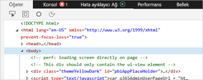
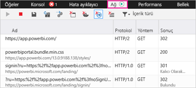
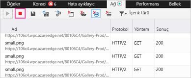
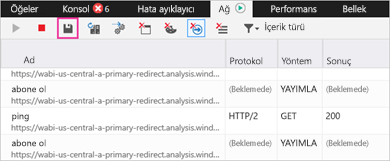

# Power BI için ek tanılama bilgilerini yakalama

Bu makalede Power BI web istemcisinden el ile ek tanılama bilgisi toplamak için kullanabileceğiniz yönergeler sunulmaktadır.

1. Microsoft Edge veya Internet Explorer kullanarak [Power BI](https://app.powerbi.com)'a gidin.

1. Microsoft Edge geliştirici araçlarını açmak için **F12** tuşuna basın.

   

1. **Ağ** sekmesini seçin. Önceden yakalanmış olan trafik listelenir.

   

    Seçenekleriniz şunlardır:

    * Pencereye göz atın ve karşılaştığınız sorunu tekrarlayın.

    * Oturum sırasında dilediğiniz zaman F12'ye basarak geliştirici araçları penceresini gizleyin ve gösterin.

1. Oturum profilini oluşturmayı durdurmak için geliştirici araçları bölümünün **Ağ** sekmesindeki kırmızı kareyi seçebilirsiniz.

   

1. Verileri bir HTTP Arşivi (HAR) dosyası olarak dışarı aktarmak için disket simgesini seçin.

   

1. Bir dosya adı girin ve HAR dosyasını kaydedin.

    HAR dosyası, tarayıcı penceresi ile Power BI arasındaki tüm ağ istekleri hakkındaki aşağıdaki bilgileri içerir:

    * Her istek için etkinlik kimlikleri.

    * Her istek için kesin zaman damgası.

    * İstemciye döndürülen tüm hata bilgileri.

    Bu izlemede, ekranda gösterilen görselleri doldurmak için kullanılan veriler de yer alır.

1. İnceleme konusunda destek olması için HAR dosyasını iletebilirsiniz.

Başka bir sorunuz mu var? [Power BI Topluluğu'na sorun](https://community.powerbi.com/)
