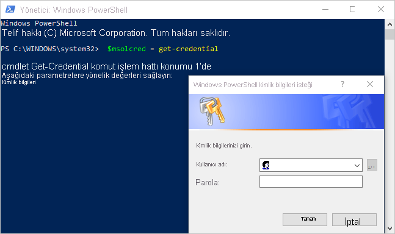

# <a name="administering-power-bi---frequently-asked-questions-faq"></a>Power BI yönetimi - sık sorulan sorular (SSS)

Bu makalede, Power BI yönetimi için sık sorulan sorular ele alınmıştır. Power BI yönetimine genel bakış için bkz. [Power BI yönetimi nedir?](service-admin-administering-power-bi-in-your-organization.md).

## <a name="whats-in-this-article"></a>Bu makalenin içindekiler

### <a name="sign-up-for-power-bi-section"></a>Power BI'a kaydolma bölümü

* [PowerShell'i kullanma](#using-powershell)
* [Kullanıcılar Power BI'a nasıl kaydolur?](#how-do-users-sign-up-for-power-bi)
* [Kuruluşumdaki bireysel kullanıcılar nasıl kaydolur?](#how-do-individual-users-in-my-organization-sign-up)
* [Kullanıcıların mevcut kuruluşuma katılmasını nasıl önleyebilirim?](#how-can-i-prevent-users-from-joining-my-existing-microsoft-365-tenant)
* [Kullanıcıların mevcut kuruluşuma katılmalarına nasıl izin verebilirim?](#how-can-i-allow-users-to-join-my-existing-microsoft-365-tenant)
* [Kiracıda engelin etkin olup olmadığını nasıl kontrol ederim?](#how-do-i-check-if-i-have-the-block-on-in-the-tenant)
* [Mevcut kullanıcılarımın Power BI'ı kullanmaya başlamasını nasıl önleyebilirim?](#how-can-i-prevent-my-existing-users-from-starting-to-use-power-bi)
* [Mevcut kullanıcılarımın Power BI'a kaydolmasına nasıl izin veririm?](#how-can-i-allow-my-existing-users-to-sign-up-for-power-bi)

### <a name="administration-of-power-bi-section"></a>Power BI Yönetimi bölümü

* [Bu, şu anda kuruluşumdaki kullanıcıların kimliklerini yönetme biçimimi nasıl değiştirecek?](#how-will-this-change-the-way-i-manage-identities-for-users-in-my-organization-today)
* [Power BI nasıl yönetilir?](#how-do-we-manage-power-bi)
* [Kullanıcılarım için Microsoft tarafından oluşturulan bir kiracıyı yönetme süreci nasıldır?](#what-is-the-process-to-manage-a-tenant-created-by-microsoft-for-my-users)
* [Birden çok etki alanım olması halinde kullanıcıların eklendiği Microsoft 365 kiracısını denetleyebilir miyim?](#if-i-have-multiple-domains-can-i-control-the-microsoft-365-tenant-that-users-get-added-to)
* [Kayıtlı kullanıcıların Power BI lisansını nasıl kaldırabilirim?](#how-do-i-remove-power-bi-for-users-that-already-signed-up)
* [Kiracıma yeni kullanıcıların katıldığını nasıl anlarım?](#how-do-i-know-when-new-users-have-joined-my-tenant)
* [Hazırlıklı olmam gereken başka şeyler var mı?](#are-there-any-additional-things-i-should-prepare-for)
* [Power BI kiracım nerede bulunur?](#where-is-my-power-bi-tenant-located)
* [Power BI SLA'sı (Hizmet Düzeyi Sözleşmesi) nedir?](#what-is-the-power-bi-sla)
* [Power BI yüksek kullanılabilirliği ve yük devretmeyi nasıl işler?](#how-does-power-bi-handle-high-availability-and-failover)

### <a name="security-in-power-bi-section"></a>Power BI'da Güvenlik bölümü

* [Power BI ulusal, bölgesel ve sektöre özel uyumluluk gereksinimlerini karşılıyor mu?](#does-power-bi-meet-national-regional-and-industry-specific-compliance-requirements)
* [Power BI'da güvenlik nasıl sağlanır?](#how-does-security-work-in-power-bi)

## <a name="sign-up-for-power-bi"></a>Power BI'a kaydolma

### <a name="using-powershell"></a>PowerShell'i kullanma

Bu bölümdeki yordamların bazılarında Windows PowerShell betiklerinin kullanılması gerekir. PowerShell hakkında bilgi sahibi değilseniz [PowerShell'i kullanmaya başlama kılavuzuna](/powershell/scripting/overview) göz atmanızı öneririz. Betikleri çalıştırmak için öncelikle [Azure Active Directory PowerShell for Graph](/powershell/azure/active-directory/overview) uygulamasının 64 bit sürümünü yüklemeniz gerekir.

### <a name="how-do-users-sign-up-for-power-bi"></a>Kullanıcılar Power BI'a nasıl kaydolur?

Microsoft 365 yöneticisi olarak Power BI’a [Power BI web sitesinden](https://powerbi.microsoft.com) veya Microsoft 365 yönetim merkezinin [Hizmet satın al](https://admin.microsoft.com/AdminPortal/Home#/catalog) sayfasından kaydolabilirsiniz. Bir Microsoft 365 yöneticisi Power BI’a kaydolduğunda, erişimi olması gereken kullanıcılara kullanıcı lisansları atayabilir.

Ayrıca kuruluşunuzdaki bireysel kullanıcılar [Power BI web sitesine](https://powerbi.microsoft.com) giderek Power BI'a kaydolabilir. Kuruluşunuzdaki bir kullanıcı Power BI’a kaydolduğunda, hizmet kullanıcıya otomatik olarak bir Power BI lisansı atar. Daha fazla bilgi için bkz. [Power BI'a bireysel olarak kaydolma](../fundamentals/service-self-service-signup-for-power-bi.md) ve [Kuruluşunuzda Power BI lisansları](service-admin-licensing-organization.md).

### <a name="how-do-individual-users-in-my-organization-sign-up"></a>Kuruluşumdaki bireysel kullanıcılar nasıl kaydolur?

Kuruluşunuzdaki kullanıcılar için geçerli olabilecek üç senaryo vardır:

* **1. Senaryo**: Kuruluşunuzda zaten bir Microsoft 365 ortamı vardır ve Power BI'a kaydolacak kullanıcı bir Microsoft 365 hesabına sahiptir.
    Bu senaryoda, kullanıcının kiracıda (örneğin, contoso.com) bir iş veya okul hesabı var ancak Power BI hesabı yoksa Microsoft, mevcut planı söz konusu hesabın Power BI (ücretsiz) planı için etkinleştirir. Kullanıcı, Power BI hizmetinin nasıl kullanılacağı konusunda otomatik olarak bilgilendirilir.

* **2. Senaryo**: Kuruluşunuzda zaten bir Microsoft 365 ortamı vardır ancak Power BI'a kaydolacak kullanıcının Microsoft 365 hesabı yoktur.
    Bu senaryoda, kullanıcının kuruluşunuzun etki alanında (örneğin, contoso.com) bir e-posta adresi vardır ancak henüz Microsoft 365 hesabı yoktur. Bu durumda, kullanıcı Power BI'a kaydolabilir ve otomatik olarak bir hesap edinir. Bu eylem kullanıcının Power BI hizmetine erişmesine olanak sağlar. Örneğin, Nancy adlı bir çalışan iş e-posta adresiyle (örneğin, nancy@contoso.com) kaydolursa Microsoft otomatik olarak Nancy'yi Contoso'nun Microsoft 365 ortamına bir kullanıcı olarak ekler ve hesabı için Power BI'ı etkinleştirir.

* **3. Senaryo**: Kuruluşunuzun e-posta etki alanınıza bağlı bir Microsoft 365 ortamı yoktur.
    Kuruluşunuzun Power BI'dan faydalanmak için gerçekleştirmesi gereken bir yönetim eylemi yoktur. Hizmet, kullanıcıları yeni bir yalnızca bulut kullanıcı dizinine ekler. Kiracının Microsoft 365 Genel yönetici rolünü devralarak bunları yönetmeyi de tercih edebilirsiniz.

> [!IMPORTANT]
> Kuruluşunuz birden fazla e-posta etki alanına sahipse ve tüm e-posta adresi uzantılarının aynı kiracıda olmasını tercih ediyorsanız, kullanıcılar kaydolmadan önce tüm e-posta adresi etki alanlarını bir Azure Active Directory kiracısına ekleyin. Kullanıcıları oluşturduktan sonra, bunları kiracılar arasında taşımak için kullanılabilecek herhangi bir otomatik sistem yoktur. Bu işlemle ilgili daha fazla bilgi için, bu makaledeki [Birden çok etki alanım olması halinde, kullanıcıların eklendiği Microsoft 365 kiracısını denetleyebilir miyim?](#if-i-have-multiple-domains-can-i-control-the-microsoft-365-tenant-that-users-get-added-to) bölümüne ve [Microsoft 365'e etki alanı ekleme](/office365/admin/setup/add-domain/) başlıklı makaleye göz atın.

### <a name="how-can-i-prevent-users-from-joining-my-existing-microsoft-365-tenant"></a>Kullanıcıların, var olan Microsoft 365 kiracıma katılmalarını nasıl önleyebilirim?

Genel yönetici olarak, kullanıcıların Microsoft 365 kiracınıza katılmasını önlemek için uygulayabileceğiniz yöntemler vardır. Erişimi engellerseniz kullanıcıların kaydolma denemeleri başarısızlıkla sonuçlanır ve kullanıcıları kuruluşlarının yöneticisiyle iletişim kurmaya yönlendiren bir ileti görüntülenir. Otomatik lisans dağıtımını (örneğin, Eğitim için Office 365'te Öğrencilere, Fakültelere ve Eğitim Personeline yönelik planlar aracılığıyla) devre dışı bıraktıysanız bu işlemi tekrarlamanıza gerek yoktur.

Yönetilen bir kiracıya yeni kullanıcıların katılmasını önlemek için aşağıdaki PowerShell komutunu kullanın. ([PowerShell hakkında daha fazla bilgi edinin][1].)

```powershell
$msolcred = get-credential
connect-msolservice -credential $msolcred

Set-MsolCompanySettings -AllowEmailVerifiedUsers $false
```

> [!NOTE]
> Erişimi engelleme, kuruluşunuzdaki yeni kullanıcıların Power BI'a kaydolmasını önler. Kuruluşunuzda yeni kaydolma işlemleri devre dışı bırakılmadan önce Power BI'a kaydolmuş olan kullanıcıların lisansları korunur. Bir kullanıcıyı kaldırmak için bu makalenin [Kayıtlı kullanıcıların Power BI lisansını nasıl kaldırabilirim?](#how-do-i-remove-power-bi-for-users-that-already-signed-up) bölümüne bakın.

### <a name="how-can-i-allow-users-to-join-my-existing-microsoft-365-tenant"></a>Kullanıcıların, var olan Microsoft 365 kiracıma katılmalarına nasıl izin verebilirim?

Yönetilen bir kiracıya yeni kullanıcıların katılmasına olanak sağlamak için aşağıdaki PowerShell komutunu kullanın. ([PowerShell hakkında daha fazla bilgi edinin][1].)

```powershell
$msolcred = get-credential
connect-msolservice -credential $msolcred

Set-MsolCompanySettings -AllowEmailVerifiedUsers $true
```

### <a name="how-do-i-check-if-i-have-the-block-on-in-the-tenant"></a>Kiracıda engelin etkin olup olmadığını nasıl kontrol ederim?

Ayarları kontrol etmek için aşağıdaki PowerShell betiğini çalıştırın. *AllowEmailVerifiedUsers*, false değerine sahip olmalıdır. ([PowerShell hakkında daha fazla bilgi edinin][1].)

```powershell
$msolcred = get-credential
connect-msolservice -credential $msolcred

Get-MsolCompanyInformation | fl allow*
```

### <a name="how-can-i-prevent-my-existing-users-from-starting-to-use-power-bi"></a>Mevcut kullanıcılarımın Power BI'ı kullanmaya başlamasını nasıl önleyebilirim?

Denetim **AllowAdHocSubscriptions** Azure AD ayarı tarafından gerçekleştirilir. Çoğu kiracıda bu ayar *true* olarak ayarlanmış, diğer bir deyişle etkinleştirilmiştir. Power BI uygulamasını bir iş ortağı aracılığıyla aldıysanız, bu ayar devre dışı bırakıldığını gösterecek şekilde *false* olabilir.

Geçici abonelikleri devre dışı bırakmak için aşağıdaki PowerShell betiğini kullanın.([PowerShell hakkında daha fazla bilgi edinin][1].)

1. Microsoft 365 kimlik bilgilerinizi kullanıp Azure Active Directory'de oturum açın. Aşağıdaki PowerShell betiğinin ilk satırında sizden kimlik bilgileriniz istenir. İkinci satırda Azure Active Directory ile bağlantı kurulur.

    ```powershell
     $msolcred = get-credential
     connect-msolservice -credential $msolcred
    ```

   

1. Oturum açtıktan sonra, kiracınızın geçerli ayarlarını görmek için aşağıdaki komutu çalıştırın.

    ```powershell
     Get-MsolCompanyInformation | fl AllowAdHocSubscriptions
    ```

1. Aşağıdaki komutu çalıştırarak **AllowAdHocSubscriptions** ayarını etkinleştirin (`$true`) veya devre dışı bırakın (`$false`).

    ```powershell
     Set-MsolCompanySettings -AllowAdHocSubscriptions $false
    ```

> [!NOTE]
> Kuruluşunuzdaki çeşitli kullanıcı özelliklerini (kullanıcıların Azure Hak Yönetimi Hizmeti'ne kaydolabilmesi de dahil) denetlemek için **AllowAdHocSubscriptions** bayrağını kullanın. Bu bayrağın değiştirilmesi bu özelliklerin tümünü etkiler. *False* ayarı kullanıcıların bireysel bir Power BI Pro deneme sürümüne kaydolmasına neden olabilir.

### <a name="how-can-i-allow-my-existing-users-to-sign-up-for-power-bi"></a>Mevcut kullanıcılarımın Power BI'a kaydolmasına nasıl izin veririm?

Mevcut kullanıcılarınızın Power BI'a kaydolmasına izin vermek için, önceki soruda belirtilen komutu çalıştırın ancak son adımda `$false` yerine `$true` değerini geçirin.

## <a name="administration-of-power-bi"></a>Power BI Yönetimi

### <a name="how-will-this-change-the-way-i-manage-identities-for-users-in-my-organization-today"></a>Bu, şu anda kuruluşumdaki kullanıcıların kimliklerini yönetme biçimimi nasıl değiştirecek?

Kuruluşunuzdaki kullanıcılar için geçerli olabilecek üç senaryo vardır:

* **1. Senaryo**: Kuruluşunuzun bir Microsoft 365 ortamı varsa ve kuruluşunuzdaki tüm kullanıcıların Microsoft 365 hesabı varsa kimlik yönetimi değişmez.

* **2. Senaryo**: Kuruluşunuzun bir Microsoft 365 ortamı varsa ancak kuruluşunuzdaki her kullanıcının Microsoft 365 hesabı yoksa kiracıda bir kullanıcı oluşturup kullanıcının iş veya okul e-posta adresine göre lisans atarız.

    Bunun sonucunda, kuruluşunuzdaki kullanıcılar hizmete kaydoldukça, belirli herhangi bir zamanda yönettiğiniz kullanıcı sayısı artar.

* **3. Senaryo**: Kuruluşunuzda e-posta etki alanınıza bağlı bir Microsoft 365 ortamı yoksa, kimlik yönetme yönteminizde değişiklik olmaz.

    Hizmet, kullanıcıları Microsoft 365 Genel yöneticisi olarak ele almak ve bunları yönetmek için seçebileceğiniz yeni ve yalnızca buluttaki bir kullanıcı dizinine ekler.

### <a name="how-do-we-manage-power-bi"></a>Power BI nasıl yönetilir?

Power BI, Microsoft 365 Genel yönetici rolündeki ve Power BI Hizmet yöneticisi rolündeki kullanıcılar için bir Power BI bir yönetim portalı sağlar. Power BI yönetici portalını kullanmak için hesabınızı, Microsoft 365 veya Azure Active Directory'de **Genel Yönetici** olarak işaretlemiş olmanız veya kullanıcı hesabınıza Power BI hizmet yöneticisi rolünün atanmış olması gerekir. Daha fazla bilgi için bkz. [Power BI hizmet yöneticisi rolünü anlama](service-admin-role.md) ve [Power BI Yönetim Portalı](service-admin-portal.md). Portal, kullanıcıları ve grupları yönetmeniz için kiracı genelinde ayarları yönetme, Power BI kullanım istatistiklerini görüntüleme olanağı ve Microsoft 365 yönetim merkezine yönelik bir bağlantı sağlar.

### <a name="what-is-the-process-to-manage-a-tenant-created-by-microsoft-for-my-users"></a>Kullanıcılarım için Microsoft tarafından oluşturulan bir kiracıyı yönetme süreci nasıldır?

Bir kullanıcı Azure AD kullanan bir bulut hizmetine kendi kendine kaydolduğunda, hizmet kullanıcıyı e-posta etki alanı temelinde yönetilmeyen bir Azure AD dizinine ekler. *Yönetici devralma* olarak bilinen bir işlemi kullanarak başka birinin oluşturduğu kiracıyı alabilir ve yönetebilirsiniz. Daha fazla bilgi için bkz. [Azure Active Directory'de yönetilmeyen bir dizini yönetici olarak devralma](/azure/active-directory/users-groups-roles/domains-admin-takeover). Gerçekleştirdiğiniz devralma işleminin türü, etki alanınızla ilişkilendirilmiş bir yönetilen kiracının var olup olmadığına bağlıdır:

* Power BI, iç yönetici devralmayı destekler. Yönetilmeyen bir Azure dizininin _iç_ yönetici devralmasını gerçekleştirdiğinizde, yönetilmeyen dizinin genel yöneticisi olarak eklenirsiniz. Hiçbir kullanıcı, etki alanı veya hizmet planı, yönettiğiniz başka bir dizine geçirilmez.

* Power BI artık dış yönetici devralmayı desteklememektedir. Yönetilmeyen bir Azure dizininin _dış_ yönetici devralma işlemini gerçekleştirdiğinizde, yönetilmeyen dizinin DNS etki alanı adını yönetilen Azure dizininize eklersiniz. Dış devralma, yönetilmeyen orijinal kiracıdaki tüm Power BI içeriğine erişimin kaybedilmesine neden olur. Power BI raporlarının yeni kiracıda yeniden yayımlanması ve Power BI panoları ile uygulamalarının yeni kiracıda yeniden oluşturulması gerekir.

### <a name="if-i-have-multiple-domains-can-i-control-the-microsoft-365-tenant-that-users-get-added-to"></a>Birden çok etki alanım olması halinde kullanıcıların eklendiği Microsoft 365 kiracısını denetleyebilir miyim?

Hiçbir işlem yapmamanız durumunda hizmet, her bir kullanıcı e-postası etki alanı ve alt etki alanı için bir kiracı oluşturur. E-posta adresi uzantılarından bağımsız olarak tüm kullanıcıların aynı kiracıda olmasını istiyorsanız: Önceden bir hedef kiracı oluşturun veya var olan bir kiracıyı kullanın. Daha sonra, kiracıyla birleştirmek istediğiniz tüm mevcut etki alanlarını ve alt etki alanlarını ekleyin. E-postaları bu etki alanları ve alt etki alanları ile sona eren tüm kullanıcılar kaydolduklarında otomatik olarak hedef kiracıya eklenir.

> [!IMPORTANT]
> Kullanıcıları oluşturduktan sonra, bunları kiracılar arasında taşımak için kullanılabilecek desteklenen herhangi bir otomatik sistem yoktur. Tek bir Microsoft 365 kiracısına etki alanı ekleme hakkında bilgi edinmek için bkz. [Microsoft 365'e etki alanı ve kullanıcı ekleme](/office365/admin/setup/add-domain/).

### <a name="how-do-i-remove-power-bi-for-users-that-already-signed-up"></a>Kayıtlı kullanıcıların Power BI lisansını nasıl kaldırabilirim?

Power BI'a kaydolmuş bir kullanıcının artık Power BI'a erişim sağlamasını istemiyorsanız kullanıcının Power BI lisansını kaldırabilirsiniz.

1. [Microsoft 365 yönetim merkezine](https://admin.microsoft.com/AdminPortal/Home#/homepage) gidin.

1. Gezinti bölmesinde, **Kullanıcılar** > **Etkin Kullanıcılar**’ı seçin.

1. Lisansını kaldırmak istediğiniz kullanıcıyı bulup bu kullanıcının adını seçin.

    Kullanıcı lisanslarını toplu olarak yönetebilirsiniz. Bunu yapmak için birden fazla kullanıcıyı seçin ve **Ürün lisanslarını düzenle** seçeneğini belirleyin.

1. Kullanıcı ayrıntıları sayfasında **Ürün lisansları**'nın yanında **Düzenle**’yi seçin.

1. İlgili hesaba uyguladığınız lisansa göre, **Power BI (ücretsiz)** veya **Power BI Pro** seçeneğini **Kapalı** olarak belirleyin.

1. **Kaydet**'i seçin.

### <a name="how-do-i-know-when-new-users-have-joined-my-tenant"></a>Kiracıma yeni kullanıcıların katıldığını nasıl anlarım?

Kiracınıza self-servis kaydolma üzerinden katılan kullanıcılara benzersiz bir lisans atanır. Yönetici panonuzun etkin kullanıcı bölmesinde bu lisansa göre filtreleme yapabilirsiniz. Bu yeni görünümü oluşturmak için aşağıdaki adımları izleyin.

1. [Microsoft 365 yönetim merkezine](https://admin.microsoft.com/AdminPortal/Home#/homepage) gidin.

1. Gezinti bölmesinde, **Kullanıcılar** > **Etkin Kullanıcılar**’ı seçin.

1. **Görünümler** menüsünde **Özel görünüm ekle**'yi seçin.

1. Yeni görünümünüzü adlandırın ve **Atanan ürün lisansı** bölümünde **Power BI (ücretsiz)** veya **Power BI Pro** seçeneğini belirleyin.

    Görünüm başına yalnızca bir lisans seçebilirsiniz. Kuruluşunuzda hem **Power BI (ücretsiz)** hem de **Power BI Pro** lisansları varsa iki görünüm oluşturabilirsiniz.

1. Varsa eklemek istediğiniz diğer koşulları da girin ve **Ekle**'yi seçin.

1. Yeni görünümü oluşturduktan sonra, görünüme **Görünümler** menüsünden erişebilirsiniz.

### <a name="are-there-any-additional-things-i-should-prepare-for"></a>Hazırlıklı olmam gereken başka şeyler var mı?

Parola sıfırlama isteklerinde bir artış ile karşılaşabilirsiniz. Bu işlem hakkında bilgi almak için bkz. [Bir kullanıcının parolasını sıfırlama](/office365/admin/add-users/reset-passwords).

Microsoft 365 yönetim merkezinde standart işlemi uygulayarak kiracınızdan kullanıcı kaldırabilirsiniz. Ancak, kullanıcı kuruluşunuzun etkin bir e-posta adresine sahipse siz tüm kullanıcıların katılımını engellemediğiniz sürece tekrar katılabilir.

### <a name="where-is-my-power-bi-tenant-located"></a>Power BI kiracım nerede bulunur?

Power BI kiracınızın bulunduğu veri bölgesi hakkında bilgi edinmek için bkz. [Power BI kiracım nerede bulunur?](service-admin-where-is-my-tenant-located.md).

### <a name="what-is-the-power-bi-sla"></a>Power BI SLA'sı nedir?

Power BI SLA'sı (Hizmet Düzeyi Sözleşmesi) hakkında bilgi edinmek için Microsoft Licensing web sitesinin **Licensing** (Lisanslama) bölümündeki [Licensing Terms and Documentation](https://www.microsoftvolumelicensing.com/DocumentSearch.aspx?Mode=3&DocumentTypeId=37) (Lisanslama ile ilgili Koşullar ve Belgeler) makalesine bakın.

### <a name="how-does-power-bi-handle-high-availability-and-failover"></a>Power BI yüksek kullanılabilirliği ve yük devretmeyi nasıl işler?

Yüksek kullanılabilirlik ve yük devretme hakkında bilgi için bkz. [Power BI yüksek kullanılabilirlik, yük devretme ve olağanüstü durum kurtarma ile ilgili SSS](service-admin-failover.md).

## <a name="security-in-power-bi"></a>Power BI'da Güvenlik

### <a name="does-power-bi-meet-national-regional-and-industry-specific-compliance-requirements"></a>Power BI ulusal, bölgesel ve sektöre özel uyumluluk gereksinimlerini karşılıyor mu?

Power BI uyumluluğu hakkında daha fazla bilgi edinmek için bkz. [Microsoft Güven Merkezi](https://www.microsoft.com/TrustCenter/CloudServices/business-application-platform/default.aspx).

### <a name="how-does-security-work-in-power-bi"></a>Power BI'da güvenlik nasıl sağlanır?

Microsoft, Power BI’ı Office 365 temel alarak oluşturmuştur. Microsoft 365'in altyapısında ise Azure Active Directory gibi Azure hizmetleri yer almaktadır. Power BI mimarisine genel bakış için bkz. [Power BI Güvenliği](service-admin-power-bi-security.md).

## <a name="next-steps"></a>Sonraki adımlar

[Power BI yönetici portalı](service-admin-portal.md)  
[Power BI yönetici rolünü anlama](service-admin-role.md)  
[Power BI için self servis kayıt](../fundamentals/service-self-service-signup-for-power-bi.md)  
[Power BI Pro'yu satın alma](service-admin-purchasing-power-bi-pro.md)  
[Power BI Premium nedir?](service-premium-what-is.md)  
[Power BI Premium'u satın alma](service-admin-premium-purchase.md)  
[Power BI Premium teknik incelemesi](https://aka.ms/pbipremiumwhitepaper)  
[Power BI ve Microsoft 365’teki grubunuzu yönetme](../collaborate-share/service-manage-app-workspace-in-power-bi-and-office-365.md)  
[İş veya okul hesabını yönetme](/office365/servicedescriptions/office-365-platform-service-description/user-account-management/)  
[Microsoft 365 grup yönetimi](/office365/admin/email/create-edit-or-delete-a-security-group/)  

Başka bir sorunuz mu var? [Power BI Topluluğu'na sorun](https://community.powerbi.com/)

[1]: /powershell/scripting/overview