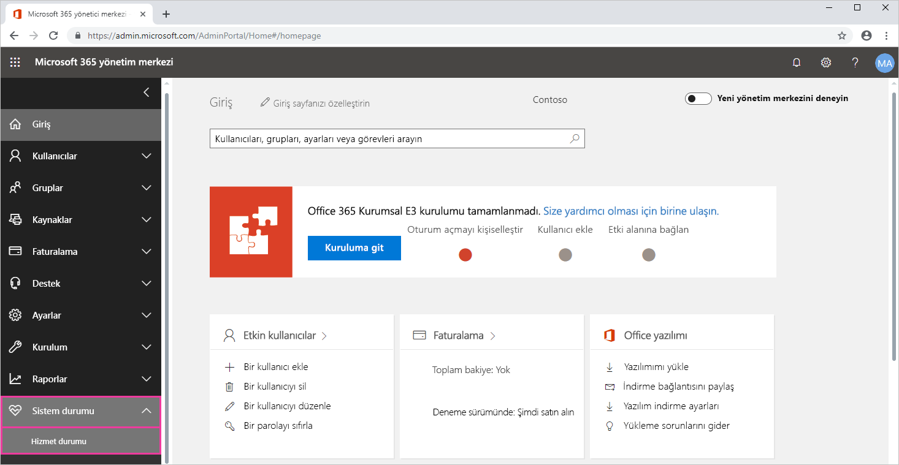
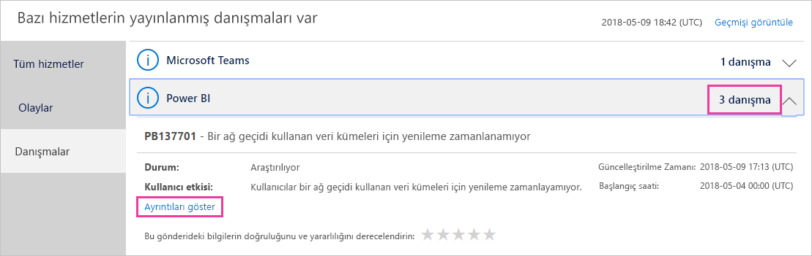
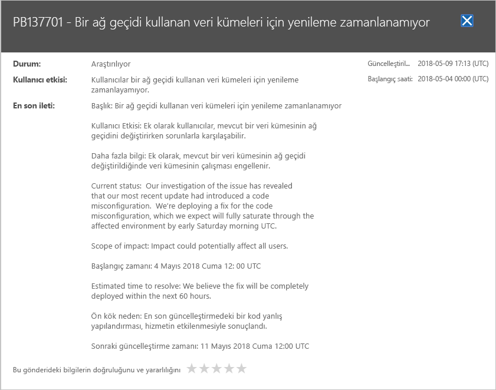

# Microsoft 365'te Power BI hizmet durumunu izleme

Microsoft 365 yönetim merkezi, Power BI yöneticileri için önemli araçlar sağlar. Araçlar, hizmet durumu hakkında güncel ve geçmiş bilgileri içerir. Hizmet durumu bilgisine erişmek için aşağıdaki rollerden birinde olmalısınız:

* Power BI Hizmet Yöneticisi

* Genel Yönetici

Rolleri hakkında daha fazla bilgi için bkz. [Power BI ile ilgili yönetici rolleri](service-admin-administering-power-bi-in-your-organization.md#administrator-roles-related-to-power-bi).

1. [Microsoft 365 yönetim merkezinde](https://portal.office.com/adminportal) oturum açın.

1. Gezinti bölmesinden **Tümünü göster** > **Sistem Durumu** > **Hizmet durumu**’nu seçin. Hizmet durumu sayfası görüntülenir:

    

1. **Tüm hizmetler** listesinden **Öneriler** veya **Olaylar**’ı seçip sonuçları gözden geçirin. Aşağıdaki ekran görüntüsünde üç etkin öneri görebilirsiniz.

    

1. Daha fazla bilgi için bir öğenin **Ayrıntıları göster** seçeneğini belirleyin. Aşağıdaki ekran görüntüsünde son durum güncelleştirmeleri dahil ek ayrıntıları görebilirsiniz.

    

    Daha fazla bilgi görmek için aşağı kaydırın, işiniz bittiğinde ise bölmeyi kapatın.

1. Tüm hizmetlerdeki geçmiş bilgileri görmek için **Hizmet durumu** sayfasında **Geçmişi görüntüle**’yi seçin. Ardından **Son 7 gün** veya **Son 30 gün**’ü seçin. 

1. Geçerli hizmet durumuna geri dönmek için **Geçerli durumu görüntüle**’yi seçin.