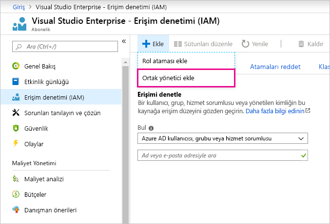

# Power BI ve Azure için aynı hesabı kullanma

Hem Power BI hem de Azure kullanıcısıysanız parolanızı iki kez yazmadan her iki hizmet için de aynı oturum açma bilgilerini kullanmak isteyebilirsiniz.

Power BI'da oturum açmak için, iş veya okul e-posta adresinizle ilişkili kuruluş hesabınızı kullanırsınız.  Azure'da oturum açmak içinse bir Microsoft hesabı veya kuruluş hesabınızı kullanmanız gerekir.

Hem Azure hem de Power BI için aynı oturum açma bilgilerini kullanmak istiyorsanız Azure'da kuruluş hesabınızla oturum açtığınızdan emin olun.

**Azure'da Microsoft hesabımla oturum açtıysam ne olur?**

Aşağıdaki adımları izleyerek Azure'da kuruluş hesabınızı bir ortak yönetici olarak ekleyebilirsiniz:

1. [Azure portalında](https://portal.azure.com/) oturum açın. Birden fazla Azure dizininde etkin bir kullanıcıysanız **Abonelikler**'i seçin ve yalnızca düzenlemek istediğiniz dizin ile abonelikler görüntülenecek şekilde filtreleme yapın.

1. Gezinti bölmesinde **Erişim denetimi (IAM)** ve sonra **Ekle** \> **Ortak yönetici ekle**’yi seçin.

    

1. Kuruluş hesabınızla ilişkili e-posta adresini girin ve **Ekle**’yi seçin.

1. Daha sonra Azure portalında oturum açacağınız zaman kuruluş e-posta adresinizi kullanın.

Başka bir sorunuz mu var? [Power BI Topluluğu'na başvurun](https://community.powerbi.com/)
