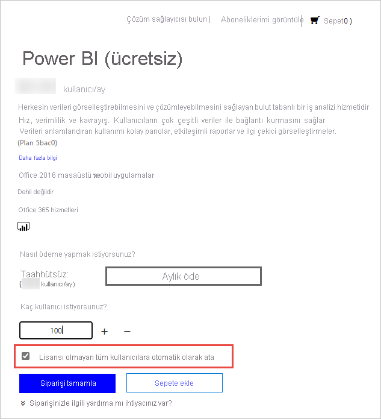

# Kuruluşunuzdaki kullanıcılar için Power BI hizmetini lisanslama

Kullanıcının Power BI hizmetinde yapabilecekleri sahip olduğu kullanıcı başına lisansın türüne göre değişir. Lisansı tarafından sağlanan erişim düzeyi, erişilen çalışma alanının Power BI Premium kapasitesine atanıp atanmadığına bağlıdır. Power BI hizmetinin tüm kullanıcıları bir lisansa sahip olmalıdır.

Kullanıcıların lisans alması için iki yol vardır. Kullanıcılar, self servis kaydolma özelliklerini ve bunların iş veya okul hesaplarını kullanarak kendi ücretsiz ya da Pro lisanslarını alabilir. Bunun yerine yöneticiler Power BI aboneliği alıp kullanıcılara lisans da atayabilir.

Bu makale, yönetim açısından hizmet satın almaya ve kullanıcı başına lisanslamaya odaklanır. Kullanıcıların kendi lisanslarını nasıl alabileceği hakkında daha fazla bilgi için bkz. [Bireysel olarak Power BI’a kaydolma](../fundamentals/service-self-service-signup-for-power-bi.md).

## Lisansları kimler satın alıp atayabilir?

Kuruluşunuz için lisans satın almak veya atamak üzere bir yönetici rolü atamanız gerekir. Yönetici rolleri, Azure Active Directory yönetim merkezi veya Microsoft 365 yönetim merkezi kullanılarak atanır. Aşağıdaki tabloda, satın alma ve lisanslama ile ilgili görevleri yapmak için hangi rolün gerekli olduğu gösterilmektedir. Azure Active Directory'deki yönetici rolleri hakkında daha fazla bilgi için bkz. [Azure Active Directory’deki yönetici rollerini görüntüleme ve atama](https://docs.microsoft.com/azure/active-directory/users-groups-roles/directory-manage-roles-portal). En iyi yöntemler dahil Microsoft 365’teki yönetici rolleri hakkında daha fazla bilgi edinmek için bkz. [Yönetici rolleri hakkında](https://docs.microsoft.com/microsoft-365/admin/add-users/about-admin-roles?view=o365-worldwide).

| Hizmetleri ve lisansları kimler satın alabilir? | Kullanıcı lisanslarını kimler yönetebilir? |
| --------------- | --------------- |
| Faturalama yöneticisi | Lisans yöneticisi |
| Genel yönetici | Kullanıcı yöneticisi |
|  | Genel yönetici |

Bu roller kuruluşu yönetir. Power BI hizmeti yöneticisi rolleri hakkında daha fazla bilgi için bkz. [Power BI hizmeti yönetici rolünü anlama](service-admin-role.md).

## Kuruluşunuz için Power BI edinin

Fiyatlandırma hakkında daha fazla bilgi için bkz. [Fiyatlandırma ve Ürün Karşılaştırması](https://powerbi.microsoft.com/pricing/).

Genel yönetici veya faturalama yöneticisi, Power BI hizmetine kaydolabilir ve kuruluşlarındaki kullanıcılar için lisans satın alabilir. Satın almaya hazır değilseniz, Power BI Pro deneme sürümünü seçin. Bir ay boyunca kullanmak için 25 lisans alırsınız. Kaydolma hakkında adım adım yönergeler için bkz. [Kuruluşunuz için Power BI aboneliği alma](service-admin-org-subscription.md).

## Self servise kaydolma hakkında

Bireysel kullanıcılar iş veya okul hesaplarıyla kaydolarak kendi Power BI lisanslarını alabilir. Ücretsiz bir lisansla, kullanıcılar Çalışma Alanım'ı kullanarak kişisel veri analizi ve görselleştirme için Power BI’ı keşfedebilir, ancak diğer kullanıcılarla paylaşamaz. İçerik paylaşmak için bir Power BI Pro lisansı gerekir. Kuruluş ticari bulut kullanıyorsa, kullanıcılar lisans türlerini Pro'ya yükseltebilir veya doğrudan Pro'ya kaydolabilir. Pro’yu doğrudan satın almak veya Pro’ya yükseltmek, eğitim kuruluşları ya da Azure Kamu, Azure Germany veya Azure China 21Vianet bulutlarına dağıtılan kuruluşlar için mümkün değildir.

Kuruluşunuzdaki kullanıcıların self servis kaydolma özelliğini kullanmasını istemiyorsanız, özelliği nasıl kapatacağınızı öğrenmek için bkz. [Self servis kaydolma özelliğini etkinleştirme veya devre dışı bırakma](service-admin-disable-self-service.md).

Self servis kaydolma özelliğini kapatmak, kullanıcıların veri görselleştirmeleri ve analizi için Power BI’ı keşfetmelerini engeller. Tek kaydolmayı engellediyseniz kuruluşunuz için Power BI (ücretsiz) lisansları alıp bunları kullanıcılara atamanız faydalı olabilir. Tüm mevcut kullanıcılara bir Power BI (ücretsiz) lisansı atamak için şu adımları izleyin:

1. Genel yönetici veya faturalama yöneticisi kimlik bilgilerini kullanarak [Microsoft 365 yönetim merkezinde](https://admin.microsoft.com) oturum açın.
1. Sol kenar çubuğu menüsünde **Faturalama** > **Hizmetleri satın alın** öğesini seçin.
1. Power BI (ücretsiz) teklifini bulmak için arayın veya kaydırın. Teklifi ve sonra **Şimdi al**’ı seçin.
1. Tüm kullanıcılarınızı kapsayacak lisans sayısını girin.
1. **Lisansı olmayan tüm kullanıcılara otomatik olarak ata**’yı seçin ve kullanıma alın.

   

Kuruluşunuzda hangi kullanıcıların zaten bir lisansa sahip olabileceğini görmek istiyorsanız, bunun nasıl yapılacağını öğrenmek için bkz. [Kullanıcı lisanslarını görüntüleme ve yönetme](service-admin-manage-licenses.md).

## Lisans türleri ve özellikleri

İki tür Power BI kullanıcı başına lisansı vardır: ücretsiz ve Pro. Kullanıcının ihtiyacı olan lisans türü, içeriğin nerede depolandığına ve kullanıcının bu içerikle nasıl etkileşime gireceğine göre belirlenir. İçeriğin depolanabileceği yer, kuruluşunuzun [abonelik türüne](#subscription-types) göre belirlenir.

Bir abonelik türü olan [Power BI Premium](service-admin-premium-purchase.md), ücretsiz lisansa sahip kullanıcıların, Premium kapasiteye atanan çalışma alanlarındaki içerik üzerinde işlem yapmasına olanak tanır. Premium kapasitenin dışında, ücretsiz lisansa sahip bir kullanıcı, **Çalışma Alanım** içinde verilere bağlanıp raporlar ve panolar oluşturmak için yalnızca Power BI hizmetini kullanabilir. Kullanıcı başkalarıyla içerik paylaşamaz veya içeriği başka çalışma alanlarında yayımlayamaz. Çalışma alanı türleri hakkında daha fazla bilgi edinmek için bkz. [Çalışma alanı türleri](../consumer/end-user-workspaces.md#types-of-workspaces).

Standart bir Power BI aboneliği, paylaşılan kapasiteyi kullanır. İçerik paylaşılan kapasitede depolanırsa, Power BI Pro lisansı atanan kullanıcılar yalnızca diğer Power BI Pro kullanıcılarıyla işbirliği yapabilir. Bu kullanıcılar diğer kullanıcılar tarafından paylaşılan içeriği kullanabilir, uygulama çalışma alanlarında içerik yayımlayabilir, panoları paylaşabilir ve pano ile raporlara abone olabilir.  Çalışma alanları Premium kapasitede olduğunda, Pro kullanıcıları Power BI Pro lisansına sahip olmayan kullanıcılara içerik dağıtabilir.

Aşağıdaki tablo, her lisans türünün temel özelliklerini özetler. Lisans türü başına özellik kullanılabilirliği hakkında ayrıntılı bir döküm için bkz. [Lisans türüne göre özellikler](../fundamentals/service-features-license-type.md).

| Lisans türü | Çalışma alanı paylaşılan kapasitede olduğunda özellikler | Çalışma alanı Premium kapasitede olduğunda ek özellikler |
| --------- | ----------- | ----------- |
| Power BI (ücretsiz) | Çalışma Alanım'daki içeriğe erişim | Onlarla paylaşılan içeriği kullanma |
| Power BI Pro | Diğer çalışma alanlarında içerik yayımlama, panoları paylaşma, panolar ile raporlara abone olma, Pro lisansına sahip kullanıcılarla paylaşım yapma | Ücretsiz lisanslara sahip kullanıcılara içerik dağıtma |

## Abonelik türleri

Microsoft'un kullanıcı tabanlı tüm ticari lisans abonelikleri, Azure Active Directory kimliklerini temel alır. Power BI hizmetini kullanmak için Azure Active Directory’nin ticari lisanslarda desteklediği bir kimlikle oturum açmanız gerekir. Kimlik hizmetleri için Azure Active Directory kullanan herhangi bir Microsoft aboneliğine Power BI ekleyebilirsiniz. Office 365 E5 gibi bazı abonelikler bir Power BI Pro lisansı içerir, bu nedenle Power BI için ayrı kayıt işlemi gerekmez.

Kuruluşlara yönelik iki tür Power BI aboneliği vardır: standart ve premium.

Standart bir self servis Power BI Pro aboneliğiyle yöneticiler kullanıcı başına lisans atar. Power BI Pro lisanslarının kullanıcı başına aylık bir ücreti vardır. Bu lisans türü işbirliğine, yayımlamaya, paylaşıma ve geçici analizlere olanak tanır. İçerik, Microsoft tarafından tam olarak yönetilen paylaşılan depolama kapasitesine kaydedilir.

Power BI Premium aboneliği, bir kuruluşa ayrılmış kapasite ayırır. Kurumsal BI, büyük veri analizi ve bulut ile şirket içi raporlama için uygun olan Premium, gelişmiş yönetim ve dağıtım denetimleri sağlar. Ayrılmış işlem ve depolama kaynakları, kuruluşunuzdaki kapasite yöneticileri tarafından yönetilir. Bu ayrılmış ortam için aylık bir maliyet vardır. Diğer Premium avantajlarına ek olarak, Power BI Pro lisansları olmayan kullanıcılar Premium kapasitede depolanan içeriğe erişilebilir ve bu içerik aynı kullanıcılara dağıtılabilir. Premium'u kullanabilmek için en az bir kullanıcıya Power BI Pro lisansı atanmış olması ve içerik oluşturucuları ile geliştiricilerinin yine de bir Power BI Pro lisansı olması gerekir.

İki tür abonelik birlikte kullanılabilir. Hem Power BI Premium hem de Power BI Pro’ya sahip olabilirsiniz. Bu yapılandırmada, Premium kapasitede depolanan içerik tüm kullanıcılarla paylaşılabilir ve paylaşılan kapasite de kullanılabilir. Kapasite sınırları hakkında bilgi edinmek için bkz. [Power BI çalışma alanlarında veri depolamayı yönetme](service-admin-manage-your-data-storage-in-power-bi.md).

Ürün özelliklerini ve fiyatlandırmayı karşılaştırmak için bkz. [Power BI fiyatlandırması](https://powerbi.microsoft.com/pricing).

## Konuk kullanıcı erişimi

Kuruluşunuzun dışındaki kullanıcılara içerik dağıtmak isteyebilirsiniz. Dış kullanıcıları, içeriği bir konuk olarak görüntülemek üzere davet ederek dış kullanıcılarla içerik paylaşmak mümkündür. İşletmeler Arası Azure Active Directory (Azure AD B2B), dış konuk kullanıcılarla paylaşım yapma imkanı sunar. Dış kullanıcılarla paylaşım yapmak için şu önkoşulların karşılanması gerekir:

- Dış kullanıcılarla içerik paylaşma özelliği etkinleştirilmelidir

- Konuk kullanıcının paylaşılan içeriği görüntülemek için doğru lisanslara sahip olması gerekir

Konuk kullanıcı erişimi hakkında daha fazla bilgi için bkz. [Azure AD B2B ile Power BI içeriğini dış konuk kullanıcılara dağıtma](service-admin-azure-ad-b2b.md).

## Power BI Pro lisansları satın alma

Yönetici olarak Power BI Pro lisanslarını Microsoft 365 aracılığıyla veya bir Microsoft iş ortağı aracılığıyla satın alırsınız. Lisansları satın aldıktan sonra, bunları tek tek kullanıcılara atarsınız. Daha fazla bilgi için bkz. [Power BI Pro lisanslarını satın alma ve atama](service-admin-purchasing-power-bi-pro.md).

### Power BI Pro lisansı süre sonu

Power BI Pro lisansının süresi dolduktan sonra bir yetkisiz kullanım süresi vardır. Bir toplu lisans satın alımı kapsamındaki lisanslar için, yetkisiz kullanım süresi 90 gündür. Lisansı doğrudan satın aldıysanız, yetkisiz kullanım süresi 30 gündür.

Power BI Pro, Microsoft 365 ile aynı abonelik yaşam döngüsüne sahiptir. Daha fazla bilgi için bkz. [İş için Microsoft 365 aboneliğim sona erdiğinde verilerime ve erişim seçeneklerime ne olur?](/microsoft-365/commerce/subscriptions/what-if-my-subscription-expires).

## Sonraki adımlar

- [Power BI Pro lisanslarını satın alma ve atama](service-admin-purchasing-power-bi-pro.md)
- [İş abonelikleri ve faturalama belgeleri](/microsoft-365/commerce/?view=o365-worldwide)
- [Oturum açmış Power BI kullanıcılarını bulma](service-admin-access-usage.md)
- Başka bir sorunuz mu var? [Power BI Topluluğu'na sorun](https://community.powerbi.com/)
