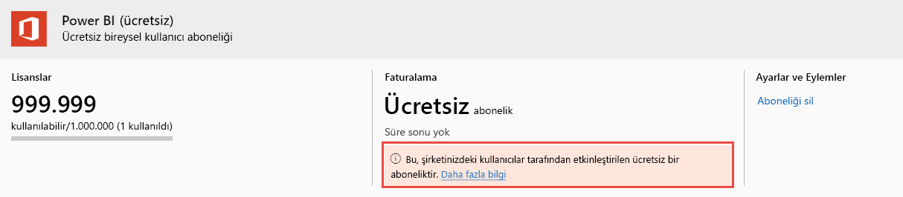

# Power BI kullanıcıları lisanslarını görüntüleme ve yönetme

Bu makalede, yöneticilerin kullanıcı lisanslarını görüntülemek ve yönetmek için Microsoft 365 yönetim merkezini veya Azure portalını nasıl kullanabileceği açıklanmaktadır.

> [!NOTE]
>
>Bir kullanıcı için hem Power BI (ücretsiz) hem de Power BI Pro lisansı atanmış olması mümkündür. Bu durum, bir kullanıcı ücretsiz lisansa kaydolursa ve daha sonra kendisine bir Power BI Pro lisansı atanırsa meydana gelebilir. Bu durumda en yüksek lisanslama düzeyi etkili olur.
>

## Aboneliklerinizi görüntüleme

Kuruluşunuzun hangi Power BI aboneliklerini olduğunu görmek için aşağıdaki adımları izleyin.

1. [Microsoft 365 yönetim merkezinde](https://admin.microsoft.com) oturum açın.
2. Gezinti menüsünde **Faturalama** > **Ürünler ve hizmetler** öğesini seçin.

Etkin Power BI abonelikleriniz, sahip olduğunuz diğer aboneliklerle birlikte listelenir. Burada gösterildiği gibi Power BI (ücretsiz) için beklenmeyen bir abonelik görebilirsiniz.

  

Kullanıcılar self servis kaydolma özelliğinden yararlanıyorsa, bu tür bir abonelik sizin için oluşturulur. Daha fazla bilgi edinmek için bkz. [Kuruluşunuzda Power BI](https://docs.microsoft.com/microsoft-365/admin/misc/power-bi-in-your-organization?view=o365-worldwide).

## Microsoft 365’te kullanıcı lisanslarını yönetme

Kullanıcı lisanslarını yönetmek üzere Microsoft 365 yönetim merkezini kullanmak için bkz. [İş abonelikleri ve faturalama belgeleri](https://docs.microsoft.com/microsoft-365/commerce/?view=o365-worldwide).

## Azure portalında kullanıcı lisanslarını yönetme

Azure portalını kullanarak Power BI lisanslarını görüntülemek ve atamak için bu adımları izleyin.

1. [Azure portalında](https://portal.azure.com) oturum açın.

2. **Azure Active Directory**'yi bulun ve seçin.

3. Azure Active Directory kaynağı menüsündeki **Yönet**’in altında **Lisanslar**’ı seçin.

4. Kaynak menüsünden **Tüm ürünler**’i ve ardından bir Power BI lisans türü seçerek lisanslı kullanıcıların listesini görüntüleyin.

5. Lisans atamak için komut çubuğundan **+ Ata**’yı seçin. **Lisans ata** sayfasında bir kullanıcı seçtikten sonra **Atama seçenekleri**’ni belirleyerek seçili kullanıcı hesabı için Power BI lisansını etkinleştirin.

6. Lisans kaldırmak için, kullanıcı adının yanındaki onay kutusunu işaretleyin ve ardından **Lisansı kaldır**'ı seçin.

## Sonraki adımlar

- [Power BI Pro satın alma](service-admin-purchasing-power-bi-pro.md)
- [Kuruluşunuz için lisanslama](service-admin-licensing-organization.md)
