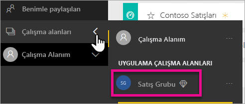

# Power BI çalışma alanlarında veri depolama alanlarını yönetme

Raporları ve veri kümelerini yayınlamaya devam edebilmek için bireysel alanınızda veya çalışma alanında veri depolamasını yönetmeyi öğrenin.

## Kapasite sınırları

Hem Çalışma Alanım hem de bir uygulamanın çalışma alanı için çalışma alanı depolama sınırları, çalışma alanının [paylaşılan kapasitede mi yoksa Premium kapasitede mi](../fundamentals/service-basic-concepts.md#capacities) yer aldığına bağlıdır.

### Paylaşılan kapasite sınırları
Paylaşılan kapasitedeki çalışma alanları için: 

- Çalışma alanı depolaması başına 100 GB sınırı vardır.
- Uygulama çalışma alanları için, toplam kullanım kiracının 10 GB’lık depolama sınırı ile kiracıdaki Pro lisansları sayısının çarpımını aşamaz.

### Premium kapasite sınırları
Premium kapasitedeki çalışma alanları için:
- Premium kapasite başına 100 TB sınırı vardır.
- Kullanıcı başına depolama sınırı yoktur.

[Power BI fiyatlandırma modelinin](https://powerbi.microsoft.com/pricing) diğer özellikleri hakkında bilgi edinin.

## Depolamaya dahil olanlar

Veri depolama alanınızda kendi veri kümelerinizin ve Excel raporlarınızın yanı sıra sizinle paylaşılan öğeler de bulunur. Veri kümeleri karşıya yüklediğiniz veya bağlandığınız veri kaynaklarıdır. Bu veri kaynakları, kullandığınız Power BI Desktop dosyalarını ve Excel çalışma kitaplarını içerir. Aşağıdaki öğeler de veri kapasitenize dahil edilir.

* Panoya sabitlenmiş olan Excel aralıkları.
* Power BI panolarına sabitlenmiş olan Reporting Services şirket içi görselleştirmeleri.
* Karşıya yüklenen görüntüler.

Paylaştığınız panoların boyutları, bu panolara sabitlenmiş öğelere göre değişir. Örneğin, iki farklı veri kümesine ait olan iki rapordaki öğeleri sabitlerseniz dosya boyutu iki veri kümesini de içerecektir.

<a name="manage"/>

## Size ait olan öğeleri yönetme

Power BI hesabınızda kullandığınız depolama alanı miktarını görün ve hesabınızı yönetin.

1. Kendi depolama alanınızı yönetmek için gezinti bölmesinde **Çalışma Alanım** sayfasına gidin.
   
    

2. Sağ üst köşedeki dişli simgesini  ve ardından \> **Kişisel depolama alanını yönet**'i seçin.
   
    Üst taraftaki çubukta, depolama alanınızın ne kadarını kullandığınız gösterilir.
   
    
   
    Veri kümeleri ve raporlar iki sekmeye ayrılmıştır:
   
    **Bana ait:** Bunlar, Salesforce ve Dynamics CRM gibi hizmet veri kümeleri de dahil olmak üzere Power BI hesabınıza sizin yüklediğiniz raporlar ve veri kümeleridir.  

    **Diğerlerine ait:** Başkalarının sizinle paylaştığı raporlar ve veri kümeleridir.
1. Bir veri kümesini veya raporu silmek için çöp kutusu simgesini seçin .

Size veya başkalarına ait bazı rapor veya panoların bir veri kümesine bağlı olabileceğini unutmayın. İlgili veri kümesini silerseniz bağlı raporlar ve panolar artık çalışmaz.

## Çalışma alanınızı yönetme
1. **Çalışma Alanları**’nın \> yanındaki oku ve ardından çalışma alanının adını seçin.
   
    
2. Sağ üst köşedeki dişli simgesini  ve ardından \> **Grup depolama alanını yönet**’i seçin.
   
    Üst taraftaki çubukta, grup depolama alanınızın ne kadarının kullanıldığı gösterilir.
   
    
   
    Veri kümeleri ve raporlar iki sekmeye ayrılmıştır:
   
    **Bize ait:** Bunlar, Salesforce ve Dynamics CRM gibi hizmet veri kümeleri de dahil olmak üzere grubun Power BI hesabına sizin yüklediğiniz veya başka birinin yüklediği raporlar ve veri kümeleridir.

    **Diğerlerine ait:** Başkalarının grubunuzla paylaştığı raporlar ve veri kümeleridir.

3. Bir veri kümesini veya raporu silmek için çöp kutusu simgesini seçin .
   
   > [!NOTE]
   > Size veya gruptaki diğer kullanıcılara ait bazı rapor veya panoların bir veri kümesine bağlı olabileceğini unutmayın. İlgili veri kümesini silerseniz bağlı raporlar ve panolar artık çalışmaz.
   
   Çalışma alanında yönetici, üye veya katkıda bulunan rolüne sahip tüm üyeler çalışma alanındaki veri kümelerini ve raporları silme izinlerine sahip olur.

## Veri kümesi sınırları
Power BI'a aktarılan her veri kümesi için 1 GB'lık bir sınır söz konusudur. Verileri içeri aktarmak yerine Excel deneyimini korumayı tercih ettiyseniz veri kümesi başına sınır 250 MB'tır.

## Sınıra ulaştığınızda ne olur?
Herhangi bir alandaki kapasite sınırına ulaştığınızda hizmet içinde uyarılar görürsünüz. 

Dişli simgesini seçtiğinizde, veri kapasitesi sınırınızı aştığınızı belirten bir kırmızı çubuk görürsünüz.

Bu sınır, **Kişisel depolama alanını yönet** bölümünde de belirtilir.

 

 Sınırlardan birine ulaşılmasına neden olacak bir eylem gerçekleştirmeye çalıştığınızda sınırı aştığınızı belirten bir ileti görürsünüz. Depoladığınız veri miktarını azaltmak ve sınır sorununu ortadan kaldırmak için depolama alanınızı [yönetebilirsiniz](#manage).

 

 ## Sonraki adımlar

 Başka bir sorunuz mu var? [Power BI Topluluğu'na sorun](https://community.powerbi.com/)
