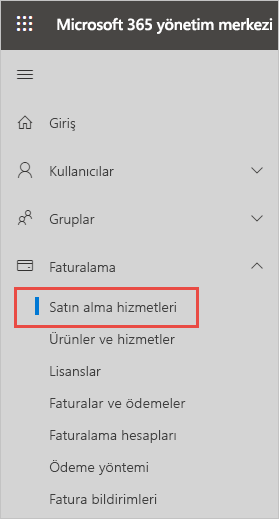
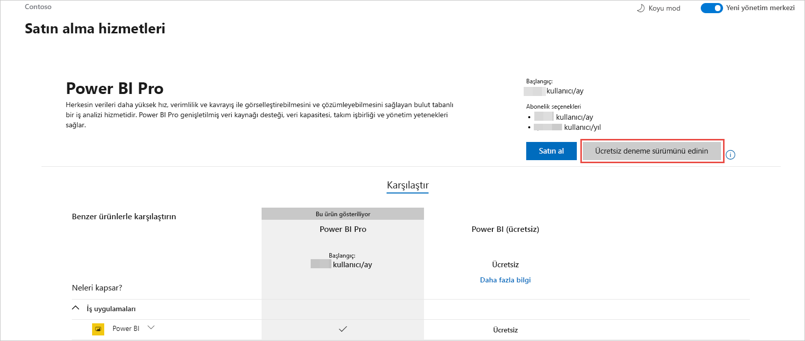
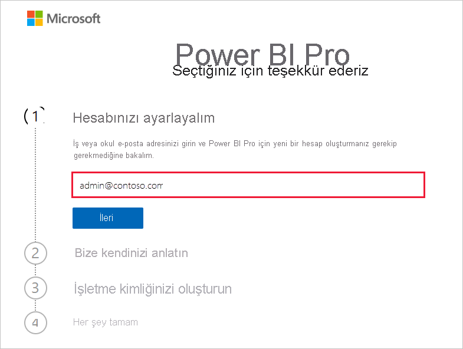
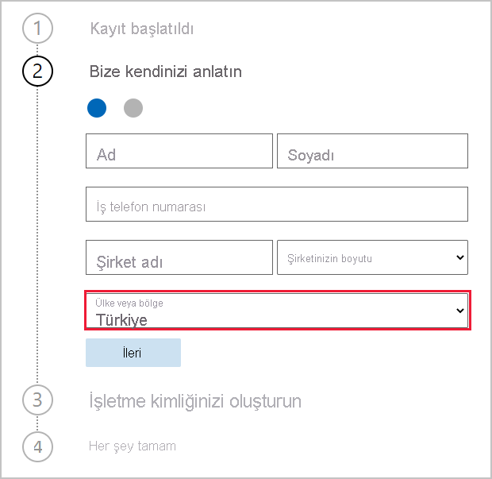
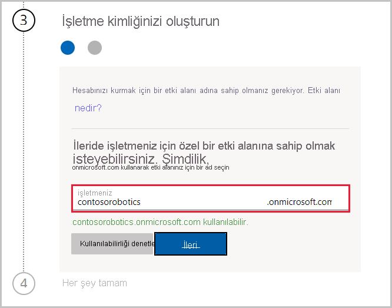

# Kuruluşunuz için Power BI hizmet aboneliği alma

Yöneticiler Power BI hizmetine Microsoft 365 yönetim merkezinin **Hizmet satın al** sayfasından kaydolabilir. Bir yönetici Power BI'a kaydolduğunda, erişimi olması gereken kullanıcılara lisans atayabilir.

Kuruluşunuzdaki kullanıcılar Power BI web sitesi aracılığıyla Power BI'a kaydolabilir. Kuruluşunuzdaki bir kullanıcı Power BI'a kaydolduğunda, ona otomatik olarak bir Power BI lisansı atanır. Self servis özelliklerini devre dışı bırakmak istiyorsanız, [Self servis kaydolma ve satın alma özelliklerini etkinleştirme veya devre dışı bırakma](service-admin-disable-self-service.md) bölümündeki adımları izleyin.

## Microsoft 365 aracılığıyla kaydolma

Genel yönetici veya faturalama yöneticisiyseniz, kuruluşunuz için bir Power BI aboneliği alabilirsiniz. Daha fazla bilgi için bkz. [Lisansları kimler satın alabilir ve atayabilir?](service-admin-licensing-organization.md#who-can-purchase-and-assign-licenses).

> [!NOTE]
>
> Microsoft 365 E5 aboneliği zaten Power BI Pro lisanslarını içeriyor. Lisansları yönetme hakkında bilgi edinmek için bkz. [Kullanıcı lisanslarını görüntüleme ve yönetme](service-admin-manage-licenses.md).
>
>

Microsoft 365 yönetim merkezinde Power BI Pro lisansları satın almak için şu adımları izleyin:

1. [Microsoft 365 yönetim merkezinde](https://admin.microsoft.com) oturum açın.

2. Gezinti menüsünde **Faturalama** > **Hizmetleri satın alın** öğesini seçin.
  
   

3. Satın almak istediğiniz aboneliği bulmak için arama yapın veya ekranı kaydırın. **Power BI**’ı sayfanın alt kısmında, **İlginizi çekebilecek diğer kategoriler**’in altında bulacaksınız. Kuruluşunuza bağlanan Power BI aboneliklerini görüntülemek için bağlantıyı seçin.

4. Power BI Pro gibi bir teklif seçin.

5. **Hizmetleri satın alın** sayfasında **Satın Al**’ı seçin. Daha önce kullanmadıysanız, bir Power BI Pro ücretsiz deneme aboneliği başlatabilirsiniz. 25 lisans içerir ve bir ayda süresi dolar.

   

6. Nasıl ödeme yapmak istediğinize bağlı olarak **Aylık ödeme** veya **Tam yıllık ödeme** seçeneğini belirleyin.

7. **Kaç tane kullanıcı istiyorsunuz?** bölümüne satın alacağınız lisans sayısını girin ve işlemi tamamlamak için **Siparişi tamamla**’yı seçin.

8. Satın alma işleminizi doğrulamak için **Faturalama** > **Ürünler ve hizmetler**’e gidin ve **Power BI Pro**’yu bulun.

Kuruluşunuzun Power BI hizmetini nasıl gözden geçirebileceği ve alabileceği hakkında daha fazla bilgi edinmek için bkz. [Kuruluşunuzda Power BI](https://docs.microsoft.com/microsoft-365/admin/misc/power-bi-in-your-organization?view=o365-worldwide).

## Kuruluşunuz için Power BI’ı almanın diğer yolları

Henüz bir Microsoft 365 abonesi değilseniz, kuruluşunuza Power BI Pro denemesi almak için aşağıdaki adımları kullanın. Öte yandan [Yeni Microsoft 365 denemesine kaydolabilir](service-admin-signing-up-for-power-bi-with-a-new-office-365-trial.md), sonra da önceki bölümde verilen adımları izleyerek Power BI’ı ekleyebilirsiniz.

Power BI aboneliğine kaydolmak için bir iş veya okul hesabına sahip olmanız gerekir. Tüketici e-posta hizmetleri veya telekomünikasyon sağlayıcıları tarafından sağlanan e-posta adreslerini desteklemiyoruz. İş veya okul hesabınız yoksa kayıt sırasında bir hesap oluşturabilirsiniz.

Kaydolmak için şu adımları izleyin:

1. [Power BI Pro’ya kaydolma](https://signup.microsoft.com/create-account/signup?OfferId=d59682f3-3e3b-4686-9c00-7c7c1c736085&ali=1&products=d59682f3-3e3b-4686-9c00-7c7c1c736085) bölümüne gidin. 

2. İş veya okul e-posta adresinizi girin, sonra da **İleri**’yi seçin. İş veya okul e-posta adresi olarak kabul edilmeyen bir e-posta adresi girmeniz de sorun yaratmaz. İşletme kimliğinizi oluştururken sizin için yeni bir hesap ayarlarız.

   

3. Yeni hesap oluşturmanızın gerekip gerekmediğini görmek için hızlı bir denetim çalıştırırız. Kayıt işlemine devam etmek için **Hesap ayarla**’yı seçin.

   > [!NOTE]
   >E-posta adresiniz zaten başka bir Microsoft hizmeti tarafından kullanılıyorsa **Oturum aç**’ı veya **Bunun yerine yeni bir hesap oluştur**’u seçebilirsiniz. Yeni hesap oluşturmayı seçerseniz, hesabı ayarlamak için bu adımları izlemeye devam edin.
>
>
 
4. Bize kendinizden bahsetmek için formu doldurun. Doğru ülke veya bölgeyi seçmeye dikkat edin. Seçtiğiniz ülke, [Power BI kiracınızın bulunduğu yeri belirleme](service-admin-where-is-my-tenant-located.md#how-to-determine-where-your-power-bi-tenant-is-located) başlığı altında açıklandığı gibi verilerinizin nerede depolanacağını belirler.

   

5. **İleri**’yi seçin. Kimliğinizi doğrulamak için bir doğrulama kodu göndermemiz gerekir. Kısa mesaj gönderebilmemiz veya sizi aramamız için bize bir telefon numarası verin. Ardından **Doğrulama Kodu Gönder**’i seçin.

6. Doğrulama kodunu girin ve **İşletme kimliğinizi oluşturun** bölümünden devam edin.

   

    İşletmeniz için kısa bir ad girin; bu adın kullanılabilir olup olmadığını denetleriz. Veri merkezinde onmicrosoft.com’un bir alt etki alanı olarak kuruluş adınızı oluşturmak için bu kısa adı kullanırız. Daha sonra kendi işletme etki alanınızı ekleyebilirsiniz. İstediğiniz kısa ad alınmışsa endişelenmeyin. Büyük olasılıkla işletme adı sizinkine benzeyen biri bu kısa adı seçmiştir; başka bir çeşitlemesini deneyin. **İleri**’yi seçin.
    
7. Hesabınızda oturum açmak için kullanıcı kimliğinizi ve parolanızı oluşturun. **Kaydol**’u seçtiğinizde işiniz tamamlanır.

Oluşturduğunuz hesap artık yeni Power BI Pro deneme kiracısının genel yöneticisidir. [Microsoft 365 yönetim merkezinde](https://admin.microsoft.com) oturum açarak daha fazla kullanıcı ekleyebilir, özel bir etki alanı ayarlayabilir, daha fazla hizmet satın alabilir ve Power BI aboneliğinizi yönetebilirsiniz.

## Sonraki adımlar

- [Kullanıcıları lisanslarını görüntüleme ve yönetme](service-admin-manage-licenses.md)
- [Self servis kaydolma ve satın alma işlemlerini etkinleştirme veya devre dışı bırakma](service-admin-disable-self-service.md)
- [İş abonelikleri ve faturalama belgeleri](https://docs.microsoft.com/microsoft-365/commerce/?view=o365-worldwide)
