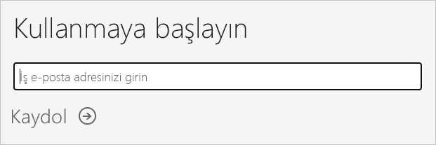
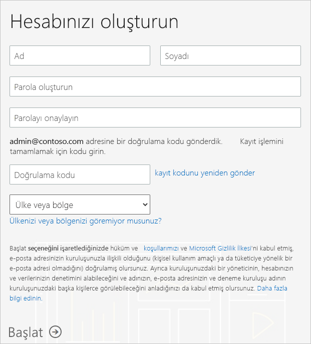

# Kuruluşunuz için Power BI aboneliği alma

Yönetici olarak [Power BI web sitesi](https://powerbi.microsoft.com) aracılığıyla Power BI'a kaydolabilirsiniz. Ayrıca Microsoft 365 yönetim merkezindeki hizmet satın alma sayfası aracılığıyla da kaydolabilirsiniz. Bir yönetici Power BI'a kaydolduğunda, erişimi olması gereken kullanıcılara lisans atayabilir.

Ayrıca kuruluşunuzdaki bireysel kullanıcılar Power BI web sitesi aracılığıyla Power BI'a kaydolabilir. Kuruluşunuzdaki bir kullanıcı Power BI'e kaydolduğunda kullanıcıya otomatik olarak bir Power BI lisansı atanır. Bu özelliği devre dışı bırakmak istiyorsanız, [Self servis kaydolma ve satın alma özelliklerini etkinleştirme veya devre dışı bırakma](service-admin-disable-self-service.md) bölümündeki adımları izleyin.

## Power BI aracılığıyla kaydolma

Power BI aboneliğine kaydolmak için bir iş veya okul hesabına sahip olmanız gerekir. Tüketici e-posta hizmetleri veya telekomünikasyon sağlayıcıları tarafından sağlanan e-posta adreslerini desteklemiyoruz.

Kaydolmak için şu adımları izleyin:

1. [Power BI web sitesine](https://powerbi.microsoft.com) gidin. **Ücretsiz deneyin**'i seçin.
2. İş e-posta adresinizi girin, sonra da **Kaydol**'u seçin.

   

3. Kimliğinizi doğrulayın. Kullanmak üzere doğrulama kodunu sizi arayarak bildireceğiz veya kısa mesaj olarak göndereceğiz.
4. Şirketinizden aldığınız bir e-posta adresi kullandığınızı onaylamak için **Evet**'i seçin.
5. Hesabınızı oluşturun. Kaydolma işlemini tamamlamak için e-posta adresinize bir doğrulama kodu göndeririz.

   

## Microsoft 365 aracılığıyla kaydolma

Microsoft 365 genel yöneticisi veya faturalama yöneticisiyseniz, kuruluşunuz için bir Power BI aboneliği alabilirsiniz. Daha fazla bilgi için bkz. [Lisansları kimler satın alabilir ve atayabilir?](../service-admin-licensing-organization.md#who-can-purchase-and-assign-licenses).

> [!NOTE]
>
> Microsoft 365 E5 aboneliği zaten Power BI Pro lisanslarını içeriyor. Lisansları yönetme hakkında bilgi edinmek için bkz. [Kullanıcı lisanslarını görüntüleme ve yönetme](service-admin-manage-licenses.md).
>
>

Microsoft 365 yönetim merkezinde Power BI Pro lisansları satın almak için şu adımları izleyin:

1. [Microsoft 365 yönetim merkezinde](https://admin.microsoft.com) oturum açın.

2. Gezinti menüsünde **Faturalama** > **Hizmetleri satın alın** öğesini seçin.
  
   

3. Satın almak istediğiniz aboneliği bulmak için arama yapın veya ekranı kaydırın. **Power BI**’ı sayfanın alt kısmında, **İlginizi çekebilecek diğer kategoriler**’in altında bulacaksınız. Kuruluşunuza bağlanan Power BI aboneliklerini görüntülemek için bağlantıyı seçin.

4. Power BI Pro gibi bir teklif seçin.

5. **Hizmetleri satın alın** sayfasında **Satın Al**’ı seçin. Daha önce kullanmadıysanız, bir Power BI Pro ücretsiz deneme aboneliği başlatabilirsiniz. 25 lisans içerir ve bir ayda süresi dolar.

   

6. Nasıl ödeme yapmak istediğinize bağlı olarak **Aylık ödeme** veya **Tam yıllık ödeme** seçeneğini belirleyin.

7. **Kaç tane kullanıcı istiyorsunuz?** bölümüne satın alacağınız lisans sayısını girin ve işlemi tamamlamak için **Siparişi tamamla**’yı seçin.

8. Satın alma işleminizi doğrulamak için **Faturalama** > **Ürünler ve hizmetler**’e gidin ve **Power BI Pro**’yu bulun.

Kuruluşunuzun Power BI hizmetini nasıl aldığı hakkında daha fazla bilgi edinmek için bkz. [Kuruluşunuzda Power BI](https://docs.microsoft.com/microsoft-365/admin/misc/power-bi-in-your-organization?view=o365-worldwide).

## Sonraki adımlar

- [Kullanıcıları lisanslarını görüntüleme ve yönetme](service-admin-manage-licenses.md)
- [Self servis kaydolma ve satın alma işlemlerini etkinleştirme veya devre dışı bırakma](service-admin-disable-self-service.md)
- [İş abonelikleri ve faturalama belgeleri](https://docs.microsoft.com/microsoft-365/commerce/?view=o365-worldwide)
