# Yönetim portalında Power BI’ı yönetme

Yönetici portalı, kuruluşunuz için Power BI ayarlarını yönetmenize olanak sağlar. Portalda kullanım ölçümleri, Microsoft 365 yönetim merkezine erişim ve kiracı ayarları gibi öğeler bulunur.

Tam yönetici portalına, genel yöneticiler ve Power BI hizmet yöneticisi rolüne sahip kullanıcılar tarafından erişilebilir. Bu rollerden birinde değilseniz portalda yalnızca **Kapasite ayarlarını** görürsünüz. Power BI hizmet yöneticisi rolü ile ilgili daha fazla bilgi için bkz. [Power BI yönetici rolünü anlama](service-admin-role.md).

## Yönetici portalına ulaşma

Power BI yönetici portalına erişmek için genel yönetici veya Power BI hizmet yöneticisi olmanız gerekir. Power BI hizmet yöneticisi rolü ile ilgili daha fazla bilgi için bkz. [Power BI yönetici rolünü anlama](service-admin-role.md). Power BI yönetici portalına ulaşmak için şu adımları izleyin:

1. Yönetici hesabı kimlik bilgilerinizi kullanarak [Power BI](https://app.powerbi.com)’da oturum açın.

1. Sayfa üst bilgisinde, **Ayarlar** > **Yönetici portalı** seçeneğini belirleyin.

    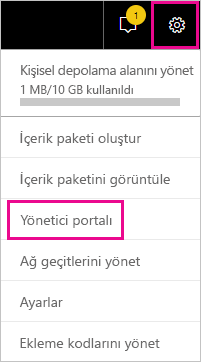

Yönetici portalında birkaç bölüm vardır. Bu makalenin kalan kısmında bu bölümlerin her biriyle ilgili bilgiler sağlanır.

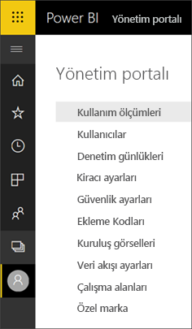

* [Kullanım ölçümleri](#usage-metrics)
* [Kullanıcılar](#users)
* [Denetim günlükleri](#audit-logs)
* [Kiracı ayarları](#tenant-settings)
* [Kapasite ayarları](#capacity-settings)
* [Ekleme kodları](#embed-codes)
* [Kuruluş görselleri](organizational-visuals.md#organizational-visuals)
* [Azure bağlantıları (önizleme)](#azure-connections-preview)
* [Çalışma alanları](#workspaces)
* [Özel marka](#custom-branding)
* [Koruma ölçümleri](#protection-metrics)
* [Öne çıkan içerik](#featured-content)

## Kullanım ölçümleri

**Kullanım ölçümleri** , kuruluşunuz için Power BI kullanımını izlemenize olanak sağlar. Ayrıca kuruluşunuzdaki hangi kullanıcıların ve grupların Power BI’da en etkin olduğunu da gösterir.

> [!NOTE]
> Panoya ilk kez eriştiğinizde veya panoyu görüntülemeniz üzerinden uzun bir süre geçtikten sonra panoyu tekrar ziyaret ettiğinizde, biz panoyu yüklerken büyük olasılıkla bir yükleme ekranıyla karşılaşırsınız.

Pano yüklendikten sonra iki kutucuk bölümü görürsünüz. İlk bölümde farklı kullanıcılara yönelik kullanım verileri, ikinci bölümde ise gruplara yönelik benzer bilgiler bulunur.

Aşağıda, her kutucukta görebileceklerinize ilişkin bir döküm verilmiştir:

* Kullanıcı çalışma alanındaki tüm panoların, raporların ve veri kümelerinin ayrı sayımı.
  
    

* Erişebilen kullanıcıların sayısına göre en fazla kullanılan pano. Örnek: Üç kullanıcıyla paylaştığınız bir panonuz var. Panoyu, iki farklı kullanıcının bağlandığı bir içerik paketine de eklediniz. Panoların sayısı 6 (1 + 3 + 2) olur.
  
    

* Kullanıcıların bağlı olduğu en popüler içerikler. İçerik, kullanıcıların Veri Al işlemiyle ulaşabileceği herhangi bir şey (ör. SaaS içerik paketleri, Kuruluş içeriği paketleri, dosyalar veya veritabanları) olabilir.

  
    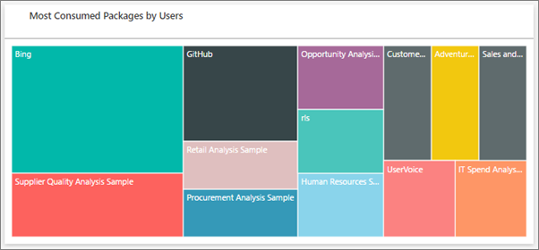

* En fazla panoya sahip (hem kendi oluşturdukları hem de kendileriyle paylaşılan panolar) kullanıcılarınızın bir görünümü.
  
    

* En fazla rapora sahip kullanıcılarınızın bir görünümü.
  
    

İkinci bölüm aynı türde bilgileri grup temelinde gösterir. Bu bölüm, kuruluşunuzdaki hangi grupların en etkin olduğunu ve ne tür içeriği kullandığını görmenize olanak sağlar.

Bu bilgilerle, kullanıcıların kuruluşunuz genelinde Power BI’ı nasıl kullandığına ilişkin gerçek içgörüler elde edebilirsiniz.

## Kullanım ölçümlerini denetleme

Kullanım ölçümleri raporları, Power BI yöneticileri veya genel yöneticiler tarafından etkinleştirilip devre dışı bırakılabilecek bir özelliktir. Yöneticiler, hangi kullanıcıların kullanım ölçümlerine erişebileceği konusunda ayrıntılı bir denetime sahiptir. Bunlar kuruluştaki tüm kullanıcılar için varsayılan olarak **Açık** 'tır.

Yöneticiler içerik oluşturucuların kullanım ölçümlerinde kullanıcı başına verileri görüp göremeyeceğini de belirleyebilir. 

Raporlar hakkındaki ayrıntılar için bkz. [Power BI panoları ve raporları için kullanım ölçümlerini izleme](../collaborate-share/service-usage-metrics.md).

### İçerik oluşturucuları için kullanım ölçümleri

1. Yönetici portalında **Kiracı ayarları** > **Denetim ve kullanım ayarları** > **İçerik oluşturucuları için kullanım ölçümleri** ’ni seçin.

    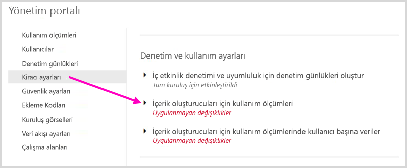

1. Kullanım ölçümlerini etkinleştirin (veya devre dışı bırakın) > **Uygula** 'yı seçin.

    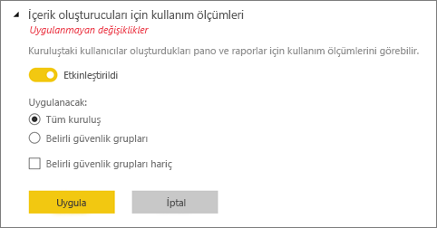

### İçerik oluşturucuları için kullanım ölçümlerinde kullanıcı başına veriler

Varsayılan olarak, kullanım ölçümleri için kullanıcı başına veriler etkinleştirilir ve hesap bilgileri, ölçüm raporuna eklenir. Kullanıcılardan bazıları veya tümü için hesap bilgilerinin eklenmesini istemiyorsanız, belirtilen güvenlik grupları veya kuruluşun tamamı için özelliği devre dışı bırakın. Bu durumda hesap bilgileri raporda *Adsız* olarak gösterilir.

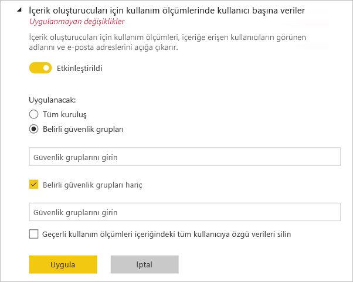

### Tüm mevcut kullanım ölçümleri içeriğini silme

Yöneticiler kuruluşun tamamı için kullanım ölçümlerini devre dışı bırakırken aşağıdaki seçeneklerden birini veya her ikisini seçebilir:

- **Tüm mevcut kullanım ölçümleri içeriğini silin** seçeneği kullanım ölçümleri raporları ve veri kümeleri kullanılarak oluşturulmuş tüm mevcut raporları ve pano kutucuklarını silmek için kullanılır. Bu seçenek, kullanmakta olanlar dahil olmak üzere kuruluştaki tüm kullanıcılar için kullanım ölçümlerine yönelik erişimi kaldırır.
- **Geçerli kullanım ölçümleri içeriğindeki tüm kullanıcıya özgü verileri silin** seçeneği kuruluşta bunları kullanıyor olabilecek tüm kullanıcılar için kullanıcı başına verilere erişimi kaldırır.

Mevcut kullanım ve kullanıcı başına ölçümleri içeriğini silme işlemi geri alınamadığından dikkatli hareket etmeniz önerilir.

## Kullanıcılar

Power BI kullanıcılarını, gruplarını ve yöneticilerini Microsoft 365 yönetim merkezinde yönetirsiniz. **Kullanıcılar** sekmesi, yönetim merkezine bağlantı sağlar.

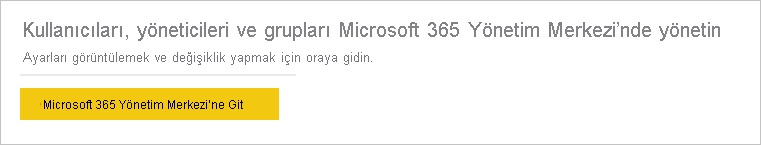

## Denetim günlükleri

Power BI denetim günlüklerini Office 365 Güvenlik ve Uyumluluk merkezinde yönetirsiniz. **Denetim günlükleri** sekmesi, Güvenlik ve Uyumluluk merkezine bağlantı sağlar. Daha fazla bilgi edinmek için bkz. [Power BI’da kullanıcı etkinliklerini izleme](service-admin-auditing.md).

Denetim günlüklerini kullanmak için [**İç etkinlik denetimi ve uyumluluk için denetim günlükleri oluşturun**](#create-audit-logs-for-internal-activity-auditing-and-compliance) ayarının etkinleştirilmiş olduğundan emin olun.

## Kiracı ayarları

**Kiracı ayarları** , kuruluşunuzun kullanımına sunulan özellikler üzerinde çok ayrıntılı bir denetime olanak tanır. Gizli verilerle ilgili endişeleriniz varsa, sunduğumuz belirli özellikler kuruluşunuz için uygun olmayabilir veya belirli bir özelliğin yalnızca belirli bir grubun kullanımına sunulmasını isteyebilirsiniz.

> [!NOTE]
> Power BI kullanıcı arabirimindeki özelliklerin kullanılabilirliğini denetleyen kiracı ayarları, idare ilkelerinin oluşturulmasında yardımcı olabilir ancak birer güvenlik ölçümü değildir. Örneğin, **Verileri dışarı aktar** ayarı, bir veri kümesindeki Power BI kullanıcısının izinlerini kısıtlamaz. Veri kümesine ilişkin okuma erişimine sahip Power BI kullanıcıları bu veri kümesini sorgulama iznine sahiptir ve Power BI kullanıcı arabirimindeki **Verileri dışarı aktar** özelliğini kullanmadan sonuçları kalıcı hale getirebilir.

Aşağıdaki bölümlerde **Kiracı ayarları** sekmesinin ayarları ele alınmıştır.

> [!NOTE]
> Ayar değişikliğinin kuruluşunuzdaki herkes için geçerlilik kazanması 15 dakikaya kadar sürebilir.

Çoğu ayar üç durumdan birine sahip olabilir:

* **Tüm kuruluş için devre dışı bırakıldı** : Kuruluşunuzda kimse bu özelliği kullanamaz.

    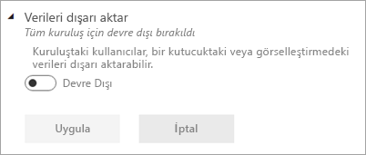

* **Tüm kuruluş için etkinleştirildi** : Kuruluşunuzdaki herkes bu özelliği kullanabilir.

    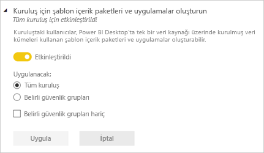

* **Kuruluşun bir alt kümesi için etkinleştirildi** : Kuruluşunuzdaki belirli güvenlik gruplarının bu özelliği kullanmasına izin verilir.

    **Belirli kullanıcı grupları dışında** kuruluşunuzun tamamı için de bir özelliği etkinleştirebilirsiniz.

    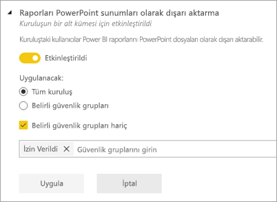

    Ayrıca, özelliği yalnızca belirli bir kullanıcı grubuna yönelik olarak etkinleştirmek ve bir kullanıcı grubu için devre dışı bırakmak amacıyla ayarları birleştirebilirsiniz. Bu yaklaşımın kullanılması, izin verilen grupta olsalar bile belirli kullanıcıların özelliğe erişmemesini sağlar. Bir kullanıcı için en kısıtlayıcı ayar geçerli olur.

    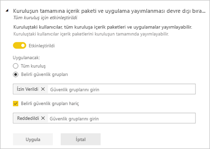

Aşağıdaki bölümlerde kiracı ayarlarının farklı türleri için genel bakışa yer verilmiştir.

## Kiracı genelindeki yeni görünüm ayarları

**Yeni görünüm** seçeneği devre dışı bırakıldığında bu kuruluştaki kullanıcılar Power BI'ın yeni görünümü açabilir ve kapatabilir. **Yeni görünüm** seçeneğini etkinleştirdiğinizde bu kuruluştaki *tüm* kullanıcılar her zaman Power BI'ın yeni görünümündeki modern denetimleri görür. Kullanıcılar yeni görünümü kapatamaz. Yeni görünüm seçeneği varsayılan olarak etkindir.

:::image type="content" source="media/service-admin-portal/admin-portal-new-look-disable.png" alt-text="Yönetici portalındaki Yeni görünümü devre dışı bırak seçeneğinin ekran görüntüsü.":::

## Yardım ve destek ayarları

### “Yardım alın” bilgilerini yayımlama

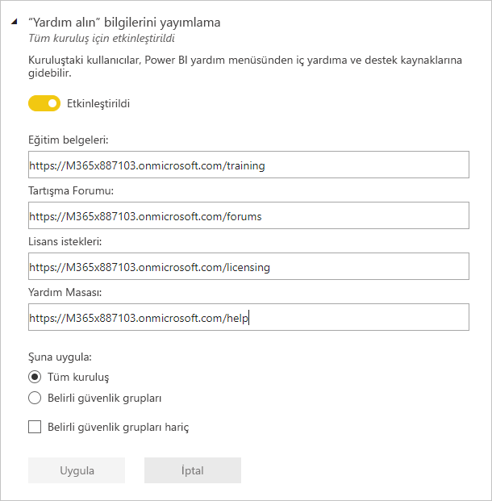

Yöneticiler, lisans yükseltmeleri için ve Power BI yardım menüsünde bağlantıların hedefini geçersiz kılmak amacıyla iç URL’ler belirtebilir. Özel URL’ler ayarlanırsa kuruluştaki kullanıcılar, varsayılan hedefler yerine iç yardım ve destek kaynaklarına gider. Aşağıdaki kaynak hedefleri özelleştirilebilir:

* **Öğrenin**. Varsayılan olarak bu yardım menüsü bağlantısı, [tüm Power BI öğrenme yollarımızın ve modüllerimizin listesini](/learn/browse/?products=power-bi) hedefler. Bunun yerine bu bağlantıyı iç eğitim kaynaklarına yönlendirmek için, **Eğitim belgelerine** yönelik özel bir URL ayarlayın.

* **Topluluk**. Kullanıcıları, yardım menüsünden [Power BI Topluluğu](https://community.powerbi.com/) yerine bir iç foruma götürmek için **Tartışma forumu** ’na yönelik özel bir URL ayarlayın.

* **Lisans yükseltmeleri**. Power BI (ücretsiz) lisansına sahip kullanıcılara, hizmeti kullanırken hesaplarını Power BI Pro’ya yükseltme fırsatı sunulabilir. **Lisanslama istekleri** için bir iç URL belirtirseniz kullanıcıları bir iç isteğe ve satın alma akışına yeniden yönlendirir ve self servis satın alma işlemini engellersiniz. Kullanıcıların lisans satın almasını engellemek istiyorsanız, ancak kullanıcıların Power BI Pro deneme sürümü başlatmasına izin vermek istiyorsanız satın alma ve deneme deneyimlerini ayırmak için bkz. [Kullanıcıların Power BI Pro’yu denemesine izin verme](#allow-users-to-try-power-bi-pro).

* **Yardım alın**. Kullanıcıları, yardım menüsünden [Power BI Desteği](https://powerbi.microsoft.com/support/) yerine bir iç yardım masasına götürmek için **Yardım Masası** ’na yönelik özel bir URL ayarlayın.

### Hizmet kesintileri veya olaylara yönelik e-posta bildirimlerini etkinleştir

Bu kiracı bir hizmet kesintisinden veya olaydan etkilenirse posta etkin güvenlik grupları e-posta bildirimleri alır. [Hizmet kesintisi bildirimleri](service-interruption-notifications.md) hakkında daha fazla bilgi edinin.

### Kullanıcıların Power BI Pro’yu denemesine izin verme

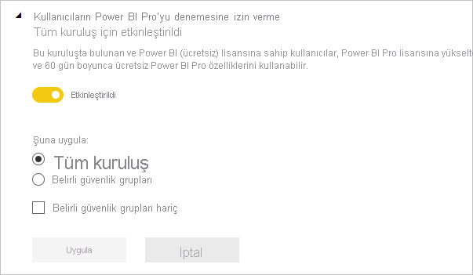

**Kullanıcıların Power BI Pro’yu denemesine izin verme** ayarı varsayılan olarak etkindir. Bu ayar, kullanıcıların Power BI Pro lisanslarını edinme yöntemi üzerindeki denetiminizi artırır. Self servis satın almayı engellediğiniz senaryolarda bu ayar, kullanıcıların Power BI Pro deneme sürümünü başlatmasına olanak sağlar. Son kullanıcı deneyimi, lisans ayarlarını nasıl birleştirdiğinize bağlıdır. Aşağıdaki tabloda, Power BI’dan (ücretsiz) Power BI Pro’ya yükseltme deneyiminizin farklı ayar birleşimlerinden nasıl etkilendiği gösterilmektedir:

| Self servis satın alma ayarı | Kullanıcının Power BI Pro’yu denemesine izin verme ayarı | Son kullanıcı deneyimi |
| ------ | ------ | ----- |
| Etkin | Devre dışı | Kullanıcı, Pro lisansı satın alabilir, ancak deneme sürümü başlatamaz |
| Etkin | Etkin | Kullanıcı, ücretsiz bir Pro deneme sürümü başlatabilir ve ücretli bir lisansa yükseltme yapabilir |
| Devre dışı | Devre dışı | Kullanıcı, lisans istemek üzere BT yöneticisiyle iletişim kurmak için bir ileti görür |
| Devre dışı | Etkin | Kullanıcı bir Pro deneme sürümü başlatabilir, ancak ücretli lisans almak için BT yöneticisiyle iletişim kurmalıdır |

> [!NOTE]
> [Yardım ve destek ayarları](#help-and-support-settings) bölümünde lisans istekleri için bir iç URL ekleyebilirsiniz. URL’yi ayarlarsanız varsayılan self servis satın alma deneyimi geçersiz kılınır. Power BI Pro lisans denemesi için kaydolma sayfasına yeniden yönlendirmez. Yukarıdaki tabloda açıklanan senaryolarda lisans satın alabilen kullanıcılar, iç URL’nize yeniden yönlendirilir.

Daha fazla bilgi edinmek için bkz. [Self servis kaydolma ve satın alma işlemlerini etkinleştirme veya devre dışı bırakma](service-admin-disable-self-service.md).

## Çalışma alanı ayarları

Yönetici portalının **Kiracı ayarları** bölümünde çalışma alanlarını denetlemeye yönelik üç bölüm vardır:

- [Yeni çalışma alanı deneyimleri oluşturma](#create-the-new-workspaces).
- [Veri kümelerini çalışma alanları arasında kullanma](#use-datasets-across-workspaces).
- [Klasik çalışma alanı oluşturma işlemini engelleme](#block-classic-workspace-creation).

### Yeni çalışma alanları oluşturma

Çalışma alanları kullanıcıların panolar, raporlar ve diğer içerikler üzerinde işbirliği yaptığı alanlardır. Yöneticiler, kuruluştaki hangi kullanıcıların çalışma alanı oluşturabileceğini belirtmek için **Çalışma alanı oluştur (yeni çalışma alanı deneyimi)** ayarını kullanır. Yöneticiler kuruluştaki kişilerin tümüne yeni çalışma alanı deneyimi oluşturma izni verebilir veya hiçbirine vermeyebilir. Ayrıca çalışma alanı oluşturmayı belirli güvenlik gruplarının üyeleriyle de sınırlayabilir. [Çalışma alanları](../collaborate-share/service-new-workspaces.md) hakkında daha fazla bilgi edinin.

:::image type="content" source="media/service-admin-portal/power-bi-admin-workspace-settings.png" alt-text="Yeni çalışma alanı deneyimi oluşturma":::

Microsoft 365 Gruplarını temel alan klasik çalışma alanlarında yönetim yine yönetim portalında ve Azure Active Directory'de gerçekleşir.

> [!NOTE]
> **Çalışma alanları oluşturma (yeni çalışma alanı deneyimi)** ayarının varsayılan değeri yalnızca Microsoft 365 Grupları oluşturabilen kullanıcılara yeni Power BI çalışma alanları oluşturma izni verilmesidir. Power BI yönetim portalında uygun kullanıcıların bu öğeleri oluşturabilmesini sağlayacak bir değer ayarlamaya dikkat edin.

**Çalışma alanlarının listesi**

Yönetici portalında, kiracınızda bulunan çalışma alanları hakkında başka bir ayarlar bölümü bulunur. Bu bölümde, çalışma alanları listesini filtreleyebilir, sıralayabilir ve her çalışma alanının ayrıntılarını görüntüleyebilirsiniz. Ayrıntılar için bu makalenin [Çalışma alanları](#workspaces) bölümüne bakın.

**İçerik paketlerini ve uygulamaları yayımlama**

Yönetici portalında, hangi kullanıcıların kuruluş uygulamalarını dağıtmak için izinleri olduğunu da denetlersiniz. Ayrıntılar için bu makalenin [Tüm kuruluşa içerik paketleri ve uygulamalar yayımlama](#publish-content-packs-and-apps-to-the-entire-organization) bölümüne bakın.

### Veri kümelerini çalışma alanları arasında kullanma

Yöneticiler, kuruluştaki hangi kullanıcıların veri kümelerini farklı çalışma alanlarında kullanabileceğini denetleyebilir. Bu ayar etkinleştirildiğinde de kullanıcılar, belirli bir veri kümesi için gerekli Oluşturma iznine ihtiyaç duyar.

:::image type="content" source="media/service-admin-portal/power-bi-admin-datasets-workspaces.png" alt-text="Veri kümelerini çalışma alanları arasında kullanma":::

Daha fazla bilgi için bkz. [Çalışma alanları arasında veri kümelerine giriş](../connect-data/service-datasets-across-workspaces.md).

### Klasik çalışma alanı oluşturma işlemini engelleme

Yöneticiler kuruluşun klasik çalışma alanları oluşturabilme becerisini denetleyebilir. Bu ayar etkinleştirildiğinde, çalışma alanını oluşturan kullanıcılar yalnızca yeni çalışma alanı deneyimi çalışma alanları oluşturabilir. 

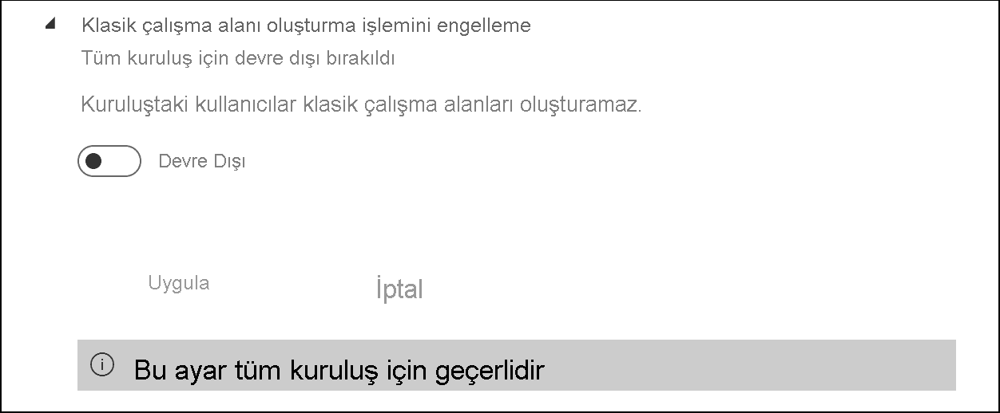

Etkinleştirildiğinde, yeni oluşturulan Office 365 Grupları Power BI çalışma alanları listesinde gösterilmez. Mevcut çalışma alanları listede gösterilmeye devam eder. Ayar etkinleştirildiğinde, kullanıcının üyesi olduğu tüm Office 365 Grupları çalışma alanları listesinde görüntülenir. [Yeni çalışma alanı deneyimi çalışma alanları](../collaborate-share/service-new-workspaces.md) hakkında daha fazla bilgi edinin.

## Dışarı aktarma ve paylaşım ayarları

### Azure Active Directory konuk kullanıcılarının Power BI’a erişmesine izin ver

Bu ayarın etkinleştirilmesi, Azure Active Directory İşletmeler Arası (Azure AD B2B) konuk kullanıcılarının Power BI’a erişmesine olanak sağlar. Bu ayarı devre dışı bırakırsanız konuk kullanıcılar Power BI’a erişmeye çalışırken bir hata alır. Kuruluşun tamamı için bu ayarın devre dışı bırakılması, kullanıcıların kuruluşunuza konuklar davet etmesini de engeller. Hangi konuk kullanıcıların Power BI’a erişebileceğini denetlemek için belirli güvenlik gruplarını kullanın.

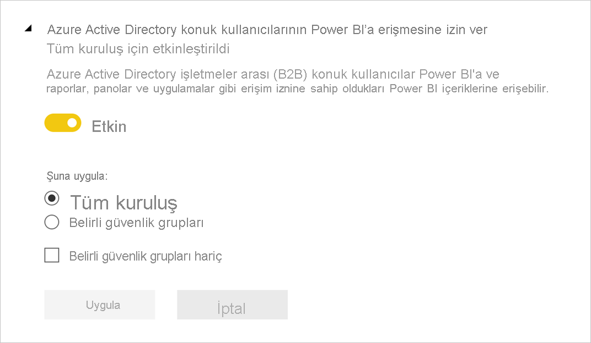

### Dış kullanıcıları kuruluşuma davet et 

**Dış kullanıcıları kuruluşuma davet et** ayarı, kuruluşların Power BI paylaşım ve izinleri yoluyla yeni dış kullanıcıların kuruluşa davet edilip edilemeyeceğini seçmesine yardımcı olur. Ayar devre dışıysa kuruluşta bir konuk kullanıcı olmayan dış kullanıcı, Power BI aracılığıyla kuruluşa eklenemez.

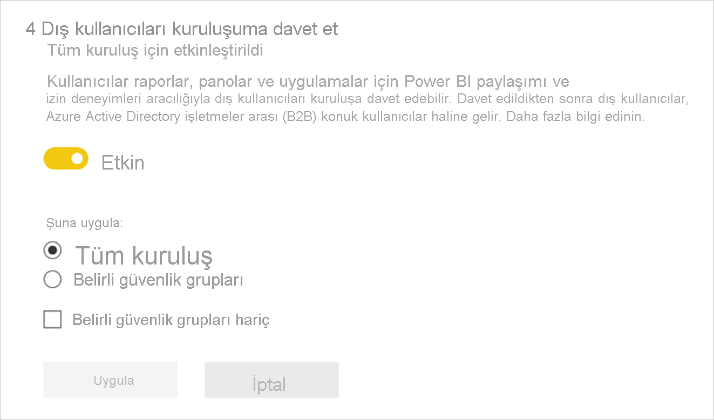

> [!IMPORTANT]
> Bu ayar daha önce “Dış kullanıcılarla içerik paylaş” olarak adlandırılıyordu. Düzeltilen ad, ayarın ne yaptığını daha doğru yansıtır.

Kullanıcının dış kullanıcıları kuruluşunuza davet edebilmesi için Azure Active Directory Konuk Davet Eden rolüne de sahip olması gerekir. Bu ayar yalnızca Power BI aracılığıyla davet etme özelliğini denetler. 

### Web'de yayımla

Power BI yöneticisi olarak **Web'de yayımla** ayarıyla kullanıcıların raporları web üzerinde yayımlamalarını sağlayacak ekleme kodları oluşturmalarına izin verebilirsiniz. Bu işlev, raporu ve verilerini web’deki herkesin kullanımına sunar. [Web’de yayımlama](../collaborate-share/service-publish-to-web.md) hakkında daha fazla bilgi edinin.

> [!NOTE]
> Yeni web’de yayımlama ekleme kodları oluşturma işlemine yalnızca Power BI yöneticileri izin verebilir. Kuruluşların mevcut ekleme kodları olabilir. Yayımlanmış raporları gözden geçirmek için yönetici portalının [Ekleme kodları](service-admin-portal.md#embed-codes) bölümüne göz atın.

Aşağıdaki resimde, **Web’de yayımla** ayarı etkinleştirildiğinde raporun **Diğer seçenekler (...)** menüsü gösterilir.

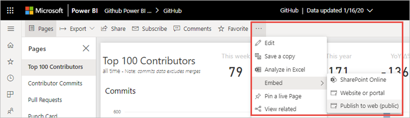

Yönetici portalındaki **Web’de yayımla** ayarı, kullanıcıların ekleme kodları oluşturabileceği seçenekler sunar.

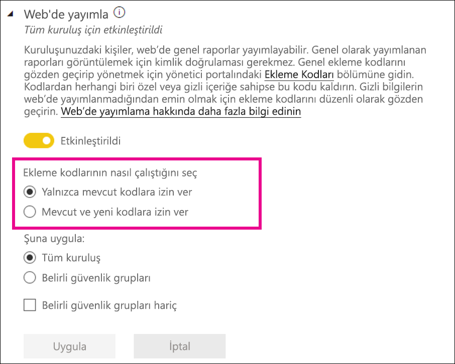

Yöneticiler **Web’de yayımlama** ayarını **Etkin** , **Ekleme kodlarının nasıl çalışacağını seçme** ayarını ise **Yalnızca mevcut ekleme kodlarına izin ver** olarak belirleyebilir. Bu durumda kullanıcılar ekleme kodları oluşturabilir, ancak izin vermesi için Power BI yöneticisine ulaşmaları gerekir.

Kullanıcılar **Web’de yayımla** ayarına göre kullanıcı arabiriminde farklı seçeneklerle karşılaşır.

|Özellik |Tüm kuruluş için etkindir |Tüm kuruluş için devre dışıdır |Belirli güvenlik grupları   |
|---------|---------|---------|---------|
|Raporun **Diğer seçenekler (...)** menüsündeki **Web'de yayımla** seçeneği|Tüm kullanıcılar için etkindir|Herkes için görünmez|Yalnızca yetkili kullanıcılar veya gruplar için görünür.|
|**Ayarlar** bölümündeki **Ekleme kodlarını yönet** seçeneği|Tüm kullanıcılar için etkindir|Tüm kullanıcılar için etkindir|Tüm kullanıcılar için etkindir  * **Sil** seçeneği yalnızca yetkili kullanıcılar veya gruplar için görünür. * **Kod al** seçeneği tüm kullanıcılar için etkindir.|
|Yönetici portalındaki **Ekleme kodları** seçeneği|Durum olarak şunlardan biri görüntülenir: * Etkin * Desteklenmiyor * Engellendi|Durum **Devre dışı** görünür|Durum olarak şunlardan biri görüntülenir: * Etkin * Desteklenmiyor * Engellendi  Bir kullanıcı, kiracı ayarına göre yetkilendirilmemişse durum, **İhlal edildi** olarak görüntülenir.|
|Mevcut yayımlanmış raporlar|Tümü etkindir|Tümü devre dışıdır|Raporlar tüm kullanıcılar için görünür olmaya devam eder.|

### Verileri dışarı aktarma

Kuruluştaki kullanıcılar, bir kutucuktaki veya görselleştirmedeki verileri dışarı aktarabilir. Bu ayar Excel’de Çözümle, .csv dosyasına aktar, veri kümesi indirmeleri (.pbix) ve Power BI Hizmeti Live Connect özelliklerini denetler. [Kutucuktaki veya görseldeki verileri dışarı aktarma](../visuals/power-bi-visualization-export-data.md) hakkında daha fazla bilgi edinin.

>[!NOTE]
> Excel’e Aktar ayarı sunulmadan önce verilerin Excel dosyalarına aktarılmasını da bu ayar denetliyordu. Ayrıntılar için [Excel’e Aktar seçeneğinin altında yer alan nota](#export-to-excel) bakın.

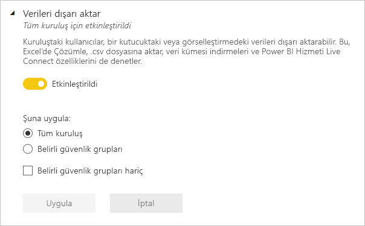

Aşağıdaki resimde kutucuktaki verileri dışarı aktarma seçeneği gösterilir.

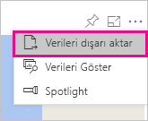

> [!NOTE]
> **Verileri dışarı aktar** seçeneğinin devre dışı bırakılması, kullanıcıların [Excel'de Çözümle](../collaborate-share/service-analyze-in-excel.md) özelliğini ve Power BI hizmeti canlı bağlantısını kullanmasını da önler.

### Excel'e aktar

Kuruluştaki kullanıcılar, görselleştirmedeki verileri bir Excel dosyasına aktarabilir.

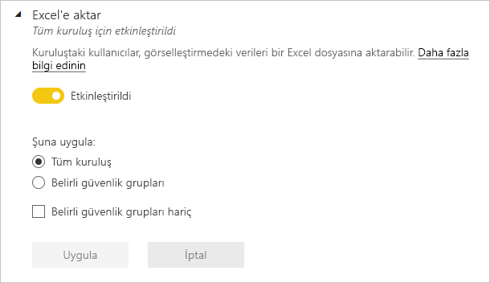

>[!IMPORTANT]
> Excel’e Aktar ayarı sunulmadan önce verilerin Excel dosyalarına aktarılmasını da bu ayar denetliyordu. Bu nedenle, Power BI yöneticileri Excel’e Aktar ayarı sunulmadan önce oluşturulan kiracılarda Excel’e Aktar ayarına ilk kez baktığında, bunun *Uygulanmamış değişikler* içerdiğini görür. Yeni ayarın etkili olması için bu değişiklikleri uygulamaları gerekir. Aksi takdirde, Verileri dışarı aktar ayarı Excel dosyasına aktarma özelliğini denetlemeye devam eder.

### Raporları PowerPoint sunuları veya PDF belgeleri olarak dışarı aktarma

Kuruluştaki kullanıcılar, Power BI raporlarını PowerPoint dosyaları veya PDF belgeleri olarak dışarı aktarabilir. [Daha fazla bilgi](../consumer/end-user-powerpoint.md)

Aşağıdaki resimde **Raporları PowerPoint sunuları veya PDF belgeleri olarak dışarı aktar** ayarı etkinleştirildiğinde raporun **Dosya** menüsü gösterilir.

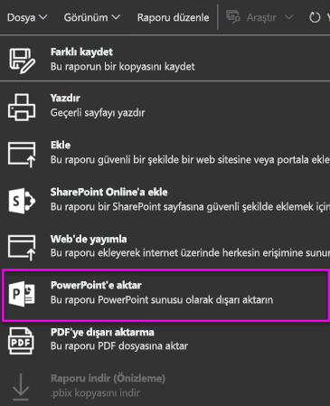

### Panoları ve raporları paylaşma

Kuruluştaki kullanıcılar panoları ve raporları yazdırabilir. [Daha fazla bilgi](../consumer/end-user-print.md)

Aşağıdaki görüntüde panoya yazdırma seçeneği gösterilmiştir.

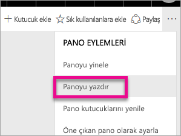

Aşağıdaki görüntüde **Panoları ve raporları yazdırın** ayarı etkinleştirildiğinde raporun **Dosya** menüsü gösterilmiştir.

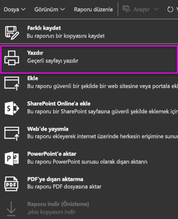

### Harici konuk kullanıcıların kuruluş içeriklerini düzenlemelerine ve yönetmelerine izin ver

Azure AD B2B konuk kullanıcıları kuruluş içeriklerini düzenleyebilir ve yönetebilir. [Daha fazla bilgi](service-admin-azure-ad-b2b.md)

Aşağıdaki resimde Harici konuk kullanıcıların kuruluş içeriklerini düzenlemelerine ve yönetmelerine izin verme seçeneği gösterilir.

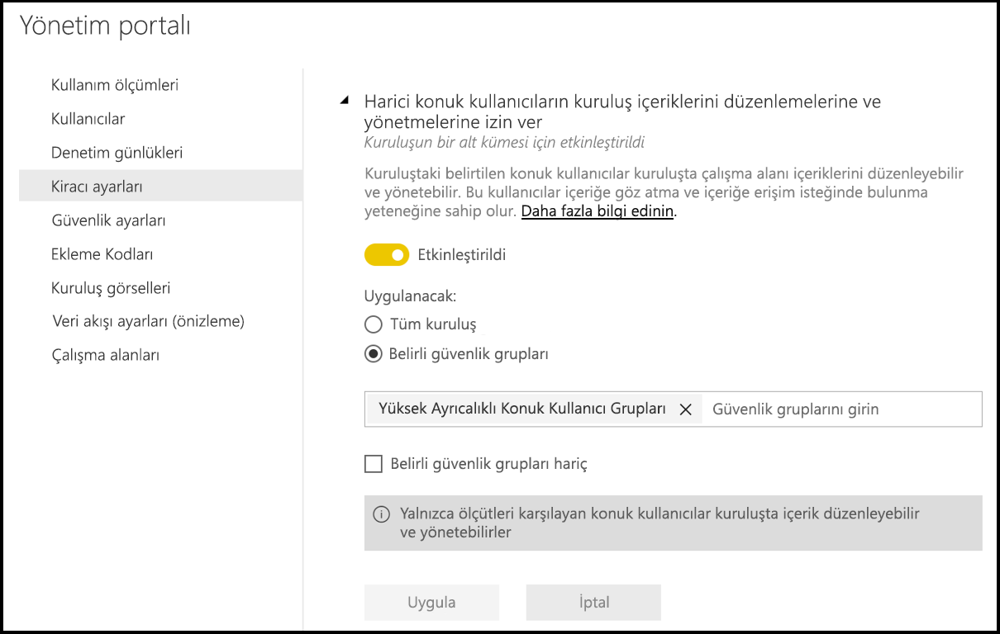

Yönetici portalında, hangi kullanıcıların kuruluşa dış kullanıcıları davet etme izni olduğunu da denetlersiniz. Ayrıntılar için bu makaledeki [Dış kullanıcılarla içerik paylaşma](#export-and-sharing-settings) bölümüne bakın.

### E-posta Abonelikleri
Kuruluştaki kullanıcılar e-posta abonelikleri oluşturabilir. [Abonelikler](../collaborate-share/service-publish-to-web.md) hakkında daha fazla bilgi edinin.

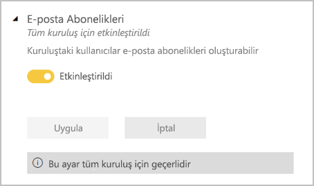

### Öne çıkan içerik

Kuruluşunuzdaki rapor yazarlarının bazılarının veya tümünün içeriklerini Power BI Giriş Sayfasının Öne Çıkanlar bölümünde öne çıkarmasına izin verin. Yeni kullanıcılar, Power BI Giriş sayfasının üst kısmında öne çıkan içerikleri görür. Öne çıkan içerik, kullanıcılar **Sık kullanılanlar** , **sık ziyaret edilenler** ve **Son Kullanılanlar** ekledikçe Giriş sayfasının aşağısına taşınır. 

Önce küçük bir dizi destekleyenle başlanmasını öneririz. Tüm kuruluşun Giriş Sayfasında içeriği öne çıkarmasına izin verilmesi, tüm tanıtılan içeriğin takip edilmesini zorlaştırabilir. 

Öne çıkan içeriği etkinleştirdikten sonra, Yönetici portalından da yönetebilirsiniz. Etki alanınızda öne çıkan içeriği denetleme hakkında bilgi edinmek için bu makalede [Öne çıkan içeriği yönetme](#manage-featured-content) bölümüne bakın.

## İçerik paketi ve uygulama ayarları

### Kuruluşun tamamına içerik paketi ve uygulama yayımlanması devre dışı bırakıldı

Yöneticiler bu ayarı, kuruluştaki hangi kullanıcıların içerik paketlerini ve uygulamaları belirli gruplar yerine kuruluşun tamamına yayımlayabileceğini belirlemek için kullanır. [Uygulama yayımlama](../collaborate-share/service-create-distribute-apps.md) hakkında daha fazla bilgi edinin.

Aşağıdaki görüntüde içerik paketi oluşturma sırasında **Tüm kuruluşum** seçeneği gösterilmiştir.

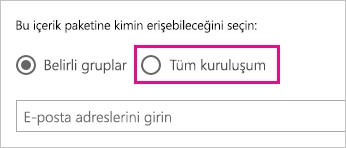

### Şablon uygulamalar kurumsal içerik paketleri oluşturma

Kuruluştaki kullanıcılar Power BI Desktop’taki bir veri kaynağı üzerinde oluşturulan veri kümelerini kullanan şablon uygulamaları ve kurumsal içerik paketleri oluşturabilir. [Şablon uygulamaları](../connect-data/service-template-apps-create.md) hakkında daha fazla bilgi edinin.

### Son kullanıcılara uygulama gönderme

Rapor oluşturucular, kullanıcıların [AppSource](https://appsource.microsoft.com)’tan yüklemesine gerek kalmadan uygulamaları son kullanıcılarla doğrudan paylaşabilir. [Son kullanıcılar için uygulamaları otomatik olarak yükleme](../collaborate-share/service-create-distribute-apps.md#automatically-install-apps-for-end-users) hakkında daha fazla bilgi edinin.

## Tümleştirme ayarları

### Şirket içi veri kümeleriyle Excel'de Çözümle özelliğini kullanma

Kuruluştaki kullanıcılar Excel'i kullanarak şirket içi Power BI veri kümelerini görüntüleyebilir ve bunlarla etkileşime geçebilir. [Daha fazla bilgi](../collaborate-share/service-analyze-in-excel.md)

> [!NOTE]
> **Verileri dışarı aktar** seçeneğinin devre dışı bırakılması, kullanıcıların **Excel'de Çözümle** özelliğini kullanmasını da engeller.

### ArcGIS Maps for Power BI kullanma

Kuruluştaki kullanıcılar, Esri tarafından sağlanan ArcGIS Maps for Power BI görselleştirmesini kullanabilir. [Daha fazla bilgi](../visuals/power-bi-visualizations-arcgis.md)

### Power BI için genel aramayı kullanma (Önizleme)

Kuruluşunuzdaki kullanıcılar, Azure Search kullanan dış arama özelliklerinden yararlanabilir.

## Öne çıkan tablo ayarları

**Kiracı ayarları** bölümündeki **Öne çıkan tablolara yönelik bağlantılara izin ver** ayarı, Power BI yöneticilerinin Excel Veri Türleri Galerisi’ndeki öne çıkan tabloları kuruluşta kullanabilecek kişileri denetlemelerini sağlar. 

:::image type="content" source="media/service-admin-portal/admin-allow-connections-featured-tables.png" alt-text="Öne çıkan tablolara yönelik tüm bağlantılar":::

**Verileri dışarı aktar** ayarı **Devre dışı** olarak ayarlandıysa öne çıkan tablolara yönelik bağlantılar da devre dışı bırakılır.

[Excel’de öne çıkan Power BI tabloları](../collaborate-share/service-excel-featured-tables.md) hakkında daha fazla bilgi edinin.

## Teams’de Paylaş kiracı ayarı

**Teams'de Paylaş** ayarı Power BI yönetici portalının **Kiracı ayarları** bölümünde yer alır. Ayar kuruluşların Power BI hizmetinde **Teams'de Paylaş** düğmelerini gizlemesine olanak tanır. Devre dışı olarak ayarlandığında, Power BI hizmetinde raporları ve panoları görüntüleyen kullanıcılar eylem çubuğunda veya bağlam menülerinde **Teams’de Paylaş** düğmelerini görmez.

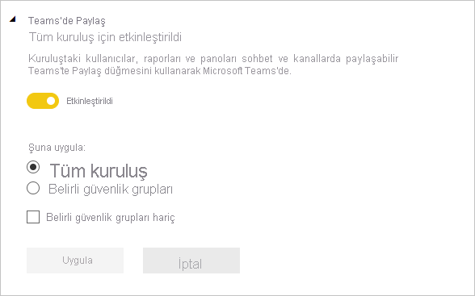

[Power BI içeriğini Teams'de paylaşma](../collaborate-share/service-share-report-teams.md) hakkında daha fazla bilgi edinin.

## R görseli ayarları

### R görselleriyle etkileşim kur ve bunları paylaş

Kuruluştaki kullanıcılar R betikleri ile oluşturulan görsellerle etkileşime geçebilir ve bunları paylaşabilir. [Daha fazla bilgi](../visuals/service-r-visuals.md)

> [!NOTE]
> Bu ayar kuruluş genelinde geçerli olur ve belirli gruplarla sınırlanamaz.

## Denetim ve kullanım ayarları

### İç etkinlik denetimi ve uyumluluk için denetim günlükleri oluştur

Kuruluştaki kullanıcılar, Power BI'da kuruluştaki diğer kullanıcılar tarafından gerçekleştirilen eylemleri izlemek için denetim özelliğini kullanabilir. [Daha fazla bilgi](service-admin-auditing.md)

Denetim günlüğü girişlerinin kaydedilmesi için bu ayarın etkinleştirilmesi gerekir. Denetimin etkinleştirilmesi ile denetim verilerinin görüntülenebilmesi arasında 48 saate kadar gecikme olabilir. Verileri hemen göremiyorsanız denetim günlüklerini daha sonra denetleyin. Denetim günlüklerini görüntüleme izni alma ile günlüklere erişebilme arasında da benzer bir gecikme olabilir.

> [!NOTE]
> Bu ayar kuruluş genelinde geçerli olur ve belirli gruplarla sınırlanamaz.

### İçerik oluşturucuları için kullanım ölçümleri

Kuruluştaki kullanıcılar oluşturdukları pano ve raporlar için kullanım ölçümlerini görebilir. [Daha fazla bilgi](../collaborate-share/service-usage-metrics.md)

### İçerik oluşturucuları için kullanım ölçümlerinde kullanıcı başına veriler

İçerik oluşturucuları için kullanım ölçümleri, içeriğe erişen kullanıcıların görünen adlarını ve e-posta adreslerini açığa çıkarır. [Daha fazla bilgi](../collaborate-share/service-usage-metrics.md)

Varsayılan olarak, kullanım ölçümleri için kullanıcı başına veriler etkinleştirilir ve içerik oluşturucunun hesap bilgileri ölçüm raporuna eklenir. Kullanıcılardan tümü için bu bilgilerin toplanmasını istemezsiniz, belirtilen güvenlik grupları veya kuruluşun tamamı için özelliği devre dışı bırakabilirsiniz. Bu durumda dışlanan kullanıcıların hesap bilgileri raporda *Adsız* olarak gösterilir.

## Pano ayarları

### Panolar için veri sınıflandırması

Kuruluştaki kullanıcılar, pano güvenlik düzeyleri belirten sınıflandırmalarla panoları etiketleyebilir. [Daha fazla bilgi](../create-reports/service-data-classification.md)

> [!NOTE]
> Bu ayar kuruluş genelinde geçerli olur ve belirli gruplarla sınırlanamaz.

## Geliştirici ayarları

### Uygulamalara içerik ekleme

Kuruluştaki kullanıcılar Hizmet Olarak Yazılım (SaaS) uygulamalarına Power BI panoları ve raporları ekleyebilir. Bu ayarın devre dışı bırakılması; kullanıcıların, uygulamalarına Power BI içeriği eklemek için REST API'lerini kullanabilmesini önler. [Daha fazla bilgi](../developer/embedded/embedding.md)

### Hizmet sorumlularının Power BI API'leri kullanmasına izin ver

Azure Active Directory’ye (Azure AD) kayıtlı web uygulamaları, oturum açmış bir kullanıcı olmadan Power BI API’lerine erişmek için atanmış bir hizmet sorumlusu kullanır. Bir uygulamanın hizmet sorumlusu kimlik doğrulamasını kullanmasına izin vermek için hizmet sorumlusunun izin verilen bir güvenlik grubuna eklenmesi gerekir. [Daha fazla bilgi](../developer/embedded/embed-service-principal.md)

> [!NOTE]
> Hizmet sorumluları tüm Power BI kiracı ayarları için izinleri kendi güvenlik grubundan devralır. İzinleri kısıtlamak için hizmet sorumlularına ayrılmış bir güvenlik grubu oluşturun ve bu grubu ilgili, etkin Power BI ayarlarının 'Belirli güvenlik grupları hariç' listesine ekleyin.

## Veri akışı ayarları

### Veri akışları oluşturma ve kullanma

Kuruluştaki kullanıcılar veri akışları oluşturabilir ve kullanabilir. Veri akışlarına yönelik bir genel bakış için bkz. [Power BI’da self servis veri hazırlığı](../transform-model/dataflows/dataflows-introduction-self-service.md). Premium kapasitede veri akışlarını etkinleştirmek için bkz. [İş yüklerini yapılandırma](service-admin-premium-workloads.md).

> [!NOTE]
> Bu ayar kuruluş genelinde geçerli olur ve belirli gruplarla sınırlanamaz.

## Şablon uygulaması ayarları

Bu ayarlar şablon uygulamalarının şablon uygulaması yayımlama veya yükleme yeteneğini denetler.

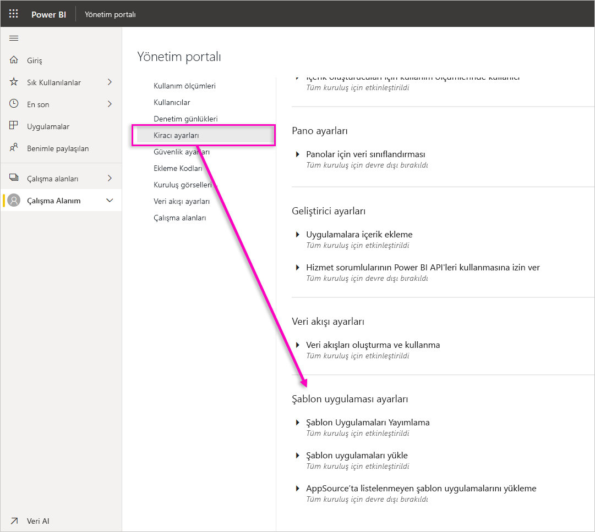

### Şablon Uygulamaları Yayımlama

Kuruluştaki kullanıcılar, şablon uygulama çalışma alanları oluşturabilir. Hangi kullanıcıların [AppSource](https://appsource.microsoft.com)’u veya başka bir dağıtım yöntemini kullanarak şablon uygulamaları yayımlayabileceğini veya bu uygulamaları kuruluşunuzun dışındaki istemcilere dağıtabileceğini denetleyin.

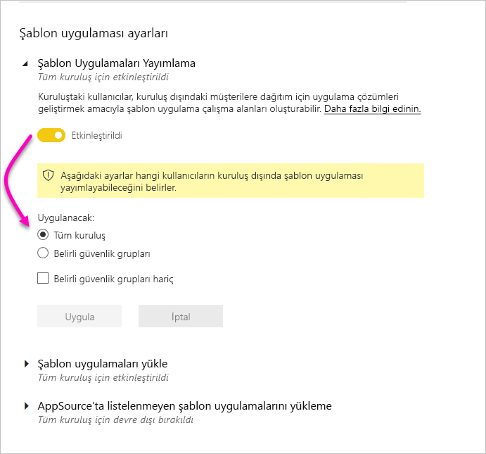

### AppSource’ta listelenen şablon uygulamalarını yükleme

Kuruluştaki kullanıcılar **yalnızca**[AppSource](https://appsource.microsoft.com)’tan şablon uygulamalarını indirebilir ve yükleyebilir. Hangi kullanıcıların veya güvenlik gruplarının AppSource’tan şablon uygulamaları yükleyebileceğini denetleyin.

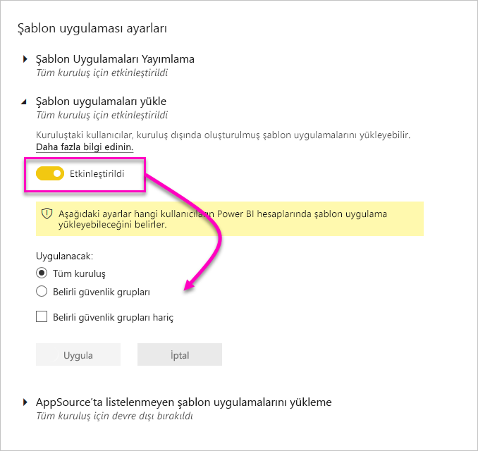

### AppSource’ta listelenmeyen şablon uygulamalarını yükleme

Kuruluştaki hangi kullanıcıların **[AppSource](https://appsource.microsoft.com)’ta listelenmeyen** şablon uygulamalarını indirebileceğini ve yükleyebileceğini denetleyin.

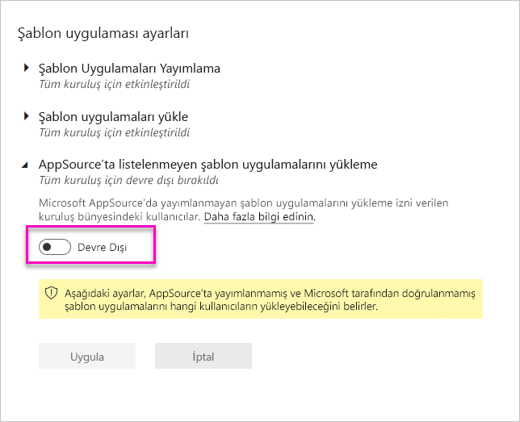

## Kapasite ayarları

### Power BI Premium

**Power BI Premium** sekmesi, kuruluşunuz için satın alınan Power BI Premium kapasitelerini (EM veya P SKU) yönetmenize olanak tanır. Kuruluşunuzdaki tüm kullanıcılar **Power BI Premium** sekmesini görebilir ancak yalnızca *Kapasite yöneticisi* olarak atanan veya atama izinlerine sahip kullanıcılar sekme içeriğini görebilir. Bir kullanıcı, izinlerden herhangi birine sahip olmaması durumunda aşağıdaki ileti görüntülenir.

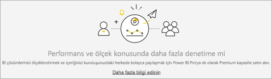

### Power BI Embedded

**Power BI Embedded** sekmesi, müşteriniz için satın aldığınız Power BI Embedded (A SKU) kapasitelerini görüntülemenizi sağlar. A SKU’ları yalnızca Azure’dan satın alabileceğiniz için [Azure’da ekli kapasiteleri yönetmek için](../developer/embedded/azure-pbie-create-capacity.md)**Azure portalı** kullanırsınız.

Power BI Embedded (A SKU) ayarlarını yönetme hakkında daha fazla bilgi için bkz. [Power BI Embedded nedir?](../developer/embedded/azure-pbie-what-is-power-bi-embedded.md)

## Ekleme kodları

Bir yönetici olarak, raporları genel kullanıma açmak amacıyla kiracınız için oluşturulan ekleme kodlarını görüntüleyebilirsiniz. Ayrıca kodları iptal edebilir veya silebilirsiniz. [Daha fazla bilgi](../collaborate-share/service-publish-to-web.md)

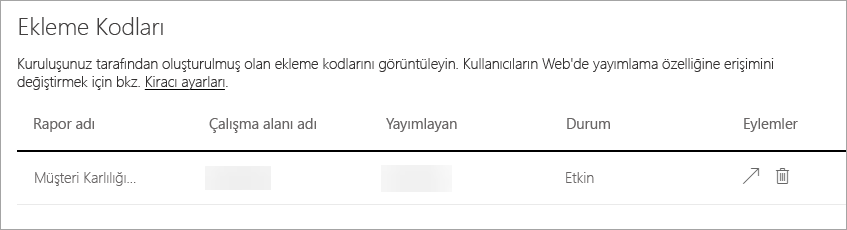

## Kuruluş görselleri

Power BI görselleri kiracı ayarları da dahil, tüm Power BI görselleri yönetici ayarları, [Power BI görselleri yönetici ayarlarını yönetme](organizational-visuals.md) bölümünde açıklanmaktadır.

## Azure bağlantıları (önizleme)

### Kiracı düzeyinde depolama (önizleme)

Varsayılan olarak, Power BI ile kullanılan veriler, Power BI tarafından sağlanan iç depolama alanında depolanır. Veri akışları ve Azure Data Lake Storage 2. Nesil (ADLS 2. Nesil) tümleştirmesi ile, kuruluşunuzun Azure Data Lake Storage 2. Nesil hesabında veri akışlarınızı depolayabilirsiniz. Daha fazla bilgi için bkz. [Veri akışları ve Azure Data Lake tümleştirmesi (Önizleme)](../transform-model/dataflows/dataflows-azure-data-lake-storage-integration.md)

### Çalışma alanı düzeyinde depolama izinleri (önizleme)

Varsayılan olarak çalışma alanı yöneticileri, kendi depolama hesaplarını bağlayamaz. Bu önizleme özelliği, çalışma alanı yöneticilerinin kendi depolama hesaplarını bağlamasına izin veren bir ayarı etkinleştirmenize olanak sağlar.

## Çalışma alanları

Yönetici olarak, kiracınızda bulunan çalışma alanlarını **Çalışma Alanları** sekmesinde görüntüleyebilirsiniz. Bu sekmede şu eylemleri gerçekleştirebilirsiniz:

- Çalışma alanları listesini ve bunların ayrıntılarını yenileme.
- Çalışma alanlarıyla ilgili verileri bir .csv dosyasına aktarma. 
- Çalışma alanının kimliği, panoları, raporları, veri kümeleri, kullanıcıları ve bu kullanıcıların rolleri gibi çalışma alanıyla ilgili ayrıntıları görüntüleme.
- Erişim iznine sahip kişilerin listesini düzenleme. Başka bir deyişle, çalışma alanını silebilirsiniz. Kendinizi bir çalışma alanına yönetici olarak ekleyebilir, sonra çalışma alanını açıp silebilirsiniz.
- Ad ve Açıklama alanlarını düzenleme.

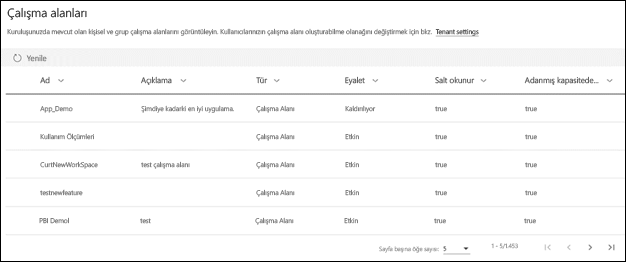

Yöneticiler, kullanıcıların yeni çalışma alanı deneyimi sunan çalışma alanlarını ve klasik çalışma alanlarını oluşturabilme yeteneğini de denetleyebilir. Ayrıntılar için bu makalenin [Çalışma alanı ayarları](#workspace-settings) bölümüne bakın. 

**Çalışma alanları** sekmesindeki tablo sütunları, çalışma alanları için [Power BI yönetici Rest API’si](/rest/api/power-bi/admin) tarafından döndürülen özelliklere karşılık gelir. Kişisel çalışma alanları **PersonalGroup** türünde, klasik çalışma alanları **Group** türünde ve yeni çalışma alanları deneyimi **Workspace** türündedir. Daha fazla bilgi için bkz. [Yeni çalışma alanlarında çalışmayı düzenleme](../collaborate-share/service-new-workspaces.md).

**Çalışma Alanları** sekmesinde her çalışma alanı için *durumu* görürsünüz. Aşağıdaki tabloda bu durumların anlamları hakkında daha ayrıntılı bilgiler verilmektedir.

|Durum  |Açıklama  |
|---------|---------|
| **Etkin** | Normal bir çalışma alanı. Kullanımı veya içindekiler hakkında bir şey ifade etmez, yalnızca çalışma alanının "normal" olduğu anlamına gelir. |
| **Yalnız bırakılmış** | Yönetici kullanıcısı olmayan çalışma alanı. |
| **Silindi** | Silinen çalışma alanı. 90 güne kadar, istenirse çalışma alanını geri yüklemek için yeterli miktarda meta veri saklarız. |
| **Kaldırılıyor** | Silinme aşamasında olup henüz silinmemiş çalışma alanı. Kullanıcılar kendi çalışma alanlarını silebilir, öğeleri Kaldırılıyor ve en sonunda Silindi durumuna alabilir. |

Yöneticiler ayrıca yönetici portalını veya PowerShell cmdlet'lerini kullanarak çalışma alanlarını yönetebilir ve kurtarabilir. 

## Özel marka

Yönetici olarak, tüm kuruluşunuz için Power BI görünümünü özelleştirebilirsiniz. Şu anda üç ana seçenek vardır:

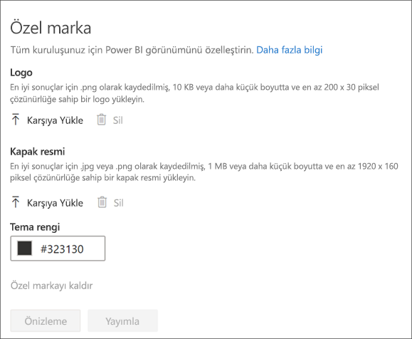

* **Logo Yükle** : En iyi sonuçlar için .png olarak kaydedilmiş, 10 KB veya daha küçük boyutta ve en az 200 x 30 piksel çözünürlüğe sahip bir logo yükleyin.

* **Kapak resmi yükle** : En iyi sonuçlar için .jpg veya .png olarak kaydedilmiş, 1 MB veya daha küçük boyutta ve en az 1920 x 160 piksel çözünürlüğe sahip bir kapak resmi yükleyin.

* **Tema rengi seç** : Bir onaltılık sayı, RGB, değer kullanarak veya verilen paletten temanızı seçebilirsiniz.

Daha fazla bilgi için bkz. [Kuruluşunuz için özel marka oluşturma](https://aka.ms/orgBranding).

## Koruma ölçümleri

Power BI için bilgi korumasını etkinleştirdikten sonra veri koruması ölçümleri, yönetici portalında görüntülenir. Bu rapor, duyarlılık etiketlerinin içeriklerinizin korunmasına nasıl yardımcı olduğunu gösterir.

## Öne çıkan içeriği yönetme

Power BI yöneticisi olarak, kuruluşunuz genelinde Power BI Giriş Sayfasında Öne Çıkanlar bölüme yükseltilen tüm raporları, panoları ve uygulamaları yönetebilirsiniz.

- Yönetici portalında **Öne çıkan içerik** seçeneğini belirleyin.

Burada, içeriği kimin ne zaman öne çıkardığına ve içeriğin tüm ilgili meta verilerine yönelik bir genel bakış görürsünüz. Bir şey şüpheli görünürse veya Öne Çıkanlar bölümünü temizlemek isterseniz, öne çıkan içeriği gerektiğinde silebilirsiniz.

Öne çıkan içeriği etkinleştirme hakkında daha fazla bilgi için bu makaledeki [Öne çıkan içerik](#featured-content) bölümüne bakın.

## Sonraki adımlar

[Kuruluşunuzda Power BI'ı yönetme](service-admin-administering-power-bi-in-your-organization.md)  
[Power BI yönetici rolünü anlama](service-admin-role.md)  
[Kuruluşunuzda Power BI'ı denetleme](service-admin-auditing.md)  

Başka bir sorunuz mu var? [Power BI Topluluğu'na sorun](https://community.powerbi.com/)