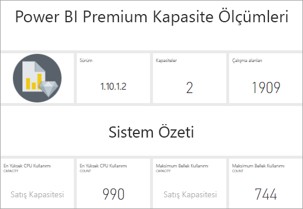

# Uygulama ile Premium kapasiteleri izleme

Premium kapasite kaynaklarını en iyi şekilde kullanma konusunda bilinçli kararlar alabilmek için kapasitelerinizi izlemek temel önem taşır. Kapasiteleri Yönetim portalında veya **Power BI Premium Kapasite Ölçümleri** uygulamasıyla izleyebilirsiniz. Bu makalede Premium Kapasite Ölçümleri uygulamasının kullanımı açıklanır. Uygulama kapasitenizin performansıyla ilgili en ayrıntılı bilgileri sağlar. Son yedi günün ortalama kullanım ölçümlerine üst düzey bir genel bakış için Yönetim portalını kullanabilirsiniz. Portalı izleme hakkında daha fazla bilgi edinmek için bkz. [Yönetim portalında Premium kapasiteleri izleme](service-admin-premium-monitor-portal.md).

Uygulama yeni özellikler ve işlevsellikle düzenli olarak güncelleştirilir. En son sürümü çalıştırdığınızdan emin olun. Yeni sürüm kullanıma sunulduğunda [bildirim](../connect-data/service-template-apps-install-distribute.md#update-a-template-app) alırsınız.

> [!IMPORTANT]
> Power BI Premium kapasitenizde performans ve güvenilirlik sorunlarına neden olan yüksek kaynak kullanımı sorunu yaşanıyorsa sorunu tanımlayıp çözmek için bildirim e-postaları alabilirsiniz. Bu, aşırı yüklenmiş kapasitelerde sorun gidermeye yönelik basitleştirilmiş bir yöntemdir. Daha fazla bilgi için bkz. [Kapasite ve güvenilirlik bildirimleri](service-interruption-notifications.md#capacity-and-reliability-notifications).

> [!NOTE]
> Yakın zamanda Power BI Premium, şu anda önizleme aşamasında olan **Premium 2. Nesil** adlı yeni bir Premium sürümünü kullanıma sundu. Premium 2. Nesil, Premium kapasitelerinin yönetimini basitleştirecek ve yönetim yükünü azaltacak. Daha fazla bilgi için bkz. [Power BI Premium 2. Nesil (önizleme)](service-premium-what-is.md#power-bi-premium-generation-2-preview).
>
>Power BI Embedded Gen2 geliştirmelerini gözden geçirmek için [Power BI Embedded 2. nesil](../developer/embedded/power-bi-embedded-generation-2.md)bölümüne bakın.

## Uygulamayı yükleme

Uygulamayı yüklemeyi ve verilere bağlanmayı öğrenmek için [Power BI Premium Kapasite Ölçümlerine Bağlanma](../connect-data/service-connect-to-pbi-premium-capacity-metrics.md) bölümüne gidin. Alternatif olarak [doğrudan uygulamaya gidin](https://go.microsoft.com/fwlink/?linkid=2114036).

## Uygulama yenileme geçmişini alma

Premium Kapasite Ölçümleri uygulamasının en son ne zaman yenilendiğini denetlemek için:

1. Uygulamayla birlikte yüklenen çalışma alanına gidin.

   

1. Veri kümesi satırında **Yenilemeyi zamanla** düğmesine tıklayın.

   

   Son yenileme gösterilir. Zamanlanmış ve isteğe bağlı yenilemeleri görmek için **Yenileme geçmişi**'ne tıklayın.

   

## Uygulama ile kapasiteleri izleme

Artık uygulamayı yüklediğinize göre kuruluşunuzdaki kapasitelerin ölçümlerini görebilirsiniz. Uygulama, ölçüm özetleri içeren bir Pano ve ayrıntılı ölçüm Raporları sunar.

### Pano

Yöneticisi olduğunuz kapasitelerin ana ölçümlerinin özetlendiği panoyu görmek için **Panolar**'da **Power BI Premium Kapasite Ölçümleri**'ne tıklayın. Bir pano görüntülenir.

Panoda aşağıdaki ölçümler bulunur:

#### Üst

| Metric | Açıklama |
| --- | --- |
| Sürüm | Uygulama sürümü. | 
| Kapasiteler | Yöneticisi olduğunuz kapasitelerin sayısı. | 
| Çalışma alanları | Ölçümleri bildiren kapasitelerinizdeki çalışma alanlarının sayısı.|
|||

#### Sistem Özeti

| Metric | Açıklama |
| --- | --- |
| CPU En Yüksek Kullanım Kapasitesi | Son yedi gün içinde CPU kullanımının eşik değerlerin %80'ini en çok aştığı kapasite. |
| CPU En Yüksek Kullanım Sayısı | Belirtilen kapasite için son yedi gün içinde CPU kullanımının eşik değerlerin %80'ini aşma sayısı. | 
| Bellek Maksimum Kullanım Kapasitesi | Son yedi gün içinde maksimum bellek sınırına en fazla ulaşan kapasite (üç dakikalık demetlere ayrılmıştır).  |
| Bellek Maksimum Kullanım Sayısı| Belirtilen kapasitenin son yedi gün içinde maksimum bellek sınırına ulaşma sayısı (üç dakikalık demetlere ayrılmıştır). |
|||

#### Veri Kümesi Özeti

| Metric | Açıklama |
| --- | --- |
| Veri kümeleri | Kapasitelerinizdeki tüm çalışma alanlarında yer alan veri kümelerinin toplam sayısı.|
| Veri Kümelerinin Ortalama Boyutu (MB) | Kapasitelerinizdeki tüm çalışma alanlarında yer alan veri kümelerinin ortalama boyutu.|  
| Veri Kümelerinin Ortalama Yükleme Sayısı | Belleğe yüklenen veri kümelerinin ortalama sayısı. |  
| Veri Kümeleri - Etkin Veri Kümesi Ortalaması (%)| Son yedi gün içindeki etkin veri kümelerinin ortalaması. Kullanıcının son üç dakika içinde görsellerle etkileşim kurduğu veri kümeleri etkin kabul edilir. |
| CPU - Veri Kümeleri Maksimum (%)| Son yedi gün içinde veri kümesi iş yükü tarafından gerçekleştirilen maksimum CPU tüketimi. |
| CPU - Veri Kümeleri Ortalama (%)| Son yedi gün içinde veri kümesi iş yükü tarafından gerçekleştirilen ortalama CPU tüketimi. |
| Bellek - Veri Kümeleri Ortalama (GB) | Son yedi gün içinde veri kümesi iş yükü tarafından gerçekleştirilen ortalama bellek tüketimi. |
| Bellek - Veri Kümeleri Maksimum (GB) | Son yedi gün içinde veri kümesi iş yükü tarafından gerçekleştirilen maksimum bellek tüketimi.|
| Veri Kümeleri Çıkarmaları | Bellek baskısı nedeniyle çıkarılan toplam veri kümesi sayısı. |
| DirectQuery/Canlı Yüksek Kullanım Sayısı| Son yedi gün içinde DirectQuery/Canlı bağlantı kullanımının eşik değerlerin %80'ini aşma sayısı (üç dakikalık demetlere ayrılmıştır). |
| DirectQuery/Canlı Maksimum Kullanım Sayısı| Son yedi gün içinde DirectQuery/Canlı bağlantı kullanımının %80'i aştığı durumların maksimum sayısı (bir saatlik demetlere ayrılmıştır). |
| DirectQuery/Canlı Maksimum Yüksek Kullanım | Son yedi gün içinde DirectQuery/Canlı bağlantı kullanımının eşik değerlerin %80'i aştığı durumların maksimum sayısı (üç dakikalık demetlere ayrılmıştır).|
| DirectQuery/Canlı Maksimum Oluşma Süresi | DirectQuery/Canlı bağlantı kullanımının bir saat içinde %80'i aştığı durumların en sık gerçekleştiği UTC saati. |
| Toplam Yenileme Sayısı | Son yedi gün içinde gerçekleştirilen toplam yenileme sayısı. |
| Yenileme Güvenilirliği (%) | Başarılı yenileme sayısının son yedi gün içinde gerçekleştirilen toplam başarılı yenileme sayısına bölünmesiyle elde edilen sonuç. |
| Ortalama Yenileme Süresi (Dakika) | Yenilemenin tamamlandığı ortalama süre. |
| Yenileme Ortalama Bekleme Süresi (Dakika)| Yenileme başlatılmadan önce beklenen ortalama süre. |
| Sorgu Toplamı |  Son yedi gün içinde çalıştırılan toplam sorgu sayısı. |
| Bekleyen Toplam Sorgu Sayısı | Yürütülmeden önce beklemesi gereken sorguların toplam sayısı. |
| Ortalama Sorgu Süresi (MS) | Sorguların tamamlanması için geçen ortalama süre. |
| Ortalama Sorgu Bekleme Süresi (MS) | Sorguların yürütülmeden önce sistem kaynaklarında beklediği ortalama süre. |
|||

#### Veri Akışı Özeti

| Metric | Açıklama |
| --- | --- |
| Veri akışları |  Kapasitelerinizdeki tüm çalışma alanlarında yer alan veri akışlarının toplam sayısı.|
| Toplam Yenileme Sayısı | Son yedi gün içinde gerçekleştirilen toplam yenileme sayısı.|  
| Ortalama Yenileme Süresi (Dakika) | Yenilemenin tamamlanması için geçen süre. |
| Yenileme Ortalama Bekleme Süresi (Dakika) | Yenilemenin zamanlanan süresi ile gerçek başlama zamanı arasındaki gecikme.|
| CPU - Veri Akışları Maksimum (%) | Son yedi gün içinde veri akışları iş yükü tarafından gerçekleştirilen maksimum CPU tüketimi. |
| CPU - Veri Akışları Ortalama (%) | Son yedi gün içinde veri akışları iş yükü tarafından gerçekleştirilen ortalama CPU tüketimi. |
| Bellek - Veri Akışları Maksimum (%) | Son yedi gün içinde veri akışları iş yükü tarafından gerçekleştirilen maksimum bellek tüketimi. |
| Bellek - Veri Akışları Ortalama (%) | Son yedi gün içinde veri akışları iş yükü tarafından gerçekleştirilen ortalama bellek tüketimi. |
|||

#### Sayfalandırılmış Rapor Özeti

| Metric | Açıklama |
| --- | --- |
| Sayfalandırılmış Raporlar |  Kapasitelerinizdeki tüm çalışma alanlarında yer alan sayfalandırılmış raporların toplam sayısı. |
| Toplam Görünüm Sayısı | Tüm raporların kullanıcılarınız tarafından toplamda kaç kez görüntülendiğini gösteren sayı. | 
| Toplam Satır Sayısı | Tüm raporlardaki veri satırlarının toplam sayısı.|
| Toplam Süre | Tüm raporların veri alma, işlemden geçirme ve işleme gibi tüm aşamaları için geçen toplam süre (milisaniye cinsinden). |
| CPU - Sayfalandırılmış Raporlar Maksimum (%) | Son yedi gün içinde sayfalandırılmış rapor iş yükü tarafından gerçekleştirilen maksimum CPU tüketimi. |
| CPU - Sayfalandırılmış Raporlar Ortalama (%) | Son yedi gün içinde sayfalandırılmış rapor iş yükü tarafından gerçekleştirilen ortalama CPU tüketimi. |
| Bellek - Sayfalandırılmış Raporlar Maksimum (%) | Son yedi gün içinde sayfalandırılmış rapor iş yükü tarafından gerçekleştirilen maksimum bellek tüketimi. |
| Bellek - Sayfalandırılmış Raporlar Ortalama (%) | Son yedi gün içinde sayfalandırılmış rapor iş yükü tarafından gerçekleştirilen ortalama bellek tüketimi. |
|||

#### AI Özeti

| Metric | Açıklama |
| --- | --- |
| AI İşlevi Yürütme | Son yedi günde gerçekleştirilen toplam yürütme sayısı. |
| AI İşlevi Yürütme Güvenilirliği (%) | Başarılı yürütme sayısının son yedi günde gerçekleştirilen toplam başarılı yürütme sayısına bölünmesiyle elde edilen sonuç. |
| CPU maksimum (%)| AI iş yükünün son yedi gündeki maksimum CPU tüketimi. |
| Bellek maksimum (GB) | AI iş yükünün son yedi gündeki maksimum bellek tüketimi.|
| AI İşlevi Yürütme Maksimum Bekleme Zamanı (MS) | Yürütme başlatılmadan önceki maksimum süre miktarı. |
| AI İşlevi Yürütme Ortalama Bekleme Zamanı (MS)| Yürütme başlatılmadan önceki ortalama zaman miktarı. |
| AI İşlevi Yürütme Maksimum Süresi (MS) | Yürütmenin tamamlanması için maksimum süre miktarı. |
| AI İşlevi Yürütme Ortalama Süresi (MS)| Yürütmenin tamamlanması için ortalama süre miktarı. |
| | |

### Raporlar

Raporlar daha ayrıntılı ölçümler sağlar. Yöneticisi olduğunuz kapasitelere ait raporları görmek için **Raporlar** bölümünde **Power BI Premium Kapasite Ölçümleri**'ne tıklayın. Dilerseniz panodaki ölçüm hücrelerinden birine tıklayarak da ilgili rapora gidebilirsiniz. 

Raporun alt kısmında beş *sekme* vardır:

[**Veri kümeleri**](#datasets): Kapasitelerinizdeki Power BI veri kümelerinin durumu hakkında ayrıntılı ölçümler sağlar.
[**Sayfalandırılmış Raporlar**](#paginated-reports): Kapasitelerinizdeki sayfalandırılmış raporların durumu hakkında ayrıntılı ölçümler sağlar.
[**Veri Akışları**](#dataflows): Kapasitelerinizdeki veri akışlarının ayrıntılı yenileme ölçümleri sağlar.
[**AI**](#ai) - Kapasitelerinizde kullanılan AI işlevlerinin durumu hakkında ayrıntılı ölçümler sağlar.
[**Kaynak Tüketimi**](#resource-consumption): Bellek ve CPU’nun yüksek kullanımı gibi ayrıntılı kaynak ölçümleri sağlar.
[**Kimlikler ve Bilgiler**](#ids-and-info): Kapasiteler, çalışma alanları ve iş yüklerinin adları, kimlikleri ve sahipleri.

Her sekmede ölçümleri kapasiteye veya tarih aralığına göre filtreleyebileceğiniz bir sayfa açılır. Hiçbir filtre seçilmezse, rapor varsayılan olarak ölçümleri bildiren tüm kapasiteler için son haftanın ölçümlerini gösterir. 

### Veri kümeleri

Veri kümeleri sayfasında beş farklı *alan bulunur*: **Yenilemeler**, **Sorgu Süreleri**, **Sorgu Bekleme Süreleri** ve **Veri Kümeleri**. Farklı alanlara gitmek için sayfanın en üstündeki düğmeleri kullanın.

#### Yenilemeler alanı

| Rapor bölümü | Ölçümler |
| --- | --- |
| Yenilemeler |  Toplam Sayı: Her veri kümesi için toplam yenileme sayısı.   Güvenilirlik: Her veri kümesi için tamamlanan yenilemelerin yüzdesi.   Ortalama Bekleme Süresi: Zamanlanan saat ve veri kümesinin yenileme başlangıcı arasındaki ortalama gecikme süresi (dakika cinsinden).   En Uzun Bekleme Süresi: Veri kümesi için en uzun bekleme süresi (dakika cinsinden).   Ortalama Süre: Veri kümesi yenilemesinin ortalama süresi (dakika cinsinden).   En Uzun Süre: Veri kümesinin en uzun çalışan yenilemesinin süresi (dakika cinsinden). |
| Ortalama Süreye Göre En İyi 5 Veri Kümesi (dakika) |  Dakika cinsinden en uzun ortalama yenileme süresine sahip beş veri kümesi. |
| Ortalama Bekleme Süresine Göre En İyi 5 Veri Kümesi (dakika) |  Dakika cinsinden en uzun ortalama yenileme bekleme süresine sahip beş veri kümesi. |
| Saatlik Yenileme Sayısı ve Bellek Tüketimi (GB) |  Bir saatlik demetlere ayrılan ve UTC saatiyle raporlanan başarılar, başarısızlıklar ve bellek tüketimi. |
| Saatlik Ortalama Yenileme Bekleme Süreleri (dakika) |  Bir saatlik demetlere ayrılmış ve UTC saatiyle bildirilen ortalama yenileme bekleme süresi. Yüksek yenileme bekleme süresi getiren birden çok ani artış, kapasiteye sık erişildiğini gösterir. |
|  |  |

#### Sorgu Süreleri alanı

| Rapor bölümü | Ölçümler |
| --- | --- |
| Sorgu Süreleri |  Bu bölümdeki veriler, çalışma alanı ve son yedi gün içindeki saatlik demetlere göre ayrılmıştır.   Toplam: Veri kümesi için çalıştırılan sorguların toplam sayısı.   Ortalama: Veri kümesi için ortalama sorgu süresi (milisaniye cinsinden)   Maksimum: Veri kümesinde en uzun süre çalışan sorgunun süresi (milisaniye cinsinden).|
| Sorgu Süresi Dağılımı |  Sorgu süresi histogramında sorgu süreleri şu kategorilere göre ayrılmış şekilde (milisaniye cinsinden) gösterilir: <= 30 ms, 30-100 ms, 100-300 ms, 300 ms-1 sn, 1 sn-3 sn, 3 sn-10 sn, 10 sn-30 sn ve > 30 saniyelik aralıklar. Uzun sorgu ve bekleme süreleri, kapasitede az yer kaldığının göstergesidir. Tek bir veri kümesinin sorunlara yol açtığı ve daha fazla araştırma gerektiği anlamına da gelebilir. |
| Ortalama Süreye Göre En İyi 5 Veri Kümesi |  Milisaniye cinsinden en uzun ortalama sorgu süresine sahip beş veri kümesi. |
| Saatlik Sorgu Süresi Dağılımları |  Sorgu sayıları ve ortalama süre (milisaniye) ile GB olarak bellek tüketimi arasındaki karşılaştırma (UTC saatiyle bir saatlik aralıklara bölünmüş olarak). |
| DirectQuery/Canlı Bağlantılar (> %80 Kullanım) |  DirectQuery'nin veya canlı bağlantının %80 CPU kullanımını kaç kez aştığı (UTC saatiyle bir saatlik aralıklara bölünmüş olarak). |
|  |  |

#### Sorgu Beklemeleri alanı

| Rapor bölümü | Ölçümler |
| --- | --- |
| Sorgu Bekleme Süreleri |  Bu bölümdeki veriler, çalışma alanı ve son yedi gün içindeki saatlik demetlere göre ayrılmıştır.   Toplam: Veri kümesi için çalıştırılan sorguların toplam sayısı.   Bekleme sayısı: Veri kümesinde yürütülmeye başlamadan önce sistem kaynaklarında bekletilen sorguların sayısı.   Ortalama: Veri kümesi için ortalama sorgu bekleme süresi (milisaniye cinsinden).   Maksimum: Veri kümesinde en uzun süre bekleyen sorgunun süresi (milisaniye cinsinden).|
| Ortalama Bekleme Süresine Göre En İyi 5 Veri Kümesi |  Sorgunun yürütülmesi için ortalama bekleme süresi (milisaniye cinsinden) en uzun olan beş veri kümesi. |
| Bekleme Süresi Dağılımı |  Sorgu süresi histogramında sorgu süreleri şu kategorilere göre ayrılmış şekilde (milisaniye cinsinden) gösterilir: <= 50 ms , 50-100 ms , 100-200 ms , 200-400 ms 400 ms-1 sn, 1 sn-5 sn ve > 5 saniyelik aralıklar. |
| Saatlik Sorgu Bekleme Süresi Dağılımı |  Sorgu bekleme sayıları ve ortalama bekleme süresi (milisaniye) ile GB olarak bellek tüketimi arasındaki karşılaştırma (UTC saatiyle bir saatlik aralıklara bölünmüş olarak). |
|  |  |

#### Veri kümeleri alanı

| **Rapor bölümü** | **Metrics** (Ölçümler) |
| --- | --- |
| Veri Kümesi Boyutları  |  En büyük boyut: Gösterilen zaman aralığında en büyük veri kümesinin MB cinsinden boyutu. |
| Veri Kümesi Çıkarma Sayıları |  Toplam: Her kapasite için veri kümesi *çıkarmalarının* toplam sayısı. Kapasite, bellek baskısıyla karşı karşıya kaldığında düğüm bir veya daha fazla veri kümesini bellekten çıkarır. Devre dışı olan veri kümeleri (sorgu/yenileme işlemi yürütülmeyen) önce çıkarılır. Çıkarma sırası, 'en önce kullanılan' (LRU) ölçütüne göre belirlenir.|
| Saatlik Yüklenen Veri Kümesi Sayısı |  Bir saatlik demetlere ayrılan ve UTC saatiyle raporlanan, belleğe yüklenen veri kümesi sayısı ile GB cinsinden bellek tüketimi karşılaştırması. |
| Saatlik Veri Kümesi Çıkarmaları ve Bellek Tüketimi |  Bir saatlik demetlere ayrılan ve UTC saatiyle raporlanan veri kümesi çıkarmaları ile GB cinsinden bellek tüketimi karşılaştırması. |
| Tüketilen Bellek Yüzdeleri |  Toplam belleğin yüzdesi olarak bellekteki etkin veri kümelerinin toplamı. Etkin ile Tümü arasındaki delta çıkarılabilen veri kümelerini tanımlar. Önceki yedi gün için saatlik olarak gösterilir. |
|  |  |

### Sayfalandırılmış Raporlar

| **Rapor bölümü** | **Metrics** (Ölçümler) |
| --- | --- |
| Genel kullanım |  Toplam Görüntüleme Sayısı: Raporun bir kullanıcı tarafından toplam görüntülenme sayısı.   Satır Sayısı: Rapordaki veri satırlarının sayısı.   Alma (ortalama): Raporun verilerini almak için gereken ortalama süre (milisaniye cinsinden). Uzun süreler yavaş çalışan sorgulara veya başka veri kaynağı sorunlarına işaret ediyor olabilir.    İşlem yapma (ortalama): Raporun verileri üzerinde işlem yapmak için gereken ortalama süre (milisaniye cinsinden).  İşleme (ortalama): Raporu tarayıcıda işlemek için gereken ortalama süre (milisaniye cinsinden).   Toplam süre: Raporun tüm aşamaları için gereken süre (milisaniye cinsinden). |
| Ortalama Veri Alma Süresine Göre İlk 5 Rapor |  Milisaniye cinsinden ortalama veri alma süresi en uzun olan beş rapor. |
| Ortalama Rapor İşlem Yapma Süresine Göre İlk 5 Rapor |  Milisaniye cinsinden ortalama raporda işlem yapma süresi en uzun olan beş rapor. |
| Saatlik Sonuçlar |  Bir saatlik demetlere ayrılan ve UTC saatiyle raporlanan başarılar, başarısızlıklar ve bellek tüketimi. |
| Saatlik Süreler |  Bir saatlik demetlere ayrılmış olarak ve UTC saatiyle bildirilen veri alma süresiyle işlem yapma ve işleme sürelerinin karşılaştırması. |
|  |  |

### Veri akışları

| **Rapor bölümü** | **Metrics** (Ölçümler) |
| --- | --- |
| Yenilemeler |  Toplam: Her veri akışı için toplam yenileme sayısı.   Güvenilirlik: Her veri akışı için tamamlanan yenilemelerin yüzdesi.   Ortalama Bekleme Süresi: Zamanlanan saat ve veri akışının yenileme başlangıcı arasındaki ortalama gecikme süresi (dakika cinsinden).   En Uzun Bekleme Süresi: Veri akışının en uzun bekleme süresi (dakika cinsinden).   Ortalama Süre: Veri akışı yenilemesinin ortalama süresi (dakika cinsinden).   En Uzun Süre: Veri akışında en uzun zamandır çalışan yenilemenin süresi (dakika cinsinden). |
| Ortalama Yenileme Süresine Göre En İyi 5 Veri Akışı |  Dakika cinsinden ortalama yenileme süresi en uzun olan beş veri akışı. |
| Ortalama Bekleme Süresine Göre En iyi 5 Veri Akışı |  Dakika cinsinden ortalama yenileme bekleme süresi en uzun olan beş veri akışı. |
| Saatlik Ortalama Yenileme Bekleme Süreleri |  Bir saatlik demetlere ayrılmış ve UTC saatiyle bildirilen ortalama yenileme bekleme süresi. Yüksek yenileme bekleme süresi getiren birden çok ani artış, kapasiteye sık erişildiğini gösterir. |
| Saatlik Yenileme Sayısı ve Bellek Tüketimi |  Bir saatlik demetlere ayrılan ve UTC saatiyle raporlanan başarılar, başarısızlıklar ve bellek tüketimi. |
|  |  |

### AI

| **Rapor bölümü** | **Metrics** (Ölçümler) |
| --- | --- |
| AI Bellek Tüketimi | Bir saatlik aralıklara bölünen ve UTC saatiyle raporlanan, GB olarak bellek tüketimi. |
| Saatlik AI İşlevi Yürütme ve Ortalama Bekleme Zamanı (MS) | Milisaniye olarak, bir saatlik aralıklara bölünen ve UTC saatiyle raporlanan AI yürütmeleri ve ortalama bekleme zamanı. |
| Genel Kullanım | Toplam sayı: Bir çalışma alanı veya veri akışındaki AI işlevlerinin sayısı.   Sistem Güvenilirliği: Tamamlanan yürütmelerin yüzdesi.  Ort. Bekleme Zamanı: Milisaniye olarak, zamanlanan saat ile bir yürütmenin başlangıcı arasındaki ortalama gecikme.  En Uzun Bekleme Süresi: Milisaniye olarak maksimum bekleme zamanı.  Ort. Süre: Milisaniye olarak, bir yürütmenin ortalama süresi.  En Uzun Süre: Milisaniye olarak, en uzun çalışan yürütmenin süresi.  Ortalama Toplam Boyut: Bayt olarak, AI işlevinin giriş ve çıkış verilerinin ortalama boyutu. |
| | |

### Kaynak Tüketimi

| **Rapor bölümü** | **Metrics** (Ölçümler) |
| --- | --- |
| CPU tüketimi |  Çalışma saati esnasında, toplam CPU kapasitesinin yüzdesi olarak iş yüküne göre en fazla CPU tüketimi. Önceki yedi gün için saatlik olarak gösterilir. |
| Bellek tüketimi |  İş yükü sınırlarıyla (noktalı çizgi) çakışan iş yüküne (düz çizgiler) göre GB cinsinden bir saatlik bellek tüketimi üst sınırı. Önceki yedi gün için saatlik olarak gösterilir. |
|  |  |

### Kimlikler ve Bilgiler

**Kimlikler ve Bilgiler** sekmesinde şu alanlar bulunur: **Kapasiteler**, **Çalışma Alanları**, **Veri Kümeleri**, **Sayfalandırılmış Raporlar** ve **Veri Akışları**.

#### Kapasiteler alanı

| Rapor bölümü | Ölçümler |
| --- | --- |
| SKU ve İş Yükü Bilgileri | Kapasiteye ait SKU ve iş yükü ayarları. |
| Yöneticiler | Kapasite yöneticilerinin adları. |
|||

#### Çalışma Alanları alanı

| Rapor bölümü | Ölçümler |
| --- | --- |
| Çalışma alanları | Tüm çalışma alanlarının adları ve kimlikleri. |
|||

#### Veri kümeleri alanı

| Rapor bölümü | Ölçümler |
| --- | --- |
| Veri kümeleri | Tüm veri kümelerinin çalışma alanı adları ve kimlikleri. |
|||

#### Sayfalandırılmış Raporlar alanı

| Rapor bölümü | Ölçümler |
| --- | --- |
| Sayfalandırılmış Raporlar | Tüm sayfalandırılmış raporların adları, çalışma alanı adları ve kimlikleri. |
|||

#### Veri Akışları alanı

| Rapor bölümü | Ölçümler |
| --- | --- |
| Veri akışları | Tüm veri akışlarının veri akışı adları, çalışma alanı adları ve kimlikleri. |
|||

## Power BI Embedded kapasitesini izleme

Power BI Premium Kapasite Ölçümleri uygulamasını kullanarak Power BI Embedded içindeki *A SKU* kapasitelerini izleyebilirsiniz. Yöneticisi olduğunuz kapasiteler raporda gösterilir. Ancak Power BI'a A SKU'larınız üzerinde belirli izinleri vermediğiniz sürece raporun yenilenmesi başarısız olur:

1. Azure portalda kapasitenizi açın.

1. **Erişim denetimi (IAM)** öğesine tıklayın ve **Power BI Premium** uygulamasını okuyucu rolüne ekleyin. Uygulamayı adıyla bulamazsanız, istemci tanımlayıcısına göre de ekleyebilirsiniz: `cb4dc29f-0bf4-402a-8b30-7511498ed654`.

    

> [!NOTE]
> Power BI Embedded kapasitesi kullanımını uygulamadan veya Azure portaldan izleyebilirsiniz ancak bu işlemi Power BI yönetici portalından gerçekleştiremezsiniz.

## Sonraki adımlar

> [!div class="nextstepaction"]
> [Power BI Premium kapasitelerini en iyi duruma getirme](service-premium-capacity-optimize.md)

Başka bir sorunuz mu var? [Power BI Topluluğu'na sorun](https://community.powerbi.com/)

Power BI, aşağıdaki iyileştirmelerle Power BI Premium deneyimini geliştiren bir önizleme teklifi olarak Power BI Premium 2. Nesil’i kullanıma sundu:
* Performans
* Kullanıcı başına lisanslama
* Daha yüksek ölçek
* İyileştirilmiş ölçümler
* Otomatik ölçeklendirme
* Azaltılmış yönetim yükü

Power BI Premium 2. Nesil hakkında daha fazla bilgi için bkz. [Power BI Premium 2. Nesil (önizleme)](service-premium-what-is.md#power-bi-premium-generation-2-preview).