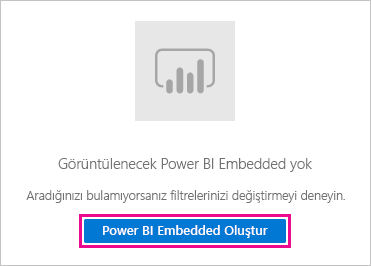
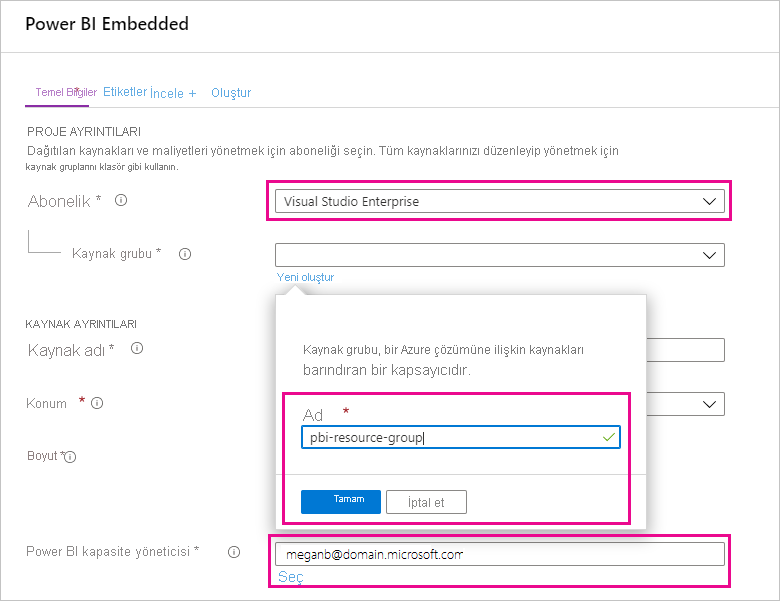
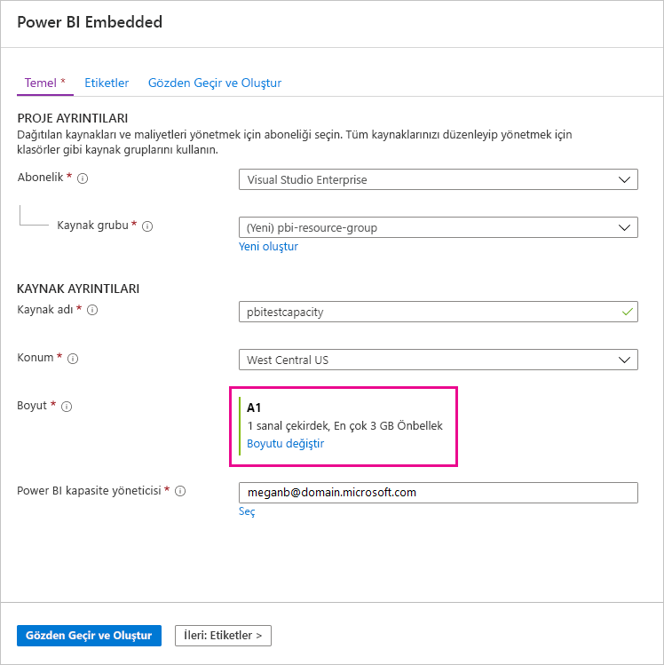
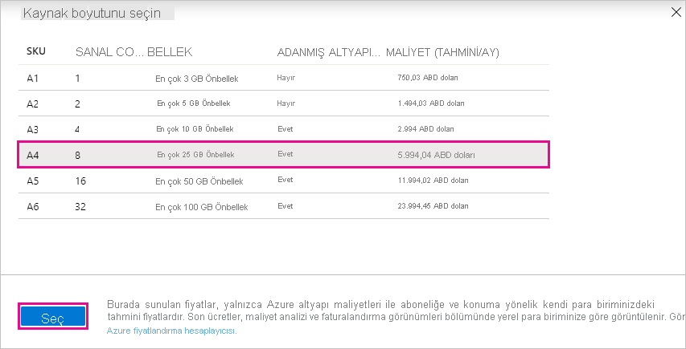
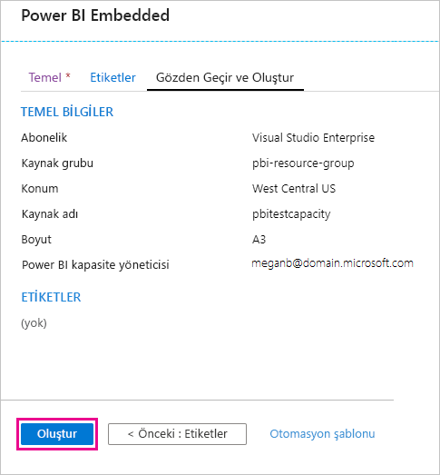
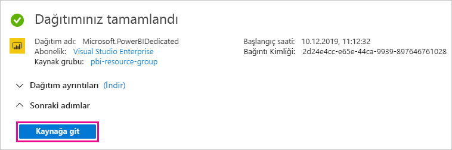
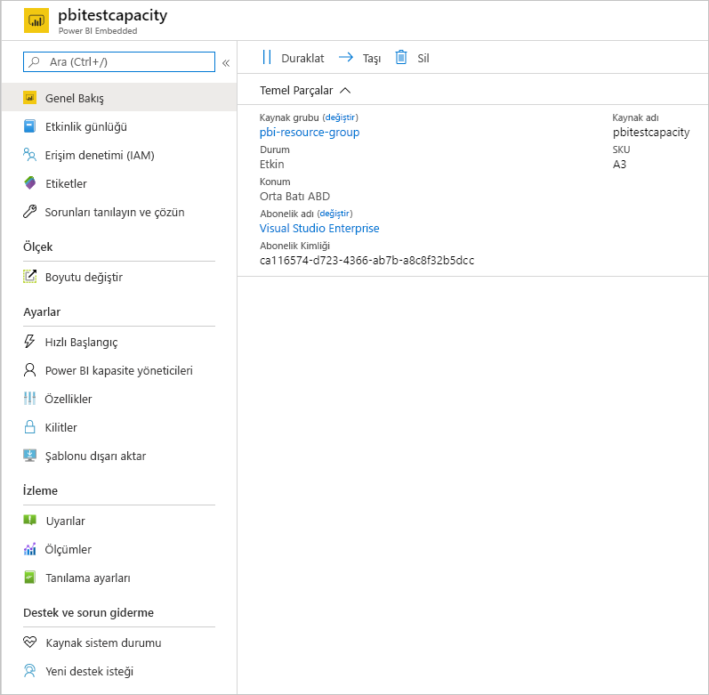

# Test için Power BI Premium satın alma

Bu makalede, test senaryolarında ve P SKU’larını satın almak için gereken izinleriniz (Microsoft 365 Genel Yöneticisi rolü veya Faturalama Yöneticisi rolü) olmadığında Power BI Premium A SKU’larını nasıl satın alacağınız açıklanmaktadır. A SKU'ları için zaman taahhütü gerekmez ve bu saatlik olarak faturalandırılır. A SKU'larını [Azure portalında](https://portal.azure.com) satın alırsınız.

Power BI Premium hakkında daha fazla bilgi için bkz. [Power BI Premium nedir?](service-premium-what-is.md). Geçerli fiyatlandırma ve planlama bilgileri için [Power BI fiyatlandırma sayfasına](https://powerbi.microsoft.com/pricing/)bakın. Kuruluşunuzda Power BI Premium sürümü kullanılsa da içerik oluşturucularının [Power BI Pro lisansına](service-admin-purchasing-power-bi-pro.md) sahip olması gerekir. Kuruluşunuz için en az bir Power BI Pro lisansı satın aldığınızdan emin olun. A SKU'larıyla, içerik kullanan _tüm kullanıcılara_ da Pro lisansları gerekir.

> [!NOTE]
> Premium aboneliğinizin süresi dolarsa kapasitenize 30 gün boyunca tam erişim sağlayabilirsiniz. Bu sürenin sonunda içeriğiniz paylaşılan kapasiteye dönüştürülür. 1 GB üzerindeki modeller paylaşılan kapasitede desteklenmez.

## Testler ve diğer senaryolar için A SKU'ları satın alma

A SKU'ları Azure Power BI Embedded hizmeti aracılığıyla kullanıma sunulur. A SKU'larını aşağıdaki yöntemlerle kullanabilirsiniz:

- Üçüncü taraf uygulamalarında Power BI eklemeyi etkinleştirin. Daha fazla bilgi için bkz. [Power BI Embedded](../developer/embedded/azure-pbie-what-is-power-bi-embedded.md).

- P SKU'su satın almadan önce Premium işlevselliğini test edin.

- P SKU'larını kullanan üretim ortamının yanında geliştirme ve test ortamları da oluşturun.

- Microsoft 365 Genel Yöneticisi veya Faturalama Yöneticisi rolünde olmasanız bile Power BI Premium satın alın.

> [!NOTE]
> A4 veya daha yüksek bir SKU satın alırsanız sınırsız içerik paylaşımı dışında tüm Premium özelliklerden yararlanabilirsiniz. A SKU'larıyla, içerik kullanan _tüm kullanıcılara_ Pro lisansları gerekir.

Azure portalında A SKU'ları satın almak için şu adımları izleyin:

1. En azından Power BI'da kapasite yöneticisi izinlerine sahip olan bir hesapla [Azure portalında](https://portal.azure.com) oturum açın.

1. _Power BI Embedded_ için arama yapın ve arama sonuçlarında hizmeti seçin.

    

1. **Power BI Embedded Oluştur**'u seçin.

    

1. **Power BI Embedded** oluşturma ekranında aşağıdaki bilgileri belirtin:

    - İçinde Power BI Embedded hizmetinin oluşturulacağı **Abonelik**.

    - İçinde hizmeti içeren kaynak grubunun oluşturulacağı fiziksel **Konum**. Daha iyi bir performans için, bu konumun Power BI için Azure Active Directory kiracınızın konumuna yakın olması gerekir.

    - Kullanılacak mevcut **Kaynak grubu** veya örnekte gösterildiği gibi yeni bir kaynak grubu oluşturun.

    - **Power BI kapasite yöneticisi**. Kapasite yöneticisi Azure AD kiracınızda üye kullanıcı veya hizmet sorumlusu olması gerekir.

    

1. Power BI Premium'un tüm özelliklerini (sınırsız paylaşım dışında) kullanmak istiyorsanız en az A4 SKU'suna ihtiyacınız vardır. **Boyutu değiştir**'i seçin.

    

1. P1, P2 ve P3'e karşılık gelen A4, A5 veya A6 kapasite boyutunu seçin.

    

1. **Gözden Geçir + Oluştur**'u seçin, belirttiğiniz seçenekleri gözden geçirin, sonra da **Oluştur**'u seçin.

    

1. Dağıtımın tamamlanması birkaç dakika sürebilir. Hazır olduğunda **Kaynağa git**'i seçin.

    

1. Yönetim ekranında hizmeti yönetmek için size sağlanan seçenekleri gözden geçirin; bunlar arasında kullanmadığınız sırada hizmeti duraklatma seçeneği de yer alır.

    

Kapasiteyi satın aldıktan sonra [kapasiteleri yönetmeyi](service-admin-premium-manage.md#manage-capacity) ve kapasiteye [çalışma alanları atamayı](service-admin-premium-manage.md#assign-a-workspace-to-a-capacity) öğrenin.

## Sonraki adımlar

[Power BI Premium nedir?](service-premium-what-is.md)
[Power BI Premium’u satın alma](service-admin-premium-purchase.md)
[Power BI Premium’daki kapasiteleri yapılandırma ve yönetme](service-admin-premium-manage.md)\
[Power BI fiyatlandırma sayfası](https://powerbi.microsoft.com/pricing/)\
[Power BI Premium hakkında SSS](service-premium-faq.md)\
[Planning a Power BI Enterprise Deployment (Power BI Kuruluş Dağıtımı Planlama) teknik incelemesi](https://aka.ms/pbienterprisedeploy)

Başka bir sorunuz mu var? [Power BI Topluluğu'na sorun](https://community.powerbi.com/)
