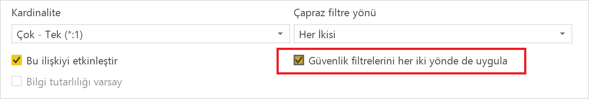
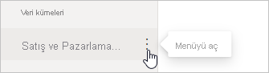
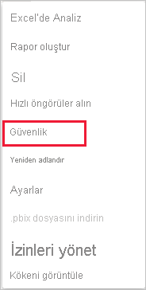
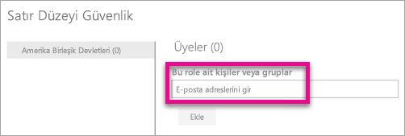
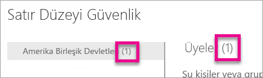
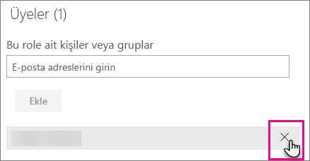
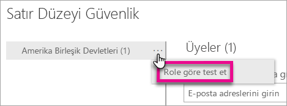
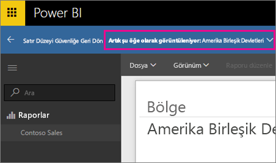
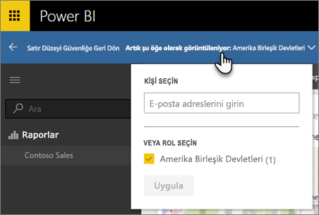
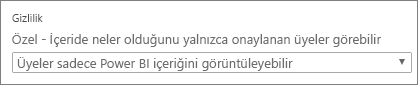

# Power BI ile satır düzeyi güvenlik (RLS)

Power BI ile satır düzeyi güvenlik (RLS), belirli kullanıcıların veri erişimini kısıtlamak için kullanılabilir. Filtreler, veri erişimini satır düzeyinde sınırlar ve rollerin içinde filtre tanımlayabilirsiniz. Power BI hizmetinde bir çalışma alanının üyeleri, o çalışma alanındaki veri kümelerine erişebilir. RLS bu veri erişimini kısıtlamaz.

Power BI Desktop ile Power BI'a aktarılan veri modelleri için RLS'yi yapılandırabilirsiniz. Ayrıca DirectQuery'yi kullanan SQL Server gibi veri kümelerinde de RLS'yi yapılandırabilirsiniz. Analysis Services veya Azure Analysis Services canlı bağlantıları için, Satır düzeyi güvenliği Power BI Desktop yerine modelde yapılandırırsınız. Güvenlik seçeneği, canlı bağlantı veri kümeleri için gösterilmez.

[!INCLUDE [include-short-name](../includes/rls-desktop-define-roles.md)]

Varsayılan olarak, ilişkilerin tek yönlü veya çift yönlü olarak ayarlanmış olması fark etmeksizin satır düzeyi güvenlik filtrelemesi için tek yönlü filtreler kullanılır. İlişkiyi seçip **Güvenlik filtrelerini her iki yönde de uygula** onay kutusunu işaretleyerek, satır düzeyi güvenlik için çift yönlü çapraz filtrelemeyi kendiniz etkinleştirebilirsiniz. Sunucu düzeyinde dinamik satır düzeyi güvenlik de uyguladıysanız (satır düzeyi güvenlik, kullanıcı adına veya oturum açma kimliğine göre yapıldığında) bu seçeneği belirleyin.

Daha fazla bilgi için [Power BI Desktop'ta DirectQuery'yi kullanarak çift yönlü çapraz filtreleme](../transform-model/desktop-bidirectional-filtering.md) makalesine ve [Securing the Tabular BI Semantic Model (Tablolu BI Anlam Modelinin Güvenliğini Sağlama)](https://download.microsoft.com/download/D/2/0/D20E1C5F-72EA-4505-9F26-FEF9550EFD44/Securing%20the%20Tabular%20BI%20Semantic%20Model.docx) başlıklı teknik makaleye bakın.

[!INCLUDE [include-short-name](../includes/rls-desktop-view-as-roles.md)]

## Modelinizde güvenliği yönetme

Veri modelinizde güvenliği yönetmek için aşağıdakileri adımları gerçekleştirin:

1. Power BI hizmetinde, bir veri kümesi için **Diğer seçenekler** menüsünü seçin. Bu menü, gezinti menüsünden veya çalışma alanı sayfasından seçmeniz fark etmeksizin bir veri kümesi adının üzerine geldiğinizde görüntülenir.

    

    

1. **Güvenlik**’i seçin.

   

Güvenlik, sizi Power BI Desktop’ta oluşturduğunuz bir role üye ekleyebileceğiniz RLS sayfasına yönlendirir. Yalnızca veri kümesinin sahipleri Güvenlik seçeneğini görür. Veri kümesi bir Grupta yer alıyorsa yalnızca grup yöneticileri güvenlik seçeneğini görür.

Power BI Desktop'ta yalnızca rol oluşturabilir veya rolleri değiştirebilirsiniz.

## Üyelerle çalışma

### Üye ekleme

Kullanıcının veya güvenlik grubunun adını ya da e-posta adresini yazarak role bir üye ekleyin. Power BI’da oluşturulan Grupları ekleyemezsiniz. [Kuruluşunuzun dışından](../guidance/whitepaper-azure-b2b-power-bi.md#data-security-for-external-partners) üyeler ekleyebilirsiniz.

Rol adının veya Üyeler'in yanında parantez içinde gösterilen sayıya bakarak role kaç üyenin dahil olduğunu da görebilirsiniz.

### Üyeleri kaldırma

Üye adlarının yanındaki X işaretlerini seçerek üyeleri kaldırabilirsiniz. 

## Power BI hizmetinde rolü doğrulama

Tanımladığınız rolü test ederek rolün doğru şekilde çalışıp çalışmadığını doğrulayabilirsiniz.

1. Rolün yanındaki **Diğer seçenekler** (...) düğmesini seçin.
2. **Verileri role göre test et** seçeneğini belirleyin

Bu rol için kullanılabilen raporları görürsünüz. Panolar bu görünümde gösterilmez. Sayfa üst bilgisinde, uygulanmakta olan rol gösterilir.

**Şu anda şu kişi olarak görüntülüyorsunuz** seçeneğini belirleyerek diğer rolleri veya rol birleşimlerini test edin.

Verileri belirli bir kullanıcı olarak görüntülemeyi tercih edebilir veya kullanılabilir rollerin bir birleşimini seçerek çalışıp çalışmadıklarını doğrulayabilirsiniz.

Normal görüntülemeye geri dönmek için **Satır Düzeyi Güvenliğe Geri Dön** seçeneğini belirleyin.

[!INCLUDE [include-short-name](../includes/rls-usernames.md)]

## Power BI'da çalışma alanlarıyla RLS'yi kullanma

Power BI Desktop raporunuzu Power BI hizmetindeki bir çalışma alanında yayımlarsanız roller salt okunur üyeler için geçerli olur. Çalışma alanı ayarlarında üyelerin Power BI içeriğini yalnızca görüntüleyebileceklerini belirtmeniz gerekir.

> [!WARNING]
> Çalışma alanını yapılandırırken, üyelerin düzenleme izinlerine sahip olacağını belirttiyseniz RLS rolleri söz konusu üyeler için geçerli olmaz. Kullanıcılar verilerin tamamını görüntüleyebilir.

[!INCLUDE [include-short-name](../includes/rls-limitations.md)]

[!INCLUDE [include-short-name](../includes/rls-faq.md)]

## Sonraki adımlar

- [Power BI Desktop için satır düzeyi güvenlik (RLS) ile veri erişimini kısıtlama](../create-reports/desktop-rls.md)
- [Power BI Desktop’ta satır düzeyi güvenlik (RLS) kılavuzu](../guidance/rls-guidance.md)
- Sorularınız mı var? [Power BI Topluluğu'na sorun](https://community.powerbi.com/)
- Önerileriniz mi var? [Power BI'ı geliştirmek için fikirlerinizi paylaşın](https://ideas.powerbi.com/)
