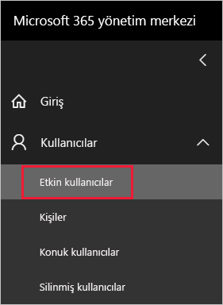
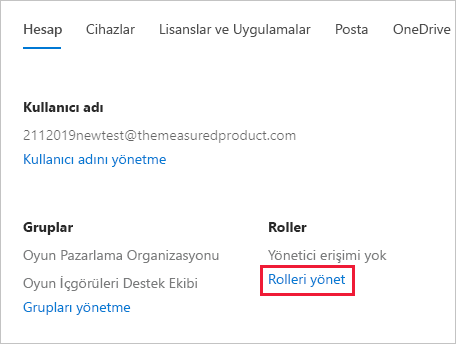
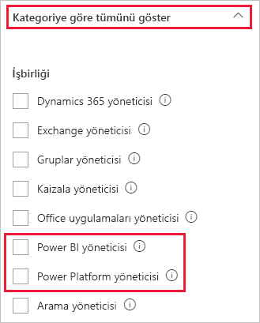

# <a name="understanding-power-bi-service-administrator-roles"></a>Power BI hizmet yöneticisi rollerini anlama

Power BI kiracısını yönetmek için şu rollerden birinde olmalısınız: Power BI yöneticisi, Power Platform yöneticisi veya Microsoft 365 genel yöneticisi. Microsoft 365 kullanıcı yöneticileri, Microsoft 365 yönetim merkezinde veya bir PowerShell betiği kullanarak kullanıcıları Power BI yöneticisi veya Power Platform yöneticisi rolüne atayabilir. Daha fazla bilgi için bkz. [PowerShell ile kullanıcı hesaplarına rol atama](/office365/enterprise/powershell/assign-roles-to-user-accounts-with-office-365-powershell).

Power BI yöneticisi ve Power Platform yöneticisi rollerindeki kullanıcılar, Power BI kiracısı ve yönetim özellikleri (lisanslama hariç) üzerinde tam denetime sahiptir. Rol atandığında kullanıcı [Power BI yönetici portalına](service-admin-portal.md) erişebilir. Burada, kiracı genelinde kullanım ölçümlerine erişebilir ve Power BI özelliklerinin kiracı genelindeki kullanımını kontrol edebilirler. Bu yönetici rolleri Power BI yönetim portalına erişmesi gereken kullanıcılara tam Microsoft 365 yönetim erişimi vermeden portal erişimi vermek için idealdir.

> [!NOTE]
> Power BI belgelerinde "Power BI yöneticisi", Power BI yöneticisi veya Power Platform yöneticisi rollerindeki kullanıcılar için kullanılır. Belgelerde bir görev için Microsoft 365 genel yönetici rolünün ne zaman gerekli olduğu net bir şekilde açıklanır.

## <a name="limitations-and-considerations"></a>Sınırlamalar ve önemli noktalar

Power BI hizmeti yöneticisi ve Power Platform yöneticisi rolleri aşağıdaki özellikleri sağlamaz:

* Microsoft 365 yönetim merkezinde kullanıcıları ve lisansları değiştirme olanağı.

* Denetim günlüklerine erişim. Daha fazla bilgi için bkz. [Power BI'da kullanıcı etkinliklerini izleme](service-admin-auditing.md).

Bu özellikler için Microsoft 365 genel yönetici rolü gereklidir.

## <a name="assign-users-to-an-admin-role-in-the-microsoft-365-admin-center"></a>Microsoft 365 yönetim merkezinde kullanıcıları yönetici rolüne atama

Kullanıcıları Microsoft 365 yönetim merkezinden yöneticisi rolüne atamak için aşağıdaki adımları izleyin.

1. [Microsoft 365 yönetim merkezinde](https://portal.office.com/adminportal/home#/homepage)**Kullanıcılar** > **Etkin Kullanıcılar**’ı seçin.

    

1. Rolü atamak istediğiniz kullanıcıyı seçin.

1. **Roller**'in altında **Rolleri Yönet**'i seçin.

    

1. **Tümünü kategoriye göre göster**'i genişletin ve **Power BI yöneticisi**'ni veya **Power Platform yöneticisi**'ni seçin.

    

1. **Değişiklikleri kaydet**'i seçin.

## <a name="assign-users-to-the-admin-role-with-powershell"></a>Kullanıcıları PowerShell ile yönetici rolüne atama

Kullanıcıları rollere atamak için PowerShell'den de faydalanabilirsiniz. Kullanıcılar Azure Active Directory (Azure AD) hizmetinde yönetilir. Azure AD PowerShell modülüne sahip değilseniz [en son sürümü indirin ve yükleyin](https://www.powershellgallery.com/packages/AzureAD/).

1. İlk olarak Azure AD'ye bağlanın:
   ```
   PS C:\Windows\system32> Connect-AzureAD
   ```

1. İkinci olarak, **Power BI Hizmet Yöneticisi** rolünün **ObjectId** değerini alın. **ObjectId** bilgisini almak için [Get-AzureADDirectoryRole](/powershell/module/azuread/get-azureaddirectoryrole) komutunu çalıştırabilirsiniz

    ```
    PS C:\Windows\system32> Get-AzureADDirectoryRole

    ObjectId                             DisplayName                        Description
    --------                             -----------                        -----------
    00f79122-c45d-436d-8d4a-2c0c6ca246bf Power BI Service Administrator     Full access in the Power BI Service.
    250d1222-4bc0-4b4b-8466-5d5765d14af9 Helpdesk Administrator             Helpdesk Administrator has access to perform..
    3ddec257-efdc-423d-9d24-b7cf29e0c86b Directory Synchronization Accounts Directory Synchronization Accounts
    50daa576-896c-4bf3-a84e-1d9d1875c7a7 Company Administrator              Company Administrator role has full access t..
    6a452384-6eb9-4793-8782-f4e7313b4dfd Device Administrators              Device Administrators
    9900b7db-35d9-4e56-a8e3-c5026cac3a11 AdHoc License Administrator        Allows access manage AdHoc license.
    a3631cce-16ce-47a3-bbe1-79b9774a0570 Directory Readers                  Allows access to various read only tasks in ..
    f727e2f3-0829-41a7-8c5c-5af83c37f57b Email Verified User Creator        Allows creation of new email verified users.
    ```

    Bu örnekte rolün **ObjectId** değeri: 00f79122-c45d-436d-8d4a-2c0c6ca246bf.

1. Ardından kullanıcının **ObjectId** değerini alın. [Get-AzureADUser](/powershell/module/azuread/get-azureaduser) komutunu çalıştırarak bu değere ulaşabilirsiniz.

    ```
    PS C:\Windows\system32> Get-AzureADUser -ObjectId 'tim@contoso.com'

    ObjectId                             DisplayName UserPrincipalName      UserType
    --------                             ----------- -----------------      --------
    6a2bfca2-98ba-413a-be61-6e4bbb8b8a4c Tim         tim@contoso.com        Member
    ```

1. Üyeyi role eklemek için [Add-AzureADDirectoryRoleMember](/powershell/module/azuread/add-azureaddirectoryrolemember) komutunu çalıştırın.

    | Parametre | Açıklama |
    | --- | --- |
    | ObjectId |Role ilişkin ObjectId. |
    | RefObjectId |Üyelere ilişkin ObjectId. |

    ```powershell
    Add-AzureADDirectoryRoleMember -ObjectId 00f79122-c45d-436d-8d4a-2c0c6ca246bf -RefObjectId 6a2bfca2-98ba-413a-be61-6e4bbb8b8a4c
    ```

## <a name="next-steps"></a>Sonraki adımlar

[Kuruluşunuzda Power BI'ı yönetme](service-admin-administering-power-bi-in-your-organization.md)  
[Power BI yönetici portalı](service-admin-portal.md)  

Başka bir sorunuz mu var? [Power BI Topluluğu'na sorun](https://community.powerbi.com/)