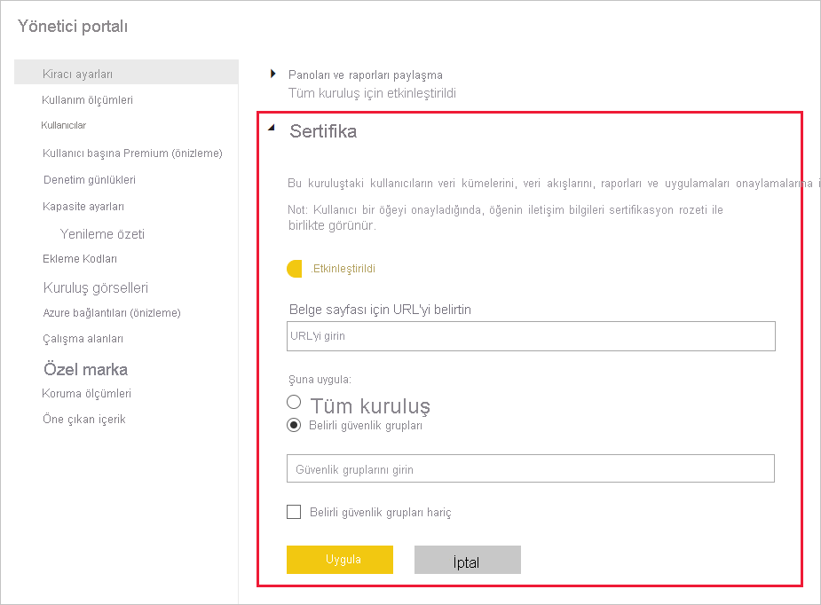

# Veri kümesi ve veri akışı onaylamasını ayarlama (önizleme)

Kuruluşunuz, kritik bilgiler için yetkili kaynaklar olan veri kümelerini ve veri akışlarını onaylayabilir.

Power BI kiracı yöneticisi olarak kuruluşunuzda onaylama işlemini ayarlamak sizin sorumluluğunuzdadır. Diğer bir deyişle:
* Kiracınızda onaylamayı etkinleştirirsiniz.
* Veri kümelerini ve veri akışlarını onaylama yetkisi olacak grupların ve kullanıcıların listesini tanımlarsınız.
* Veri kümeleri için, kuruluşun veri kümesi onaylama ilkesinin (varsa) URL’sini sağlarsınız.

Veri kümesi ve veri akışı onaylama işlemi, veri kümesi ve veri akışı *onay* sürecinin bir parçasıdır. Daha fazla bilgi için [veri kümesi onayı](../connect-data/service-datasets-promote.md) ve [veri akışı onayı](../transform-model/service-dataflows-promote-certify.md) konularına bakın.

## Onaylamayı ayarlama

1. Yönetim portalında Kiracı ayarlarına gidin.
1. Dışarı aktarma ve paylaşım ayarları bölümünde Onaylama bölümünü genişletin.

   

1. İki durumlu düğmeyi **Etkinleştirildi** olarak ayarlayın.
1. Veri kümesi onaylama işlemi için, kuruluşunuz onaylama ilkesi yayımladıysa burada ilkenin URL’sini sağlayabilirsiniz. Bu URL [veri akışı onay ayarları iletişim kutusunun](../connect-data/service-datasets-promote.md#request-dataset-certification) onaylama bölümünde **Daha fazla bilgi edinin** bağlantısına dönüşür. 
1. Veri kümelerini ve veri akışlarını onaylama yetkisi olacak kullanıcıları ve grupları belirtin. Bu yetkili onaylayıcılar [veri kümesi](../connect-data/service-datasets-promote.md#request-dataset-certification) veya [veri akışı](../transform-model/service-dataflows-promote-certify.md#certify-a-dataflow) onay ayarları iletişim kutusunun onaylama bölümündeki Onaylama düğmesini kullanabilir.
1. **Uygula**'ya tıklayın.

## Sonraki adımlar
* [Veri kümelerini tanıtma](../connect-data/service-datasets-promote.md)
* [Veri kümelerini onaylama](../connect-data/service-datasets-certify.md)
* [Veri akışlarını yükseltme](../transform-model/service-dataflows-promote-certify.md#promote-a-dataflow)
* [Veri akışlarını onaylama](../transform-model/service-dataflows-promote-certify.md#certify-a-dataflow)
* Sorularınız mı var? [Power BI Topluluğu'na sorun](https://community.powerbi.com/)
