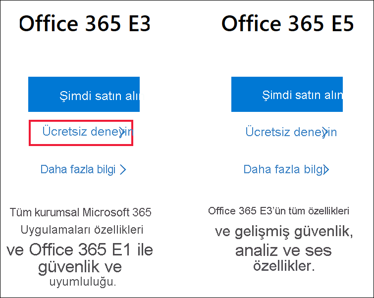
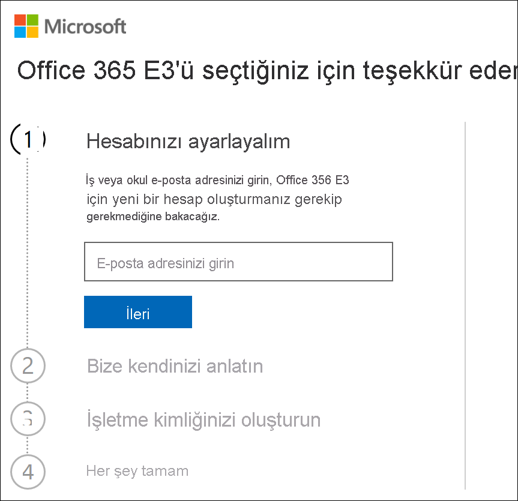
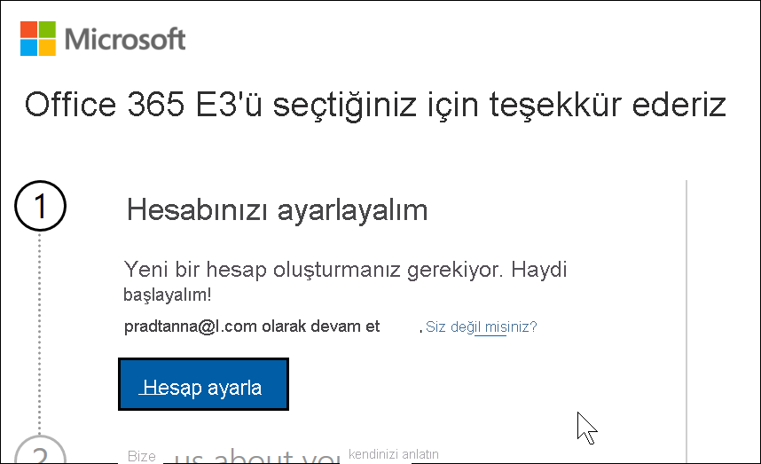
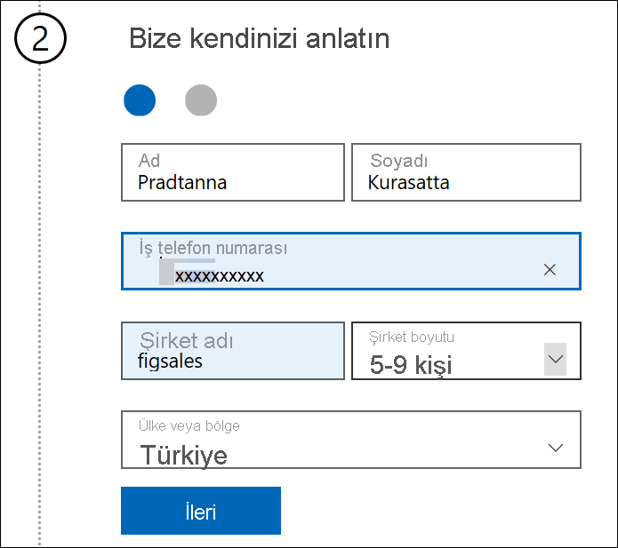
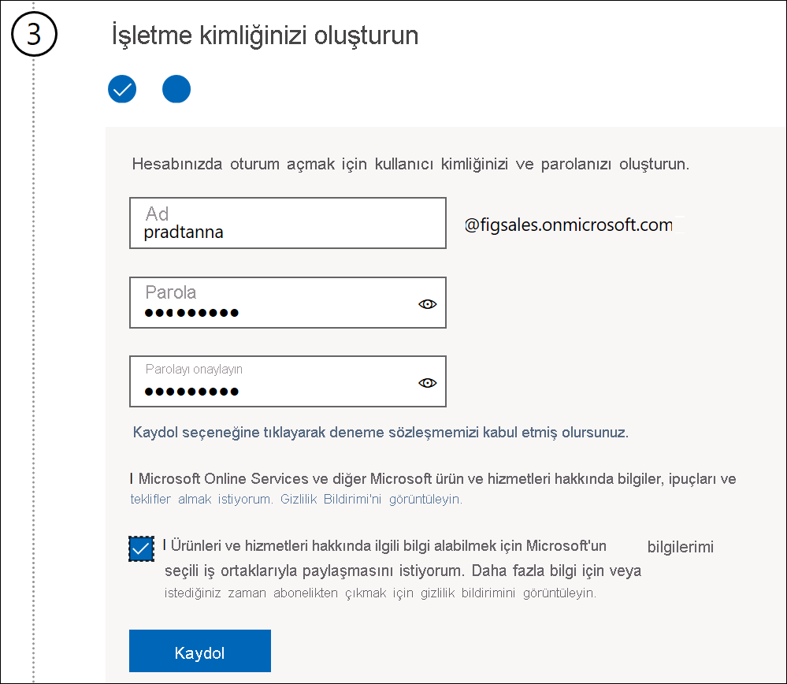
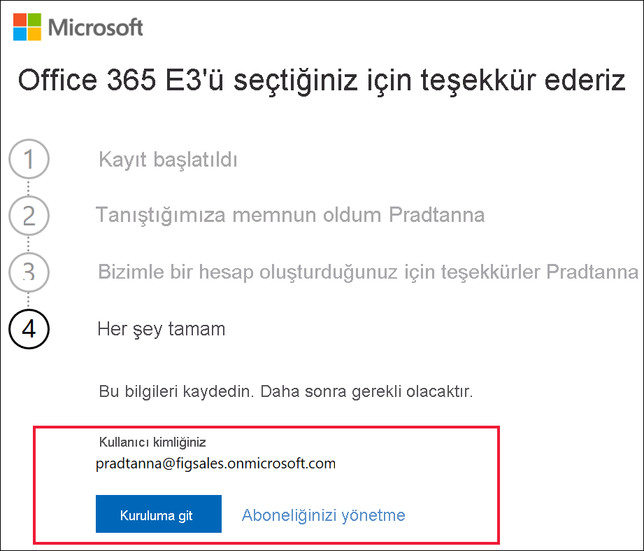

# Yeni bir Microsoft 365 Deneme Sürümü ile Power BI uygulamasına kaydolma

Bu makalede, bir iş veya okul e-posta adresiniz yoksa Power BI hizmetine kaydolmaya yönelik alternatif bir yol açıklanmaktadır.

Power BI’a e-posta adresinizle kaydolma konusunda sorun yaşıyorsanız öncelikle bunun [Power BI ile kullanılabilecek bir e-posta adresi](../fundamentals/service-self-service-signup-for-power-bi.md#supported-email-addresses) olduğundan emin olun. Bu işe yaramazsa Microsoft 365 deneme sürümüne kaydolup bir iş hesabı oluşturun. Daha sonra, Power BI hizmetine kaydolmak için bu yeni iş hesabını kullanın. Microsoft 365 deneme sürümünün süresi dolsa bile Power BI’ı kullanmaya devam edebilirsiniz.

## Office’in Microsoft 365 denemesine kaydolma

[Microsoft 365 web sitesinden](https://www.microsoft.com/microsoft-365/business/compare-more-office-365-for-business-plans) Microsoft 365 deneme sürümüne kaydolun. Henüz bir hesabınız yoksa Microsoft hesap oluşturma adımlarında size yol gösterir. Ticari e-posta hesapları (Hotmail ve Gmail gibi) Microsoft 365’le kullanılamadığından, kullanılabilen yeni bir hesap oluşturursunuz.  Bu e-posta hesabı şuna benzer olacaktır: *zalan\@onmicrosoft.com*.

**Office 365 E5**’i seçerseniz denemeniz Power BI Pro’yu içerir. Power BI Pro denemesinin süresi Office 365 E5 denemenizle aynı zamanda dolar ve bu süre şu anda 30 gündür. Bunun yerine **Office 365 E3**’ü seçerseniz Power BI’a *ücretsiz* kullanıcı olarak kaydolabilir ve 60 günlük deneme için **Pro**’ya yükseltebilirsiniz. 

1. E-posta adresinizi girin. Microsoft bu e-posta adresinin Microsoft 365’le kullanılabileceğini veya yeni bir e-posta adresi oluşturmanız gerektiğini size bildirir.  

    Yeni e-posta adresine ihtiyacınız varsa Microsoft ilgili adımlarda size yol gösterir. İlk adım yeni bir hesap oluşturmaktır. **Hesap ayarla**’yı seçin.

    

2. Yeni hesap hakkındaki ayrıntıları girin.

    

3. Yeni e-posta adresinizi ve parolanızı oluşturun. you@yourcompany.onmicrosoft.com benzeri bir oturum açma adı oluşturun. Bu, yeni iş veya okul hesabınızla ve Power BI’la kullanacağınız oturum açma bilgileridir.

    

4. Hepsi bu!  Artık Power BI’a kaydolmak için kullanabileceğiniz bir e-posta adresiniz var. [Power BI hizmetine bireysel olarak kaydolma](../fundamentals/service-self-service-signup-for-power-bi.md) sayfasına gidin

     

    Yeni kiracınız oluşturulurken beklemeniz gerekebilir.

## Önemli noktalar

Yeni hesapla oturum açma sırasında sorun yaşıyorsanız gizli bir tarayıcı oturumu kullanmayı deneyin.

Oturum açma yöntemini kullanarak yeni bir kuruluş kiracısı oluşturursunuz ve bu kiracının yöneticisi olarak atanırsınız. Daha fazla bilgi için bkz. [Power BI yönetimi nedir?](service-admin-administering-power-bi-in-your-organization.md). Kiracınıza yeni kullanıcılar ekleyebilir ve ardından söz konusu kullanıcılarla [Microsoft 365 yönetim belgelerinde](https://support.office.com/article/Add-users-individually-to-Office-365---Admin-Help-1970f7d6-03b5-442f-b385-5880b9c256ec) açıklandığı gibi paylaşımda bulunabilirsiniz.

## Sonraki adımlar

[Power BI yönetimi nedir?](service-admin-administering-power-bi-in-your-organization.md)  
[Kuruluşunuzda Power BI lisansları](service-admin-licensing-organization.md)  
[Power BI'a bireysel olarak kaydolma](../fundamentals/service-self-service-signup-for-power-bi.md)

Başka bir sorunuz mu var? [Power BI Topluluğu'na sorun](https://community.powerbi.com/)