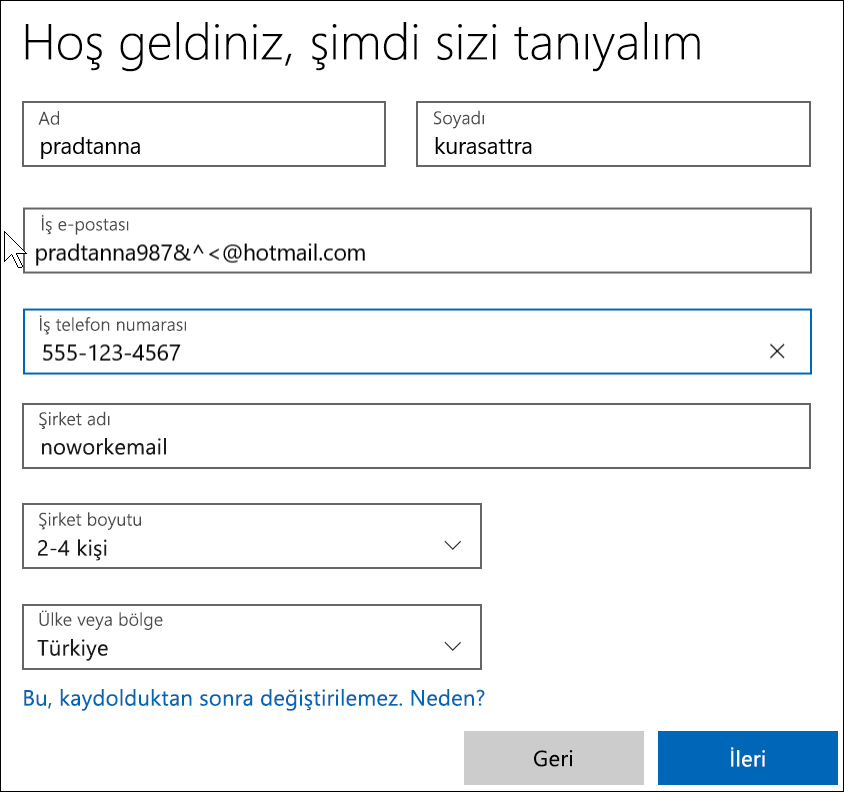

# Yeni bir Microsoft 365 Deneme Sürümü ile Power BI uygulamasına kaydolma

Bu makalede, bir iş veya okul e-posta adresiniz yoksa Power BI’a kaydolmaya yönelik alternatif bir yol açıklanmaktadır. 

Power BI’a e-posta adresinizle kaydolma konusunda sorun yaşıyorsanız öncelikle bunun [Power BI ile kullanılabilecek bir e-posta adresi](../fundamentals/service-self-service-signup-for-power-bi.md#supported-email-addresses) olduğundan emin olun. Bu işe yaramazsa Microsoft 365 deneme sürümüne kaydolup bir iş hesabı oluşturun. Daha sonra, Power BI hizmetine kaydolmak için bu yeni iş hesabını kullanın. Microsoft 365 deneme sürümünün süresi dolsa bile Power BI’ı kullanmaya devam edebilirsiniz.

> [!NOTE]
> Office 365’in adı yakın zamanda Microsoft 365 olarak değiştirildi. Tüm makalelerimiz güncelleştirilene kadar bu üründen Office 365 olarak bahsedildiğini görebilirsiniz.

1. [Microsoft 365 web sitesinden](https://www.microsoft.com/en-us/microsoft-365/business/compare-more-office-365-for-business-plans) Microsoft 365 deneme sürümüne kaydolun.

    

    

    

    

    

    

1. you@yourcompany.onmicrosoft.com gibi görünen yeni iş oturum açma adınızı oluşturun. Bu bilgilerle Power BI'da oturum açabilirsiniz.

    

        

1. Yeni kiracınız oluşturulurken beklemeniz gerekebilir. 

Hepsi bu!  Artık Power BI’a kaydolmak için kullanabileceğiniz bir e-posta adresiniz var. [Power BI hizmetine bireysel olarak kaydolma](../fundamentals/service-self-service-signup-for-power-bi.md) sayfasına gidin

## Önemli noktalar
Yeni hesapla oturum açma sırasında sorun yaşıyorsanız gizli bir tarayıcı oturumu kullanmayı deneyin.    

Oturum açma yöntemini kullanarak yeni bir kuruluş kiracısı oluşturursunuz ve bu kiracının yöneticisi olarak atanırsınız. Daha fazla bilgi için bkz. [Power BI yönetimi nedir?](service-admin-administering-power-bi-in-your-organization.md). Kiracınıza yeni kullanıcılar ekleyebilir ve ardından söz konusu kullanıcılarla [Microsoft 365 yönetim belgelerinde](https://support.office.com/en-sg/article/Add-users-individually-to-Office-365---Admin-Help-1970f7d6-03b5-442f-b385-5880b9c256ec) açıklandığı gibi paylaşımda bulunabilirsiniz.

## Sonraki adımlar

[Power BI yönetimi nedir?](service-admin-administering-power-bi-in-your-organization.md)  
[Kuruluşunuzda Power BI lisansları](service-admin-licensing-organization.md)  
[Power BI'a bireysel olarak kaydolma](../fundamentals/service-self-service-signup-for-power-bi.md)

Başka bir sorunuz mu var? [Power BI Topluluğu'na sorun](https://community.powerbi.com/)