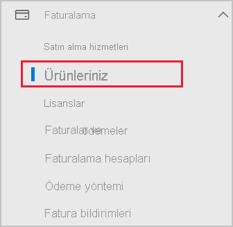
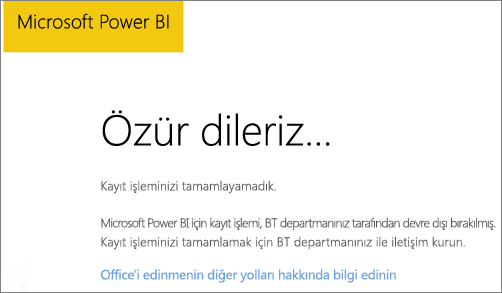

# Microsoft 365 iş ortağı aboneliğine Power BI’ı ekleme

Microsoft 365 şirketlere, Microsoft 365’i kendi çözümleriyle paketlenmiş ve tümleştirilmiş biçimde yeniden satma olanağı sunar ve kullanıcılara satın alma, fatura ve destek için tek bir irtibat noktası sağlar.

Power BI’i Microsoft 365 aboneliğinize eklemek istiyorsanız bunu yapması için iş ortağınıza ulaşmanızı öneririz. İş ortağınız şu anda Power BI’ı sunmuyorsa aşağıda açıklanan seçenekleri izleyebilirsiniz.

## Power BI'ı satın almak için iş ortağınızla birlikte çalışma

Bir Power BI Pro veya Power BI Premium aboneliği satın almak istiyorsanız, sahip olduğunuz seçenekleri değerlendirmek için iş ortağınızla iletişim kurabilirsiniz:

* İş ortağınız, hizmeti kendisinden satın alabilmeniz için Power BI'ı portföyüne ekleyebilir.

* İş ortağınız sizi, Power BI’ı doğrudan Microsoft’tan veya Power BI’ı sunan başka bir iş ortağından satın alabileceğiniz bir modele geçirebilir.

## Microsoft'tan veya başka bir kanaldan satın alma

İş ortağınızla aranızdaki ilişkiye bağlı olarak Power BI'ı doğrudan Microsoft'tan veya başka bir iş ortağından satın alma seçeneğine sahip olabilirsiniz. Microsoft 365 yönetim merkezinden Power BI aboneliği ekleyip ekleyemediğinizi doğrulayabilirsiniz (genel yönetici veya faturalama yöneticisi rolüne sahip olmanız gerekir).

1. [Microsoft 365 yönetim merkezine](https://admin.microsoft.com/AdminPortal/Home#/homepage) gidin.

1. Soldaki menüden **Faturalama**’yı açın ve **Ürünleriniz**’i seçin:

   

 1. Aşağıda gösterildiği gibi, **Abonelikler**’i bulun. **Abonelikler**'i görüyorsanız hizmeti doğrudan Microsoft'tan edinebilir veya Power BI'ı hizmetini sunan başka bir iş ortağıyla iletişime geçebilirsiniz.

    

    **Abonelikler** seçeneği yoksa doğrudan Microsoft'tan veya başka bir iş ortağından satın alma imkanınız yoktur.

İş ortağınız Power BI hizmetini sunmuyorsa ve doğrudan Microsoft'tan veya başka bir iş ortağından satın alma seçeneğiniz de yoksa ücretsiz deneme için kaydolabilirsiniz.

## Ücretsiz deneme için kaydolma

Power BI için ücretsiz denemeye kaydolabilirsiniz. Deneme süresinin sonunda Power BI Pro'yu satın almasanız da birçok Power BI özelliğini sunan ücretsiz bir lisansa sahip olursunuz. Daha fazla bilgi için bkz. [Power BI'a bireysel olarak kaydolma](../fundamentals/service-self-service-signup-for-power-bi.md).

### Özel abonelikleri etkinleştirme

Özel abonelikler olarak da bilinen bireysel kaydolma işlemleri varsayılan olarak devre dışıdır. Bu durumda, kaydolmayı denediğinizde aşağıdaki iletiyi görürsünüz: *Microsoft Power BI için kayıt işlemi, BT departmanınız tarafından devre dışı bırakılmış*.

Özel abonelikleri etkinleştirmek için, iş ortağınızla iletişime geçip bu seçeneği kullanımınıza sunmasını isteyebilirsiniz. Kiracınızda yöneticiyseniz ve Azure Active Directory PowerShell komutlarını kullanmayı biliyorsanız özel abonelikleri kendiniz de etkinleştirebilirsiniz. Daha fazla bilgi için [Self servis satın almayı etkinleştirme veya devre dışı bırakma](service-admin-disable-self-service.md) bölümündeki adımları izleyin.

## Sonraki adımlar

* [Kuruluşunuzda Power BI lisansları](service-admin-licensing-organization.md)
* [Power BI Pro lisanslarını satın alma ve atama](service-admin-purchasing-power-bi-pro.md)

Başka bir sorunuz mu var? [Power BI Topluluğu'na sorun](https://community.powerbi.com/)