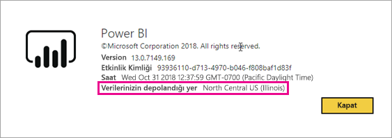
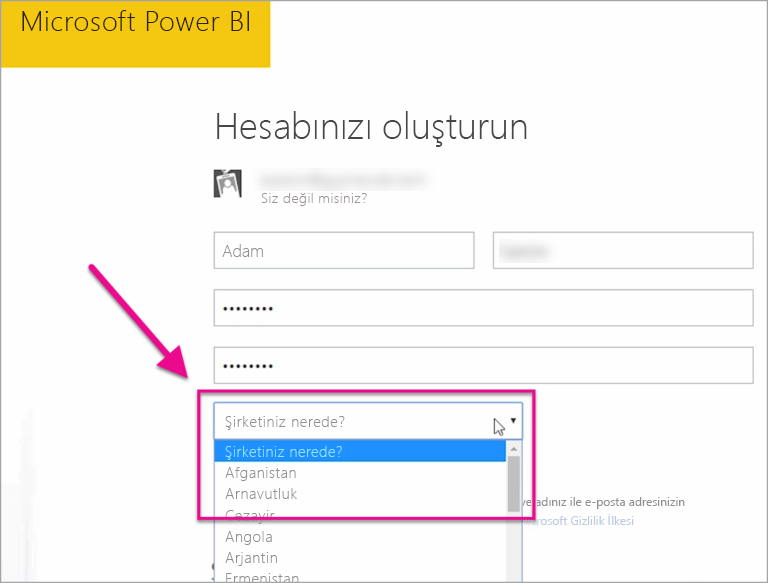

# Power BI kiracım nerede bulunur?

<iframe width="560" height="315" src="https://www.youtube.com/embed/0fOxaHJPvdM?showinfo=0" frameborder="0" allowfullscreen></iframe>

Power BI kiracınızın bulunduğu yeri ve bu konumun nasıl seçildiğini öğrenin. Hizmetle kurduğunuz etkileşimleri etkileyebileceği için konumu öğrenmek önemlidir.

## Power BI kiracınızın bulunduğu yeri belirleme

Kiracınızın bulunduğu bölgeyi bulmak için aşağıdaki adımları izleyin.

1. Power BI hizmetinde üst taraftaki menüden yardım simgesini ( **?** ) ve ardından **Power BI Hakkında** 'yı seçin.

1. **Verilerinizin depolandığı yer** ifadesinin yanındaki değere bakın. Bu bölge, kiracınızın bulunduğu yerdir. Bu değer ayrıca, çalışma alanlarınız için farklı bölgelerdeki kapasiteleri kullanmadığınız sürece verileriniz de bu bölgede depolanır.

    

## Veri bölgesi nasıl seçilir?

Veri bölgesi, kiracınızı oluştururken seçtiğiniz ülkeye/bölgeye göre belirlenir. Bu bilgi paylaşıldığından seçim hem Microsoft 365 hem de Power BI kayıtları için geçerlidir. Yeni bir kiracı oluşturuyorsanız kaydolma işlemleri sırasında listeden uygun ülkeyi/bölgeyi seçin.

Power BI, seçiminize en yakın veri bölgesini seçer ve kiracınıza ait veriler bu bölgede depolanır.

> [!IMPORTANT]
> Kiracıyı oluşturduktan sonra seçimi değiştiremezsiniz.

Başka bir sorunuz mu var? [Power BI Topluluğu'na başvurun](https://community.powerbi.com/)
