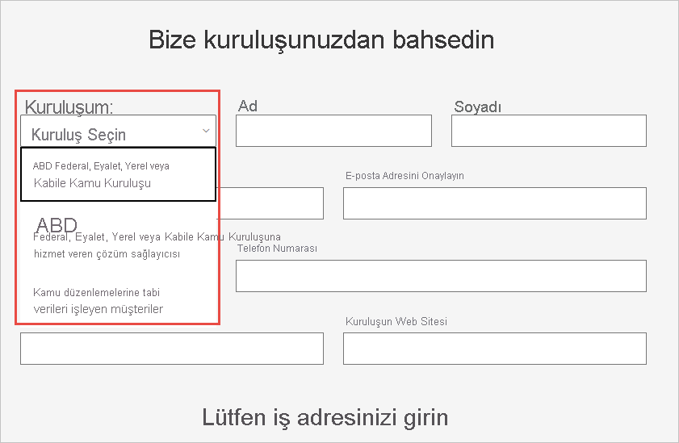

# ABD kamu kuruluşunuzu Power BI hizmetine kaydetme

Power BI hizmetinin [Microsoft 365 Kamu planları](https://www.microsoft.com/microsoft-365/government/compare-office-365-government-plans?rtc=1) kapsamında bir sürümü vardır. Bu makale, ABD kamu müşterileri için tasarlanmıştır ve burada açıklanan kayıt süreci, Power BI hizmetinin ticari sürümünden farklıdır.

ABD kamu kuruluşlarına yönelik Power BI hizmeti hakkında daha fazla bilgi için bkz. [Birleşik Devletler kamu müşterileri için Power BI - Genel Bakış](service-govus-overview.md).

> [!NOTE]
> Bu makale, ABD kamu kuruluşlarını Power BI'a kaydetme yetkisine sahip olan yöneticiler için yazılmıştır. Son kullanıcıysanız, ABD kamu kuruluşları için Power BI aboneliğine sahip olma hakkında bilgi almak üzere yöneticinize başvurun.
> 
> 

## ABD kamu kuruluşunuz için doğru kaydolma sürecini seçme

ABD kamu kuruluşunuz, kamu bulutu topluluğunda yeni veya abonelik sahibi olabilir. Aşağıdaki bölümlerde, Microsoft 365 Kamu planları ve Power BI sürecindeki durumunuzu temel alan kaydolma adımları ayrıntılı olarak ele alınmıştır. Adımlar, geçerli kaydınıza bağlı olarak farklılık gösterir.

Power BI ABD kamuya kaydolduktan sonra, bu makalede açıklanan [izin verilenler listesine ekleme](#additional-signup-information) sürecini başlatmak için hesap ekibinizle birlikte çalışın. Bu adım, kuruluşunuzun Government Community Cloud’da tam olarak etkinleştirilmesi için gereklidir.

## Yeni bir Microsoft 365 Kamu planına kaydolma

Kuruluşunuz kamu bulut topluluğunda yeniyse, Microsoft 365 Kamu planını almak için şu adımları izleyin:

> [!NOTE]
> Bu adımların genel yönetici tarafından gerçekleştirilmesi gerekir.
>

1. [Microsoft 365 Kamu planlarına](https://products.office.com/government/office-365-web-services-for-government) gidin.
2. **Ücretsiz deneme sürümü ile başlayın** seçeneğini belirleyin.
3. Bize kuruluşunuzdan bahsetmek için formu doldurun. Kuruluş türünüzü seçmek için açılan listeyi kullanın.

   

4. Ekleme sürecini başlatmak için formu gönderin. Microsoft temsilciniz veya iş ortağınız herhangi bir soru konusunda yardımcı olabilir.

Bu süreç tamamlandıktan sonra, bir Power BI aboneliği eklemek için mevcut Microsoft 365 Kamu müşterilerine yönelik adımları izleyin.

## Microsoft 365 Kamu planına Power BI ekleme

Kuruluşunuzun zaten Microsoft 365 Kamu planı varsa, Power BI aboneliği eklemeye yönelik bu adımları izleyin:

> [!NOTE]
> Bu adımların genel yönetici tarafından gerçekleştirilmesi gerekir.
> 
> 

1. Microsoft 365 yönetim merkezinde, genel yönetici veya faturalama yöneticisi kimlik bilgilerinizi kullanarak oturum açın.
2. **Faturalama** > **Hizmet satın alın**'ı seçin.
4. Power BI Pro Kamu teklifini bulmak için arama yapın veya kaydırın ve ardından **Deneyin** ya da **Şimdi Satın Alın**’ı seçin.
5. Siparişinizi tamamlayın.
6. Kullanıcı hesaplarına lisans atayın.

## Ek kayıt bilgileri

ABD kamu Power BI hizmetlerini kullanabilmek istiyorsanız önce kuruluşunuz için izin verilenler listesine ekleme işlemini başlatmak üzere Microsoft hesabı ekibiniz ile birlikte çalışmanız gerekir. İzin verilenler listesine ekleme, Power BI mühendislik ekibinin ticari bulut ortamındaki müşterileri güvenli Government Community Cloud’a taşımak için kullandığı bir işlemdir. Bu adım, ABD kamu bulutundaki kullanılabilir özelliklerin beklenen şekilde çalışmasını sağlar. 

İzin verilenler listesine ekleme işlemini başlatmak istiyorsanız yardım için Microsoft hesabı ekibinize başvurun. İzin verilenler listesine ekleme isteğini yalnızca yöneticiler yapabilir. İşlem yaklaşık üç hafta sürer. Power BI mühendislik ekibi bu süreçte kiracınızın ABD kamu bulutunda düzgün şekilde çalışmasını sağlamak için gerekli değişiklikleri gerçekleştirir.

## Sonraki adımlar

* [Power BI ABD kamu sürümüne genel bakış](service-govus-overview.md)
- [Microsoft 365 Kamu’yu nasıl satın alırım?](/office365/servicedescriptions/office-365-platform-service-description/office-365-us-government/microsoft-365-government-how-to-buy#how-do-i-buy-microsoft-365-government)