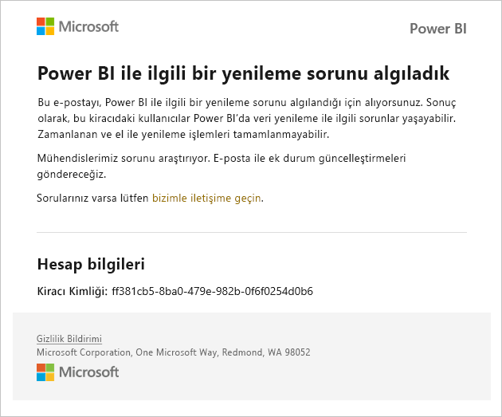
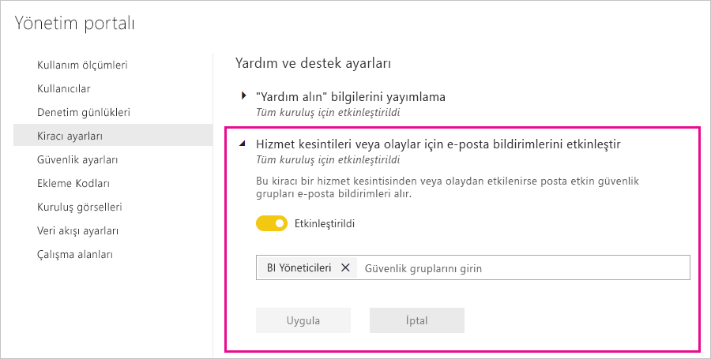

# Hizmet kesintisi bildirimleri

Görev açısından kritik iş uygulamalarınızın kullanılabilirliği hakkında içgörü sahibi olmak önemlidir. Power BI, hizmet kesintisi veya hizmette performans düşüşü yaşandığında e-postaları almaya devam edebilmeniz için seçenek olarak olay bildirimi özelliğini sunar. Power BI’ın %99,9 hizmet düzeyi sözleşmesi (SLA) ile bunlar nadir yaşansa da, bilgileri almaya devam etmenizi garantilemek istiyoruz. Aşağıdaki ekran görüntüsü, bildirimleri etkinleştirirseniz ne tür e-postalar alacağınızı gösterir.

Şu anda, aşağıdaki _güvenilirlik senaryoları_için e-posta göndeririz:

- Rapor güvenilirliğini açma
- Model yenileme güvenilirliği
- Sorgu yenileme güvenilirliği

Raporları açma, veri kümesi yenileme veya sorgu yürütme gibi işlemlerde _uzun gecikme_ yaşandığında bildirim gönderilir. Bir olay çözümlendikten sonra bir izleme e-postası alırsınız.

> [!NOTE]
> Bu özellik, şu anda yalnızca Power BI Premium’daki ayrılmış kapasiteler için sunulmaktadır. Paylaşılan veya ekli kapasite için sunulmamaktadır.

## Kapasite ve güvenilirlik bildirimleri

Power BI Premium kapasitesi, güvenilirliği etkileme ihtimali olan genişletilmiş yüksek düzeyde kaynak kullanımı süreleriyle karşılaştığında bir bildirim e-postası gönderilir. Bu tür etkilerin örnekleri arasında rapor açma, veri kümesi yenileme ve sorgu yürütmeleri gibi işlemlerde uzun gecikmelere yer alır. 

Bildirim e-postası, aşağıdakiler gibi yüksek kaynak kullanımının nedenleri hakkında bilgi sağlar:

* İlgili veri kümesinin veri kümesi kimliği
* İşlem türü
* Yüksek kaynak kullanımıyla ilişkili CPU süresi

Power BI Premium kapasitesinde aşırı yükleme algılandığında da Power BI e-posta bildirimi gönderir. E-postada aşırı yüklemenin olası nedeni, geçtiğimiz 10 dakikada yükü oluşturan işlemler ve her işlemin oluşturduğu yük miktarı açıklanır. 

Birden çok Premium kapasiteye sahipseniz e-postada aşırı yüklenme süresi boyunca bu kapasitelerin hepsine ilişkin bilgiler yer alır. Böylece yoğun kaynağa sahip öğeler içeren çalışma alanlarınızı daha az yüke sahip kapasitelere taşımayı düşünebilirsiniz.

Aşırı yüklenme e-posta bildirimleri, yalnızca bir aşırı yüklenme eşiği tetiklendiğinde gönderilir. Premium kapasitedeki yük miktarı, aşırı yük düzeyinin altına indiğinde ikinci bir e-posta bildirimi gönderilmez.

Aşağıdaki resimde bir bildirim e-postası örneği gösterilir:

## Bildirimleri etkinleştirme

Power BI kiracı yöneticisi, yönetici portalından bildirimleri etkinleştirir:

1. Bildirimleri alması gereken bir e-posta etkin güvenlik grubu tanımlayın veya oluşturun.

1. Yönetici portalında **Kiracı ayarlarını** seçin. **Yardım ve destek ayarlarının** altında **Hizmet kesintileri veya olaylar için e-posta bildirimlerini etkinleştir** seçeneğini genişletin.

1. E-posta bildirimlerini etkinleştirin, bir güvenlik grubu girin ve **Uygula**’yı belirleyin.

    

> [!NOTE]
> Power BI şu hesaptan bildirim gönderir: no-reply-powerbi@microsoft.com. Bildirimlerin istenmeyen veya önemsiz posta klasörlerine düşmemesi için bu hesabın beyaz listede bulunduğundan emin olun.

## Sonraki adımlar

[Power BI Pro ve Power BI Premium destek seçenekleri](service-support-options.md)

Başka bir sorunuz mu var? [Power BI Topluluğu'na başvurun](https://community.powerbi.com/)
