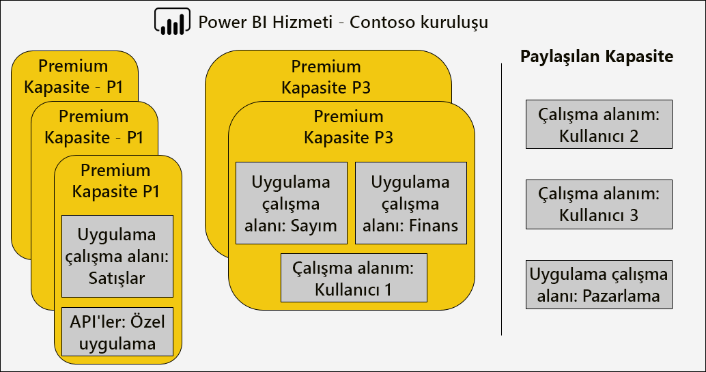
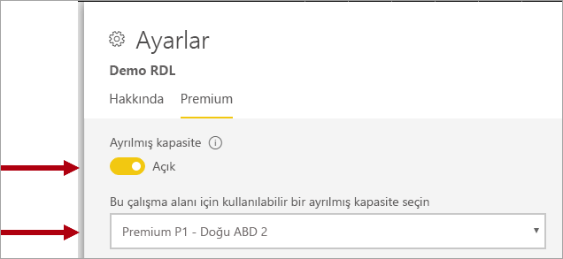
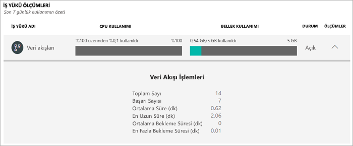
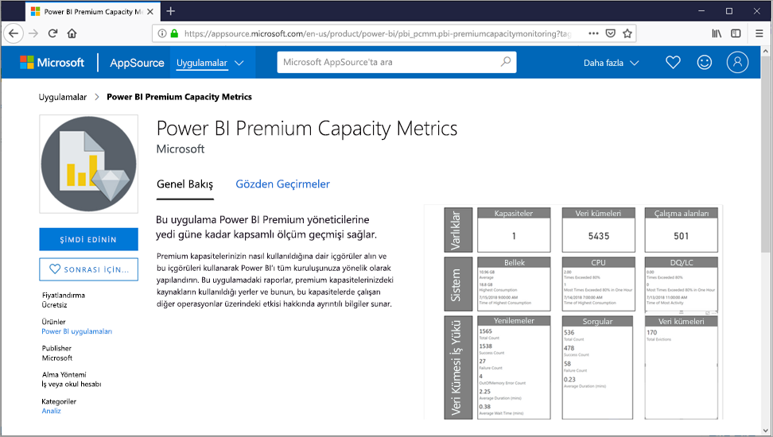

# Premium kapasiteleri yönetme

Power BI Premium yönetimi, Premium kapasiteleri oluşturmayı, yönetmeyi ve izlemeyi içerir. Bu makalede kapasitelere genel bir bakış sunulmaktadır. Adım adım yönergeler için bkz. [Kapasiteleri yapılandırma ve yönetme](service-admin-premium-manage.md).

## Kapasite oluşturma ve yönetme

Power BI Yönetim portalının **Kapasite Ayarları** sayfasında, satın alınan sanal çekirdek sayısı ve kullanılabilir Premium kapasiteler gösterilmektedir. Sayfa Genel yöneticilerin veya Power BI hizmet yöneticilerinin kullanılabilir sanal çekirdeklerden Premium kapasiteler oluşturmasına veya mevcut Premium kapasiteleri değiştirmesine izin verir.

> [!NOTE]
> Yakın zamanda Power BI Premium, şu anda önizleme aşamasında olan **Premium 2. Nesil** adlı yeni bir Premium sürümünü kullanıma sundu. Premium 2. Nesil, Premium kapasitelerinin yönetimini basitleştirecek ve yönetim yükünü azaltacak. Daha fazla bilgi için bkz. [Power BI Premium 2. Nesil (önizleme)](service-premium-what-is.md#power-bi-premium-generation-2-preview).

Premium kapasite oluştururken, yöneticilerin şunları tanımlaması gerekir:

- Kapasite adı (kiracı içinde benzersizdir).
- Kapasite yöneticileri.
- Kapasite boyutu.
- Veri yerleşimi bölgesi.

En az bir Kapasite Yöneticisinin atanması gerekir. Kapasite Yöneticisi olarak atanan kullanıcılar şunları yapabilir:

- Kapasiteye çalışma alanları atama.
- Kullanıcı izinlerini yönetme, ek Kapasite Yöneticileri veya atama izinlerine sahip kullanıcılar ekleme (kapasiteye çalışma alanları atamalarına olanak tanımak için).
- Sayfalandırılmış raporlar ve veri akışı iş yükleri için maksimum bellek kullanımını yapılandırmak üzere iş yüklerini yönetme.
- Sistem aşırı yüklemesi nedeniyle tüm işlemleri sıfırlamak için kapasiteyi yeniden başlatma.

Kapasite Yöneticileri, çalışma alanı izinlerine açıkça atanmadıkça çalışma alanı içeriğine erişemez. Kullanım ölçümleri, denetim günlükleri veya kiracı ayarları gibi tüm Power BI yönetim alanlarına da erişim izinleri yoktur (açıkça atanmadıkları sürece). Önemli bir bilgi olarak, Kapasite Yöneticilerinin yeni kapasiteler oluşturma veya mevcut kapasiteleri ölçeklendirme izinleri yoktur. Yöneticiler kapasite temelinde atanır. Bu sayede yalnızda atandıkları kapasiteleri görüntüleyip yönetebilirler.

Kapasite boyutu, havuzdaki kullanılabilir sanal çekirdek sayısıyla kısıtlanmış olan bir SKU seçenekleri listesinden seçilir. Havuzdan, kaynakları bir veya daha fazla satın alınan SKU’dan kullanılan birden fazla kapasite oluşturulması mümkündür. Örneğin, bir P3 SKU (32 sanal çekirdek) üç kapasite oluşturmak için kullanılabilir: bir P2 (16 sanal çekirdek) ve iki P1 (2 x 8 sanal çekirdek). Aşağıdaki görüntüde, her biri çalışma alanı ve paylaşılan kapasitede birkaç çalışma alanı içeren beş Premium kapasiteden (3 x P1 ve 2 x P3) oluşan kurgusal Contoso kuruluşu için örnek bir kurulum gösterilmektedir.

Premium kapasite, çoklu coğrafi bölge olarak bilinen Power BI kiracısının giriş bölgesi dışında bir bölgeye atanabilir. Çoklu coğrafi bölge, Power BI içeriklerinizin tanımlanmış coğrafi bölgelerde hangi veri merkezlerinde bulunacağı konusunda yönetim denetimi sağlar. Çoklu coğrafi dağıtımın mantığı genellikle performans ve ölçek yerine kurumsal veya idari uyumdur. Raporları ve panoları yükleme işlemi yine de meta veriler için ana bölgeye istekler göndermeyi içerir. Daha fazla bilgi edinmek için bkz. [Power BI Premium için Multi-Geo desteği](service-admin-premium-multi-geo.md).

Power BI hizmet yöneticileri ve Genel Yöneticiler Premium kapasiteleri değiştirebilir. Özellikle şunları yapabilirler:

- Kaynakların ölçeğini artırmak veya azaltmak için kapasite boyutunu değiştirme.
- Kapasite Yöneticileri ekleme veya kaldırma.
- Atama izinlerine sahip kullanıcıları ekleme veya kaldırma.
- İlave iş yükleri ekleme veya kaldırma.
- Bölgeleri değiştirme.

Atama izinleri, bir çalışma alanını belirli bir Premium kapasiteye atamak için gereklidir. İzinler tüm kuruluşa, belirli kullanıcılara veya gruplara verilebilir.

Varsayılan olarak, Premium kapasiteler çalışan Power BI sorgularıyla ilişkili iş yüklerini destekler. Premium kapasiteler ayrıca ek iş yüklerini destekler: **Yapay Zeka (Bilişsel Hizmetler)** , **Sayfalandırılmış Raporlar** ve **Veri Akışları**. Her iş yükü, bu iş yükü için kullanılabilecek maksimum belleğin yapılandırılmasını (toplam kullanılabilir belleğin yüzdesi olarak) gerektirir. Maksimum bellek ayırmalarının artmasının, barındırılabilen etkin model sayısını ve yenileme aktarım hızını etkileyebileceğini anlamak önemlidir. 

Bellek, dinamik olarak veri akışlarına ayrılsa da istatistiksel olarak sayfalandırılmış raporlara ayrılır. Maksimum belleği statik olarak ayırmanın nedeni, sayfalandırılmış raporların, kapasitenin güvenli bir sınırlandırılmış alanı içinde çalışmasıdır. Modelleri yüklemek için kullanılabilir belleği azalttığından, sayfalandırılmış rapor belleği ayarlanırken dikkatli olunmalıdır. Daha fazla bilgi için bkz. [Varsayılan bellek ayarları](service-admin-premium-workloads.md#default-memory-settings).

Premium Gen2 için bellek ayarları veya güncelleştirmeler gerekli değildir. Tüm iş yükleri, ihtiyaç duydukları tüm belleğe, kapasite SKU 'sunun sınırları dahilinde sahiptir.

Premium kapasitenin silinmesi mümkün değildir ve çalışma alanları ile içeriğinin silinmesine neden olmaz. Bunun yerine, atanan çalışma alanlarını paylaşılan kapasiteye taşır. Premium kapasite farklı bir bölgede oluşturulduğunda, çalışma alanı giriş bölgesinin paylaşılan kapasitesine taşınır.

### Kapasiteye çalışma alanları atama

Çalışma alanları, Power BI yönetim portalındaki veya bir çalışma alanı için **Çalışma Alanı** bölmesindeki bir Premium kapasiteye atanabilir.

Genel Yöneticilerle Power BI hizmet yöneticilerine ek olarak Kapasite Yöneticileri de Power BI Yönetim portalında çalışma alanlarını toplu olarak atayabilir. Toplu atama şunlara uygulanabilir:

- **Kullanıcılara göre çalışma alanları** - Kişisel çalışma alanları dahil olmak üzere bu kullanıcıların sahip olduğu tüm çalışma alanları Premium kapasiteye atanır. Buna, farklı bir Premium kapasiteye zaten atanmış olan çalışma alanlarının yeniden atanması dahildir. Ayrıca, kullanıcılara çalışma alanı atama izinleri de atanır.

- **Belirli çalışma alanları**
- **Tüm kuruluşun çalışma alanları** - Kişisel çalışma alanları dahil olmak üzere tüm çalışma alanları Premium kapasiteye atanır. Tüm geçerli ve gelecek kullanıcılara çalışma alanı atama izinleri atanır. Bu yaklaşım önerilmez. Daha hedeflenmiş bir yaklaşım tercih edilir.

Kullanıcının hem çalışma alanı yöneticisi olması hem de atama izinlerine sahip olması durumunda, **Çalışma Alanı** bölmesi kullanılarak bir çalışma alanı Premium kapasiteye atanabilir.

Çalışma alanı yöneticileri, atama izni gerekmeden bir çalışma alanını kapasiteden (paylaşılan kapasiteye) kaldırabilir. Ayrılmış kapasitelerden çalışma alanlarını kaldırmak, çalışma alanını paylaşılan kapasiteye etkin bir şekilde yeniden konumlandırır. Bir çalışma alanının Premium kapasiteden kaldırılması olumsuz sonuçlara neden olabilir; örneğin, paylaşılan içeriğin Power BI Ücretsiz lisanslı kullanıcılar için kullanılamaz hale gelmesi veya paylaşılan kapasiteler tarafından desteklenen kesintileri aştıklarında zamanlanan yenilemenin askıya alınması.

Power BI hizmetinde, Premium kapasiteye atanan bir çalışma alanı, çalışma alanı adındaki elmas simgesiyle kolayca tanımlanır.

## Kapasiteleri izleme

Premium kapasitelerin izlenmesi yöneticilerin kapasitelerin nasıl performans gösterdiğini anlamasını sağlar. Kapasiteler Power BI Yönetim portalı veya **Power BI Premium Kapasite Ölçümleri** (Power BI) uygulaması kullanılarak izlenebilir.

### Power BI Yönetim portalı

Yönetim portalında **Sistem Durumu** sekmesi her kapasite için kapasiteye ve etkinleştirilmiş her bir iş yüküne ait özet ölçümleri sağlar. Ölçümler son yedi günün ortalamasını gösterir.  

Kapasite düzeyinde, ölçümler tüm etkin iş yüklerinin birikimidir. Aşağıdaki ölçümler sağlanır:

- **CPU KULLANIMI** - Ortalama CPU kullanımını, kapasite için toplam kullanılabilir CPU yüzdesi olarak gösterir.  
- **BELLEK KULLANIMI** - Ortalama bellek kullanımını (GB cinsinden) kapasitenin toplam kullanılabilir belleği olarak gösterir. 

Etkinleştirilen her iş yükü için CPU kullanımı ve bellek kullanımının yanı sıra iş yüküne özgü ölçümlerin sayısı gösterilir. Örneğin, Veri Akışı iş yükü için **Toplam Sayı** her bir veri akışın toplam yenileme sayısını, **Ortalama Süre** ise veri akışının ortalama yenileme süresini gösterir.

Her iş yüküne ilişkin tüm kullanılabilir ölçümler hakkında daha fazla bilgi için bkz. [Yönetim portalındaki kapasiteleri izleme](service-admin-premium-monitor-portal.md).

Power BI Yönetim portalındaki izleme özellikleri, önemli kapasite ölçümlerinin hızlı bir özetini sağlamak üzere tasarlanmıştır. Daha ayrıntılı izleme için **Power BI Premium Kapasite Ölçümleri** uygulamasını kullanmanız önerilir.

### Power BI Premium Kapasite Ölçümleri uygulaması

[Power BI Premium Kapasite Ölçümleri uygulaması](https://appsource.microsoft.com/en-us/product/power-bi/pbi_pcmm.capacity-metrics-dxt?tab=Overview), kapasite yöneticilerinin kullanabileceği bir Power BI uygulamasıdır ve diğer Power BI uygulamaları gibi yüklenir. Bir pano ve rapor içerir.

Uygulama açıldığında pano, kullanıcının bir Kapasite Yöneticisi olduğu tüm kapasitelerin toplu bir görünümünü ifade eden çok sayıda kutucuğu göstermek üzere yüklenir. Pano düzeni beş ana bölümden oluşur:

- **Genel Bakış** - Uygulama sürümü, kapasite ve çalışma alanı sayısı
- **Sistem Özeti** - Bellek ve CPU ölçümleri
- **Veri Kümesi Özeti** - Veri kümesi, DQ/LC, yenileme ve sorgu ölçümü sayısı
- **Veri Akışı Özeti** - Veri akışı ve veri kümesi ölçümü sayısı
- **Sayfalandırılmış Rapor Özeti** - Yenileme ve görüntüleme ölçümleri

Pano kutucuklarının sabitlendiği temel rapora, herhangi bir pano kutucuğuna tıklanarak erişilebilir. Pano bölümlerinin her birinin daha ayrıntılı bir perspektifini sağlar ve etkileşimli filtrelemeyi destekler. 

Filtreleme, dilimleyiciler tarih aralığına, kapasiteye, çalışma alanına ve iş yüküne (rapor, veri kümesi, veri akışı) göre ayarlanarak ve rapor sayfasını çapraz filtrelemek için rapor görselleri içindeki öğeler seçilerek elde edilebilir. Çapraz filtreleme belirli zaman dilimleri, kapasiteler, çalışma alanları, veri kümeleri vb. seçeneklere daraltmak için güçlü bir tekniktir ve kök neden analizi gerçekleştirilirken çok yararlı olabilir.

Uygulamadaki pano ve rapor ölçümleri hakkında ayrıntılı bilgi için bkz. [Premium kapasiteleri uygulama ile izleme](service-admin-premium-monitor-capacity.md).

### Ölçümleri yorumlama

Ölçümler, kaynak kullanımı ve iş yükü etkinliğinin temel olarak anlaşılması amacıyla izlenmelidir. Kapasite yavaşlarsa hangi ölçümlerin izleneceğini ve varabileceğiniz sonuçları anlamak önemlidir.

Sorguların rapor kullanıcılarına duyarlı deneyimler sunmak ve daha yüksek sorgu aktarım hızı sağlamak için bir saniye içinde tamamlanması idealdir. Yenilemeler gibi arka plan işlemlerinin daha uzun sürede tamamlanması genellikle daha az önemlidir.

Genel olarak, yavaş raporlar aşırı ısınan bir kapasitenin göstergesi olabilir. Raporlar yüklenemediğinde aşırı ısınan bir kapasitenin göstergesidir. Her iki durumda da kök neden aşağıdakiler dahil olmak üzere birçok faktöre bağlanabilir:

- **Başarısız sorgular** kesin olarak bellek basıncına ve bir modelin belleğe yüklenemediğine işaret eder. Power BI hizmeti, başarısız olmadan önce 30 saniye boyunca bir model yüklemeye çalışır.

- **Çok sayıda sorgu bekleme süresinin** birçok nedeni olabilir:
  - Power BI hizmetinin öncelikle modelleri çıkarma ve sonra sorgulanacak modeli yükleme gereksinimi (bellek kaybına işaret eden uzun sorgu bekleme süreleri de mevcut olmadıkça, veri kümesi çıkarma oranlarının tek başına kapasite geriliminin göstergesi olmadığını hatırlayın).
  - Model yükleme süreleri (özellikle de büyük bir modeli belleğe yüklemeyi bekleme süresi).
  - Uzun süre çalışan sorgular.
  - Çok fazla LC\DQ bağlantısı (kapasite limitlerini aşan).
  - CPU doygunluğu.
  - Sayfada çok sayıda görsel içeren karmaşık rapor tasarımları (her görselin bir sorgu olduğunu hatırlayın).

- **Uzun sorgu süreleri**, özellikle bir kapasitede birden fazla veri kümesi etkin olduğunda ve yalnızca bir veri kümesi uzun sorgu süreleri ürettiğinde model tasarımlarının iyileştirilmediğini gösterebilir. Bu durum, kapasitenin yeterli kaynak kullandığı ve söz konusu veri kümesinin en iyi durumda olmadığı ya da sadece yavaş olduğu anlamına gelir. Uzun süre çalışan sorgular, diğer işlemlerin gerektirdiği kaynaklara erişimi engelleyebilecekleri için sorunlu olabilir.
- **Uzun yenileme bekleme süreleri**, belleği tüketen çok sayıda etkin model olması nedeniyle yetersiz belleğe veya sorunlu bir yenilemenin diğer yenilemeleri engellediğine (paralel yenileme sınırlarını aştığına) işaret edebilir.

Ölçümlerin nasıl kullanılacağına ilişkin daha ayrıntılı bir açıklama [Premium kapasiteleri iyileştirme](service-premium-capacity-optimize.md) makalesinde açıklanmıştır.

## Teşekkürler

Bu makale, Veri Platformu MVP’si ve [Bitwise Solutions](https://www.bitwisesolutions.com.au/)’da bağımsız BI uzmanı olan Peter Myers tarafından yazılmıştır.

## Sonraki adımlar

> [!div class="nextstepaction"]
> [Premium kapasiteleri iyileştirme](service-premium-capacity-optimize.md)   
> [!div class="nextstepaction"]
> [Premium kapasitedeki iş yüklerini yapılandırma](service-admin-premium-workloads.md)   

Başka bir sorunuz mu var? [Power BI Topluluğu'na sorun](https://community.powerbi.com/)

Power BI, aşağıdaki iyileştirmelerle Power BI Premium deneyimini geliştiren bir önizleme teklifi olarak Power BI Premium 2. Nesil’i kullanıma sundu:
* Performans
* Kullanıcı başına lisanslama
* Daha yüksek ölçek
* İyileştirilmiş ölçümler
* Otomatik ölçeklendirme
* Azaltılmış yönetim yükü

Power BI Premium 2. Nesil hakkında daha fazla bilgi için bkz. [Power BI Premium 2. Nesil (önizleme)](service-premium-what-is.md#power-bi-premium-generation-2-preview).
