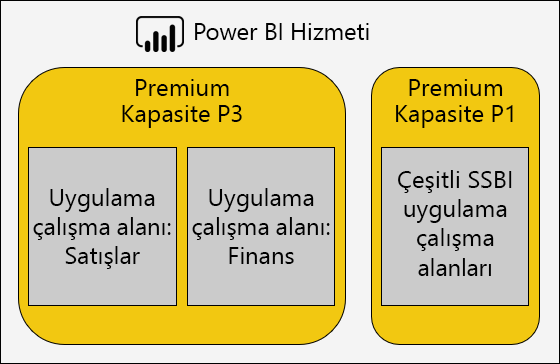
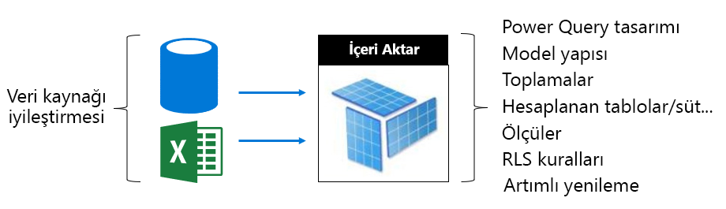
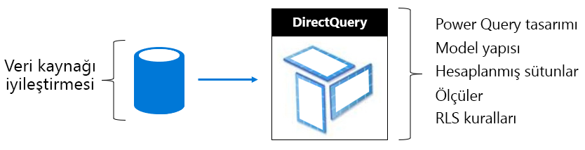
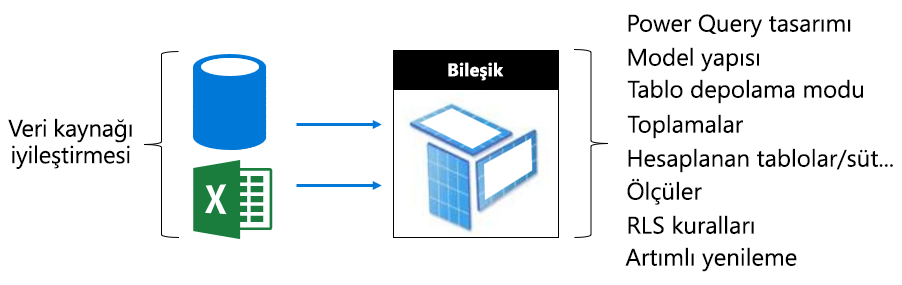

# Premium kapasiteleri iyileştirme

Premium kapasite performans sorunları ortaya çıktığında yeniden kabul edilebilir yanıt sürelerine dönmek için uygulanan yaygın ilk yaklaşımlardan biri çözümlerinizi iyileştirmek veya ayarlamaktır. Gerekçe ise, geçerli bir sebep olmadığı sürece ek Premium kapasite satın almaktan kaçınmadır.

Ek Premium kapasite gerektiğinde, bu makalede tanımlanan iki seçenek bulunur:

- Mevcut Premium kapasiteyi ölçeklendirme
- Yeni bir Premium kapasite ekleme

Son olarak, yaklaşımlar ve Premium kapasite boyutlandırması test edilerek bu makale sonlandırılır.

> [!NOTE]
> Yakın zamanda Power BI Premium, şu anda önizleme aşamasında olan **Premium 2. Nesil** adlı yeni bir Premium sürümünü kullanıma sundu. Premium 2. Nesil, Premium kapasitelerinin yönetimini basitleştirecek ve yönetim yükünü azaltacak. Daha fazla bilgi için bkz. [Power BI Premium 2. Nesil (önizleme)](service-premium-what-is.md#power-bi-premium-generation-2-preview).
>
>Power BI Embedded Gen2 geliştirmelerini gözden geçirmek için [Power BI Embedded 2. nesil](../developer/embedded/power-bi-embedded-generation-2.md)bölümüne bakın.

Bu makaledeki öneriler ve en iyi deneyimler her veri kümesinin ve diğer Power BI yapılarının CPU kullanımının iyileştirilmesini sağlar.

## Önerilen uygulamalar

En uygun kullanımı ve en iyi performansı elde etmek için şunları da içeren önerilen en iyi yöntemler bulunur:

- Kişisel çalışma alanlarının yerine çalışma alanlarını kullanma.
- İş açısından kritik ve Self Servis BI’ı (SSBI) farklı kapasitelere ayırma.

  

- İçeriği yalnızca Power BI Pro kullanıcılarıyla paylaşıyorsanız bunu bir ayrılmış kapasitede depolamaya gerek kalmayabilir.
- Belirli bir yenileme zamanına ulaşmak istiyorsanız veya belirli özellikler gerektiğinde ayrılmış kapasiteleri kullanın. Örneğin, büyük veri kümeleri veya sayfalandırılmış raporlama ile bunu yapabilirsiniz.

### Sık sorulan soruları ele alma

Power BI Premium dağıtımlarını iyileştirme karmaşık bir konudur. Bu iyileştirmenin sağlanması için iş yükü gereksinimleri, kullanılabilen kaynaklar ve bunların etkili bir şekilde kullanılması hakkında bilgi sahibi olmak gerekir.

Bu makalede, sıkça sorulan destek sorularından yedisi ele alınır, olası sorunlar tanımlanıp açıklamalar sağlanır ve bu sorunların nasıl belirlenip çözüleceğine yönelik bilgiler sunulur.

### Kapasite neden yavaşladı? Bununla ilgili ne yapabilirim?

Premium kapasitenin yavaşlamasına katkıda bulunabilen birçok sebep vardır. “Yavaş” dendiğinde neyin kastedildiğini anlamak için bu soruyla ilgili daha fazla bilgi gerekir. Raporlar yavaş mı yükleniyor? Yoksa yükleme başarısız mı oluyor? Rapor görselleri yavaş mı yükleniyor veya kullanıcılar raporla etkileşime geçtiğinde mi güncelleştiriliyor? Yenilemelerin tamamlanması beklenenden veya öncekinden daha uzun mu sürüyor?

Sebepleri anladıktan sonra araştırmaya başlayabilirsiniz. Aşağıdaki altı soruya verdiğiniz cevaplar daha özel soruları ele almanıza yardımcı olur.

### Kapasitemi hangi içerikler kullanıyor?

Kapasiteye göre filtrelemek ve çalışma alanı içeriği için performans ölçümlerini gözden geçirmek için **Power BI Premium Kapasite Ölçümleri** uygulamasını kullanabilirsiniz. Bir Premium kapasitede depolanan tüm içerikler için performans ölçümlerini ve kaynak kullanımını saate göre gözden geçirme olanağı bulunur. Premium kapasite performansı hakkında genel bir sorun giderilirken genelde öncelikle izleme adımından başlanır.

İzlenecek ana ölçümler şunları içerir:

- Ortalama CPU ve yüksek kullanım sayısı.
- Ortalama Bellek ve yüksek kullanım sayısının yanı sıra belirli veri kümeleri, veri akışları ve sayfalandırılmış raporlar için bellek kullanımı.
- Bellekte yüklenen etkin veri kümeleri.
- Ortalama ve en fazla sorgu süreleri.
- Ortalama sorgu bekleme süreleri.
- Ortalama veri kümesi ve veri akışı yenileme süreleri.

Power BI Premium Kapasite Ölçümleri uygulamasında, son üç dakika içinde kullanıldığı için çıkarılamayan bir rapora verilen toplam bellek miktarını gösteren ölçüm etkin bellektir. Yenileme süresindeki ani bir artış büyük ve/veya etkin bir veri kümesi ile bağıntılı olabilir.

**Ortalama Süreye Göre En İyi 5** grafiği, kapasite kaynaklarını tüketen en iyi 5 veri kümesini, sayfalandırılmış raporu ve veri akışlarını gösterir. En iyi beş listelerindeki içeriklere araştırma ve olası iyileştirmeler için başvurulabilir.

### Raporlar neden yavaş?

Aşağıdaki tablolar olası sorunları ve bunları tanımlayıp düzeltmeye yönelik yöntemleri gösterir.

#### Yetersiz kapasite kaynakları

| Olası Açıklamalar | Nasıl Tanımlanır? | Nasıl Çözülür? |
| --- | --- | --- |
| Yüksek toplam etkin bellek (model, son üç dakika içinde kullanıldığı için çıkarılamaz).   Sorgu bekleme sürelerinde birden fazla, yüksek ani artış.   Yenileme bekleme sürelerinde birden fazla, yüksek ani artış. | Bellek ölçümlerini \[[1](#endnote-1)\] ve çıkarma ölçümlerini \[[2](#endnote-2)\] izleyin. | Model boyutunu azaltın veya DirectQuery moduna dönüştürün. Bu makalenin [Modelleri iyileştirme](#optimizing-models) kısmına bakın.   Kapasitenin ölçeğini artırın.   İçeriği farklı bir kapasiteye atayın. |

#### Verimsiz rapor tasarımları

| Olası Açıklamalar | Nasıl Tanımlanır? | Nasıl Çözülür? |
| --- | --- | --- |
| Rapor sayfaları çok fazla görsel içerir (etkileşimli filtreleme, görsel başına en az bir sorgu tetikleyebilir).   Görseller gerekenden daha fazla veri alır. | Rapor tasarımlarını gözden geçirin.   Raporlarla nasıl etkileşime geçtiklerini anlamak için rapor kullanıcılarıyla görüşün.   Veri kümesi sorgu ölçümlerini izleyin \[[3](#endnote-3)\]. | Raporları, her sayfada daha az görsel olacak şekilde yeniden tasarlayın. |

#### Özellikle daha önceden raporların performansı iyi olduğunda veri kümesi çok yavaş kalıyor

| Olası Açıklamalar | Nasıl Tanımlanır? | Nasıl Çözülür? |
| --- | --- | --- |
| Hacmi gittikçe artan içeri aktarma verileri.   RLS rolleri de dahil olmak üzere karmaşık veya verimsiz hesaplama mantığı.   Model tamamen iyileştirilmemiş.   (DQ/LC) Ağ geçidi gecikme süresi.   Yavaş DQ kaynak sorgusu yanıt süreleri. | Model tasarımlarını gözden geçirin.   Ağ geçidi performans sayaçlarını izleyin. | Bu makalenin [Modelleri iyileştirme](#optimizing-models) kısmına bakın. |

#### Yüksek eşzamanlı rapor kullanımı

| Olası Açıklamalar | Nasıl Tanımlanır? | Nasıl Çözülür? |
| --- | --- | --- |
| Yüksek sorgu bekleme süreleri.   CPU doygunluğu.   DQ/LC bağlantı sınırları aşıldı. | CPU kullanımını \[[4](#endnote-4)\], sorgu bekleme sürelerini, ve DQ/LC kullanımı \[[5](#endnote-5)\] ölçümlerini + Sorgu sürelerini izleyin. Bunlarda yaşanan dalgalanmalar eşzamanlılık sorunlarına işaret eder. | Kapasitenin ölçeğini artırın, veya içeriği farklı bir kapasiteye atayın.   Raporları, her sayfada daha az görsel olacak şekilde yeniden tasarlayın. |

**Notlar:**    
\[1\] Ortalama Bellek Kullanımı (GB), ve En Yüksek Bellek Tüketimi (GB).   
\[2\] Veri kümesi çıkarmaları.   
\[3\] Veri Kümesi Sorguları, Veri Kümesi Ortalama Sorgu Süresi (ms), Veri Kümesi Bekleme Sayısı ve Veri Kümesi Ortalama Bekleme Süresi (ms).   
\[4\] CPU Yüksek Kullanım Sayısı ve CPU’nun En Yüksek Kullanım Zamanı (son yedi gün içerisinde).   
\[5\] DQ/LC Yüksek Kullanım Sayısı ve DQ/LC’nin En Yüksek Kullanım Zamanı (son yedi gün içerisinde).   

### Raporlar neden yüklenmiyor?

Raporların yüklenememesi, kapasitenin yetersiz belleğe sahip olduğuna ve aşırı ısındığına işaret eder. Bu, yüklenen tüm modeller aktif olarak sorgulandıkları için çıkarılamadığında ve tüm yenileme işlemleri durdurulduğunda veya geciktiğinde ortaya çıkabilir. Power BI hizmeti, 30 saniye boyunca veri kümesini yüklemeye çalışır. Bu işlem başarısız olursa durum kullanıcıya bildirilir ve kısa bir süre sonra tekrar denemesi önerilir.

Şu anda, rapor yükleme hatalarını izlemeye yönelik bir ölçüm bulunmamaktadır. Bu soruna yol açan etmenleri sistem belleğini, özellikle de en yüksek kullanım oranına ve en yüksek kullanım süresine sahip olanları izleyerek tanımlayabilirsiniz. Yüksek veri kümesi çıkarmaları ve veri kümesi yenilemeleri için ortalama bekleme süresinin uzun olması bu sorunun meydana geldiğini gösterebilir.

Bu çok nadiren yaşanıyorsa öncelikli bir sorun olarak kabul edilmeyebilir. Rapor kullanıcılarına hizmetin meşgul olduğu ve kısa bir süre sonra yeniden denemeleri gerektiği bildirilir. Bu çok sık yaşanırsa Premium kapasitesinin ölçeği artırılarak veya içeriği farklı bir kapasiteye atayarak bu sorun çözülebilir.

Kapasite Yöneticileri (ve Power BI hizmet yöneticileri) bunun ne zaman yaşandığını belirlemek için **Sorgu Hataları** ölçümünü izleyebilir. Sistemin aşırı yüklenmesi durumunda tüm işlemleri sıfırlayarak kapasiteyi yeniden başlatabilirler.

### Yenilemeler neden zamanında başlamıyor?

Zamanlanan yenileme başlangıç süreleri garanti edilmez. Power BI hizmetinin her zaman arka plan işlemlerinden ziyade etkileşimli işlemleri önceliklendirdiğini unutmayın. Yenileme, iki koşul karşılandığında oluşabilen bir arka plan işlemidir:

- Yeterli bellek bulunduğunda
- Premium kapasite için desteklenen eşzamanlı yenileme sayısı aşılmadığında

Koşullar karşılanmazsa, koşullar uygun hale gelene kadar yenileme kuyruğa alınır.

Tam yenileme için, mevcut veri kümesi bellek boyutunun en az iki katının gerektiğini unutmayın. Yeterli bellek yoksa çıkarma işlemi belleği boşaltana kadar yenileme başlayamaz. Bu da veri kümelerinin biri veya daha fazlası etkin olmayan ve çıkarılabilir duruma gelene kadar gecikme yaşanacak demektir.

Desteklenen en fazla eşzamanlı yenileme sayısının, arka uç sanal çekirdeklerinin 1.5 katının yukarı yuvarlanmış hali olarak ayarlandığını unutmayın.

Zamanlanmış yenileme, sonraki zamanlanmış yenileme başlamadan önce başlayamadığında başarısız olur. Kullanıcı arabiriminden el ile tetiklenen bir isteğe bağlı yenileme, başarısız olmadan önce en az üç kere çalışmayı dener.

Kapasite Yöneticileri (ve Power BI hizmet yöneticileri), zamanlanan süre ve işlemin başlangıcı arasındaki ortalama gecikmeyi tespit etmek için **Ortalama Yenileme Bekleme Süresi (dakika)** ölçümünü izleyebilir.

Genellikle yönetime yönelik bir öncelik olmasa da, zamanında veri yenilemelerini etkilemek için yeterli bellek bulunduğundan emin olun. Bu, veri kümelerini bilinen yeterli kaynaklara sahip kapasiteler için ayrı tutmayı içerebilir. Yöneticilerin, çarpışmaları en az indirmek amacıyla zamanlanan veri yenileme sürelerini kademelendirmek veya azaltmak için veri kümesi sahipleriyle çalışma olanağı da bulunur. Bir yöneticinin yenileme kuyruğunu görüntülemesi veya veri kümesi zamanlamalarını alması mümkün değildir.

### Yenilemeler neden yavaş?

Yenilemeler yavaş olabilir veya yavaş gibi algılanabilir (önceki soruda ele alındığı gibi).

Yenileme gerçekten yavaşsa, bu çeşitli nedenlerden kaynaklanabilir:

- Yetersiz CPU (yenileme işlemi CPU’yu yoğun olarak kullanabilir).
- Yenileme duraklamasına neden olan yetersiz bellek (koşullar yeniden başlatma için uygun olduğunda yenilemenin baştan başlamasını gerektirir).
- Veri kaynağı sisteminin yanıt hızı, ağ gecikme süresi, geçersiz izinler veya ağ geçidi aktarım hızının da dahil olduğu, kapasiteyle ilgili olmayan sebepler.
- Veri hacmi, aşağıda anlatıldığı gibi artımlı yenilemeyi yapılandırmak için iyi bir nedendir.

Kapasite Yöneticileri (ve Power BI hizmet yöneticileri) zaman içinde karşılaştırma için bir kıyaslama gerçekleştirmek için **Ortalama Yenileme Süresi (dakika)** ölçümünü, zamanlanan süre ve işlemin başlangıcı arasındaki gecikmeyi belirlemek için de **Ortalama Yenileme Bekleme Süresi (dakika)** ölçümünü izleyebilir.

Artımlı yenileme, özellikle büyük model tabloları için veri yenileme süresini önemli ölçüde azaltabilir. Artımlı yenilemenin sunduğu dört avantaj bulunur:

- **Yenilemeler daha hızlıdır** - Tablonun sadece alt kümesinin yüklenmesi gerekir. Böylelikle CPU ve bellek kullanımı azalır ve birden fazla bölüm yenilenirken paralellik daha yüksek olabilir.
- **Yenilemeler sadece gerekli olduğunda gerçekleşir** - Artımlı yenileme ilkeleri sadece veriler değiştirildiğinde yüklenecek şekilde yapılandırılabilir.
- **Yenilemeler daha güvenilirdir** - Geçici veri kaynağıyla kurulan kısa çalışan bağlantılar kesintilere daha az duyarlıdır.
- **Modeller kırpılmış olarak kalır** - Artımlı yenileme ilkeleri, geçmişi otomatik olarak kayan zaman penceresinin ötesinde de kaldıracak şekilde yapılandırılabilir.

Daha fazla bilgi edinmek için bkz. [Power BI Premium’da artımlı yenileme](service-premium-incremental-refresh.md).

### Veri yenilemeleri neden tamamlanmıyor?

Veri yenileme başlarsa ancak tamamlanamazsa bunun çeşitli sebepleri olabilir:

- Premium kapasitede yalnızca bir model olsa da yetersiz kalan bellek (örneğin model boyutu) çok büyükse.
- Veri kaynağı sistemi bağlantısının kopması, geçersiz izinler veya ağ geçidi hatası dahil olmak üzere kapasiteyle ilgili olmayan sebepler.

Kapasite Yöneticileri (ve Power BI hizmet yöneticileri) **Belleğin yetersiz kalmasından ötürü Yenileme Hataları** ölçümünü izleyebilir.

## Modelleri iyileştirme

Etkili ve ölçeklenebilir bir çözüm sunmak için model tasarımının en uygun halde olması önemlidir. Ancak, bununla ilgili ayrıntılı bir tartışma sunma, bu makalenin kapsamını aşar. Bunun yerine, modeller iyileştirilirken dikkate alınması gereken önemli hususlar bu bölümde sunulacaktır.

### Power BI barındırılan modelleri iyileştirme

Bir Premium kapasitede barındırılan modelleri iyileştirme işlemi veri kaynaklarında ve model katmanlarında gerçekleştirilebilir.

İçeri aktarma modeline yönelik iyileştirme olanaklarını göz önünde bulundurun:

Veri kaynağı katmanında:

- İlişkisel veri kaynakları, verileri önceden tümleştirerek, uygun dizinler uygulanarak, artımlı yenileme dönemleriyle uyumlu olan tablo bölümleri tanımlayarak, hesaplamaları gerçekleştirerek (hesaplanan model tabloları ve sütunların yerine) veya görünümlere hesaplama mantığı ekleyerek mümkün olan en hızlı yenileme süresini sunmak için iyileştirilebilir.
- İlişkisel olmayan veri kaynakları ilişkisel depolarla önceden tümleştirilebilir.
- Ağ geçitlerinin, tercihen ayrılmış makinelerde, yeterli ağ genişliğiyle, veri kaynaklarının yakınında yer alan yeterli kaynaklarının bulunduğundan emin olun.

Model katmanında:

- Power Query sorgu tasarımları, karmaşık dönüşümleri (özellikle farklı veri kaynaklarını birleştirenleri) en aza indirebilir veya kaldırabilir (veri ambarları bunu Ayıklama-Dönüştürme-Yükleme aşamasında gerçekleştirir). Uygun veri kaynağı gizlilik düzeylerinin ayarlandığından emin olarak, sorgularda birleşik bir sonuç üretmek için Power BI’ın tam sonuçları yüklemesini gerektirmeyebilir.
- Model, yüklenecek veriyi belirler ve model boyutunun üzerinde doğrudan etkiye sahiptir. Sütunları, satırları kaldırarak (özellikle geçmiş verilerini) veya özetlenen verileri yükleyerek (ayrıntılı verileri yükleme pahasına) gereksiz verileri yüklemesi engellenecek şekilde tasarlanabilir. Verimli şekilde depolama veya sıkıştırma yapamayan yüksek kardinaliteli sütunlar kaldırılarak (özellikle metin sütunları) boyut büyük ölçüde azaltılabilir.
- Çift yönlü filtrelemeye izin vermeyi gerektiren bir sebep olmadıkça, tek yönlü ilişkiler yapılandırılarak sorgu performansı geliştirilebilir. Çift yönlü filtrelemenin yerine [CROSSFILTER](/dax/crossfilter-function) işlevini kullanmayı da düşünebilirsiniz.
- Toplama tabloları, önceden özetlenmiş verileri yükleyerek hızlı sorgu yanıtları elde edebilir. Ancak, bunun sonucu olarak modelin boyutu büyür ve yenileme süreleri uzar. Genellikle, toplama tabloları çok büyük modeller veya bileşik model tasarımları için ayrılmalıdır.
- Hesaplanan tablolar ve sütunlar model boyutunu artırıp yenileme süresinin uzamasına neden olur. Genellikle, veriler veri kaynağında gerçekleştirildiğinde veya hesaplandığında daha küçük bir depolama boyutu ve daha hızlı yenileme zamanı elde edilebilir. Bu mümkün değilse, Power Query özel sütunlar gelişmiş depolama sıkıştırması sunabilir.
- Ölçümler ve RLS kuralları için DAX ifadelerini ayarlamaya yönelik bir fırsat olabilir. Pahalı formüllerden kaçınmak için mantık yeniden yazılabilir
- Artımlı yenileme, yenileme süresini önemli ölçüde azaltabilir ve bellek ve CPU tasarrufu sağlayabilir. Artımlı yenileme, model boyutlarının kırpmalarını saklayan geçmiş verilerini kaldıracak şekilde de yapılandırılabilir.
- Farklı ve çakışan sorgu desenleri olduğunda, model iki model olarak yeniden tasarlanabilir. Örneğin, bazı raporlar tüm geçmişte yüksek düzeyde toplama sunar ve 24 saatlik gecikme süresine izin verebilir. Diğer raporlar bugünün verileriyle ilgilidir ve tek işlemlere ayrıntılı erişim gerektirir. Tüm raporları karşılamak için tek bir model tasarlamaktan ziyade her gereksinim için iyileştirilmiş iki model oluşturun.

Bir DirectQuery modeli için iyileştirme olanaklarını göz önünde bulundurun. Model, temel alınan veri kaynağına sorgu isteği gönderdikçe, yanıt veren model sorguları sunmak için veri kaynağının iyileştirilmesi büyük önem taşır.

 

Veri kaynağı katmanında:

- Veri kaynağı, verileri önceden tümleştirerek (model katmanında mümkün değildir), uygun dizinleri uygulayarak, tablo bölümlerini tanımlayarak, özetlenmiş verileri gerçekleştirerek (dizinlenmiş görünümlerle) ve hesaplama miktarını en aza indirerek mümkün olan en hızlı sorgulamayı sunması için iyileştirilebilir. En iyi deneyim, doğrudan sorgular sadece filtreye ihtiyaç duyduğunda ve iç birleşimleri dizinlenmiş tablolar veya görünümler arasında gerçekleştirdiğinde elde edilir.
- Ağ geçitlerinin, tercihen ayrılmış makinelerde, yeterli ağ genişliğiyle, veri kaynaklarının yakınında yer alan yeterli kaynaklarının bulunduğundan emin olun.

Model katmanında:

- Power Query sorgu tasarımları tercihen dönüşüm uygulamamalıdır. Aksi takdirde, dönüşümleri en az düzeyde tutmaya çalışın.
- Çift yönlü filtrelemeye izin vermeyi gerektiren bir sebep olmadıkça, tek yönlü ilişkiler yapılandırılarak sorgu performansı geliştirilebilir. Ayrıca, bilgi tutarlılığının zorlandığını varsaymak için model ilişkileri (durum bu olduğunda) yapılandırılmalıdır. Sonuç olarak, daha verimli iç birleşimler (dış birleşimlerin yerine) kullanan veri kaynağı sorguları ortaya çıkar.
- Mümkün olduğunda, Power Query sorgusu özel sütunları veya model hesaplanmış sütunları oluşturmaktan kaçının.
- Ölçümler ve RLS kuralları için DAX ifadelerini ayarlamaya yönelik bir fırsat olabilir. Pahalı formüllerden kaçınmak için mantık yeniden yazılabilir.

Birleşik bir model için iyileştirme olanaklarını göz önünde bulundurun. Birleşik modelin içeri aktarma ve DirectQuery tablolarının karışımına olanak tanıdığını unutmayın.

- Genellikle, İçeri aktarma ve DirectQuery modellerine yönelik iyileştirmeler, bu depolama modlarını kullanan Birleşik model tabloları için geçerlidir.
- Boyut türü tabloları (iş varlıklarını temsil eder) ikili depolama modu ve olgu türü tablolar (sıklıkla büyük tablolar olur ve işletimsel olguları temsil eder) olarak yapılandırarak dengeli bir tasarım elde etmeye çalışın. İkili tasarım modu, hem İçeri aktarma hem de DirectQuery depolama modunun kullanıldığı anlamına gelir. Bu, Power BI hizmetinin doğrudan sorgu için yerel bir sorgu oluştururken kullanılacak en verimli depolama modunu kararlaştırmasına olanak tanır.
- Ağ geçitlerinin, tercihen ayrılmış makinelerde, yeterli ağ genişliğiyle, veri kaynaklarının yakınında yer alan yeterli kaynaklarının bulunduğundan emin olun
- İçeri aktarma depolama modu olarak yapılandırılan toplama tabloları, DirectQuery sorgu modunda olgu türü tabloları özetlemek için kullanıldığında önemli sorgu performansı artışı sunabilir. Bu durumda, toplama tabloları modelin boyutunu ve yenileme süresini artırır. Bu, genelde daha hızlı sorgular için kabul edilebilir bir ödünleşmedir.

### Dışarıda barındırılan modelleri iyileştirme

[Power BI’da barındırılan modelleri iyileştirme](#optimizing-power-bi-hosted-models) bölümünde tartışılan birçok iyileştirme olanağı, Azure Analysis Services ve SQL Server Analysis Services ile geliştirilen modeller için de geçerlidir. Bileşik modeller ve toplama tabloları gibi şu anda desteklenmeyen özellikler açık özel durumlardandır.

Dışarıda barındırılan veri kümelerine yönelik bir diğer durum da, Power BI hizmetiyle ilişkili olarak veritabanı barındırmadır. Azure Analysis Services için bu, Azure kaynağını Power BI kiracısıyla aynı bölgede (ana bölge) oluşturma anlamına gelir. Bu, SQL Server Analysis Services ve IaaS için de VM’i aynı bölgede barındırma, şirket içi için de verimli bir ağ geçidi kurulumu sağlama anlamına gelir.

Bunun yanı sıra, Azure Analysis Services veritabanlarının ve SQL Server Analysis Services tablosal veritabanlarının modellerin belleğe tam olarak yüklenmesini gerektirdiğini ve sorgulamayı desteklemek için sürekli olarak orada kaldıklarını hatırlamak faydalı olabilir. Power BI hizmeti gibi, modelin yenileme esnasında çevrimiçi kalması gerekiyorsa yeterli belleğin bulunması gerekir. Power BI hizmetinin aksine, kullanıma göre modellerin bellekte eski veya yeni hale getirilmesine yönelik bir kavram bulunmamaktadır. Bu nedenle, daha düşük bellek kullanımı ile model sorgulamayı en üst düzeye çıkarmak için Power BI Premium daha verimli bir yaklaşım sunar.

## Kapasite planlaması

Premium kapasitesinin boyutu kullanılabilir olan bellek ve işlemci kaynaklarını ve kapasiteye uygulanan limitleri belirler. Premium kapasitelerinin sayısı da dikkate alınır. Birden fazla Premium kapasitesinin oluşturulması iş yüklerini birbirinden yalıtmaya yardımcı olabilir. Depolamanın kapasite düğümü başına 100 TB olduğunu ve bu durumun herhangi bir iş yükü için yeterli olduğunu unutmayın.

Premium kapasitelerinin sayısını ve boyutunu belirleme, özellikle oluşturduğunuz ilk kapasiteler için zorlayıcı bir durum olabilir. Kapasiteyi boyutlandırmanın ilk adımı, beklenen günlük kullanımı temsil eden ortalama iş yükünü anlamadır. Tüm iş yüklerinin eşit olmadığını anlamak önemlidir. Örneğin, ölçeğin bir ucunda tek bir görsel içeren bir rapor sayfasına 100 kullanıcının erişmesini sağlama hedefine kolayca erişilebilir. Ancak, ölçeğin diğer ucunda, her biri rapor sayfasında 100 görsel içeren 100 farklı rapora aynı anda 100 kullanıcının erişmesini sağlama, kapasite kaynaklarından oldukça farklı taleplerde bulunacaktır.

Bu nedenle, Kapasite Yöneticilerinin ortamınıza, içeriklerinize ve beklenen kullanımlara özgü birçok farklı etkeni göz önünde bulundurması gerekir. Burada üstün gelen hedef, tutarlı sorgu süreleri, kabul edilebilir bekleme süreleri ve çıkarma oranları sunarken kapasite kullanımını en üst düzeye çıkarmadır. Göz önünde bulundurulacak etkenler şunları içerebilir:

- **Model boyutu ve veri özellikleri** - Sorgulama veya yenilemeye izin vermek için içeri aktarma modelleri belleğe tamamen yüklenmelidir. LC/DQ veri kümeleri, karmaşık ölçümleri veya RLS kurallarını değerlendirmek için önemli işlemci süresi ve muhtemelen önemli ölçüde bellek gerektirebilir. Bellek ve işlemci boyutu ve LC/DQ sorgu aktarım hızı kapasite boyutuyla kısıtlıdır.
- **Eşzamanlı etkin modeller** - Farklı içeri aktarma modellerinin eşzamanlı olarak sorgulanması, modeller bellekte durdukça en iyi yanıtlama hızını ve performansı sunar. Yoğun şekilde sorgulanan modelleri barındırmak için yeterli bellek olmalıdır. Bunların yenilenmesi için de ek bellek gerekir.
- **İçeri aktarma modelini yenileme** - Yenileme türü (tam veya artımlı), Power Query sorgularının süresi ve karmaşıklığı ve hesaplanan tablo/sütun mantığının bellek ve özellikle de işlemci kullanımı üzerinde etkisi olabilir. Eş zamanlı yenilemeler kapasite boyutuyla kısıtlanır (1,5 x arka uç sanal çekirdek sayısı, yukarıya doğru yuvarlanır).
- **Eşzamanlı sorgular** - İşlemci veya LC/DQ bağlantıları kapasite sınırını aştığında çoğu eşzamanlı sorgu yanıt vermeyen raporlara neden olabilir. Bu durum özellikle de çok sayıda görsel içeren rapor sayfaları için geçerlidir.
- **Veri akışları ve sayfalandırılmış raporlar** - Kapasite, veri akışlarını ve sayfalandırılmış raporları destekleyecek şekilde yapılandırılabilir. Her biri, kapasite belleğinin yapılandırılabilir en fazla yüzdesini gerektirir. Bellek, dinamik olarak veri akışlarına ayrılsa da istatistiksel olarak sayfalandırılmış raporlara ayrılır.

Bu faktörlere ek olarak, Kapasite Yöneticileri birden fazla kapasite oluşturmayı düşünebilir. Birden fazla kapasite, iş yüklerinin yalıtılmasına olanak tanır ve öncelikli iş yüklerinin garanti kaynaklara sahip olmasını sağlayacak şekilde yapılandırılabilir. Örneğin, iş açısından kritik iş yüklerini self servis BI (SSBI) iş yüklerinden ayırmak için iki kapasite oluşturulabilir. İş açısından kritik kapasite, sadece BT departmanına sağlanan yazar erişimi ile garanti kaynaklar sunarak büyük kurumsal modelleri ayrı tutmak için kullanılabilir. İş analistlerine sağlanan erişim ile, SSBI kapasitesi sayısı gittikçe artan küçük modelleri barındırmak için kullanılabilir. SSBI kapasitesi, zaman zaman kabul edilebilir sorgu veya yenileme beklemeleri yaşayabilir.

Zamanla, Kapasite Yöneticileri içerikleri çalışma alanlarının arasında taşıyarak, çalışma alanlarını kapasitelerin arasında taşıyarak veya kapasitelerin ölçeğini artırıp azaltarak çalışma alanlarını dengeleyebilir. Genellikle, daha büyük modelleri barındırmak için ölçeği artırıp daha fazla eşzamanlılık için ölçeği genişletirsiniz.

Lisans satın almanın sanal çekirdekleri bulunan kiracıyı sağladığını unutmayın. **P3** aboneliği satın alınarak bir veya dört taneye kadar Premium kapasite oluşturulabilir. Örn. 1 x P3, veya 2 x P2, veya 4 x P1. Boyutu P2 kapasitesinden P3 kapasitesine artırmadan önce iki tane P1 kapasitesi oluşturmak için sanal çekirdeklerin bölünmesi düşünülebilir.

## Yaklaşımları test etme

Kapasite boyutu kararlaştırıldığında, denetimli bir ortam oluşturularak test gerçekleştirilebilir. Bir Azure (A SKU’lar) kapasitesi oluşturma, pratik ve ekonomik seçeneklerden biridir. P1 kapasitesinin boyutu A4 kapasitesinin, P2 ve P3 kapasitelerinin boyutları da sırasıyla A5 ve A6 kapasitelerinin boyutlarıyla aynıdır. Hızla oluşturulabilen Azure kapasiteleri saatlik olarak faturalandırılır. Böylelikle, tahakkuk eden maliyetleri durdurmak için test etme tamamlandıktan sonra kolayca silinebilirler.

Test içeriği Azure kapasitesinde oluşturulan çalışma alanlarına eklenebilir. Ardından, tek bir kullanıcı olarak gerçekçi ve temsili bir sorgu iş yükü oluşturmak için raporlar çalıştırılabilir. İçeri aktarma modelleri varsa, her model için bir yenileme de gerçekleştirilmelidir. Kaynak kullanımını anlamak için tüm ölçümleri gözden geçirmek amacıyla izleme araçları kullanılabilir.

Testlerin tekrarlanabilir olması önemlidir. Testler birkaç kez çalıştırılmalı ve her seferinde yaklaşık olarak aynı sonucu sunmalıdır. Gerçek üretim koşulları altında iş yükünü tahmin etmek için bu sonuçların ortalaması kullanılabilir.

Zaten bir kapasiteniz ve testi yüklemek istediğiniz raporlarınız varsa, hızla bir yük testi oluşturmak için [PowerShell yük oluşturma aracını](https://aka.ms/PowerBILoadTestingTool) kullanın. Araç, her raporun bir saat içinde kapasitenizin kaç tane örneğini çalıştırabileceğini tahmin etmenize olanak tanır. Kapasitenizin ayrı rapor işleme veya farklı raporları paralel olarak işleme yeteneğini değerlendirmek için aracı kullanabilirsiniz. Daha fazla bilgi için şu videoyu izleyin: [Microsoft Power BI: Premium kapasite](https://www.youtube.com/watch?time_continue=1860&v=C6vk6wk9dcw).

Daha karmaşık bir test oluşturmak için, gerçekçi bir iş yüküne benzetim yapan bir yük test etme uygulaması geliştirmeyi düşünebilirsiniz. Daha fazla bilgi için bkz. [Visual Studio Yük Testi ile Power BI Uygulamalarında Yük Test Etme](https://powerbi.microsoft.com/blog/week-4-11-webinars-load-testing-power-bi-applications-with-visual-studio-load-test-and-getting-started-with-cds-for-apps-based-model-driven-apps/).

## Teşekkürler

Bu makale, Veri Platformu MVP’si ve [Bitwise Solutions](https://www.bitwisesolutions.com.au/)’da bağımsız BI uzmanı olan Peter Myers tarafından yazılmıştır.

## Sonraki adımlar

> [!div class="nextstepaction"]
> [Premium kapasite senaryoları](service-premium-capacity-scenarios.md)   
  
Başka bir sorunuz mu var? [Power BI Topluluğu'na sorun](https://community.powerbi.com/)

Power BI, aşağıdaki iyileştirmelerle Power BI Premium deneyimini geliştiren bir önizleme teklifi olarak Power BI Premium 2. Nesil’i kullanıma sundu:
* Performans
* Kullanıcı başına lisanslama
* Daha yüksek ölçek
* İyileştirilmiş ölçümler
* Otomatik ölçeklendirme
* Azaltılmış yönetim yükü

Power BI Premium 2. Nesil hakkında daha fazla bilgi için bkz. [Power BI Premium 2. Nesil (önizleme)](service-premium-what-is.md#power-bi-premium-generation-2-preview).