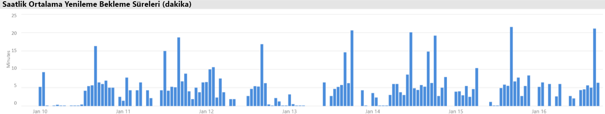
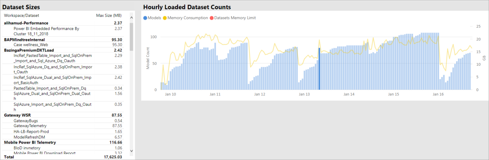
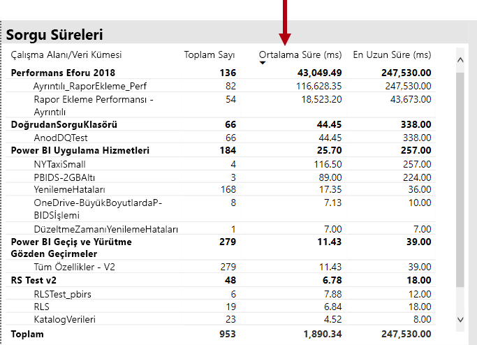
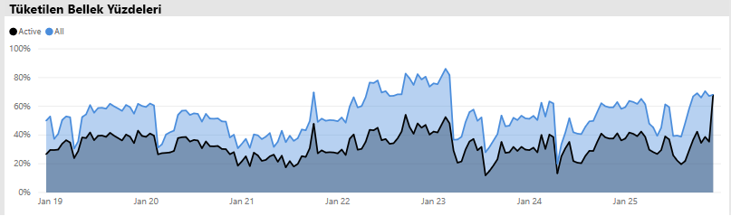
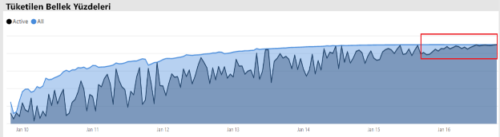
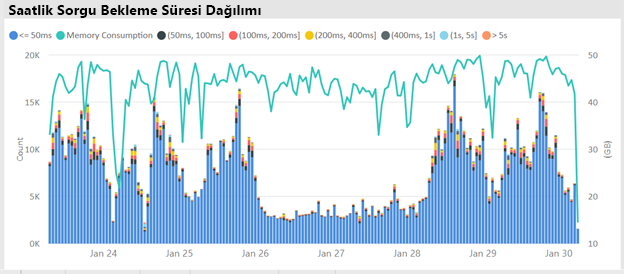

# Premium kapasite senaryoları

Bu makalede Power BI Premium kapasitelerinin uygulanmış olduğu gerçek dünya senaryoları açıklanmaktadır. Yaygın sorunlar ve zorluklar ile sorunları tespit etme adımları açıklanmakta ve yardım bilgileri sunulmaktadır:

- [Veri kümelerini güncel tutma](#keeping-datasets-up-to-date)
- [Yavaş yanıt veren veri kümelerini tanımlama](#identifying-slow-responding-datasets)
- [Aralıklı olarak yavaş yanıt veren veri kümeleriyle ilgili nedenleri tanımlama](#identifying-causes-for-sporadically-slow-responding-datasets)
- [Yeterli bellek olup olmadığını belirleme](#determining-whether-there-is-enough-memory)
- [Yeterli CPU olup olmadığını belirleme](#determining-whether-there-is-enough-cpu)

Adımlar, örnek grafikler ve tablolar, Power BI yöneticisi tarafından erişim sağlanabilecek **Power BI Premium Kapasite Ölçümleri uygulamasından** alınmıştır.

> [!NOTE]
> Yakın zamanda Power BI Premium, şu anda önizleme aşamasında olan **Premium 2. Nesil** adlı yeni bir Premium sürümünü kullanıma sundu. Premium 2. Nesil, Premium kapasitelerinin yönetimini basitleştirecek ve yönetim yükünü azaltacak. Daha fazla bilgi için bkz. [Power BI Premium 2. Nesil (önizleme)](service-premium-what-is.md#power-bi-premium-generation-2-preview).
>
>Power BI Embedded Gen2 geliştirmelerini gözden geçirmek için [Power BI Embedded 2. nesil](../developer/embedded/power-bi-embedded-generation-2.md)bölümüne bakın.

## Veri kümelerini güncel tutma

Bu senaryoda, kullanıcıların rapor verilerinin bazen eski veya "süresi dolmuş" olduğunu belirtmesi üzerine bir araştırma gerçekleştirilmiştir.

Yönetici, uygulamadaki **Yenilemeler** görseliyle etkileşime geçip veri kümelerini **En Uzun Bekleme Süresi** istatistiklerine göre azalan sırada sıralamıştır. Bu görsel, yöneticinin en uzun bekleme süresine sahip olan veri kümelerini çalışma alanı adına göre gruplanmış bir şekilde görmesini sağlar.

Yönetici, **Saatlik Ortalama Yenileme Bekleme Süreleri** görselinde yenileme bekleme sürelerinin tutarlı bir şekilde her gün saat 16:00 civarında zirve yaptığını görmüştür.

Bu sonuçlar için birkaç olası açıklama söz konusudur:

- Aynı anda çok fazla yenileme girişimi olması nedeniyle kapasite düğümü tarafından tanımlanan sınırlar aşılmıştır. Bu örnekte varsayılan bellek ayırma özelliğine sahip olan bir P1 ile altı eşzamanlı yenileme gerçekleştirilmiştir.

- Yenilenecek veri kümeleri, kullanılabilir durumdaki belleğe sığamayacak kadar büyük olabilir (tam yenileme için en az 2 katı bellek gerekiyor olabilir).
- Verimsiz Power Query mantığı nedeniyle veri kümesi yenileme işlemi sırasında bellek kullanımında ani artış yaşanıyor olabilir. Yoğun bir kapasitede bu ani artış fiziksel sınıra ulaşılmasına ve yenilemenin başarısız olmasının yanı sıra kapasitedeki diğer rapor görünümü işlemlerinin etkilenmesine neden olabilir.
- Bellek içinde kalması gereken sık sorgulanan veri kümeleri, kullanılabilir belleğin sınırlı olması nedeniyle diğer veri kümelerinin yenilenmemesine neden olabilir.

Power BI yöneticisi araştırmaya devam etmek için şu noktalara bakabilir:

- Kullanılabilir belleğin, yenilenecek veri kümesinin boyutunun iki katından az olduğu veri yenileme işlemleri.
- Veri kümelerinin yenilenmemesi ve yenileme öncesi bellek içinde olmaması ancak yoğun yenileme zamanlarında etkileşimli trafik olduğunu göstermesi. Power BI yöneticisi, herhangi bir anda bellek içine yüklenmiş olan veri kümelerini görmek için uygulamanın **Veri Kümeleri** sekmesinin veri kümeleri bölümüne bakabilir. Yönetici daha sonra **Saatlik Yüklenen Veri Kümesi Sayısı** bölümündeki çubuklardan birine tıklayarak belirli bir an için çapraz filtreleme yapabilir. Aşağıdaki görüntüde gösterilen yerel ani artışlar, zamanlanan yenilemelerin başlatılmasını geciktirebilecek şekilde belleğe birden fazla veri kümesinin yüklendiği belirli bir saati göstermektedir.
- Veri yenileme işlemlerinin başlatılmak üzere zamanlandığı durumlarda gerçekleşen artan veri kümesi çıkarma işlemleri. Çıkarma işlemleri, yenileme öncesinde çok fazla farklı etkileşimli raporun sunulmasından kaynaklanan yüksek bellek baskısı olduğunu gösteriyor olabilir. Çıkarma işlemlerindeki ani artışlar, **Saatlik Veri Kümesi Çıkarmaları ve Bellek Tüketimi** görselinde net bir şekilde görülebilir.

Aşağıdaki görüntüde yüklenmiş olan veri kümelerindeki yerel ani artış gösterilmektedir ve bu artış, etkileşimli sorgulardan kaynaklı yenileme gecikmesini gösteriyor olabilir. **Saatlik Yüklenen Veri Kümesi Sayısı** görselinde bir zaman aralığı seçildiğinde **Veri Kümesi Boyutları** görseline çapraz filtreleme uygulanır.

Power BI yöneticisi, veri kümeleri için yeterli belleğin sağlandığından emin olmak için gerekli adımları atarak bu sorunu çözme girişiminde bulunabilir. Bunun için gerekli adımlar:

- Veri kümesi sahipleriyle iletişime geçerek veri yenileme işlemlerini aşamalı olarak ve aralarında zaman bırakarak gerçekleştirmelerini istemek.
- Özellikle satır düzeyinde güvenlik gerektiren gereksiz panoları veya pano kutucuklarını kaldırarak veri kümesi sorgu yükünü azaltmak.
- Power Query mantığını iyileştirerek veri yenileme işlemlerini hızlandırmak. Hesaplanmış sütunları veya tabloları modelleme süreçlerini geliştirmek. Veri kümesi boyutlarını azaltmak veya daha büyük veri kümelerini artımlı veri yenileme gerçekleştirecek şekilde yapılandırmak.

## Yavaş yanıt veren veri kümelerini tanımlama

Bu senaryoda kullanıcıların, belirli raporların açılmasının çok uzun sürdüğü yönündeki şikayetleri üzerine bir araştırma başlatılmıştır. Raporlar yanıt vermeyi durdurmaktadır.

Power BI yöneticisi uygulama içinde **Sorgu Süreleri** görselini kullanarak veri kümelerini **Ortalama Süre** ölçütüne göre azalan sırada sıralayarak performansı en düşük olan veri kümelerini görebilir. Bu görselde ayrıca veri kümesi sorgu sayıları da vardır ve bu sayede veri kümelerinin ne kadar sorgulandığını görebilirsiniz.

Yönetici, filtrelenen zaman aralığı için kümelenmiş olan sorgu performansının (<= 30 ms, 0-100 ms) genel dağılımını gösteren **Sorgu Süresi Dağılımı** görseline bakabilir. Kullanıcılar genellikle bir saniye veya altında tamamlanan sorguları hızlı olarak kabul eder. Daha uzun süren sorgular, performansın düşük olduğu algısını yaratabilir.

**Saatlik Sorgu Süresi Dağılımı** görseli, Power BI yöneticisinin kapasitenin kötü olarak algılanmış olabileceği bir saatlik dönemleri belirlemesini sağlar. Çubuğun bir saniyeden uzun süren sorgu sürelerini gösteren bölümleri ne kadar büyük olursa kullanıcıların performansın düşük olduğunu düşünme riski o kadar yüksek olur.

Görsel etkileşimlidir ve çubuğun bir bölümü seçildiğinde rapor sayfasındaki karşılık gelen **Sorgu Süreleri** tablo görseline çapraz filtre uygulanarak temsil ettiği veri kümeleri gösterilir. Çapraz filtreleme, Power BI yöneticisinin yavaş yanıt veren veri kümelerini kolayca tanımlamasını sağlar.

Aşağıdaki görüntüde **Saatlik Sorgu Süresi Dağılımları** ölçütüyle filtrelenmiş olan ve bir saatlik aralıklarla en düşük performanslı veri kümelerini gösteren bir görsel yer almaktadır.

Power BI yöneticisi, belirli bir saatin içindeki düşük performanslı veri kümesini belirledikten sonra düşük performansın nedeninin kapasiteye aşırı yüklenilmesinden mi yoksa kötü tasarlanmış veri kümesi ve rapordan mı kaynaklandığını araştırmaya başlayabilir. Yönetici, **Sorgu Bekleme Süreleri** görseline bakarak veri kümelerini azalan ortalama sorgu bekleme süresine göre sıralayabilir. Sorguların büyük bir bölümü gecikiyorsa, veri kümesi yüksek talep nedeniyle çok fazla sorguyu bekletiyor olabilir. Ortalama sorgu bekleme süresi önemli bir düzeydeyse (> 100 ms), veri kümesi ve raporu inceleyerek iyileştirme yapılıp yapılamayacağı belirlenebilir. Örneğin ilgili raporun sayfalarındaki görsel sayısı azaltılabilir veya DAX ifadeleri iyileştirilebilir.

Veri kümelerindeki sorgu bekleme sürelerinin artmasının birden fazla nedeni olabilir:

- Uygun olmayan model tasarımı, ölçü ifadeleri ve hatta rapor tasarımı gibi yüksek düzeyde CPU kullanan ve uzun süre çalışan sorgulara neden olabilecek tüm koşullar. Bu durum, yeni sorguların CPU iş parçacıkları müsait duruma gelene kadar beklemesine neden olur ve bir konvoy etkisi yaratabilir (trafik sıkışıklığı gibi düşünebilirsiniz). Bu, yoğun iş saatlerinde sık görülen bir durumdur. Veri kümelerinin ortalama sorgu bekleme süresinin yüksek olup olmadığını belirlemek için öncelikli olarak **Sorgu Beklemeleri** sayfasını incelemeniz gerekir.
- Bir raporu veya veri kümesini eşzamanlı olarak kullanan kullanıcıların sayısının çok yüksek (yüzlerce veya binlerce) olması. Eşzamanlılık eşiğinin aşılması durumunda iyi tasarlanmış veri kümeleri dahi kötü bir performans sergileyebilir. Bu durum genellikle tek bir veri kümesinin diğer veri kümelerine kıyasla çok daha yüksek bir sorgu sayısına sahip olmasıyla anlaşılabilir. Örneğin bir veri kümesine 300 binden fazla sorgu gelirken diğer veri kümelerine gelen sorguların toplamı 30 binden küçük olabilir. Bu veri kümesine gönderilen sorgular belirli bir noktada aksamaya başlayacaktır ve bu durum **Sorgu Süreleri** görselinden takip edilebilir.
- Birbirinden ayrı birçok veri kümesinin aynı anda sorgulanması nedeniyle belleğe alınan ve atılan veri kümesi sayısının çok olması, bu nedenle belleğin sürekli temizlenmesi. Veri kümesi her seferinde belleğe yüklendiğinden kullanıcılar düşük performansla karşılaşır. Power BI yöneticisi bu durumu doğrulamak için **Saatlik Veri Kümesi Çıkarmaları ve Bellek Tüketimi** görseline bakabilir. Bu görselde belleğe yüklenen çok sayıdaki veri kümesinin sürekli çıkarıldığı gösteriliyor olabilir.

## Aralıklı olarak yavaş yanıt veren veri kümeleriyle ilgili nedenleri tanımlama

Bu senaryoda, kullanıcıların görsellerin belirli zamanlarda yavaşlayıp yanıt vermeyi durdurabildiğini belirtmeleri üzerine bir araştırma başlatılmıştır. Rapor görselleri bunun dışında kabul edilebilir düzeyde hızlıdır.

Bu duruma neden olan veri kümesini bulmak için uygulamanın içindeki **Sorgu Süreleri** bölümü kullanılmış ve aşağıdaki adımlar izlenmiştir:

- Yönetici, Sorgu Süreleri görselinde veri kümesine göre filtreleme yapmış (en çok sorgulanan veri kümeleriyle başlayarak) ve **Saatlik Sorgu Dağılımları** görselindeki çapraz filtrelenmiş çubukları incelemiştir.
- Saatlik çubuklardan birinin, tüm sorgu süresi grupları ile veri kümesinin diğer bir saatlik çubukları arasında önemli bir fark göstermesi (örneğin, renkler arasındaki oranların önemli ölçüde değişmesi), veri kümesinin performansının önemli ölçüde değiştiğini gösterir.
- Düşük performanslı sorguların düzensiz olduğu zamanı gösteren bir saatlik çubuklar, veri kümesinin diğer veri kümelerinin etkinliklerinden kaynaklanan gürültülü komşu etkisine maruz kaldığını göstermektedir.

Aşağıdaki görüntüde "(3,10s]" olan yürütme süresi demetinin boyutu ile veri kümesi performansında önemli bir düşüşün görüldüğü 30 Ocak tarihindeki bir saat gösterilmiştir. Bu bir saatlik çubuğa tıkladığınızda o saat içinde belleğe yüklenmiş olan tüm veri kümeleri gösterilmekte ve gürültülü komşu etkisine neden olan olası veri kümeleri belirtilmektedir.

Sorunlu bir zaman aralığı belirlendikten (örneğin, yukarıdaki görüntüde 30 Ocak tarihinde) sonra Power BI yöneticisi tüm veri kümesi filtrelerini kaldırıp yalnızca bu zaman aralığına göre filtreleme gerçekleştirerek bu süre içinde etkin olarak sorgulanan veri kümelerini belirleyebilir. Gürültülü komşu etkisinde suçlu olan veri kümesi genellikle en çok sorgulanan veya ortalama sorgu süresi en yüksek olan veri kümesidir.

Bu sorunu gidermek için sorun yaratan veri kümeleri farklı Premium kapasitelerdeki veya veri kümesi boyutunun, tüketim gereksinimlerinin ve veri yenileme desenlerinin desteklenmesi durumunda paylaşılan kapasitedeki bağımsız çalışma alanlarına dağıtılabilir.

Bunun tersi de yapılabilir. Power BI yöneticisi, bir veri kümesinin sorgu performansında önemli artış yaşanan anları belirleyip ardından bunu geriye götüren noktaları tespit edebilir. Bu noktadaki eksik bilgiler de sorunun nedenini bulma konusunda yardımcı olabilir.

## Yeterli bellek olup olmadığını belirleme

Power BI yöneticisi, kapasitede iş yüklerini tamamlamaya yetecek kadar bellek olup olmadığını belirlemek için uygulamanın **Veri Kümeleri** sekmesindeki **Tüketilen Bellek Yüzdeleri** görseline bakabilir. **Tümü** (toplam) bellek, etkin olarak sorgulanıp sorgulanmadıklarına veya işlenip işlenmediklerine bakılmaksızın belleğe yüklenmiş olan veri kümeleri tarafından tüketilen belleği temsil eder. **Etkin** bellek, etkin olarak işlenen veri kümeleri tarafından tüketilen belleği temsil eder.

İyi durumdaki bir kapasitede bu görsel aşağıdaki gibi görünür ve Tümü (toplam) ile Etkin bellek arasında fark vardır:

Bellek baskısı yaşayan bir kapasitede aynı görsel, etkin bellekle toplam belleğin birbirine yakın olduğunu ve belleğe ek veri kümesi yüklemenin mümkün olmadığını gösterecektir. Power BI yöneticisi böyle bir durumda **Kapasite Yeniden Başlatma**'ya (yönetim portalının kapasite ayarları sayfasındaki **Gelişmiş Seçenekler** menüsünde) tıklayabilir. Kapasitenin yeniden başlatılması durumunda bellekteki tüm veri kümeleri boşaltılır ve ihtiyaç duyulanlar (sorguyla veya veri yenileme işlemiyle) belleğe yeniden yüklenir.

> [!NOTE]
> Premium Gen2 ve [Embedded Gen2](../developer/embedded/power-bi-embedded-generation-2.md)için bellek tüketiminin izlenmesi gerekmez. Premium Gen2 ve Embedded Gen2 'daki tek sınırlama, tek bir yapıtın bellek ayak katında. Parmak izi, kapasitedeki kullanılabilir bellek miktarını aşamaz. Premium 2. Nesil hakkında daha fazla bilgi için bkz. [Power BI Premium 2. Nesil (önizleme)](service-premium-what-is.md#power-bi-premium-generation-2-preview).

## Yeterli CPU olup olmadığını belirleme

Bir kapasitenin ortalama CPU kullanımı genellikle %80'in altında olmalıdır. Bu değerin aşılması, kapasitenin CPU doyma noktasına yaklaştığı anlamına gelir.

CPU'nun doyma noktasına gelmesi durumunda, kapasitenin tüm işlemleri gerçekleştirme amacıyla birçok CPU bağlam değiştirme işlemi gerçekleştirmesi nedeniyle işlemler normalden daha uzun sürecektir. Bu durum, çok sayıda eşzamanlı sorguya sahip olan bir Premium kapasitede sorgu bekleme sürelerinin uzamasına neden olacaktır. Sorgu bekleme sürelerinin uzun olması da yanıtların daha yavaş gelmesi olacaktır. Power BI yöneticisi, **Saatlik Sorgu Bekleme Süresi Dağılımı** görselini görüntüleyerek CPU doyma noktasına geldiği zamanları kolayca tanımlayabilir. Sorgu bekleme süresi sayılarının düzenli aralıklarla zirve yapması olası CPU doyma noktasına işaret eder.

Benzer bir durum, CPU'nun doyma noktasına gelmesine katkıda bulunan arka plan işlemleri olması halinde de ortaya çıkabilir. Power BI yöneticisi, belirli bir veri kümesinin yenileme sürelerindeki aralıklı ani artışları gözlemleyebilir. Bu değer, devam eden veri kümesi yenileme işlemleri ve/veya etkileşimli sorgular nedeniyle CPU'nun doyma noktasına geldiğini gösterebilir. Bu örnekte uygulamanın **Sistem** görünümünde CPU'nun %100 olduğu gösterilmeyebilir. **Sistem** görünümü saatlik ortalama değerleri gösterir ancak CPU, yoğun işlemler nedeniyle birkaç dakika boyunca doyma noktasına ulaşabilir ve bu da bekleme sürelerinde ani artışlar olarak görülebilir.

CPU'nun doyma noktasına gelmesinin etkileri farklı şekillerde de gözlemlenebilir. Bekleyen sorgu sayısı önemlidir ancak performansta önemli bir düşüş yaşanmadan sorgu bekleme süreleri de uzayabilir. Bazı veri kümeleri (karmaşık veya büyük olması nedeniyle ortalama sorgu süresi daha uzun olanlar), CPU'nun doyma noktasına gelmesi etkisine diğerlerinden daha açıktır. Power BI yöneticisi bu veri kümelerini kolayca tanımlamak için **Saatlik Bekleme Süresi Dağılımı** görselindeki çubukların renklerinde gerçekleşen değişimleri inceleyebilir. Bir aykırı değer çubuğu gören yönetici, bu zaman aralığında sorgu bekleten veri kümelerini inceleyebilir ve ayrıca ortalama sorgu süresiyle ortalama sorgu bekleme süresini karşılaştırabilir. Bu iki ölçüm aynı değere sahipse ve veri kümesinin sorgu iş yükü önemsiz düzeydeyse veri kümesinin CPU değeri yetersiz olabilir.

Bu etki özellikle veri kümesinin birden fazla kullanıcıdan gelen yüksek yoğunluklu sorgularla ve kısa süreli ani artışlarla tüketilmesi (eğitim oturumu gibi), bu nedenle de her ani artışta CPU'nun doyma noktasına ulaşması durumunda görülebilir. Bu durumda bu veri kümesinde uzun sorgu bekleme süreleri yaşanabilir ve bu durum kapasitedeki diğer veri kümelerini de etkileyebilir (gürültülü komşu etkisi).

Bazı durumlarda Power BI yöneticileri, veri kümesi sahiplerinin rapor yerine pano (önbelleğe alınmış kutucuklar için veri kümesi yenileme işlemleriyle ve belirli aralıklarla sorgu gönderen) oluşturmalarını sağlayarak daha az geçici sorgu iş yükü oluşturmasını isteyebilir. Bu durum, pano yüklendiğinde karşılaşılan ani artışların engellenmesine yardımcı olabilir. Bu çözüm her zaman iş gereksinimlerine uygun olmayabilir ancak veri kümesinde değişiklik yapmadan CPU'nun doyma noktasına gelmesinden kaçınmanın etkili bir yolu olabilir.

> [!NOTE]
> Premium Gen2 ve [Embedded Gen2](../developer/embedded/power-bi-embedded-generation-2.md)için CPU süresi kullanımı, yapıt başına düzeyde izlenir ve kapasite kullanımı uygulamasında görülebilir. Her yapıt, verilen zaman aralığındaki toplam CPU süresi kullanımını gösterir. Premium 2. Nesil hakkında daha fazla bilgi için bkz. [Power BI Premium 2. Nesil (önizleme)](service-premium-what-is.md#power-bi-premium-generation-2-preview).

## Teşekkürler

Bu makale, Veri Platformu MVP’si ve [Bitwise Solutions](https://www.bitwisesolutions.com.au/)’da bağımsız BI uzmanı olan Peter Myers tarafından yazılmıştır.

## Sonraki adımlar

> [!div class="nextstepaction"]
> [Uygulama ile Premium kapasiteleri izleme](service-admin-premium-monitor-capacity.md)    
> [!div class="nextstepaction"]
> [Yönetim portalında kapasiteleri izleme](service-admin-premium-monitor-portal.md)   

Başka bir sorunuz mu var? [Power BI Topluluğu'na sorun](https://community.powerbi.com/)

Power BI, aşağıdaki iyileştirmelerle Power BI Premium deneyimini geliştiren bir önizleme teklifi olarak Power BI Premium 2. Nesil’i kullanıma sundu:
* Performans
* Kullanıcı başına lisanslama
* Daha yüksek ölçek
* İyileştirilmiş ölçümler
* Otomatik ölçeklendirme
* Azaltılmış yönetim yükü

Power BI Premium 2. Nesil hakkında daha fazla bilgi için bkz. [Power BI Premium 2. Nesil (önizleme)](service-premium-what-is.md#power-bi-premium-generation-2-preview).

