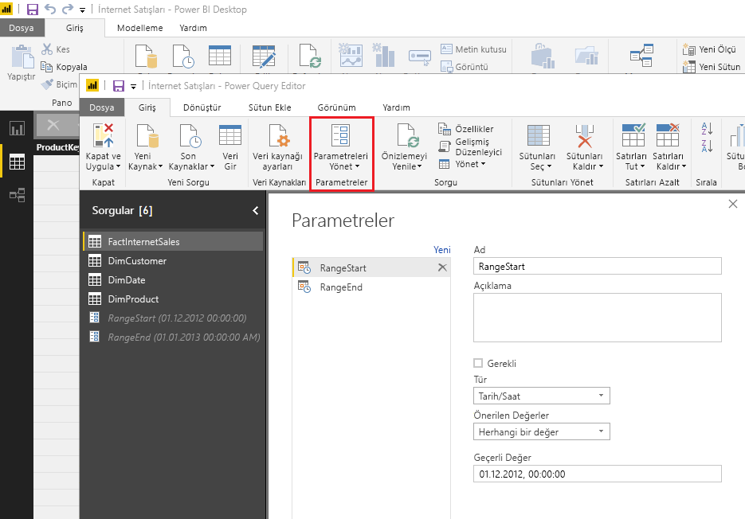
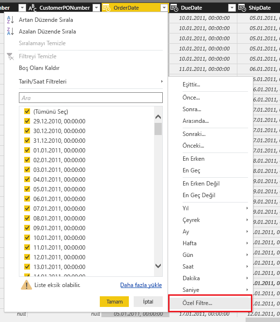
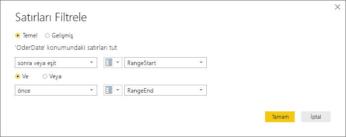
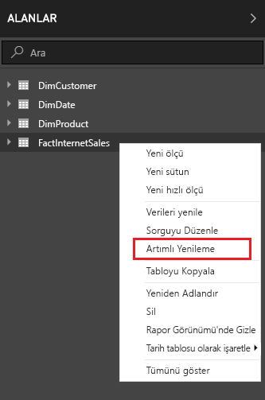
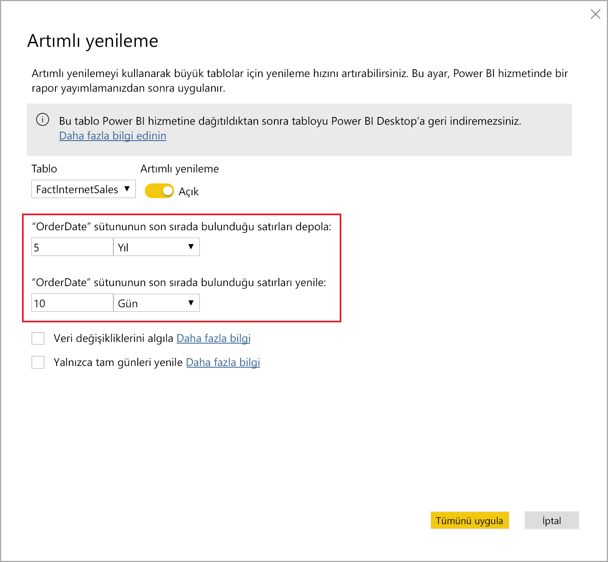
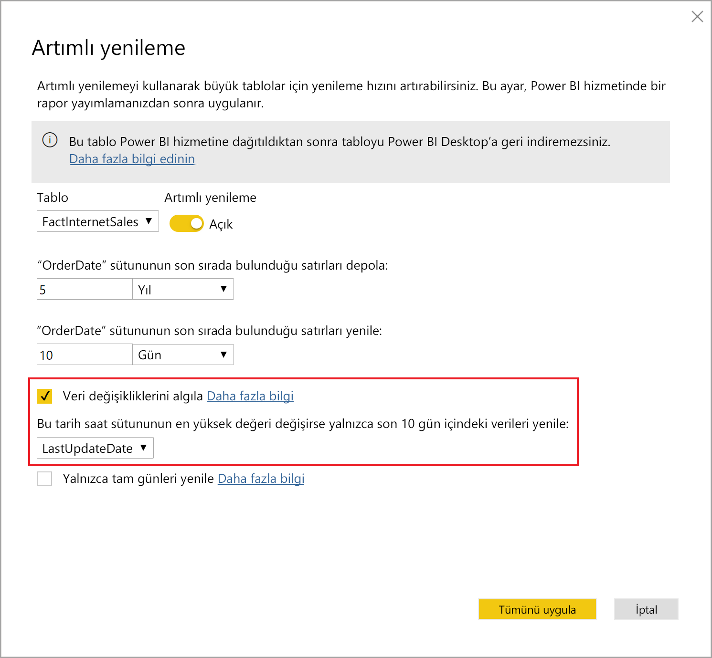
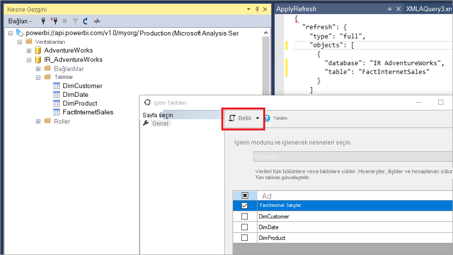
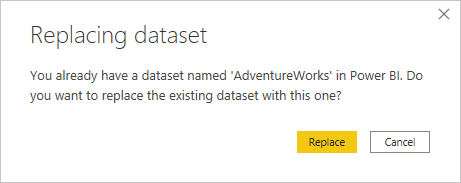

# <a name="incremental-refresh-in-power-bi"></a>Power BI’da artımlı yenileme

Artımlı yenileme, aşağıdaki avantajlarla Power BI'daki çok büyük veri kümelerini etkinleştirir:

> [!div class="checklist"]
> * **Yenilemeler daha hızlıdır** - Yalnızca değişmiş olan verilerin yenilenmesi gerekir. Örneğin, on yıllık bir veri kümesinin yalnızca son beş gününü yenileyin.
> * **Yenilemeler daha güvenilir olur** - Artık geçici kaynak sistemlerine uzun süreli bağlantıların sürdürülmesi gerekmez.
> * **Kaynak tüketimi azaltılır** - Yenilenecek verilerin daha az olması, belleğin ve diğer kaynakların genel tüketimini azaltır.

> [!NOTE]
> Artımlı yenileme şimdi Power BI Pro, Premium ve paylaşılan abonelikler ile veri kümeleri için kullanılabilir.

> [!NOTE]
> Yakın zamanda Power BI Premium, şu anda önizleme aşamasında olan **Premium 2. Nesil** adlı yeni bir Premium sürümünü kullanıma sundu. Premium 2. Nesil, Premium kapasitelerinin yönetimini basitleştirecek ve yönetim yükünü azaltacak. Premium 2. Nesil, yenileme çakışmalarını önlemek amacıyla otomatik ölçeklendirmeyi etkinleştirerek zamanlanmış yenileme özelliğini önemli ölçüde iyileştirir. Daha fazla bilgi için bkz. [Power BI Premium 2. Nesil (önizleme)](service-premium-what-is.md#power-bi-premium-generation-2-preview).


## <a name="configure-incremental-refresh"></a>Artımlı yenilemeyi yapılandırma

Artımlı yenileme ilkeleri, Power BI Desktop’ta tanımlanır ve Power BI hizmetinde yayımlandıktan sonra uygulanır.

### <a name="filter-large-datasets-in-power-bi-desktop"></a>Power BI Desktop’ta büyük veri kümelerini filtreleme

Milyarlarca satır içerebilecek büyük veri modelleri Power BI Desktop modeline sığmayabilir çünkü PBIX dosyası masaüstü bilgisayarda kullanılabilir olan bellek kaynaklarıyla sınırlanmıştır. Bu nedenle genellikle bu tür veri kümeleri içeri aktarmanın ardından filtrelenir. Bu tür filtreleme artımlı yenileme kullanılıp kullanılmadığına göre uygulanır. Artımlı yenileme için Power Query tarih/saat parametreleri kullanılarak filtrelenir.

#### <a name="rangestart-and-rangeend-parameters"></a>RangeStart ve RangeEnd parametreleri

Artımlı yenileme için veri kümeleri ayrılmış, büyük/küçük harfe duyarlı **RangeStart** ve **RangeEnd** adlı Power Query tarih/saat parametreleri kullanılarak filtrelenir. Bu parametreler Power BI Desktop’a aktarılan verileri filtrelemek için ve aynı zamanda Power BI hizmetine yayımlandıktan sonra verileri dinamik olarak aralıklara bölmek için kullanılır. Her bölümü filtrelemek için parametre değerleri hizmet tarafından değiştirilir. Bunları hizmette veri kümesi ayarları içinde ayarlamak gerekmez. Yayımlandıktan sonra parametre değerleri otomatik olarak Power BI hizmeti tarafından geçersiz kılınır.

Parametreleri varsayılan değerlerle tanımlamak için, Power Query Düzenleyicisi’nde **Parametreleri Yönet**’i seçin.



Parametreler tanımlandığında, bir sütun için **Özel Filtre** menü seçeneğini belirterek filtreyi uygulayabilirsiniz.



Sütun değerinin **RangeStart** değerinden *sonra veya eşit* olduğu ve **RangeEnd** değerinden *önce* olduğu satırların filtrelendiğinden emin olun. Diğer filtre birleşimleri satırların çift sayılmasına yol açabilir.



> [!IMPORTANT]
> Sorgularda **RangeStart** veya **RangeEnd** parametresinde eşittir (=) işareti olduğunu ama her ikisinde birden olmadığını doğrulayın. Her iki parametrede de eşittir (=) işareti varsa, bir satır iki bölüm için de koşullara uyabilir ve bu durum modelde yinelenen verilere yol açabilir. Örneğin,  
> \#"Filtrelenen Satırlar" = Table.SelectRows(dbo_Fact, each [OrderDate] **>= RangeStart** and [OrderDate] **<= RangeEnd**) yinelenen veriler oluşması sonucunu verebilir.

> [!TIP]
> Parametrelerin veri türünün tarih/saat olması gerekse de, parametreler veri kaynağının gereksinimleriyle eşleşecek şekilde dönüştürülebilir. Örneğin, aşağıdaki Power Query işlevi bir tarih/saat değerini, veri ambarları için ortak olan *yyyyaagg* biçimindeki bir tamsayı vekil anahtarına benzeyecek şekilde dönüştürür. İşlev, filtre adımı tarafından çağrılabilir.
>
> `(x as datetime) => Date.Year(x)*10000 + Date.Month(x)*100 + Date.Day(x)`

Power Query Düzenleyicisi’nden **Kapat ve Uygula**’yı seçin. Power BI Desktop’ta veri kümesinin bir alt kümesi bulunmalıdır.

#### <a name="filter-date-column-updates"></a>Tarihi sütunu filtre güncelleştirmeleri

Tarih sütunundaki filtre Power BI hizmetinde verileri dinamik olarak aralıklara bölmek için kullanılır. Artımlı yenileme, filtrelenmiş tarih sütununun kaynak sistemde güncelleştirildiği durumları destekleyecek şekilde tasarlanmamıştır. Güncelleştirme, gerçek bir güncelleştirme olarak değil ekleme ve silme olarak yorumlanır. Artımlı aralıkta değil geçmiş aralıkta gerçekleştirilen silme işlemleri seçilmez. Bu durum bölüm anahtarı çakışmaları nedeniyle veri yenileme hatalarına neden olabilir.

#### <a name="query-folding"></a>Sorgu katlama

Yenileme işlemleri için sorgu gönderildiğinde bölüm filtresinin kaynağa gönderilmesi önemlidir. Filtrelemenin gönderilmesi, veri kaynağının sorgu katlama özelliğini desteklemesi gerektiği anlamına gelir. SQL sorgularını destekleyen veri kaynaklarının çoğu sorgu katlamayı da destekler. Öte yandan düz dosyalar, bloblar ve web akışları genellikle bu desteği vermez. Filtrenin veri kaynağı arka ucu tarafından desteklenmediği durumlarda filtre gönderilemez. Böyle durumları karma altyapısı telafi eder ve filtreyi yerel olarak uygular. Bunun için veri kaynağından tam veri kümesinin alınması gerekebilir. Bu da artımlı yenilemenin çok yavaş olmasına neden olabilir ve bu durumda işlem Power BI hizmetinde veya kullanılması durumunda şirket içi veri ağ geçidinde kaynakları tüketebilir.

Her veri kaynağı için farklı sorgu katlama düzeyleri söz konusu olduğundan filtre mantığının kaynak sorgularına dahil edildiğinden emin olmak için bunu doğrulamanız önerilir. Bunu kolaylaştırmak için Power BI Desktop bu doğrulamayı sizin yerinize gerçekleştirmeyi dener. Doğrulanamazsa, artımlı yenileme ilkesi tanımlanırken artımlı yenileme iletişim kutusunda bir uyarı görüntülenir. SQL, Oracle ve Teradata gibi SQL tabanlı veri kaynakları bu uyarıya güvenebilir. Diğer veri kaynakları sorguları izlemeden doğrulama yapamayabilir. Power BI Desktop onaylayamazsa aşağıdaki uyarı görüntülenir. Bu uyarıyı görüyorsanız ve gerekli sorgu katlama işleminin gerçekleşip gerçekleşmediğini denetlemek istiyorsanız Sorgu Tanılama özelliğini kullanabilir veya kaynak veritabanına ulaşan sorguları izleyebilirsiniz.

 

### <a name="define-the-refresh-policy"></a>Yenileme ilkesini tanımlama

Artımlı yenileme, Canlı Bağlantı modelleri dışında tablolar için bağlam menüsünde kullanılabilir.



#### <a name="incremental-refresh-dialog"></a>Artımlı yenileme iletişim kutusu

Artımlı yenileme iletişim kutusu görüntülenir. İletişim durumunu etkinleştirmek için iki durumlu düğmeyi kullanın.


> [!NOTE]
> Tablo için Power Query ifadesi, ayrılmış adlara sahip parametreleri ifade etmezse, iki durumlu düğme devre dışı bırakılır.

Üst bilgi metni aşağıdakileri açıklar:

- Yenileme ilkeleri, Power BI Desktop’ta tanımlanır ve hizmetteki yenileme işlemleri tarafından uygulanır.

- Power BI hizmetinden artımlı yenileme ilkesini içeren PBIX dosyasını indiremezseniz, bu dosya Power BI Desktop’ta açılamaz. Bu gelecekte desteklenebilse de, söz konusu veri kümelerinin çok büyüyeceğini ve tipik bir masaüstü bilgisayarda indirilip açılmasının elverişsiz hale gelebileceğini unutmayın.

#### <a name="refresh-ranges"></a>Yenileme aralıkları

Aşağıdaki örnekte, toplam beş takvim yılı verisine ek olarak geçerli tarihe kadar mevcut yılın verilerini depolayacak ve tam on günlük verileri artımlı olarak yenileyecek bir yenileme ilkesi tanımlanır. Birinci yenileme işlemi, geçmiş verileri yükler. Sonraki yenileme işlemleri artımlı olur ve (günlük olarak çalışacak şekilde zamanlanmışsa) aşağıdaki işlemleri gerçekleştirir:

- Veriler için yeni bir gün ekleme.

- Güncel tarihe kadarki tam on günü yenileme.

- Güncel tarihten beş yıl öncesinden daha eski zamana ait takvim yıllarını kaldırma. Örneğin, güncel tarih 1 Ocak 2019 ise, 2013 yılı kaldırılır.

Power BI hizmetindeki ilk yenilemede beş takvim yılının tamamının içeri aktarılması uzun sürebilir. Sonraki yenilemeler hızlı şekilde tamamlanabilir.



#### <a name="current-date"></a>Geçerli tarih

*Geçerli tarih*, yenileme anındaki sistem tarihini temel alır. Power BI hizmetinde veri kümesi için zamanlanmış yenilemenin etkinleştirilmiş olması durumunda geçerli tarih belirlenirken belirtilen saat dilimi dikkate alınır. Hem el ile çağrılan hem de Power BI hizmeti üzerinden zamanlanmış yenileme işlemleri varsa saat dilimini dikkate alır. Örneğin 20:00 PT (ABD ve Kanada) itibarıyla gerçekleşen ve saat dilimi belirtilmiş olan bir yenileme işlemi, geçerli tarihi GMT (bu durumda bir sonraki gün olacaktır) değil PT olarak kabul eder. [TMSL yenileme komutu](/analysis-services/tmsl/refresh-command-tmsl?view=power-bi-premium-current) gibi, Power BI hizmeti üzerinden çağrılmayan yenileme işlemleri, zamanlanmış yenileme saat dilimini dikkate almaz


> [!NOTE]
> Bu aralıkların tanımı tüm ihtiyaçlarınıza yanıt verebilir; bu durumda doğrudan aşağıdaki yayımlama adımına gidebilirsiniz. Ek açılır pencereler, gelişmiş özellikler içindir.

### <a name="advanced-policy-options"></a>Gelişmiş ilke seçenekleri

#### <a name="detect-data-changes"></a>Veri değişikliklerini algılama

On günlük artımlı yenileme, beş yılın tam yenilemesini yapmaktan çok daha verimlidir. Öte yandan bunu daha da iyi hale getirmek mümkündür. **Veri değişikliklerini algıla** onay kutusunu seçerseniz, yalnızca verilerin değiştiği günleri belirleyip o günleri yenilemek için kullanılan bir tarih/saat sütunu seçebilirsiniz. Bu, genellikle denetim amacıyla, kaynak sistemde bir sütunun var olduğunu varsayar. **Bu sütun, RangeStart/RangeEnd parametreleriyle verileri bölmek için kullanılan sütun olmamalıdır.** Artımlı aralıktaki dönemlerin her biri için bu sütunun maksimum değeri değerlendirilir. Son yenilemeden bu yana değişmemişse dönemin yenilenmesi gerekmez. Örnekte bu, artımlı olarak yenilenen gün sayısını ondan ikiye kadar düşürebilir.



> [!TIP]
> Mevcut tasarım gereği, veri değişikliklerini algılayacak sütunun kalıcı duruma getirilmesi ve önbelleğe alınması gerekir. Kardinalite ve bellek kullanımını azaltmak için aşağıdaki tekniklerden birini dikkate almak isteyebilirsiniz.
>
> Power Query işlevini kullanarak, yenileme anında bu sütunun yalnızca maksimum değerini kalıcı duruma getirin.
>
> Duyarlılığı, yenileme sıklığı gereksinimleriniz için kabul edilebilir bir düzeye indirin.
>
> XMLA uç noktasını kullanarak veri değişikliklerini algılamak için özel bir sorgu tanımlayın ve sütun değerinin olduğu gibi kalıcı hale getirilmesini önleyin. Daha fazla bilgi için veri değişikliklerini algılamaya yönelik aşağıdaki özel sorgulara göz atın.

#### <a name="only-refresh-complete-periods"></a>Yalnızca tam dönemleri yenileme

Yenilemenin her sabah 4:00’da çalıştırılacak şekilde zamanlandığını varsayalım. Bu 4 saat boyunca kaynak sistemde veri görüntülenirse, bunu hesaba katmak istemeyebilirsiniz. Petrol ve doğal gaz endüstrisindeki günlük varil sayısı gibi bazı iş ölçümleri, kısmi günler için bir anlam taşımaz.

Ayın 12. takvim gününde önceki ayın verilerinin onaylandığı bir finansal sistemden verilerin yenilenmesi de başka bir örnek olarak verilebilir. Artımlı aralığı 1 ay olarak ayarlayabilir ve yenilemeyi ayın 12. gününde çalıştırılacak şekilde zamanlayabilirsiniz. Bu seçenek işaretlendiğinde, örneğin, Ocak verileri 12 Şubat’ta yenilenir.


> [!NOTE]
> Hizmetteki yenileme işlemleri, UTC saatine göre çalıştırılır. Bu, geçerlilik tarihini belirleyebilir ve tam dönemleri etkiler. Yenileme işlemi için geçerlilik tarihini geçersiz kılma özelliği eklemeyi planlıyoruz.

## <a name="publish-to-the-service"></a>Hizmette yayımlama

Şimdi modeli yenileyebilirsiniz. İlk yenilemede geçmiş verilerin içeri aktarılması uzun sürebilir. Sonraki yenilemeler artımlı yenilemeyi kullandığından çok daha hızlı olabilir.

## <a name="query-timeouts"></a>Sorgu zaman aşımları

[Yenileme sorunlarını giderme](../connect-data/refresh-troubleshooting-refresh-scenarios.md) makalesinde, Power BI hizmetindeki yenileme işlemlerinin zaman aşımına tabi olduğu açıklanmaktadır. Sorgular, veri kaynağı için varsayılan zaman aşımıyla da sınırlanabilir. Çoğu ilişkisel kaynak, M ifadesindeki zaman aşımlarının geçersiz kılınmasına olanak sağlar. Örneğin, aşağıdaki ifadede zaman aşımını 2 saate ayarlamak için [SQL Server veri erişimi işlevi](/powerquery-m/sql-database) kullanılır. İlke aralıkları tarafından tanımlanan her dönem, komut zaman aşımı ayarını gözlemleyerek bir sorgu gönderir.

```powerquery-m
let
    Source = Sql.Database("myserver.database.windows.net", "AdventureWorks", [CommandTimeout=#duration(0, 2, 0, 0)]),
    dbo_Fact = Source{[Schema="dbo",Item="FactInternetSales"]}[Data],
    #"Filtered Rows" = Table.SelectRows(dbo_Fact, each [OrderDate] >= RangeStart and [OrderDate] < RangeEnd)
in
    #"Filtered Rows"
```

## <a name="xmla-endpoint-benefits-for-incremental-refresh"></a>Artımlı yenileme için XMLA uç noktası avantajları

Premium kapasitedeki veri kümeleri için [XMLA uç noktası](service-premium-connect-tools.md), artımlı yenilemeye yönelik önemli avantajlar sağlayabilen okuma/yazma işlemleri için etkinleştirilebilir. XMLA uç noktası üzerinden yapılan yenileme işlemleri [günlük 48 yenileme işlemiyle](../connect-data/refresh-data.md#data-refresh) sınırlı değildir ve [zamanlanan yenileme zaman aşımı](../connect-data/refresh-troubleshooting-refresh-scenarios.md#scheduled-refresh-timeout) uygulanmaz. Bu sayede bu işlemler artımlı yenileme senaryolarında yararlı olabilir.

### <a name="refresh-management-with-sql-server-management-studio-ssms"></a>SQL Server Management Studio (SSMS) ile yenileme yönetimi

Okuma/yazma özelliği etkin XMLA uç noktası sayesinde SSMS, artımlı yenileme ilkelerinin uygulanması sonucu oluşan bölümleri görüntüleyip yönetmek için kullanılabilir. Bu işlem, tüm geçmiş verileri yenilemek zorunda kalmadan geriye dönük güncelleştirmek yapmak için artımlı aralıkta bulunmayan belirli bir geçmiş bölümü yenilemeye olanak sağlar. Ayrıca geçmiş bölümleri toplu olarak artımlı ekleme/yenileme yoluyla çok büyük veri kümelerinin geçmiş verilerini yüklemek için SSMS’yi de kullanabilirsiniz.


#### <a name="override-incremental-refresh-behavior"></a>Artımlı yenileme davranışını geçersiz kılma

SSMS sayesinde [Tablosal Model Betik Dili (TMSL)](/analysis-services/tmsl/tabular-model-scripting-language-tmsl-reference?view=power-bi-premium-current) ve [Tablosal Nesne Modeli (TOM)](/analysis-services/tom/introduction-to-the-tabular-object-model-tom-in-analysis-services-amo?view=power-bi-premium-current) kullanarak artımlı yenilemeleri çağırma konusunda daha fazla denetime sahip olursunuz. Örneğin SSMS’deki Nesne Gezgini’nde bir tabloya sağ tıklayıp **Tabloyu İşle** menü seçeneğini belirleyin. Ardından bir TMSL yenileme komutu oluşturmak için **Betik** düğmesine tıklayın.



Aşağıdaki parametreler, varsayılan artımlı yenileme davranışını geçersiz kılmak için TMSL yenileme komutuna eklenebilir.

- **applyRefreshPolicy**: Bir tabloda artımlı yenileme ilkesi tanımlanmışsa applyRefreshPolicy, ilkenin uygulanıp uygulanmadığını belirler. İlke uygulanmamışsa, eksiksiz bir işleme işlemi bölüm tanımlarını değiştirmeden bırakır ve tablodaki tüm bölümler tamamen yenilenmiş olur. True varsayılan değerdir.

- **effectiveDate**: Artımlı yenileme ilkesi uygulanmaktaysa geçmiş aralık ve artımlı aralık için sıralı pencere aralıklarını belirlemek amacıyla geçerli tarihi bilmesi gerekir. effectiveDate parametresi geçerli tarihi geçersiz kılmanıza olanak verir. Bu parametre, verilerin artımlı bir şekilde geçmişteki veya gelecekteki bir tarihe kadar yenilendiği (örneğin, gelecek bütçeler) test, tanıtım ve işletme senaryoları için yararlıdır. Varsayılan değer geçerli tarihtir.

```json
{ 
  "refresh": {
    "type": "full",

    "applyRefreshPolicy": true,
    "effectiveDate": "12/31/2013",

    "objects": [
      {
        "database": "IR_AdventureWorks", 
        "table": "FactInternetSales" 
      }
    ]
  }
}
```

TMSL ile varsayılan artımlı yenileme davranışını geçersiz kılma hakkında daha fazla bilgi için bkz. [Yenileme komutu](/analysis-services/tmsl/refresh-command-tmsl?view=power-bi-premium-current).

### <a name="custom-queries-for-detect-data-changes"></a>Veri değişikliklerini algılamak için özel sorgular

Algılanan veri değişiklikleri davranışını geçersiz kılmak için TMSL ve/veya TOM kullanabilirsiniz. Bu yalnızca bellek içi önbellekteki son güncelleştirilen sütunun kalıcı önlemek amacıyla değil, aynı zamanda yalnızca yenilenmesi gereken bölümleri işaretlemek üzere yapılandırma/yönerge tablosunun ETL işlemleri tarafından hazırlandığı senaryoların etkinleştirilmesi için de kullanılabilir. Bu işlem, veri güncelleştirmelerinin ne kadar süre önce yapıldığı fark etmeksizin, yalnızca gerekli aralıkların yenilendiği daha verimli bir artımlı yenileme işlemi oluşmasını sağlar.

pollingExpression parametresinin basit bir M ifadesi veya başka bir M sorgusunun adı olması amaçlanmıştır. Skaler bir değer döndürmelidir ve her bölüm için yürütülür. Döndürülen değer, bir artımlı yenilemenin son kez gerçekleştiği zamandan farklıysa bölüm, tam işleme için işaretlenir.

Aşağıdaki örnek geriye dönük değişikliklere yönelik geçmiş aralığındaki 120 ayın tümünü ele alır. 10 yıl yerine 120 ay belirterek yapılan veri sıkıştırma işlemi çok verimli olmayabilir, ancak geriye dönük değişiklik için tek bir ayın yeterli olacağı durumlarda çok daha maliyetli olabilecek tam bir geçmiş yılı yenileme işleminin önüne geçer.

```json
"refreshPolicy": {
    "policyType": "basic",
    "rollingWindowGranularity": "month",
    "rollingWindowPeriods": 120,
    "incrementalGranularity": "month",
    "incrementalPeriods": 120,
    "pollingExpression": "<M expression or name of custom polling query>",
    "sourceExpression": [
    "let ..."
    ]
}
```

## <a name="metadata-only-deployment"></a>Yalnızca meta veri dağıtımı

Power BI Desktop’taki bir PBIX dosyasının yeni sürümünü Power BI Premium’daki bir çalışma alanına yayımladığınızda, aynı ada sahip başka bir veri kümesi varsa mevcut veri kümesini değiştirmeniz istenir.



Özellikle artımlı yenilemenin olduğu gibi bazı durumlarda veri kümesini değiştirmek istemeyebilirsiniz. Power BI Desktop’taki veri kümesi, hizmettekinden çok daha küçük olabilir. Hizmetteki veri kümesine artımlı yenileme ilkesi uygulandıysa veri kümesinde, küme değiştirildiğinde kaybedilebilecek birkaç yıllık geçmiş veri bulunuyor olabilir. Tüm geçmiş verilerin yenilenmesi saatler sürebilir ve kullanıcılar için sistem kapalı kalma süresine yol açabilir.

Bunun yerine, yalnızca meta veri dağıtımı gerçekleştirmek daha iyi bir seçenektir. Bu işlem, geçmiş verileri kaybetmeden yeni nesnelerin dağıtılmasına olanak verir. Örneğin, birkaç ölçü eklediyseniz verileri yenilemek zorunda kalmadan yalnızca yeni ölçüleri dağıtıp bolca zaman kazanabilirsiniz.

Okuma/yazma için yapılandırıldığında XMLA uç noktası, bu işlemi gerçekleştiren araçlarla uyumluluk sağlar. Örneğin ALM Araç Seti, Power BI veri kümelerine yönelik bir şema ayrıştırma aracıdır ve yalnızca meta verilerin dağıtılması için kullanılabilir.

ALM Araç Seti’nin en son sürümünü [Analysis Services Git deposundan](https://github.com/microsoft/Analysis-Services/releases) indirip yükleyebilirsiniz. Desteklenebilirlik hakkında belge bağlantılarına ve bilgilere Yardım şeridinden ulaşabilirsiniz. Yalnızca meta veri dağıtımı gerçekleştirmek için bir karşılaştırma yapın. Ardından, çalışan Power BI Desktop örneğini kaynak olarak, hizmetteki mevcut veri kümesini de hedef olarak seçin. Görüntülenen farkları değerlendirin ve artımlı yenileme bölümleri içeren tablonun güncelleştirmesini atlayın veya Seçenekler iletişim kutusunu kullanarak tablo güncelleştirmelerine yönelik parçaları koruyun. Hedef modelin bütünlüğünü sağlamak için seçimi doğrulayın, ardından güncelleştirin.


## <a name="see-also"></a>Ayrıca bkz.

[XMLA uç noktasıyla veri kümesi bağlantısı](service-premium-connect-tools.md)   
[Yenileme ile ilgili sorun giderme senaryoları](../connect-data/refresh-troubleshooting-refresh-scenarios.md)


Power BI, aşağıdaki iyileştirmelerle Power BI Premium deneyimini geliştiren bir önizleme teklifi olarak Power BI Premium 2. Nesil’i kullanıma sundu:
* Performans
* Kullanıcı başına lisanslama
* Daha yüksek ölçek
* İyileştirilmiş ölçümler
* Otomatik ölçeklendirme
* Azaltılmış yönetim yükü

Power BI Premium 2. Nesil hakkında daha fazla bilgi için bkz. [Power BI Premium 2. Nesil (önizleme)](service-premium-what-is.md#power-bi-premium-generation-2-preview).