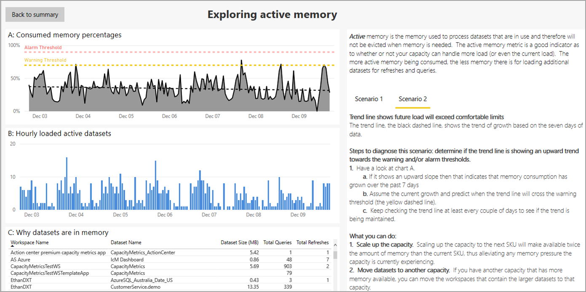
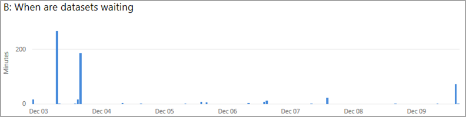

# Power BI Premium Metrics uygulaması

**Power BI Premium Metrics uygulamasını**, Power BI Premium aboneliğinizin durumunu ve kapasitesini yönetmek için kullanabilirsiniz. Bu uygulamayla, yöneticiler uygulamanın **Kapasite durumu merkezi**’ni kullanarak premium kapasitelerinin durumunu izleyen göstergeleri görebilir ve bunlarla etkileşimli çalışabilir. Metrics uygulaması **Kapasite Durumu Merkezi** adlı bir giriş sayfasından ve üç önemli ölçümün ayrıntılarından oluşur:

* Etkin bellek
* Sorgu beklemeleri
* Yenileme beklemeleri

Aşağıdaki bölümlerde giriş sayfası ve üç ölçüm raporu sayfası ayrıntılarıyla açıklanır. 

> [!IMPORTANT]
> Power BI Premium kapasitenizde performans ve güvenilirlik sorunlarına neden olan yüksek kaynak kullanımı sorunu yaşanıyorsa sorunu tanımlayıp çözmek için bildirim e-postaları alabilirsiniz. Bu, aşırı yüklenmiş kapasitelerde sorun gidermeye yönelik basitleştirilmiş bir yöntemdir. Daha fazla bilgi için bkz. [Kapasite ve güvenilirlik bildirimleri](service-interruption-notifications.md#capacity-and-reliability-notifications).

## Premium kapasite durumu merkezi

**Power BI Premium Metrics uygulamasını** açtığınızda Power BI Premium kapasitenizin durumuna genel bir bakış sağlayan **Kapasite durumu merkezi** gösterilir.

Kuruluşunuzun birden çok Premium aboneliği olması durumunda, giriş sayfasında görüntülemek istediğiniz Power BI Premium kapasiteyi seçebilirsiniz. Premium kapasiteyi görüntülemek için sayfanın üst kısmındaki **Ölçümlerini görmek için bir kapasite seçin** adlı açılan listesi seçin.

Üç KPI, bunların her birine uygulanan ayarlar temelinde, seçilen Premium kapasitenin geçerli durumunu gösterir. 

KPI’ler hakkındaki özel değerleri görüntülemek için her KPI’nin altındaki **Araştır** düğmesini seçin; KPI’nin ayrıntılar sayfası görüntülenir. Aşağıdaki bölümlerde KPI’ler ve sayfalarında sağlanan ayrıntılar açıklanır.

## Etkin bellek ölçümü

**Etkin bellek** ölçümü *kapasite planlaması* kategorisinde yer alır. Bu kategori kullanım için kapasitenizin kaynak tüketimini değerlendirmenizi, dolayısıyla kapasite ölçeğini planlarken gereken kapasiteyi ayarlayabilmenizi sağlayan iyi bir göstergedir. 

**Etkin bellek** şu anda kullanımda olan, dolayısıyla bellek gerektiğinde çıkarılmayacak veri kümelerini işlemek için kullanılan bellektir. Etkin bellek ölçümü kapasitenizin ek yükü işleyip işleyemeyeceğini ya da geçerli yükün kapasitesine yaklaşıldığını veya bu kapasitenin aşıldığını gösterir. Etkin belleğin şu anda tüketiliyor olması, ek yenileme ve sorguları desteklemek için kullanılabilecek daha az bellek olduğu anlamına gelir. 

**Etkin bellek** KPI kapasitenin etkin belleğinin 50 kez %70 eşiğini geçme durumuyla kaç kez karşılaştığını ölçer (işaretçi son yedi günün %30’una ayarlanmıştır); bu ölçüm kapasitenin sorgularda kullanıcının performans sorunlarıyla karşılaşmaya başlayabileceği bir noktaya yaklaştığını gösterir.

Bu bölümde gösterilen ölçer görseli raporun son yenilenmesinden bu yana geçen son yedi günde kapasitenin %70 eşiğini dört kez aştığını, saatlik demetlere bölünmüş olarak ortaya koymaktadır. Ölçerin en yüksek değeri olan 168, saat cinsinden son yedi günü temsil eder.

Etkin bellek KPI’nin ayrıntılarını öğrenmek için **Araştır** düğmesine tıklayarak ayrıntılı ölçümlerinin belirli görselleştirmelerini sağlayan rapor sayfasına bakabilirsiniz. Ayrıca bu sayfanın sağ sütununda bir sorun giderme kılavuzu da gösterilir. 

İki senaryo açıklanmıştır; rapor sayfasında **Senaryo 1** veya **Senaryo 2**’yi seçerek bunları görüntüleyebilirsiniz. 

Her senaryoyla ilişkilendirilmiş sorun giderme kılavuzları ölçümlerin ne anlama geldiğine ilişkin ayrıntılı açıklamalar sağlar. Böylelikle kapasitenin durumunu ve varsa sorunları azaltmak için ne yapılabileceğini daha iyi anlayabilirsiniz. 

Bu iki senaryo aşağıdaki bölümlerde açıklanmıştır.

### Senaryo bir - geçerli yük fazla büyük 

Kapasitenin iş yüklerini tamamlamasına yetecek kadar bellek olup olmadığını saptamak için sayfadaki ilk görsele başvurun: **A: Tüketilen Bellek Yüzdeleri**, şu anda etkin olarak işlenen ve bu nedenle çıkarılamayacak olan veri kümelerinin tükettiği belleği görüntüler.

Kırmızı noktalı çizgiyle gösterilen alarm eşiği %90 bellek tüketimi durumlarına işaret eder.

Sarı noktalı çizgiyle gösterilen uyarı eşiği %70 bellek tüketimi durumlarına işaret eder. 

Siyah noktalı çizgi, grafiğin zaman çizelgesi boyunca geçerli kapasitenin bellek kullanımına dayanarak bellek kullanımının eğilim çizgisini gösterir.

Etkin belleğin alarm eşiğinin (kırmızı noktalı çizgi) ve bellek eğilim çizgisinin (siyah noktalı çizgi) üzerine çıktığı durumlar bellek kapasitesi baskısı olduğunu gösterir; bu süre boyunca başka veri kümelerinin belleğe yüklenmesi büyük olasılıkla engellenir. 

Böyle durumlarla karşılaştığınızda, şu anda neden bu kadar sıklıkta bu kadar fazla bellek tüketildiğini ve yükün nasıl dengeleneceğini veya iyileştirileceğini ya da kapasitenin ölçeğini artırmanın gerekip gerekmediğini daha iyi saptamak için sayfadaki diğer grafikleri dikkatle gözden geçirmelisiniz. 

Sayfadaki diğer görsel olan **B: Saatlik yüklenen etkin veri kümeleri**, saatlik demetler halinde belleğe yüklenmiş olan veri kümelerinin maksimum sayısını görüntüler. 

Üçüncü görsel olan **C: Veri kümeleri neden bellekte**, veri kümesini çalışma alanı adı, veri kümesi adı, bellekte veri kümelerinin sıkıştırılmamış boyutuna göre listeleyen ve belleğe neden yüklendiğini açıklayan (yenileniyor, sorgulandı veya her ikisi gibi) bir tablodur.

#### Senaryo bir için tanılama

Tutarlı yüksek bellek kullanımı, şu anda etkin bir şekilde kullanılan veri kümelerini çıkarmaya zorlayabilir veya yeni veri kümelerinin yüklenmesini engelleyebilir. Aşağıdaki adımlar sorunları tanılamanıza yardımcı olabilir

1. *A: Tüketilen bellek yüzdeleri* grafiğine bakın

    **a.** Grafik A’da alarm eşiğinin (%90) birçok kez ve/veya birbirini izleyen saatlerde aşıldığını gösteriyorsa, kapasiteniz yetersiz bellek durumuyla fazla sık karşılaşıyor demektir. Aşağıdaki grafikte uyarı eşiğinin (%70) dört kez aşıldığını görebiliriz.

    

    **b.** *B: Saatlik yüklenen etkin veri kümeleri*, saatlik demetler halinde belleğe yüklenmiş olan benzersiz veri kümelerinin maksimum sayısını gösterir. Görselde bir çubuk seçildiğinde veri kümelerinin bellek görselinde olma nedenlerine çapraz filtre uygulanır.  

         

    **c.** Belleğe yüklenen veri kümelerinin listesini görmek için **Veri kümeleri neden bellekte** tablosuna başvurun. En fazla bellek kullanan veri kümelerini vurgulamak için *Veri Kümesi Boyutu (MB)* alanına göre sıralayın. Kapasite işlemleri *etkileşimli* veya *arka plan* olarak sınıflandırılır. Etkileşimli işlemler isteklerin işlenmesini ve kullanıcı etkileşimlerine (filtreleme ve Soru-Cevap sorgulama gibi) yanıt verilmesini içerir. Toplam sorgu sayısı ve toplam yenileme sayısı, veri kümesinde ağır etkileşimli işlemlerin mi (sorgular) yoksa arka plan işlemlerinin mi (yenilemeler) gerçekleştirildiğine ilişkin bir fikir sağlar. Mümkün olan en iyi kullanıcı deneyimini sağlamak için etkileşimli işlemlerin her zaman arka plan işlemlerinden daha öncelikli olduğunun anlaşılması önemlidir. Kaynaklar yetersizse arka plan işlemleri kuyruğa eklenir ve kaynaklar serbest kaldığında işlenir. Veri kümesi yenilemeleri ve yapay zeka işlevleri gibi arka plan işlemleri, işlemin ortasında Power BI hizmeti tarafından durdurulabilir ve kuyruğa eklenebilir.
    
      

#### Senaryo bir için düzeltmeler

Senaryo bir ile ilişkilendirilmiş sorunları düzeltmek için aşağıdaki adımları uygulayabilirsiniz:

1. **Kapasitenin ölçeğini artırın** - Kapasitenin ölçeği bir sonraki SKU’ya artırıldığında geçerli SKU’nun iki katı kadar bellek miktarı kullanıma sunulduğundan, kapasitede şu anda yaşanan bellek baskısı hafifletilir.

2. **Veri kümelerini başka bir kapasiteye taşıyın** - Daha fazla kullanılabilir belleğe sahip başka bir kapasiteniz varsa, büyük veri kümelerini içeren çalışma alanlarını o kapasiteye taşıyabilirsiniz.

### Senaryo iki - yük gelecekte sınırları aşacak

Kapasitenin iş yüklerini tamamlamasına yetecek kadar bellek olup olmadığını saptamak için sayfadaki üst kısmında yer alan **A: Tüketilen Bellek Yüzdeleri**, görseline başvurabilirsiniz. Bu görsel şu anda etkin olarak işlenen ve bu nedenle çıkarılamayacak olan veri kümelerinin tükettiği belleği temsil eder. Siyah noktalı çizgi eğilimleri vurgular. Bellek baskısıyla karşılaşılan kapasitede aynı görsel bellek eğilim çizgisinin (siyah noktalı çizgi) açıkça yukarı doğru çıktığını gösterecektir. Bunun anlamı, zamanın bu noktasında ek veri kümelerini belleğe yüklemenin büyük olasılıkla engellendiğidir. Siyah noktalı eğilim çizgisi yedi günlük verilere dayanarak büyüme eğilimini gösterir. 

#### Senaryo iki için tanılama

Senaryo iki’yi tanılamak için eğilim çizgisinin yukarıya, uyarı ve alarm eşiklerine doğru bir eğilim gösterip göstermediğini saptayın. 

1. Şu grafiğe bakın: **Grafik A:**

    

    **a.** Grafikte yukarı doğru bir eğim gösteriliyorsa, bellek tüketimi son yedi günde artmış demektir.

    **b.** Geçerli büyümeyi düşünerek eğilim çizgisinin uyarı eşiğini (sarı noktalı çizgi) ne zaman geçeceğini tahmin edin.

    **c.** Eğilimin devam edip etmediğini görmek için en azından iki günde bir eğilim çizgisini gözden geçirmeye devam edin.

#### Senaryo iki için düzeltmeler

Senaryo iki ile ilişkilendirilmiş sorunları düzeltmek için aşağıdaki adımları uygulayabilirsiniz:

1. **Kapasitenin ölçeğini artırın** - Kapasitenin ölçeği bir sonraki SKU’ya artırıldığında geçerli SKU’nun iki katı kadar bellek miktarı kullanıma sunulduğundan, kapasitede şu anda yaşanan bellek baskısı hafifletilir.

2. **Veri kümelerini başka bir kapasiteye taşıyın** - Daha fazla kullanılabilir belleğe sahip başka bir kapasiteniz varsa, büyük veri kümelerini içeren çalışma alanlarını o kapasiteye taşıyabilirsiniz.

## Sorgu bekleme ölçümü

**Sorgular** kategorisi kullanıcıların yavaş yanıt veren veya yanıt vermeyi durduran rapor görselleriyle karşılaşıp karşılaşmayacağını gösterir. **Sorgu beklemeleri** sorgunun tetiklenmesinden yürütülmeye başlamasına kadar geçen süredir. Bu KPI seçilen kapasitedeki sorguların %25’inde veya daha çoğunda sorgunun yürütülmesi için 100 milisaniye beklenip beklenmediğini ölçer. Sorgu beklemeleri, tüm bekleyen sorguların yürütülmesi için yeterli kullanılabilir CPU olmadığında ortaya çıkar. 

Bu görseldeki ölçer raporun son yenilenmesinin ardından geçen yedi gün boyunca sorguların %17,32’sinin 100 milisaniyeden fazla beklediğini gösteriyor. 

Sorgu beklemeleri KPI’nin ayrıntılarını öğrenmek için **Araştır** düğmesine tıklayarak uygun ölçümlerin görsellerini içeren rapor sayfasını ve sayfanın sağ sütununda sorun giderme kılavuzunu görüntüleyin. Sorun giderme senaryosunun iki senaryosu vardır. Senaryolardan her biri ölçümün ayrıntılı açıklamalarını, kapasitenin durumunu ve sorunu hafifletmek için neler yapabileceğinizi gösterir.

Aşağıdaki bölümlerde sırasıyla iki sorgu beklemeleri senaryosunu da anlatacağız.

### Senaryo bir - uzun süre çalışan sorgular CPU’yu tüketiyor

Senaryo bir’de uzun süre çalışan sorgular çok fazla CPU kullanıyor. 

Düşük rapor performansının aşırı yüklenen kapasiteden mi yoksa yanlış tasarlanmış veri kümesi veya rapordan mı kaynaklandığını araştırabilirsiniz. Uzun süre çalışan sorgular, yürütmesini tamamlamanın 10 saniyeden uzun sürdüğü sorgular olarak tanımlanır ve sorgunun uzun süre çalışmasının çeşitli nedenleri vardır. Örneğin veri kümesinin boyutu ve karmaşıklığı ile sorgu karmaşıklığı, sorgunun uzun süre çalışmasının olası nedenlerinden yalnızca birkaçıdır. 

Rapor sayfasında aşağıdaki görseller görüntülenir: 

* Üstte yer alan **A: Uzun bekleme süreleri** tablosunda bekleyen sorguların bulunduğu veri kümeleri listelenir. 
* **B: Saatlik uzun bekleme süresi dağılımları**, uzun bekleme sürelerinin dağılımını gösterir. 
* **C: Saatlik uzun sorgu sayıları** başlıklı grafikte yürütülmüş olan uzun çalışan sorguların saatlik demetler halinde sayısı görüntülenir.
* Son görsel olan **D: Uzun süre çalışan sorgular** tablosunda uzun süre çalışan sorgular ve onların istatistikleri listelenir.

Sorgu bekleme sürelerini tanılamak ve gidermek için izleyebileceğiniz adımlar vardır ve bunlar aşağıda açıklanmıştır.

#### Senaryo bir için tanılama

İlk olarak sorguların uzun süre çalışma durumunun sorgularınız beklerken mi gerçekleştiğini saptayın. 

100 ms’den fazla bekleyen sorguların sayısını gösteren **Grafik B**’ye bakın. Yüksek bekleme sayısı gösteren sütunlardan birini seçin.

Uzun bekleme süreleri içeren bir sütuna tıkladığınızda, aşağıdaki resimde gösterildiği gibi **Grafik C** bu süre içinde yürütülen ve uzun süre çalışan sorguların sayısını gösterecek şekilde filtrelenir:

Buna ek olarak **Grafik D** de seçilen zaman aralığı içinde uzun süre çalışmış olan sorgular gösterilecek şekilde filtrelenir.

#### Senaryo bir için düzeltmeler

Senaryo bir’deki sorunları gidermek için izleyebileceğiniz adımlar şunlardır:

1. **Raporları ve veri kümelerini iyileştirmek için PerfAnalyzer çalıştırın** - Raporlar için performans analizi, her görselin ne kadar sürede yenilendiği ve zamanın nereye harcandığı da dahil olmak üzere sayfadaki her etkileşimin etkisini gösterir.

2. **Kapasitenin ölçeğini artırın** - Kapasitenin ölçeği bir sonraki SKU’ya artırıldığında kullanılabilir CPU miktarı iki katına çıktığından, sorguların uzun süre çalışmasına neden olabilen CPU baskısı hafifletilir.

3. **Veri kümelerini başka bir kapasiteye taşıyın** - Daha fazla kullanılabilir CPU’ya sahip başka bir kapasiteniz varsa, bekleyen sorguların bulunduğu veri kümelerini içeren çalışma alanlarını o kapasiteye taşıyabilirsiniz.

### Senaryo iki - çok fazla sorgu

Senaryo iki’de çok fazla sorgu yürütülmektedir.

Yürütülecek sorguların sayısı kapasitenin sınırlarını aştığında, sorguları yürütmek için gereken kaynaklar kullanılabilir duruma gelene kadar sorgular kuyruğa alınır. Kuyruğun boyutu çok fazla büyürse, sonunda söz konusu kuyruktaki sorgular 100 milisaniyeden daha fazla beklemek zorunda kalabilir.

#### Senaryo iki için tanılama

**Tablo A**’dan bekleme süresi oranı yüksek bir veri kümesi seçin.

Siz uzun bekleme süresi olan bir veri kümesi seçtikten sonra, **Grafik B** söz konusu veri kümesindeki sorgular için son yedi gündeki bekleme süresi dağılımlarını gösterecek şekilde filtrelenir. Sonra **Grafik B**’deki sütunlardan birini seçin.

Ardından **Grafik C**, kuyruğun Grafik B’den seçildiği sıradaki uzunluğunu gösterecek şekilde filtrelenir.

Kuyruğun uzunluğu 20 eşiğini aştıysa, aynı anda yürütülmeye çalışılan sorgu sayısı çok fazla olduğundan büyük olasılıkla seçilen veri kümesindeki sorgular geciktirilir.

#### Senaryo iki için düzeltmeler

Senaryo iki ile ilişkilendirilmiş sorunları düzeltmek için aşağıdaki adımları uygulayabilirsiniz:

1. **Kapasitenin ölçeğini artırın** - Kapasitenin ölçeği bir sonraki SKU’ya artırıldığında geçerli SKU’nun iki katı kadar bellek miktarı kullanıma sunulduğundan, kapasitede şu anda yaşanan bellek baskısı hafifletilir.

2. **Veri kümelerini başka bir kapasiteye taşıyın** - Daha fazla kullanılabilir belleğe sahip başka bir kapasiteniz varsa, büyük veri kümelerini içeren çalışma alanlarını o kapasiteye taşıyabilirsiniz.

## Yenileme beklemeleri ölçümü

**Yenileme beklemeleri** ölçümü kullanıcıların eski rapor verileriyle karşılaşabileceği durumlarla ilgili içgörü sağlar. **Yenileme beklemeleri**, belirli bir veri yenilemesinin isteğe bağlı veya zamanlanmış olarak tetiklendiği zamandan başlayarak, yürütülmeden önce beklediği süredir. Bu KPI bekleyen yenileme isteklerinin %10’unun veya daha fazlasının 10 dakika veya daha uzun süre bekleyip beklemediğini gösterir. Bekleme durumları genellikle kullanılabilir belleğin veya CPU’nun yetersiz olduğu zamanlarda yaşanır.

Bu ölçer son rapor yenilemesinden sonraki yedi gün içinde yenilemelerden %3,18’inin 10 dakikadan fazla beklediğini göstermektedir. 

**Yenileme beklemeleri** KPI’nin ayrıntılarını öğrenmek için **Araştır** düğmesine tıklayın. Ölçümleri ve rapor sayfasının sağ sütununda sorun giderme kılavuzunu içeren bir sayfa görüntülenir. Kılavuz sayfadaki ölçümler hakkında ayrıntılı açıklamalar sağlar, ayrıca kapasitenin durumunu ve sorunları gidermek için neler yapabileceğinizi anlamanıza yardımcı olur.

İki senaryo açıklanmıştır; rapor sayfasında Senaryo 1 veya Senaryo 2’yi seçerek bunları görüntüleyebilirsiniz. Aşağıdaki bölümlerde sırasıyla iki senaryoyu da anlatacağız.

### Senaryo bir - bellek yetersiz

Senaryo bir’de veri kümesini yüklemek için yeterli bellek yoktur. Yetersiz bellek koşullarında yenilemenin azaltılmasıyla sonuçlanan iki durum vardır:

1. Veri kümesini yüklemek için bellek yeterli değil.
2. Daha yüksek öncelikli bir işlemden dolayı yenileme iptal edildi. 

Veri kümelerini yükleme önceliği şöyledir:

1. Etkileşimli Sorgu
2. İsteğe bağlı yenileme
3. Zamanlanmış yenileme

Etkileşimli sorguda veri kümesini yüklemek için yeterli bellek yoksa, zamanlanan yenilemeler durdurulur ve yeterli bellek kullanılabilir duruma gelene kadar bu yenilemelerin veri kümeleri kaldırılır. Bu işlem yeterli belleğin serbest bırakılmasını sağlamazsa, isteğe bağlı yenilemeler durdurulur ve onların veri kümeleri kaldırılır.

#### Senaryo bir için tanılama

Senaryo bir’de tanılama için önce azaltmanın yetersiz bellekten kaynaklanıp kaynaklanmadığını saptayın. Bu işlemin adımları aşağıda verilmiştir.

1.    **Tablo A**’da ilgilendiğiniz veri kümesini tıklayarak seçin: 

    

    a. **Tablo A**’da veri kümesi seçildiğinde **Grafik B** beklemenin ne zaman oluştuğunu gösterecek şekilde filtrelenir.

    

    b. Ardından **Grafik C** herhangi bir azaltmayı gösterecek şekilde filtrelenir (sonraki adımda açıklanmıştır). 

2. Artık filtrelenmiş olan **Grafik C**’deki sonuçları gözden geçirin. Grafik, veri kümesi beklerken bellek yetersiz azaltması oluştuğunu gösteriyorsa, veri kümesinin beklemesinin nedeni yetersiz bellek koşullarıdır.

    

3. Son olarak, gerçekleşen yenilemelerin türünü (zamanlanmış veya isteğe bağlı) gösteren **Grafik D**’yi denetleyin. Azaltmanın nedeni aynı anda gerçekleşen isteğe bağlı yenilemeler olabilir.

    

#### Senaryo bir için düzeltmeler

Senaryo bir ile ilişkilendirilmiş sorunları düzeltmek için aşağıdaki adımları uygulayabilirsiniz:

1. **Kapasitenin ölçeğini artırın** - Kapasitenin ölçeği bir sonraki SKU’ya artırıldığında geçerli SKU’nun iki katı kadar bellek miktarı kullanıma sunulduğundan, kapasitede şu anda yaşanan bellek ve CPU baskısı hafifletilir.

2. **Veri kümelerini başka bir kapasiteye taşıyın** - Bekleme sürelerinizin nedeni bellek baskısıysa ve daha fazla kullanılabilir belleğe sahip başka bir kapasiteniz varsa, bekleyen veri kümelerini içeren çalışma alanlarını o kapasiteye taşıyabilirsiniz.

3. **Zamanlanan yenilemeleri yayın** - Yenilemelerin yayılması çok fazla yenilemenin eşzamanlı olarak yürütülmeye çalışılmasını önlemeye yardımcı olur.

### Senaryo iki - yenileme için CPU yeterli değil

Senaryo iki’de yenilemeyi gerçekleştirmek için yeterli kullanılabilir CPU yok. 

Ayrılmış kapasiteler için Power BI eşzamanlı olarak gerçekleşebilecek yenileme sayısını sınırlar. Bu sayı, arka uç çekirdeklerinin sayısı x 1,5’e eşittir. Örneğin dört arka uç çekirdeği olan bir P1 ayrılmış kapasitesi eşzamanlı olarak 6 yenileme çalıştırabilir. Eşzamanlı yenileme sayısı üst sınırına ulaşıldığında, diğer yenilemeler yürütülen yenilemelerin bitmesini bekler.

#### Senaryo iki için tanılama

Senaryo iki’de tanılama yapmak için önce azaltmanın eşzamanlı yenileme sayısı üst sınırına ulaşılmasından mı kaynaklandığını saptayın. Bu işlemin adımları aşağıda verilmiştir.

1.    **Tablo A**’da ilgilendiğiniz veri kümesini tıklayarak seçin: 

    

    a. **Tablo A**’da veri kümesi seçildiğinde **Grafik B** beklemenin ne zaman oluştuğunu gösterecek şekilde filtrelenir.

    

    b. Ardından **Grafik C** herhangi bir azaltmayı gösterecek şekilde filtrelenir (sonraki adımda açıklanmıştır). 

2. Artık filtrelenmiş olan **Grafik C**’deki sonuçları gözden geçirin. Grafik, veri kümesi beklerken oluşan *en fazla eşzamanlılık* değerini gösteriyorsa veri kümesinin beklemesinin nedeni kullanılabilir CPU’nun yeterli olmamasıdır.

    

3. Son olarak, gerçekleşen yenilemelerin türünü (zamanlanmış veya isteğe bağlı) gösteren **Grafik D**’yi denetleyin. Azaltmanın nedeni aynı anda gerçekleşen isteğe bağlı yenilemeler olabilir.

    

#### Senaryo iki için düzeltmeler

1. **Kapasitenin ölçeğini artırın** - Kapasitenin ölçeği bir sonraki SKU’ya artırıldığında geçerli SKU’nun iki katı kadar bellek miktarı ve geçerli SKU’dan iki kat fazla eşzamanlı yenileme sayısı kullanıma sunulduğundan, kapasitede şu anda yaşanan bellek ve CPU baskısı hafifletilir.

2. **Veri kümelerini başka bir kapasiteye taşıyın** - Bekleme sürelerinizin nedeni eşzamanlılık sayısı üst sınırına ulaşılmasıysa ve daha fazla kullanılabilir eşzamanlılığa sahip başka bir kapasiteniz varsa, bekleyen veri kümelerini içeren çalışma alanlarını o kapasiteye taşıyabilirsiniz.

3. **Zamanlanan yenilemeleri yayın** - Yenilemelerin yayılması çok fazla yenilemenin eşzamanlı olarak yürütülmeye çalışılmasını önlemeye yardımcı olur.

## Sonraki adımlar

* [Power BI Premium nedir?](service-premium-what-is.md)
* [Power BI Premium sürüm notları](../service-premium-release-notes.md)
* [Microsoft Power BI Premium teknik incelemesi](https://aka.ms/pbipremiumwhitepaper)
* [Planning a Power BI Enterprise Deployment (Power BI Kuruluş Dağıtımı Planlama) teknik incelemesi](https://aka.ms/pbienterprisedeploy)
* [Uzatılmış Pro Deneme Sürümünü etkinleştirme](../service-extended-pro-trial.md)
* [Power BI Embedded SSS](../developer/embedded/embedded-faq.md)

Başka bir sorunuz mu var? [Power BI Topluluğu'na sorun](https://community.powerbi.com/)