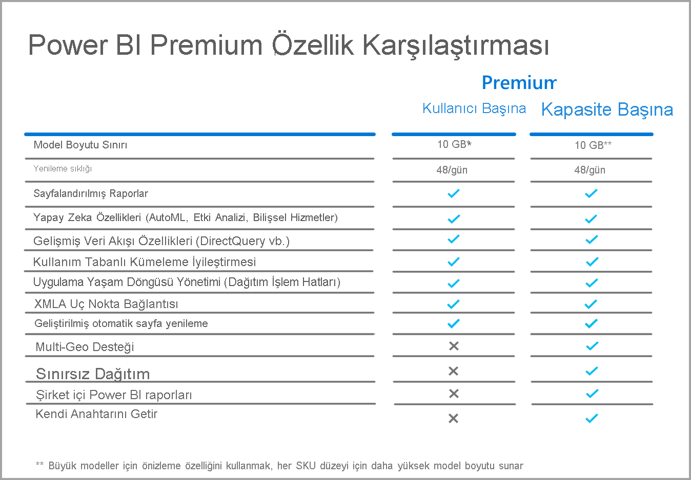

# Kullanıcı Başına Power BI Premium Hakkında SSS (önizleme)

**Kullanıcı Başına Power BI Premium**, kuruluşların Premium özellikleri kullanıcı başına lisanslamalarına olanak verir. Kullanıcı Başına Premium (PPU) tüm Power BI Pro lisansı özelliklerine sahip olmanın yanı sıra, sayfalandırılmış raporlar, yapay zeka ve yalnızca Premium abonelere sunulan diğer özellikler gibi olanaklar ekler. 

Bu makalede, Kullanıcı Başına Premium lisanslaması hakkında sık sorulan sorulara ilişkin yanıtlar verilmektedir. Kullanıcı Başına Premium lisanslaması önizleme süresini tamamlayıp genel kullanılabilirlik (GA) aşamasına sunulduğunda, bu makaledeki tüm bilgiler değişikliğe ve iyileştirmeye tabi olacaktır. 

Bu makalede, soru ve yanıtlar aşağıdaki kategorilere göre gruplandırılır:
* Genel sorular 
* Yönetim soruları 
* Son kullanıcı deneyimi hakkındaki sorular 

## Genel sorular

1.  **Kullanıcı Başına Premium (PPU) nedir?** 

    Kullanıcı Başına Premium (PPU), premium özelliklerini kullanıcı başına lisanslamaya yönelik yeni bir yöntemdir. Sayfalandırılmış raporlar, yapay zeka ve şu anda yalnızca Premium’da kullanıma sunulan diğer özelliklere ek olarak, tüm Power BI Pro lisansı özelliklerini içerir.

2.  **Ne zaman satın alınabilir?**

    Geliştirme aşaması şu anda devam ediyor ve PPU’nun 2021’e kadar genel kullanılabilirlik aşamasına sunulmasını beklemiyoruz. Genel kullanılabilirlik aşamasına kadar, genel önizleme tüm kuruluşlar tarafından ücretsiz kullanılabilir.

3.  **Hem Power BI Pro hem de Kullanıcı Başına Premium lisansı almam gerekiyor mu?**

    Hayır, Kullanıcı Başına Premium lisansıyla tüm Power BI Pro özelliklerine sahip olabilirsiniz.

4.  **Nasıl ücretsiz deneme alabilirim?**

    Ürün içi ücretsiz deneme sürümü ve Microsoft 365 ile sunulan bir ücretsiz deneme sürümü vardır. Kuruluşlarının PPU’yu kısıtlamaması şartıyla tüm kullanıcılar bir çalışma alanında Kullanıcı Başına Premium’u açarak ürün içi ücretsiz deneme sürümüne erişebilir. Microsoft 365 ile sunulan ücretsiz deneme sürümü, Power BI Pro ücretsiz denemelerinin başlatılması gibi, portal aracılığıyla etkinleştirilebilir.  
    
5.  **İlk deneme sürümümün süresi doldu ancak henüz önizleme aşamasındayız.  Önizleme döneminde kullanıcı başına Premium aboneliğimi nasıl uzatabilirim/yenileyebilirim?**

    Ürün içi deneme sürümünü kullanan müşteriler, deneme süreleri sona erdikten sonra portalın sağ üst köşesinde bulunan profil simgesine tıklayarak yeni bir deneme sürümü başlatabilir.  Deneme sürümüne yeniden kaydolmanızı sağlayacak bir seçenek göreceksiniz.  Bu seçenek yeni bir 60 günlük deneme süresi başlatır.  Bu seçenek önizleme süresi boyunca sunulmaya devam edecektir.  
    
    Microsoft 365 aracılığıyla sunulan deneme sürümünü kullanan müşterilerin kiracı yöneticileri ilk 30 günlük deneme sürümünü bir 30 gün daha uzatabilir. Deneme süresi en fazla bu kadar uzatılabilir.

6.  **Kullanıcı Başına Premium’da hangi özellikler mevcuttur?**

    Özellik karşılaştırma kılavuzu aşağıda verilmiştir:    

    

7.  **Kuruluşumun zaten Power BI Premium lisansı var. Kapasitemde içerik yayımlamak için şimdi Kullanıcı Başına Premium lisansı mı almam gerekiyor?**
    
    Kuruluşunuz Premium kapasitesini Kullanıcı Başına Premium lisanslarıyla sunmayı tercih edebilir, ancak mevcut kapasitelerde içerik yayımlamak için Kullanıcı Başına Premium lisansı gerekmez.  

## Yönetim soruları

1.  **Kiracım için Kullanıcı Başına Premium’u (PPU) nasıl etkinleştirebilirim?**
    
    Kiracı için bir PPU lisansı sağlandığında, PPU özelliklerini açtığınız tüm çalışma alanlarında kullanabilirsiniz. Önizleme aşamasında, aşağıdaki resimde gösterildiği gibi Kullanıcı Başına Premium öğesini seçerek kapasite açılır menüsünde Kullanıcı Başına Premium özelliklerini etkinleştirmeniz yeterlidir.

    

2.  **Bu bir Premium kapasite gibi mi çalışıyor? Özellikleri açıp kapatabilir miyim?**

    Hayır, PPU için bellek veya CPU yönetimi yoktur. Power BI Pro’nun şu anda çalıştığı gibi çalışır. Kiracı yöneticiniz belirli özellik ayarlarını yönetebilir, ancak panoları kapatamadığınız gibi, sayfalandırılmış raporlar gibi iş yüklerini devre dışı bırakamazlar. 

3.  **Kullanıma sunulan Kullanıcı Başına Premium ayarlarını nereden yönetebilirim?**

    Kullanıcı Başına Premium için kiracı ayarlarındaki yeni bir menü seçeneği, yöneticilerin bu ayarları yönetmesine olanak tanır.

4.  **PPU çalışma alanları oluşturabilecek kullanıcı sayısına sınır koyabilir miyim?**

    Evet, şu anda çalışma alanı oluşturabilecek kullanıcı sayısını sınırlayabildiğiniz şekilde yapabilirsiniz.

5.  **Kiracı yöneticileri hangi çalışma alanlarının Kullanıcı Başına Premium olarak işaretlendiğini görebilir mi?**

    Evet, bunlar kiracı yöneticisi ekranındaki çalışma alanı menüsü öğesinde vurgulanır. Burada, Premium olarak işaretlenmiş çalışma alanları gösterilir.

6.  **Çalışma alanlarını Kullanıcı Başına Premium ve Premium kapasiteler arasında taşıyabilir miyim?**

    Evet. Genel Kullanılabilirlik (GA) aşamasında, Premium kapasiteye geri taşımadan önce çalışma alanındaki tüm veri kümelerinin ve veri akışlarının eksiksiz bir yenilemesini yapmanız gerekir. Bu gereksinim, Premium 2. Nesil’deki CPU ücretlendirme mekanizmasından kaçınmak isteyen şirketlerin kötüye kullanımını önlemektedir.

7.  **Kapasite API’leri Kullanıcı Başına Premium’da kullanılabilir mi?**

    Sınırlı sayıda API, çalışma alanlarının taşınmasına olanak sağlar. Ancak iş yüklerini kapatmaya benzeyen etkinlikleri gerçekleştirilemez.  
    
7.  **Hizmet sorumluları Kullanıcı Başına Premium çalışma alanlarında destekleniyor mu?**

    Hayır, hizmet sorumluları şu an için Kullanıcı Başına Premium çalışma alanlarında desteklenmiyor.  

## Son kullanıcı deneyimi hakkındaki sorular

1.  **Bir çalışma alanını Kullanıcı Başına Premium olarak işaretlediğimi diğer kullanıcılar nasıl anlar?**
    
    Aşağıdaki resimde gösterildiği gibi, Kullanıcı Başına Premium olarak işaretlenen çalışma alanlarını gösteren yeni bir simge kullanıma sunulmuştur:

        

2.  **Kullanıcı Başına Premium çalışma alanındaki/uygulamasındaki içeriğe kimler erişebilir?**

    Kullanıcı Başına Premium çalışma alanındaki içerikleri görüntülemek için kullanıcıların Kullanıcı Başına Premium lisansına sahip olması gerekir. Bu, kullanıcıların XMLA uç noktası, Excel’de Analiz Et, Bileşik Modeller vb. aracılığıyla içeriklere eriştiği senaryoları içerir. Henüz PPU lisansına sahip olmayan kullanıcılara çalışma alanı erişimi verebilirsiniz, ancak içeriğe erişemediklerini belirten bir ileti alırlar. Koşulları sağlıyorlarsa ücretsiz deneme lisansı almaları istenir. Koşulları sağlamıyorlarsa bu kullanıcılara kiracı yöneticileri tarafından bir lisans atanması gerekir.

3.  **Hangi lisans türüne sahip kullanıcılar, kendileriyle paylaşılan hangi türdeki içerikleri görebilir?**

    Aşağıdaki grafikte, PPU ile kimlerin hangi tür içerikleri görebileceği açıklanmıştır:

       

4.  **Ekli kullanım örnekleri için Kullanıcı Başına Premium’u kullanabilir miyim?**

    Kullanıcı Başına Premium, Pro lisansı kullandığınızdaki ekli kullanım örnekleriyle aynı şekilde çalışır. İçeriği ekleyebilirsiniz ve her kullanıcının bu içeriği görüntülemek için PPU lisansı olması gerekir.

5.  **Kullanıcı Başına Premium lisansı satın almamaya karar verirsem önizleme dönemi sona erdiğinde PPU çalışma alanıma ne olur?**

    Sizinle birlikte kullanıcılarınız çalışma alanına erişmeye devam edebilir, ancak bu lisans türünü gerektiren içerikler kullanılamaz. Çalışma alanını bir Premium kapasiteye taşımanız veya gereksinimi kapatmanız gerekir. 

6.  **Kullanıcı Başına Premium ile elde ettiğim toplam depolama alanı ne kadardır?**

    Kiracının tamamı, depolama bakımından Premium kapasitenin sahip olduğu 100 TB’lık sınırın aynısına sahiptir.

7.  **Kullanıcı Başına Premium ile Dışarı Aktarma API’si kullanılabilir mi?**

    Bu özellik şu anda sayfalandırılmış raporlarla birlikte kullanılabilir ve her 5 dakikada tek bir çağrıyla sınırlıdır.  Power BI raporları şu anda desteklenmiyor.  

8.  **PPU’da e-posta aboneliklerinin işleyişi nasıldır?**

    PPU veya Pro lisansına sahip herkes abonelikleri ve ekin tüm kullanıcılar için aynı olması şartıyla aboneliğin içerdiği ekleri alabilir. Pro kullanıcıları ürün portalındaki içeriği görüntüleyemez. Farklı alıcılar için farklı veri görünümlerine olanak veren ek abonelik özellikleri kullanıma sunulduysa bu özellikleri kullanmak için PPU lisansı (veya Premium kapasite) gerekir.

9.  **Yenileme API’sinden yararlanarak portal aracılığıyla 48 yenileme sınırını aşabilir miyim?**

    Yenilemelere şu anda bir kısıtlama uygulanmamaktadır.  

10. **Kullanıcı Başına Premium kullanımını izlemek için Power BI Premium Kapasite Ölçümleri uygulamasını kullanabilir miyim?**

    Power BI Premium Capacity Metrics uygulaması Premium 2. Nesil ile çalışmadığından, PPU öğelerini görüntülemenize olanak tanımaz.  

11. **PPU çalışma alanında bir Power BI veri kümesi barındırabilir, bu çalışma alanında bir rapor oluşturabilir, PPU olmayan bir çalışma alanında yayımlayabilir ve PPU lisansı olmadan kullanıcıların bu rapora erişmesine izin verebilir miyim?**

    Hayır. Veri kümesi Kullanıcı Başına Premium çalışma alanında bulunduğundan, PPU olmayan bir çalışma alanında rapora erişebilseler bile kullanıcılar tarafından lisans olmadan görüntülenemez.

12. **Aynı anda birden çok 10 GB’lık veri modelini yenileyebilir miyim?**

    Premium 2. Nesil’deki paralel yenilemeler için uygulanan kısıtlamaların aynısına tabi olursunuz.

13. **Kullanıcı Başına Premium’da barındırılan içerikleri Web’de Yayımla işlevi aracılığıyla paylaşabilir miyim?**

    Web’de Yayımla işlevi, şu anda Premium kapasitede barındırılan içeriklerle çalıştığı şekilde çalışır.

14. **Bir veri akışını Kullanıcı Başına Premium çalışma alanında çalıştırabilir, başka bir çalışma alanındaki Power BI veri kümesine aktarabilir ve bu içeriği tüketen kullanıcıların Kullanıcı Başına Premium lisansına sahip olma gereksinimini ortadan kaldırabilir miyim?**

    Power BI rapor yazarının Kullanıcı Başına Premium lisansı olduğu sürece, PPU’nun önizleme süresi boyunca bunları yapabilirsiniz.

15. **Power BI mobil uygulamalarını Kullanıcı Başına Premium ile kullanabilir miyim?**

    Evet, Power BI mobil uygulamaları Kullanıcı Başına Premium uygulamasında veya çalışma alanında yayımlanan tüm içeriklerle çalışabilecek şekilde güncelleştirilmiştir.

**Sonraki adımlar**

* [Power BI Premium nedir?](service-premium-what-is.md)
* [Microsoft Power BI Premium teknik incelemesi](https://aka.ms/pbipremiumwhitepaper)
* [Planning a Power BI Enterprise Deployment (Power BI Kuruluş Dağıtımı Planlama) teknik incelemesi](https://aka.ms/pbienterprisedeploy)
* [Uzatılmış Pro Deneme Sürümünü etkinleştirme](../fundamentals/service-self-service-signup-for-power-bi.md)
* [Power BI Embedded SSS](../developer/embedded/embedded-faq.md)

Başka bir sorunuz mu var? [Power BI Topluluğu'na sorun](https://community.powerbi.com/)
