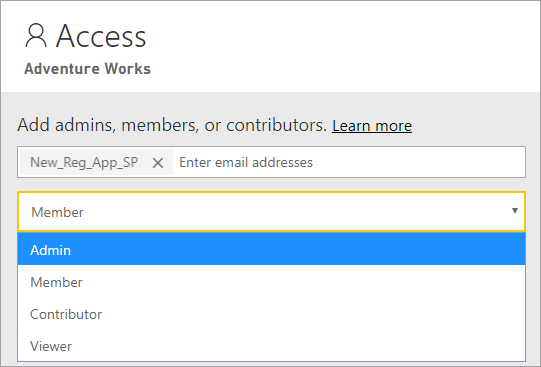

# <a name="automate-premium-workspace-and-dataset-tasks-with-service-principals"></a>Hizmet sorumlularıyla Premium çalışma alanı ve veri kümesi görevlerini otomatikleştirme

Hizmet sorumlusu, katılımsız kaynak ve hizmet düzeyinde işlemler gerçekleştirmek için kiracınızın içinde oluşturduğunuz bir Azure Active Directory *uygulama kaydıdır*. Bu uygulama adı, uygulama kimliği, kiracı kimliği ve parola olarak *istemci gizli anahtarı* veya sertifikayla benzersiz türde bir kullanıcı kimliğidir.

Power BI Premium, Power BI Embedded ile aynı hizmet sorumlusu işlevini kullanır. Daha fazla bilgi edinmek için bkz. [Hizmet sorumlularıyla Power BI içeriği ekleme](../developer/embedded/embed-service-principal.md).

Ayrıca **Power BI Premium** ’da hizmet sorumluları [XMLA uç noktasıyla](service-premium-connect-tools.md) birlikte kullanılarak çalışma alanları sağlama, modelleri dağıtma ve veri kümesini yenileme gibi veri kümesi yönetim görevleri şunlarla otomatik hale getirilebilir:

- PowerShell
- Azure Otomasyonu
- Azure Logic Apps
- Özel istemci uygulamaları

Hizmet sorumlularını kullanan XMLA uç nokta bağlantılarını yalnızca [Yeni çalışma alanları](../collaborate-share/service-new-workspaces.md) destekler. Klasik çalışma alanları desteklenmez. Hizmet sorumlusu yalnızca atandığı çalışma alanlarındaki görevleri gerçekleştirmek için gereken izinlere sahiptir. İzinler, normal UPN hesaplarına çok benzer biçimde çalışma alanı erişimi aracılığıyla atanır.

Yazma işlemleri gerçekleştirmek için kapasitenin **Veri kümeleri iş yükünde** [XMLA uç noktasının okuma-yazma için etkinleştirilmiş](service-premium-connect-tools.md#enable-xmla-read-write) olması gerekir. Power BI Desktop’tan yayımlanan veri kümelerinde [Gelişmiş meta veri biçimi](../connect-data/desktop-enhanced-dataset-metadata.md) özelliği etkinleştirilmelidir.

## <a name="create-a-service-principal"></a>Hizmet sorumlusu oluşturma

Hizmet sorumluları Azure portalında bir uygulama kaydı olarak veya PowerShell kullanılarak oluşturulur. Hizmet sorumlunuzu oluştururken uygulama adını, Uygulama (istemci) Kimliğini ve istemci gizli anahtarını ayrı ayrı kopyalayıp yapıştırdığınızdan emin olun. Hizmet sorumlusu oluşturma adımları için bkz:

[Hizmet sorumlusu oluşturma - Azure portalı](/azure/active-directory/develop/howto-create-service-principal-portal)   
[Hizmet sorumlusu oluşturma - PowerShell](/azure/active-directory/develop/howto-authenticate-service-principal-powershell)

## <a name="create-an-azure-ad-security-group"></a>Azure AD güvenlik grubu oluşturma

Varsayılan olarak, hizmet sorumluları etkinleştirilmiş oldukları tüm kiracı ayarlarına erişebilir. Yönetici ayarlarınıza bağlı olarak erişim belirli güvenlik gruplarını veya kuruluşun tamamını içerebilir.

Hizmet sorumlusu erişimini belirli kiracı ayarlarıyla sınırlamak için belirli güvenlik gruplarına erişim izni verebilirsiniz. Dilerseniz hizmet sorumluları için ayrılmış bir güvenlik grubu oluşturabilir ev bu grubu istediğiniz kiracı ayarlarından dışlayabilirsiniz. Güvenlik grubu oluşturma ve hizmet sorumlusu ekleme adımları için bkz. [Temel bir grup oluşturma ve Azure Active Directory’yi kullanarak üyeleri ekleme](/azure/active-directory/fundamentals/active-directory-groups-create-azure-portal).

## <a name="enable-service-principals"></a>Hizmet sorumlularını etkinleştirme

Power BI’da hizmet sorumlularını kullanabilmek için önce yöneticinin Power BI yönetim portalında hizmet sorumlusu erişimini etkinleştirmesi gerekir.

Power BI **Yönetim portalı** > **Kiracı ayarları** altında **Hizmet sorumlularının Power BI API'leri kullanmasına izin ver** seçeneğini genişletin ve **Etkin** ’e tıklayın. İzinleri güvenlik grubuna uygulamak için **Belirli güvenlik grupları** ’na grup adını ekleyin.


## <a name="workspace-access"></a>Çalışma alanı erişimi

Hizmet sorumlunuzun Premium çalışma alanı ve veri kümesi işlemleri yaparken gereken izinlere sahip olması için, hizmet sorumlusunu çalışma alanı Üyesi veya Yöneticisi olarak eklemelisiniz. Burada Power BI hizmetinde Çalışma alanı erişiminin kullanılması açıklanmıştır ama [Grup Kullanıcısı Ekleme User REST API’sini](/rest/api/power-bi/groups/addgroupuser) de kullanabilirsiniz.

1. Power BI hizmetinde çalışma alanı için **Diğer** > **Çalışma alanı erişimi** ’ni seçin.

    

2. Uygulama adına göre arama yapın, hizmet sorumlusunu çalışma alanına **Yönetici** veya **Üye** olarak ekleyin.

    

## <a name="connection-strings-for-the-xmla-endpoint"></a>XMLA uç noktası için bağlantı dizeleri

Hizmet sorumlusunu oluşturduktan, kiracınız için hizmet sorumlularını etkinleştirdikten ve hizmet sorumlusunu Çalışma alanı erişimine ekledikten sonra, XMLA uç noktasıyla bağlantı dizelerinde bu hizmet sorumlusunu bir kullanıcı kimliği olarak kullanabilirsiniz. Aradaki fark Kullanıcı Kimliği ve Parola parametreleri için uygulama kimliğini, kiracı kimliğini ve uygulama gizli dizisini belirtmenizdir.

`Data Source=powerbi://api.powerbi.com/v1.0/myorg/<workspace name>; Initial Catalog=<dataset name>;User ID=app:<appId>@<tenantId>;Password=<app_secret>;`

### <a name="powershell"></a>PowerShell

#### <a name="using-sqlserver-module"></a>SQLServer modülünü kullanma

Aşağıdaki örnekte veri kümesi yenileme işleminin kimliğini doğrulamak için AppId, TenantId ve AppSecret kullanılmıştır:

```powershell
Param (
        [Parameter(Mandatory=$true)] [String] $AppId,
        [Parameter(Mandatory=$true)] [String] $TenantId,
        [Parameter(Mandatory=$true)] [String] $AppSecret
       )
$PWord = ConvertTo-SecureString -String $AppSecret -AsPlainText -Force

$Credential = New-Object -TypeName "System.Management.Automation.PSCredential" -ArgumentList $AppId, $PWord

Invoke-ProcessTable -Server "powerbi://api.powerbi.com/v1.0/myorg/myworkspace" -TableName "mytable" -DatabaseName "mydataset" -RefreshType "Full" -ServicePrincipal -ApplicationId $AppId -TenantId $TenantId -Credential $Credential
```

### <a name="amo-and-adomd"></a>AMO ve ADOMD

İstemci uygulamalarıyla ve web uygulamalarıyla bağlantı kurarken, NuGet’ten [AMO ve ADOMD istemci kitaplıkları](/azure/analysis-services/analysis-services-data-providers) sürüm 15.1.42.26 (Haziran 2020) ve üzeri yüklenebilir paketleri, bağlantı dizelerinde şu söz dizimiyle hizmet sorumlularının kullanılmasını destekler: `app:AppID` ve parola veya `cert:thumbprint`.

Aşağıdaki örnekte bir model veritabanı yenileme işlemi gerçekleştirmek için `appID` ve `password` kullanılmıştır:

```csharp
string appId = "xxx";
string authKey = "yyy";
string connString = $"Provider=MSOLAP;Data source=powerbi://api.powerbi.com/v1.0/<tenant>/<workspacename>;Initial catalog=<datasetname>;User ID=app:{appId};Password={authKey};";
Server server = new Server();
server.Connect(connString);
Database db = server.Databases.FindByName("adventureworks");
Table tbl = db.Model.Tables.Find("DimDate");
tbl.RequestRefresh(RefreshType.Full);
db.Model.SaveChanges();
```

## <a name="next-steps"></a>Sonraki adımlar

[XMLA uç noktasıyla veri kümesi bağlantısı](service-premium-connect-tools.md)  
[Azure Otomasyonu](/azure/automation)  
[Azure Logic Apps](/azure/logic-apps/)  
[Power BI REST API'leri](/rest/api/power-bi/)