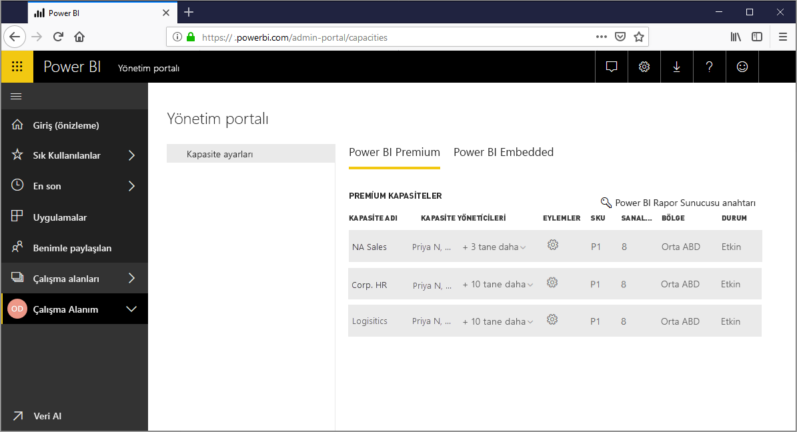
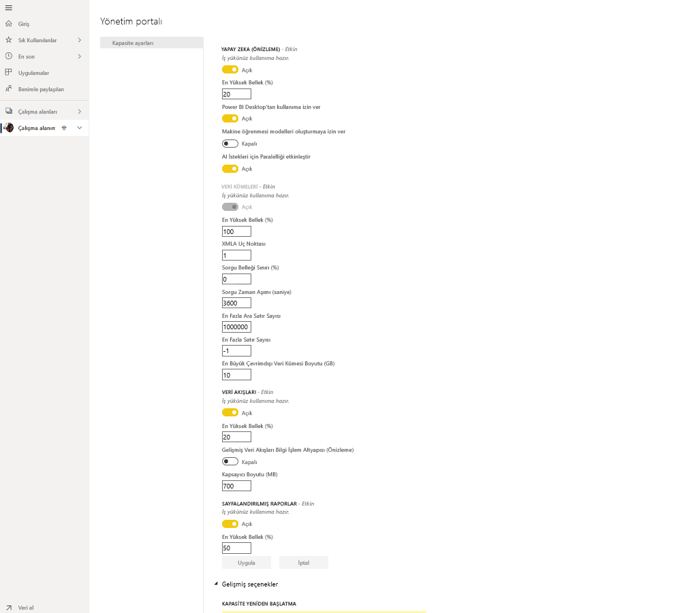
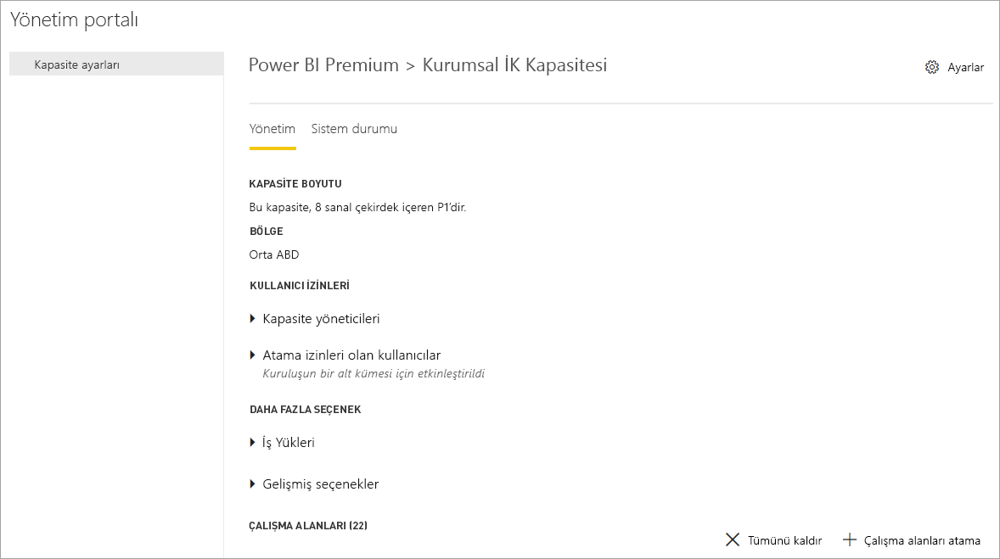
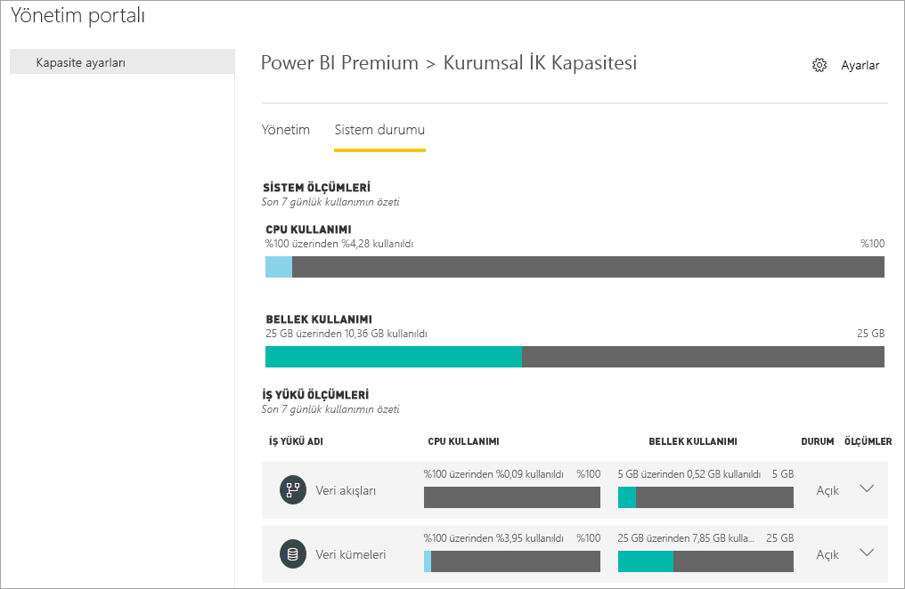
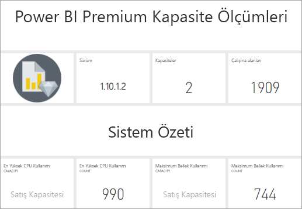
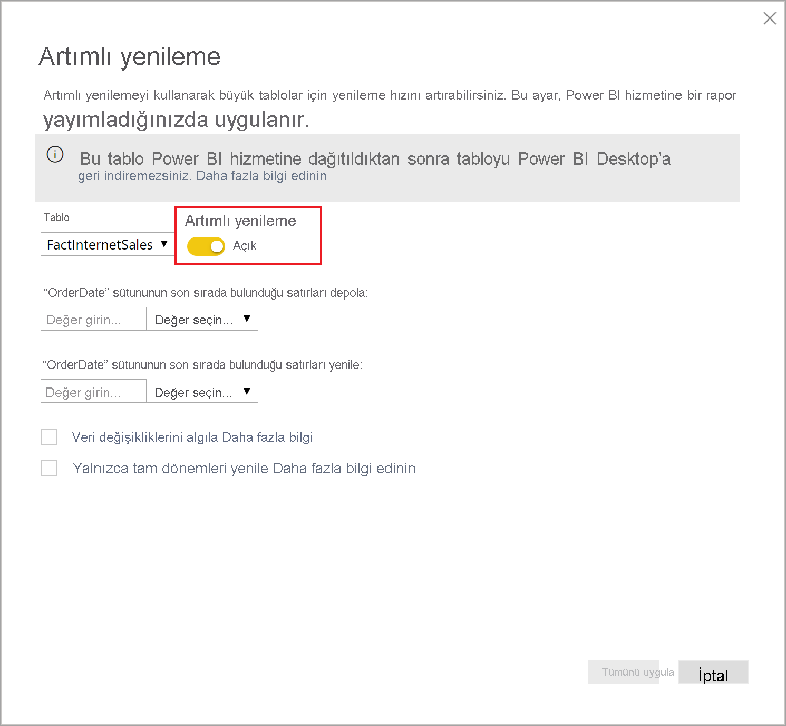
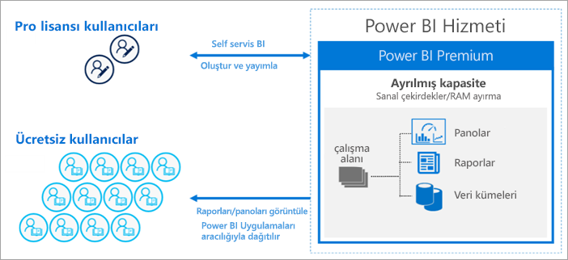
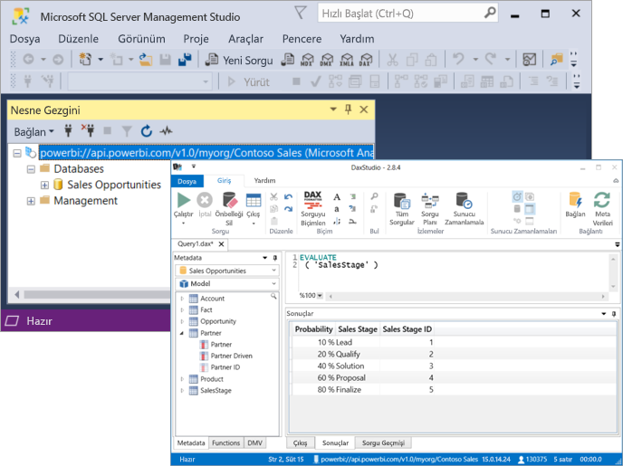

# Power BI Premium nedir?

Yalnızca Premium’da kullanılabilen özelliklere erişmek için Power BI Premium’u kullanabilir ve kuruluşunuzdaki Power BI içeriklerine yönelik daha yüksek ölçeklendirme ve performans sunabilirsiniz. Power BI Premium, kuruluşunuzdaki daha fazla kullanıcının daha iyi performans ve duyarlılık ile Power BI’dan en iyi şekilde yararlanmasını sağlar. Örneğin, Power BI Premium sayesinde siz ve kuruluşunuzdaki kullanıcılar şu özellikleri elde edersiniz:

> [!div class="checklist"]
> * Power BI raporlarında daha yüksek ölçeklendirme ve performans
> * Kapasiteye göre lisanslama esnekliği
> * Veri görselleştirmeye ve yapay zeka destekli analiz, birleştirilebilir ve yeniden kullanılabilir veri akışları, sayfalandırılmış raporlar gibi içgörü ayıklamaya yönelik sınıfının en iyisi özellikler
> * Daha yoğun iş yüklerini destekleyen ve kurumsal ölçek gerektiren, Premium’a özgü pek çok özellikler sayesinde self servisi ve kurumsal iş zekasını birleştirme
> * Power BI Rapor Sunucusu ile şirket içi iş zekasını genişletmeyi sağlayan yerleşik lisans
> * Bölgeye göre veri yerleşimi desteği (Multi-Geo) ve bekleyen verilere (Kendi Anahtarını Getir) yönelik, müşteri tarafından yönetilen şifreleme anahtarları
> * Kullanıcı başına lisans satın almaksızın Power BI içeriğini herkesle (kuruluşunuzun dışındaki kişilerle bile) paylaşabilme özelliği

 

Bu makalede Power BI Premium'un önemli özellikleri tanıtılır. Gerektiğinde, daha ayrıntılı bilgiler içeren makalelerin bağlantıları sağlanır. Power BI Pro ve Power BI Premium hakkında daha fazla bilgi için [Power BI fiyatlandırması](https://powerbi.microsoft.com/pricing/) konusunun _Power BI özelliklerinin karşılaştırması_ bölümüne bakın.

## Power BI Premium 2. Nesil (önizleme)

Yakın zamanda Power BI Premium’un **Power BI Premium 2. Nesil** adlı yeni bir sürümü kullanıma sunuldu. Kolaylık açısından bu sürüm **Premium 2. Nesil** olarak adlandırılmaktadır. Premium 2. Nesil şu anda önizleme aşamasındadır ve bu süre boyunca kullanılmak üzere Premium abonelere sunulur. Premium’un özgün sürümünü kullanabilir veya Premium 2. Nesil’e geçiş yapabilirsiniz. Premium kapasitenizde yalnızca birini veya diğerini kullanabilirsiniz. 

Premium 2. Nesil şu güncelleştirmeleri ve iyileştirilmiş deneyimleri sunar:

* Kapasiteye göre lisanslamaya ek olarak, **Kullanıcı Başına Premium** lisanslama özelliği.

* Her zaman, tüm kapasite boyutlarında gelişmiş **performans**: Analiz işlemleri, Premium 2. Nesil’de 16 kata kadar daha hızlı çalışır. İşlemler her zaman en yüksek hızda gerçekleştirilir ve kapasitedeki yük miktarı kapasite sınırına yaklaştığında yavaşlamaz.

* **Daha yüksek ölçek**:
    * Eşzamanlı yenileme sayısında *sınır yoktur*, kapasitenizde yenilenmekte olan veri kümeleri için artık zamanlamaları izlemeniz gerekmez
    * Daha az bellek kısıtlaması
    * Rapor etkileşimi ve zamanlanmış yenilemeler arasında eksiksiz ayrım

* Boyutuna, analiz işlemleri sırasında sistemdeki yük düzeyine veya diğer faktörlere değil, yalnızca kapasitenin gerçekleştirdiği analiz işlemlerinin karmaşıklığına bağlı olan net ve normalleştirilmiş kapasite kullanım verilerine sahip **iyileştirilmiş ölçümler**. İyileştirilmiş ölçümler, kullanım analizi, bütçe planlaması, ücret yansıtma ve yükseltme gereksinimi yerleşik raporlama sayesinde net bir şekilde görülebilir. İyileştirilmiş ölçümler sonra önizleme süresinde daha sonra kullanıma sunulacaktır. Son 7 günün kullanım ölçümlerine erişmeye çalışan müşteriler, müşteri desteğine başvurarak bunu yapabilir. 

* Kapasitedeki yük kapasite sınırını aştığında **Otomatik Ölçeklendirme**, 24 saatlik süreler boyunca bir sanal çekirdeğin *otomatik olarak eklenmesine* olanak sağlar ve böylece yük kaynaklı yavaşlamaları önler. Sanal çekirdekler, boşta süresi algılandığında otomatik olarak kaldırılır. Ek sanal çekirdeklerin ücreti Azure aboneliğinize, kullandıkça öde fiyatlandırması temel alınarak yansıtılır. Otomatik Ölçeklendirme, önizleme aşaması sırasında kullanıma sunulacaktır. 

* Kapasite kullanım düzeyi ve yük artışı hakkındaki proaktif ve yapılandırılabilir yönetici bildirimleri sayesinde **azalan yönetim yükü**.

### Premium 2. Nesil’i kullanma

Güncelleştirmelerinden yararlanmak için Premium 2. Nesil’i etkinleştirin. Premium 2. Nesil’i etkinleştirmek için aşağıdaki adımları izleyin:

1. Yönetici portalında **Kapasite ayarları**’na gidin.
2. **Power BI Premium**’u seçin.
3. Karşınıza çıkan **Premium 2. Nesil (önizleme)** başlıklı bölümde Premium 2. Nesil’i (önizleme) etkinleştirebileceğiniz bir kaydırıcı vardır. 
4. Kaydırıcıyı **Etkin** seçeneğine kaydırın.

Aşağıdaki resimde, Premium 2. Nesil’i nasıl etkinleştirebileceğiniz gösterilmektedir. 

 

### Premium 2. Nesil’deki bilinen sınırlamalar

Şu anda aşağıdaki sınırlamaların Premium 2. Nesil’de uygulandığı bilinmektedir:

1.    Premium 2. Nesil kapasite kullanımı ölçümler uygulamasında izlenemez.

2.    Belirli iş yüklerine yönelik Premium 2. Nesil kapasite ayarları henüz yönetici portalındaki Premium 2. Nesil kapasite ayarları sayfasında görünmez. Ayarları değiştirmek için kapasiteyi özgün Premium sürümüne geçirin, ayarları değiştirin ve sonra kapasiteyi yeniden Premium 2. Nesil’i kullanacak şekilde ayarlayın. Bellek ayırma ayarları Premium 2. Nesil kapasiteler için geçerli değildir.

3.  Premium 2. Nesil üzerinde XMLA kullanıyorsanız [veri modelleme ve yönetim araçlarının](service-premium-connect-tools.md#data-modeling-and-management-tools) en güncel sürümlerini kullandığınızdan emin olun. 

4.  Premium 2. Nesil ile sunulan analiz hizmetleri özellikleri yalnızca en son istemci kitaplıklarında desteklenir. Bu gereksinimi desteklemeye yönelik bağımlı araçlar için tahmini çıkış tarihleri şunlardır:

    |Araç|Gerekli en düşük sürüm|Tahmini çıkış tarihi|
    |---|---|---|
    |SQL Server Management Studio (SSMS)|18.8|8 Aralık 2020|
    |SQL Server Veri Araçları (SSDT)|2.9.15|Genel kullanılabilirlik: 30 Kasım 2020|
    | AS PowerShell| 21.1.18229 üzeri|26 Kasım 2020|

## Abonelikler ve lisanslama

Power BI Premium iki SKU (Stok Saklama Birimi) ailesinde sağlanan kiracı düzeyi bir Microsoft 365 aboneliğidir:

- **P** SKU’ları (P1-P5) eklemeye ve kurumsal özelliklere yöneliktir, aylık veya yıllık taahhüt gerektirir, aylık faturalanır ve şirket içinde Power BI Rapor Sunucusu’nu yüklemek için bir lisans içerir.

- **EM** SKU'ları (EM1-EM3) _kurumsal_ eklemeye yöneliktir, yıllık taahhüt gerektirir, aylık faturalanır. EM1 ve EM2 SKU'ları yalnızca toplu lisans planlarıyla sağlanır. Bunları doğrudan satın alamazsınız.

### Premium 2. Nesil Güncelleştirmeleri (Önizleme)
Premium 2. Nesil şu anda yalnızca **P** ve **EM** SKU’ları için tam olarak desteklenen önizleme özelliği şeklinde kullanılabilir. **A** SKU’ları kapasitesi henüz Premium 2. Nesil önizleme güncelleştirmesinde tanıtılan ek avantajların tamamını sağlamaz.

### Satın alma

Power BI Premium abonelikleri Microsoft 365 yönetim merkezinde yöneticiler tarafından satın alınır. Özel olarak yalnızca Genel yöneticiler veya Faturalama Yöneticileri SKU satın alabilir. Satın alındığında, kiracı kapasitelere atamak üzere alışverişe karşılık gelen sayıda sanal çekirdek alır; bu *sanal çekirdek havuzu* olarak bilinir. Örneğin, P3 SKU satın almak kiracıya 32 sanal çekirdek sağlar. Daha fazla bilgi edinmek için bkz. [Power BI Premium'u satın alma](service-admin-premium-purchase.md).

#### Kullanıcı Başına Power BI Premium (önizleme)

**Kullanıcı Başına Power BI Premium**, kuruluşların Premium özellikleri kullanıcı başına lisanslamalarına olanak verir. Kullanıcı Başına Premium (PPU) tüm Power BI Pro lisansı özelliklerine sahip olmanın yanı sıra, sayfalandırılmış raporlar, yapay zeka ve yalnızca Premium abonelere sunulan diğer özellikler gibi olanaklar ekler. Kullanıcı Başına Premium şu anda önizleme aşamasındadır. Özellik karşılaştırması ve önizleme sürümü hakkındaki diğer bilgiler gibi, Kullanıcı Başına Premium hakkında daha fazla bilgi için [Kullanıcı Başına Power BI Premium Hakkında SSS (önizleme)](service-premium-per-user-faq.md) başlıklı makaleye göz atın. 

## Ayrılmış kapasiteler

Power BI Premium ile *ayrılmış kapasiteler* elde edersiniz. İş yüklerinin analiz işlemesi başka müşterilerle paylaşılan bilgi işlem kaynaklarında çalıştırıldığı paylaşılan kapasitenin tersine, ayrılmış kapasite özel olarak kuruluşun kullanımına yöneliktir. Barındırılan içerik için güvenilir ve tutarlı bir performans sağlayan ayrılmış bilgi işlem kaynaklarıyla yalıtılmıştır. Aşağıdaki Power BI içerik türlerinin işlenmesinin, ayrılmış kapasiteniz yerine paylaşılan kapasitede depolandığını unutmayın:

* Excel çalışma kitapları (veriler önce Power BI Desktop'a içeri aktarılmadıysa)
* [Gönderme veri kümeleri](/rest/api/power-bi/pushdatasets)
* [Akış veri kümeleri](../connect-data/service-real-time-streaming.md#set-up-your-real-time-streaming-dataset-in-power-bi)
* [Soru-Cevap](../create-reports/power-bi-tutorial-q-and-a.md)

Çalışma alanları kapasitelerin içinde yer alır. Her Power BI kullanıcısının **Çalışma Alanım** olarak bilinen kendi kişisel çalışma alanı vardır. İşbirliğine olanak tanımak için ek **çalışma alanları** oluşturulabilir. Kişisel çalışma alanları da dahil olmak üzere çalışma alanları varsayılan olarak paylaşılan kapasitede oluşturulur. Premium kapasiteleriniz varsa, hem Çalışma Alanlarım hem de çalışma alanları Premium kapasitelere atanabilir.

Kapasite yöneticilerine ait Çalışma Alanlarım otomatik olarak Premium kapasitelere atanır.

### Premium 2. Nesil Güncelleştirmeleri (Önizleme)

Premium 2. Nesil düğümlerinde artık ayrılmış altyapı kullanılmaz. Bunun yerine hizmet, paylaşılan çok özellikli işleme düğümleri havuzundan yeterli sayıda kaynak ayırarak, çalışan her iş yükü için yeterli işleme gücünün sağlandığından emin olur.

### Kapasite düğümleri

[Abonelikler ve Lisanslama](#subscriptions-and-licensing) bölümünde açıklandığı gibi, iki Power BI Premium SKU ailesi vardır: **EM** ve **P**. Tüm Power BI Premium SKU'ları kapasite *düğümleri* olarak sağlanır; bunlardan her biri işlemci, bellek ve depolamadan oluşan belirli bir miktar kaynağı temsil eder. Kaynaklara ek olarak, her SKU'nun saniyede kurulan Canlı Bağlantı ve DirectQuery bağlantılarının sayısıyla ve paralel model yenilemesi sayısıyla ilgili çalışma sınırlamaları vardır.

İşleme, arka uç ile ön üç arasında eşit olarak bölünmüş belirli sayıda sanal çekirdekle gerçekleştirilir.

**Arka uç sanal çekirdekleri** temel Power BI işlevselliğinden sorumludur: sorgu işleme, önbellek yönetimi, R hizmetlerini çalıştırma, veri yenileme, raporlar ile resimlerin sunucu tarafında işlenmesi. Arka uç sanal çekirdeklerine sabit bir miktar bellek atanır ve bu bellek öncelikli olarak etkin veri kümeleri olarak da bilinen modelleri barındırmak için kullanılır.

**Ön uç sanal çekirdekleri** web hizmetinden, pano ve rapor belge yönetiminden, erişim hakları yönetiminden, zamanlamadan, API'lerden, karşıya yüklemelerden ve indirmelerden, kısacası kullanıcı deneyimiyle ilgili her şeyden sorumludur.

Depolama **kapasite düğümü başına 100 TB** olarak ayarlanır.

Aşağıdaki tabloda her Premium SKU'sunun (ve eşdeğer boyutlu A SKU'sunun) kaynakları ve sınırları açıklanır:

| Kapasite Düğümleri | Toplam sanal çekirdek sayısı | Arka uç sanal çekirdek sayısı | RAM (GB) | Ön uç sanal çekirdek sayısı | DirectQuery/Canlı Bağlantı (saniyede) | Model Yenileme Paralelliği |
| --- | --- | --- | --- | --- | --- | --- |
| EM1/A1 | 1 | 0,5 | 3 | 0,5 | 3,75 | 1 |
| EM2/A2 | 2 | 1 | 5 | 1 | 7,5 | 2 |
| EM3/A3 | 4 | 2 | 10 | 2 | 15 | 3 |
| P1 | 8 | 4 | 25 | 4 | 30 | 6 |
| P2 | 16 | 8 | 50 | 8 | 60 | 12 |
| P3 | 32 | 16 | 100 | 16 | 120 | 24 |
| P4 [1](#limit)| 64 | 32 | 200 | 32 | 240 | 48 |
| P5 [1](#limit)| 128 | 64 | 400 | 64 | 480 | 96 |
| | | | | | | |

<a name="limit">1</a> - Yalnızca özel istek üzerine. 100 GB'tan çok daha büyük modeller için.

>[!NOTE]
>Daha küçük SKU'ları (örneğin iki P1 SKU'su) birleştirmek yerine tek bir büyük SKU (örneğin tek P2 SKU'su) kullanmak tercih edilebilir. Örneğin P2 ile daha büyük modeller kullanabilir ve daha iyi bir paralellik elde edebilirsiniz.

#### Premium 2. Nesil Güncelleştirmeleri (Önizleme)

**Premium 2. Nesil** ile her düğüm boyutundaki kullanılabilir bellek miktarı, kümülatif bellek tüketimi yerine tek bir yapının bellek ayak izi sınırına ayarlanır. Örneğin, aynı anda işlenen veri kümelerinin toplam bellek ayak izinin 25 GB ile sınırlı olduğu özgün Premium ile karşılaştırıldığında, Premium 2. Nesil’de yalnızca tek bir veri kümesi boyutu 25 GB ile sınırlıdır.

### Kapasite iş yükleri

Kapasite iş yükleri kullanıcılarının kullanımına sunulan hizmetlerdir. Varsayılan olarak, Premium ve Azure kapasiteleri yalnızca çalışan Power BI sorgularıyla ilişkili veri kümesi iş yüklerini destekler. Veri kümesi iş yükleri devre dışı bırakılamaz. [AI (Bilişsel Hizmetler)](https://powerbi.microsoft.com/blog/easy-access-to-ai-in-power-bi-preview/), [Veri akışları](../transform-model/dataflows/dataflows-introduction-self-service.md) ve [Sayfalandırılmış raporlar](../paginated-reports/paginated-reports-save-to-power-bi-service.md) için ek iş yükleri etkinleştirilebilir. Bu iş yükleri yalnızca Premium aboneliklerinde desteklenir. 

Eklenen her iş yükünde, bu iş yükü için kullanılabilecek maksimum belleğin yapılandırılmasına (toplam bellek kapasitesinin yüzdesi olarak) izin verilir. Maksimum bellek için varsayılan değerler SKU tarafından belirlenir. Bu ek iş yüklerini yalnızca kullanıldıklarında etkinleştirerek kapasitenizin kullanılabilir kaynaklarını en üst düzeye çıkarabilirsiniz. Ayrıca bellek ayarlarını yalnızca belirlenmiş varsayılan ayarlarınızın kapasite kaynak gereksinimlerinizi karşılamadığı durumlarda değiştirebilirsiniz. Bir kapasite için iş yükleri kapasite yöneticileri tarafından **Yönetim portalındaki**[Kapasite ayarları](service-admin-portal.md) veya [Kapasite REST API'leri](/rest/api/power-bi/capacities) kullanılarak etkinleştirilebilir ve yapılandırılabilir.  

Daha fazla bilgi edinmek için bkz. [Premium kapasitedeki iş yüklerini yapılandırma](service-admin-premium-workloads.md). 

### Kapasiteler nasıl çalışır?

Power BI hizmeti her zaman kapasite için belirlenen sınırları aşmadan kapasite kaynaklarının en iyi şekilde kullanılmasını sağlar.

Kapasite işlemleri *etkileşimli* veya *arka plan* olarak sınıflandırılır. Etkileşimli işlemler isteklerin işlenmesini ve kullanıcı etkileşimlerine (filtreleme, Soru-Cevap sorgulama vb.) yanıt verilmesini içerir. Arka plan işlemleri veri akışı ile içeri aktarma modeli yenilemelerini ve pano sorgusunu önbelleğe almayı içerir.

Mümkün olan en iyi kullanıcı deneyimini sağlamak için etkileşimli işlemlerin her zaman arka plan işlemlerinden daha öncelikli olduğunun anlaşılması önemlidir. Kaynaklar yetersizse arka plan işlemleri kaynaklar serbest kaldığında işlenmek üzere bekleme kuyruğuna eklenir. Veri kümesi yenilemeleri gibi arka plan işlemleri, işlemin ortasında Power BI hizmeti tarafından kesilebilir, kuyruğa eklenebilir ve daha sonra yeniden deneme yapılabilir.

İçeri aktarma modellerinin sorgulanabilmesi veya yenilenebilmesi için tümüyle belleğe yüklenmesi gerekir. Power BI hizmeti, bellek kullanımını uygun şekilde yönetmek için gelişmiş algoritmalar kullanır ancak nadir de olsa müşterilerin gerçek zamanlı taleplerini karşılayacak kadar kaynak mevcut olmaması halinde kapasite aşırı yükle karşı karşıya kalabilir. Kapasitenin kalıcı depolama alanında çok sayıda içeri aktarma modelini (Premium kapasite başına 100 TB'a kadar) depolaması mümkün olsa da tüm modeller aynı anda bellek içinde kalmaz. Aksi halde bellek içi veri kümesi boyutu, kapasitenin bellek sınırını kolayca aşabilir. Veri kümelerini yüklemek için gerekli belleğe ek olarak sorguların ve yenileme işlemlerinin yürütülmesi için de belleğe ihtiyaç duyulur.

Dolayısıyla içeri aktarma modelleri kullanıma göre belleğe yüklenir ve bellekten kaldırılır. İçeri aktarma modeli sorgulandığında (etkileşimli işlem) veya yenilenmesi gerektiğinde (arka plan işlemi) yüklenir.

Modelin bellekten kaldırılması *çıkarma* olarak bilinir. Bu, Power BI'ın modellerin boyutuna bağlı olarak hızla gerçekleştirebildiği bir işlemdir. Kapasitede hiçbir bellek baskısı olmazsa ve model boşta değilse (etkin kullanımdaysa) ilgili model bellekte kalabilir ve çıkarılmaz. Power BI, bir modeli yüklemek için yeterli belleğin bulunmadığına karar verirse Power BI hizmeti etkin olmayan modelleri çıkararak belleği boşaltmaya çalışır. Bu modeller genellikle etkileşimli işlemler için yüklenmiş olan ve son üç dakika içinde kullanılmamış olan modellerdir \[[1](#endnote-1)\]. Çıkarılabilecek etkinlik dışı kalmış model yoksa Power BI hizmeti arka plan işlemleri için yüklenmiş modelleri çıkarmayı dener. Denemelerin 30 saniye boyunca \[[1](#endnote-1)\] başarısız olması durumunda, son çare etkileşimli işlemin başarısız olmasıdır. Bu durumda, rapor kullanıcısına işlemin başarısız olduğu bildirilir ve kısa süre sonra yeniden denemesi önerilir. Bazı durumlarda modeller hizmet işlemlerinden dolayı bellekten kaldırılabilir.

Veri kümesi çıkarmanın normal bir kapasite davranışı olduğunu vurgulamak önemlidir. Kapasite, bellek kullanımını dengelemek için modellerin bellek içi yaşam döngüsünü kullanıcıların görebileceği bir şekilde yönetmeye çalışır. Yüksek çıkarma oranlarının kapasitede verimsiz kaynak kullanımına işaret ediyor olması şart değildir. Ancak modellerin kısa süre içinde yüklenmesi ve çıkarılması sonucu oluşan yük nedeniyle sorgu veya yenileme performansının düşmesi durumunda bir sorun haline gelebilir.

Modellerin belleğe yüklenmesini gerektirdiğinden, içeri aktarma modellerinin yenilenmesi her zaman bellek yoğun işlemlerdir. İşleme için ek ara belleğe de ihtiyaç vardır. Tam yenileme işleminde modelin ihtiyaç duyduğu belleğin yaklaşık iki katı kullanım yapılabilir. Bunun nedeni Power BI'ın işlem tamamlanana kadar modelin var olan anlık görüntüsünü bellek içinde tutmasıdır. Bu da modelin işleme sırasında dahi sorgulanabilmesini sağlar. Yenileme işlemi tamamlanana ve yeni model verileri kullanılabilir duruma gelene kadar sorgular modelin var olan anlık görüntüsüne gönderilebilir.

Artımlı yenileme, tam model yenileme işlemi yerine bölüm yenileme işlemi gerçekleştirir ve genellikle hem hızlı tamamlanır hem de düşük bellek kullanır. Ayrıca kapasitenin kaynak kullanımını önemli ölçüde azaltabilir. Modeller için yenilemeler, özellikle karmaşık Power Query dönüştürmeleri ya da karmaşık olan veya büyük hacimli verilere dayanan hesaplanan tablolar veya sütunlar içeren yenilemeler de yoğun CPU kullanabilir.

Sorgular gibi yenilemeler de modelin belleğe yüklenmesini gerektirir. Bellek yetersizse Power BI hizmeti etkin olmayan modelleri çıkarmayı dener ve bu mümkün olmazsa (tüm modeller etkinse) yenileme işi kuyruğa alınır. Yenilemeler normalde sorgulardan bile daha yoğun CPU kullanır. Bu nedenle eşzamanlı yenileme işlemleri için arka uçtaki sanal çekirdek sayısının 1,5 katı olarak hesaplanan bir sınır uygulanır. Çok fazla eşzamanlı yenileme varsa bir yenileme yuvası kullanılabilir duruma gelene kadar zamanlanmış yenileme kuyruğa alınır ve bu durumda işlem daha uzun sürer. Kullanıcı isteği veya API çağrısı tarafından tetiklenen yenilemeler gibi isteğe bağlı yenilemeler üç kez \[[1](#endnote-1)\] yeniden denenir. Hala yeterli kaynak bulunamazsa yenileme başarısız olacaktır.

#### Premium 2. Nesil Güncelleştirmeleri (Önizleme)

Premium 2. Nesil kümülatif bellek sınırları gerektirmez ve bu nedenle eşzamanlı veri kümesi yenileme işlemleri kaynak kısıtlamalarına dahil olmaz. Sanal çekirdek başına çalışan yenileme sayısıyla ilgili sınır da yoktur. Ancak ayrı veri kümesi yenileme işlemleri, var olan kapasite bellek ve CPU sınırlarına tabi olmaya devam eder. Dilediğiniz zaman, gereken sayıda yenileme zamanlayıp çalıştırabilirsiniz. Power BI hizmeti, bu yenilemeleri zamanlamaya uygun şekilde çalıştırır.

Bölüm notları:   
\[1\] Değişebilir.

### Bölgesel destek

Genel yöneticiler ve Power BI hizmeti yöneticileri yeni kapasite oluştururken, kapasiteye atanan çalışma alanlarının tutulacağı bir bölge belirtebilir. Bu işlem **Multi-Geo** olarak adlandırılır. Multi-Geo ile, kuruluşlar içeriği belirli bir bölgedeki veri merkezlerine dağıtarak veri yerleşimi gereksinimlerini karşılayabilir. Bu bölge Microsoft 365 aboneliğinin tutulduğunu bölgeden farklı olabilir. Daha fazla bilgi edinmek için bkz. [Power BI Premium için Multi-Geo desteği](service-admin-premium-multi-geo.md).

### Kapasite yönetimi

Premium kapasitelerin yönetimi kapasite oluşturma veya silmeyi, yönetici atamayı, çalışma alanı atamayı, iş yüklerini yönetmeyi, izlemeyi ve kapasite performansını iyileştirmek amacıyla ayarlamalar yapmayı içerir. 

Genel yöneticiler ve Power BI hizmeti yöneticileri kullanılabilir sanal çekirdeklerden Premium kapasite oluşturabilir veya mevcut Premium kapasitelerde değişiklik yapabilir. Kapasite oluşturulurken kapasite boyutu ile coğrafi bölgesi belirtilir ve kapasiteye en az bir kapasite yöneticisi atanır. 

Kapasiteleri oluşturma işleminde yönetim görevlerinin çoğu [Yönetim portalında](service-admin-portal.md) tamamlanır.

Kapasite yöneticileri kapasiteye çalışma alanları atayabilir, kullanıcı izinlerini yönetebilir ve başka yöneticiler atayabilir. Kapasite yöneticileri ayrıca iş yüklerini yapılandırabilir, bellek ayırmalarını ayarlayabilir ve kapasitenin aşırı yükle karşılaşması halinde işlemleri sıfırlayarak kapasiteyi yeniden başlatabilir.

Yine kapasite yöneticileri kapasitenin sorunsuz çalıştığından emin olunmasını sağlayabilir. Doğrudan Yönetim portalında veya Premium kapasite ölçümleri uygulamasını kullanarak kapasitenin durumunu izleyebilirler.

Kapasite oluşturma, yönetici atama ve çalışma alanı atama hakkında daha fazla bilgi edinmek için bkz. [Premium kapasiteleri yönetme](service-premium-capacity-manage.md). Roller hakkında daha fazla bilgi edinmek için bkz. [Power BI ile ilgili yönetici rolleri](service-admin-administering-power-bi-in-your-organization.md#administrator-roles-related-to-power-bi).

### İzleme

Premium kapasitelerin izlenmesi yöneticilerin kapasitelerin nasıl performans gösterdiğini anlamasını sağlar. Kapasiteler Yönetim portalı veya [Power BI Premium Kapasite Ölçümleri uygulaması](https://app.powerbi.com/groups/me/getapps/services/capacitymetrics) kullanılarak izlenebilir.

Portalda izleme, son yedi gün içinde kapasitenizde yerleştirilen yükleri ve kullanılan kaynakları gösteren, ortalaması alınmış üst düzey ölçümlere hızlı bir bakış sağlar. 

> [!NOTE]
> **Premium 2. Nesil (Önizleme) Güncelleştirmeleri**: Premium 2. Nesil yalnızca tek bir boyutun izlenmesini gerektirir: Herhangi bir zamanda, kapasitenizin yük için sunması gereken CPU süresi. Satın aldığınız SKU başına CPU süresi boyutunu aşarsanız kapasiteniz ihtiyacı karşılamak adına otomatik olarak ölçeklendirir veya yapılandırma ayarlarınızı temel alarak etkileşimli işlemlerinizi kısıtlar.

**Power BI Premium Kapasite Ölçümleri** uygulaması kapasitenizin performansıyla ilgili en ayrıntılı bilgileri sağlar. Uygulamada bir üst düzey pano ve daha ayrıntılı raporlar sağlanır.

Uygulamanın panosunda bir ölçüm hücresine tıklayarak daha kapsamlı bir raporu açabilirsiniz. Raporlarda, ayrıntılı ölçümler ve kapasitelerinizi sorunsuz çalıştırmayı sürdürmek için ihtiyacınız olan en önemli bilgilerde detaya gitmek için filtreleme özelliği sağlanır.

Kapasiteleri izleme hakkında daha fazla bilgi edinmek için bkz. [Power BI Yönetim portalında izleme](service-admin-premium-monitor-portal.md) ve [Power BI Premium Kapasite Ölçümleri uygulamasıyla izleme](service-admin-premium-monitor-capacity.md).

#### Premium 2. Nesil Güncelleştirmeleri (Önizleme)
**Premium 2. Nesil** kapasitelerde Ölçümler uygulaması kullanılmaz. Bunun yerine, önizleme aşamasında kullanıma sunulacak olan Kapasite Kullanımı Uygulaması kullanılır. Kullanımlarını gözden geçirmek isteyen müşteriler, müşteri desteğinden istekte bulunarak son 7 günün kullanım raporlarının bir kopyasını alabilir. Rapor, isteğin gönderilmesini izleyen 72 saat içinde sağlanacaktır. Kapasite Kullanımı Uygulaması, her kapasite için **Yönetici portalındaki** kapasite yönetim sayfanızdan başlatılır ve 30 günlük veya daha uzun analize olanak tanır.

### Kapasiteleri iyileştirme

Premium yatırımınızdan kullanıcılarınız için iyi performansı ve kendiniz için de en yüksek değeri elde ettiğinizden emin olmak açısından, kapasitelerinizi en iyi şekilde kullanabilmeniz kritik önem taşır. Yöneticiler önemli ölçümleri izleyerek performans sorunlarını en iyi nasıl giderebileceklerini saptayabilir ve gerekli önlemi alabilir. Daha fazla bilgi edinmek için bkz. [Premium kapasiteleri iyileştirme](service-premium-capacity-optimize.md) ve [Premium kapasite senaryoları](service-premium-capacity-scenarios.md).

### Kapasite REST API'leri

Power BI REST API'leri bir [Kapasite API'leri](/rest/api/power-bi/capacities) koleksiyonu içerir. Yöneticiler API'lerle Premium kapasitenizin çeşitli yönlerini programlı olarak yönetebilir. Örneğin iş yüklerini etkinleştirebilir ve devre dışı bırakabilir, kapasiteye çalışma alanları atayabilir ve daha birçok işlem yapabilirler.

## Büyük veri kümeleri

SKU'ya bağlı olarak, Power BI Premium boyunu en çok **10 GB** olan Power BI Desktop (.pbix) model dosyalarının karşıya yüklenmesini destekler. Model yüklendiğinde, Premium kapasiteye atanmış bir çalışma alanında yayımlanabilir. Ardından veri kümesi boyutu **12 GB**’a ulaşana kadar yenilenebilir.

### Boyutla ilgili dikkat edilmesi gerekenler

Büyük veri kümelerinin kaynak kullanımı yoğun olabilir. 1 GB’ın üzerindeki veri kümeleri için en az P1 veya A4 SKU kullanmalısınız. Büyük veri kümelerini A3 düzeyine kadar olan A SKU'larını kullanan çalışma alanlarında yayımlama işlemi başarılı sonuç verebilse de bu veri kümelerini yenileme işlemi yapılamaz.

Aşağıdaki tabloda, .pbix dosyasını karşıya yüklemek veya Power BI hizmetinde yayımlamak için önerilen SKU'lar gösterilmektedir:

   |SKU  |.pbix dosyasının boyutu   |
   |---------|---------|
   |P1    | 3 GB’tan küçük        |
   |P2    | 6 GB’tan küçük        |
   |P3, P4, P5    | 10 GB'a kadar  |

Power BI Embedded A4 SKU’su P1 SKU, A5 = P2 ve A6 = P3’e eşittir.

### Büyük veri kümesi depolama biçimi

Bir veri kümesinde [Büyük veri kümesi depolama biçimi](service-premium-large-models.md) ayarını etkinleştirirseniz, .pbix dosya boyutu sınırlamaları dosyaları karşıya yükleme veya yayımlama işlemleri için geçerli olmaya devam eder. Büyük veri kümesi depolama biçimi, karşıya yükleme boyutu sınırını etkilemez. Ancak artımlı yenileme ve büyük veri kümesi depolama biçimi etkinleştirilmiş şekilde hizmette yayımlanan veri kümeleri bu sınırların üzerine çıkabilir. Büyük veri kümesi depolama biçiminde veri kümesi boyutu yalnızca Power BI Premium kapasitesi boyutuyla sınırlıdır.

Power BI veri kümeleri, sorgu performansını iyileştirerek büyük veri kümeleri üzerinde daha hızlı kullanıcı etkileşimine olanak tanımak için verileri yüksek oranda sıkıştırılmış bellek içi önbellekte depolayabilir. Daha önce Power BI Premium'da veri kümeleri sıkıştırma sonrası 10 GB ile sınırlıydı. Daha büyük modellerle sınırlama kaldırıldı. Veri kümesi boyutları yalnızca kapasite boyutuyla veya yönetici tarafından ayarlanan boyut üst sınırıyla sınırlanır. Böyle büyük veri kümesi boyutlarının etkinleştirilmesi, Power BI veri kümesi boyutlarının Azure Analysis Services model boyutlarıyla daha iyi hizalanmasına olanak tanır.

.pbix dosyalarınız, verileri *yüksek oranda sıkıştırılmış durumda* gösterir. Muhtemelen veriler belleğe yüklenirken genişletilir ve veri yenileme sırasında birkaç kez daha genişletilebilir.

Büyük veri kümeleri için zamanlanmış yenileme çok uzun sürebilir ve yoğun kaynak kullanabilir. Bunu göz önünde bulundurarak çok fazla örtüşen yenileme zamanlamamak önemlidir. Daha hızlı ve daha güvenilir olmasının yanı sıra daha az kaynak tükettiği için [artımlı yenileme](service-premium-incremental-refresh.md) yapılandırılması önerilir.

Veritabanı en son uzun bir süre önce kullanılmışsa, büyük veri kümelerinin ilk raporunun yüklenmesi uzun zaman alabilir. Yüklenmesi nispeten uzun süren raporların ilerleme durumunu göstermek için bir yükleme çubuğu görüntülenir.

Premium kapasitede sorgu başına bellek ve süre sınırları çok daha yüksek olsa da filtre ve dilimleyicileri kullanarak görsel öğeleri yalnızca gerekli öğelerin görüntüleneceği şekilde kısıtlamanız önerilir.

## Artımlı yenileme

Artımlı yenileme, Power BI Premium’da ve Power BI Pro’da büyük veri kümelerini bulundurmanın ve tutmanın çok önemli bir parçasını sağlar. Artımlı yenilemenin birçok avantajı vardır; örneğin yalnızca değişmiş verilerin yenilenmesi gerektiğinden yenileme işlemi daha hızlı yapılır. Yenilemeler daha güvenilir olur çünkü geçici veri kaynaklarına uzun süreli bağlantıların sürdürülmesi gerekli değildir. Kaynak tüketimi azaltılır çünkü yenilenecek verilerin daha az olması, belleğin ve diğer kaynakların genel tüketimini azaltır. Artımlı yenileme ilkeleri, **Power BI Desktop**’ta tanımlanır ve Premium kapasitedeki bir çalışma alanına yayımlandıktan sonra uygulanır. 

Daha fazla bilgi edinmek için bkz. [Power BI Premium’da artımlı yenileme](service-premium-incremental-refresh.md).

## Sayfalandırılmış raporlar

P1-P3 ve A4_A6 SKU'larında desteklenen sayfalandırılmış raporlarda, SQL Server Reporting Services'teki Rapor Tanımlama Dili (RDL) teknolojisi temel alınır. RDL teknolojisine dayansa da, şirket içinde yükleyebileceğiniz indirilebilir bir raporlama platformu olan ve Power BI Premium'da da sağlanan Power BI Rapor Sunucusu ile aynı değildir. Sayfalandırılmış raporlar yazdırılabilen ve paylaşılabilen bir sayfaya sığacak şekilde biçimlendirilir. Tablo birden fazla sayfaya yayılsa bile veriler bir tabloda gösterilir. Kullanıcılar ücretsiz [**Power BI Rapor Oluşturucusu**](https://aka.ms/pbireportbuilder) Windows Desktop uygulamasını kullanarak sayfalandırılmış raporlar yazar ve bunları hizmette yayımlar.

Power BI Premium'da Sayfalandırılmış raporlar, Yönetim portalı kullanılarak bir kapasite için etkinleştirilmesi gereken bir iş yüküdür. Kapasite yöneticileri bunu etkinleştirebilir ve ardından kapasitenin genel bellek kaynaklarının bir yüzdesi olarak bellek miktarını belirtebilir. Diğer iş yükü türlerinden farklı olarak Premium sayfalandırılmış raporları kapasite içinde kapsanan bir alanda çalıştırır. İş yükünün etkin olup olmadığına bakılmaksızın, bu alan için belirtilen en büyük bellek kullanılır. Varsayılan değer %20'dir. 

> [!NOTE]
> **Premium 2. Nesil’de (Önizleme)** , Sayfalandırılmış raporlar için bellek yönetimi yoktur. Premium 2. Nesil’de Sayfalandırılmış raporlar EM1-EM3 SKU’larında desteklenir.

### Sayfalandırılmış raporlar ve Premium 2. Nesil

Premium 2. Nesil kullanılırken Power BI’daki Sayfalandırılmış raporlar, Premium 2. Nesil’de yapılan mimari ve mühendislikle ilgili iyileştirmelerden yararlanır. Aşağıdaki bölümlerde, Sayfalandırılmış raporlar için Premium 2. Nesil avantajları açıklanmaktadır.

**Daha geniş SKU kullanılabilirliği**: Premium 2. Nesil’de çalışan sayfalandırılmış raporlar, tüm kullanılabilir ekli ve Premium SKU’larda raporları çalıştırabilir. Faturalama, 24 saatlik döngüde CPU saati başına hesaplanır. Bu, Sayfalandırılmış raporları destekleyen SKU’ları önemli ölçüde artırmaktadır.

**Dinamik ölçeklendirme**: Premium 2. Nesil ile etkinlikteki ani artışlarla ilgili zorluklar veya kaynak ihtiyacı, ihtiyaç arttıkça dinamik olarak ele alınabilir. 

**İyileştirilmiş önbelleğe alma**: Premium 2. Nesil’den önce, iş yükü kapasitesindeki ayrılan bellek bağlamında çok sayıda işlem gerçekleştirmek için sayfalandırılmış raporlara ihtiyaç duyulurdu. Şimdi Premium 2. Nesil sayesinde çok sayıda işlem için gereken bellek miktarındaki azalma, müşterilerin uzun süre çalışan işlemleri diğer kullanıcı oturumlarını etkilemeden gerçekleştirme olanağını artırır. 

**Gelişmiş güvenlik ve kod yalıtımı**: Premium 2. Nesil ile kod yalıtımı, özgün Premium teklifindeki kapasite başına yerine kullanıcı başına düzeyinde gerçekleşebilir. 

Daha fazla bilgi edinmek için bkz. [Power BI Premium’da sayfalandırılmış raporlar](../paginated-reports/paginated-reports-report-builder-power-bi.md). Sayfalandırılmış raporlar iş yükünü etkinleştirme hakkında daha fazla bilgi edinmek için bkz. [İş yüklerini yapılandırma](service-admin-premium-workloads.md).

## Power BI Rapor Sunucusu
 
Power BI Premium'a dahil edilen Power BI Rapor Sunucusu, web portalı olan *şirket içi* bir rapor sunucusudur. Şirket içinde BI ortamınızı oluşturabilir ve raporları kuruluşunuzun güvenlik duvarının arkasında dağıtabilirsiniz. Rapor Sunucusu, kullanıcıların SQL Server Reporting Services'in zengin, etkileşimli ve kurumsal raporlama özelliklerine erişmesini sağlar. Kullanıcılar daha iyi, daha hızlı kararlar alabilmek için verileri görsel olarak inceleyebilir ve desenleri hızla keşfedebilir. Rapor Sunucusu kendi koşullarınızda yönetmenizi sağlar. Gerekirse zamanı geldiğinde Power BI Rapor Sunucusu buluta geçişi kolaylaştırır ve kuruluşunuz bulutta tüm Power BI Premium işlevselliğinin avantajından yararlanabilir.

Daha fazla bilgi edinmek için bkz. [Power BI Rapor Sunucusu](../report-server/get-started.md).

## Sınırsız içerik paylaşma

Premium ile kuruluşunuzun içindeki veya dışındaki herkes tek tek lisans satın almadan sayfalandırılmış ve etkileşimli raporlar dahil Power BI içeriğinizi görüntüleyebilir. 

Premium ayrıca içeriği görüntüleyen alıcılarda Pro lisansı gerektirmeden içeriğin Pro kullanıcıları tarafından geniş ölçekte dağıtılmasını sağlar. İçerik oluşturucularına Pro lisansları gerekir. Oluşturucular veri kaynaklarına bağlanır, verileri modeller ve çalışma alanı uygulamaları olarak paketlenen raporlar ve panolar oluşturur. Pro lisansı olmayan kullanıcı Görüntüleyici rolüne sahip olduğu sürece Power BI Premium kapasitesindeki çalışma alanına yine de erişebilir. 

Daha fazla bilgi edinmek için bkz. [Power BI lisansı](service-admin-licensing-organization.md).

## Power BI Premium’da Analysis Services

Yakından bakıldığında Power BI Premium çalışma alanlarına ve veri kümelerine gereken gücü kurumsal açıdan kanıtlanmış Microsoft **Analysis Services Vertipaq altyapısı** sağlar. Analysis Services, açık kaynak XMLA protokolünü destekleyen istemci kitaplıkları ve API’ler aracılığıyla programlama ve istemci uygulama ve araç desteği sağlar. Varsayılan olarak, Power BI Premium kapasite veri kümesi iş yükleri bir **XMLA uç noktası** aracılığıyla Microsoft ve üçüncü taraf istemci uygulamalarından ve araçlarından gelen *salt okunur* işlemleri destekler. Kapasite yöneticileri, uç nokta üzerinden *okuma/yazma* işlemlerini devre dışı bırakma veya bu işlemlere izin verme tercihini yapabilir.

Salt okunur erişim sayesinde, SQL Server Management Studio (SSMS) ve SQL Server Profiler gibi Microsoft araçları ile DAX Studio ve veri görselleştirme uygulamaları gibi üçüncü taraf uygulamaları XMLA, DAX, MDX, DMV ve Trace olaylarını kullanarak Premium veri kümelerine bağlanabilir ve bunları sorgulayabilir. Okuma/yazma erişimi sayesinde, Analysis Services projeleri uzantısına veya açık kaynaklı Tablosal Düzenleyici’ne sahip Visual Studio gibi kurumsal modelleme araçları, tablosal modelleri Premium çalışma alanlarına veri kümesi olarak dağıtabilir. Son olarak, SSMS gibi araçlar sayesinde yöneticiler, betik meta veri değişikliklerinde ve gelişmiş veri yenileme senaryolarında Tablosal Model Betik Dilini (TMSL) kullanabilir. 

Daha fazla bilgi için bkz. [XMLA uç noktasıyla veri kümesi bağlantısı](service-premium-connect-tools.md).

## Sonraki adımlar

> [!div class="nextstepaction"]
> [Premium kapasiteleri yönetme](service-premium-capacity-manage.md)
> [Azure Power BI Embedded Belgeleri](https://azure.microsoft.com/services/power-bi-embedded/)

Başka bir sorunuz mu var? [Power BI Topluluğu'na sorun](https://community.powerbi.com/)
