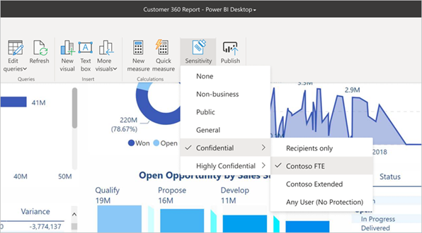

# Power BI'da duyarlılık etiketlerini uygulama

Rapor, pano, veri kümesi, veri akışı ve .pbix dosyalarınıza uygulanan Microsoft Bilgi Koruması duyarlılık etiketleri, hassas içeriklerinizi yetkisiz veri erişimi ve sızıntılara karşı koruyabilir. Verilerinize duyarlılık etiketlerinin doğru şekilde uygulanması, verilerinize yalnızca yetkili kişilerin erişebilmesini sağlar. Bu makalede Power BI hizmetinde ve Power BI Desktop'ta duyarlılık etiketlerinin nasıl uygulanacağı gösterilir.

Power BI’daki duyarlılık etiketleri hakkında daha fazla bilgi için bkz. [Power BI'daki duyarlılık etiketleri](service-security-sensitivity-label-overview.md).

## Power BI hizmetinde duyarlılık etiketlerini uygulama

Power BI hizmetinde raporlara, panolara, veri kümelerine ve veri akışlarına duyarlılık etiketi uygulayabilirsiniz.

Power BI hizmetinde duyarlılık etiketlerini uygulayabilmek için:
* Bir [Power BI Pro lisansına](./service-admin-purchasing-power-bi-pro.md) ve etiketlemek istediğiniz içerik üzerinde Düzenleme izinlerine sahip olmanız gerekir.
* Kuruluşunuz için duyarlılık etiketlerinin etkinleştirilmesi gerekir. Bundan emin değilseniz Power BI yöneticinize danışın.
* [Power BI’da duyarlılık etiketlerini etkinleştirme](./service-security-enable-data-sensitivity-labels.md) makalesinde açıklandığı gibi, duyarlılık etiketlerini uygulama izinleri olan bir güvenlik grubuna dahil olmanız gerekir.
* Tüm [lisanslama gereksinimleri ve diğer gereksinimler](./service-security-enable-data-sensitivity-labels.md#licensing-and-requirements) karşılanmış olmalıdır.

Kiracınızda veri koruma etkin olduğunda panolar, raporlar, veri kümeleri ve veri akışlarının liste görünümünün duyarlılık sütununda duyarlılık etiketleri görünür.

**Rapor veya panodaki bir duyarlılık etiketini uygulama veya değiştirme**
1. **Daha fazla (...)** seçeneğine tıklayın.
1. **Ayarlar**'ı seçin.
1. Ayarlar kenar bölmesinde uygun duyarlılık etiketini seçin.
1. Ayarları kaydedin.

Aşağıdaki görüntüde rapordaki bu adımlar gösterilmektedir

**Veri kümesi veya veri akışındaki bir duyarlılık etiketini uygulama veya değiştirme**

1. **Diğer seçenekler (...)** öğesine tıklayın.
1. **Ayarlar**'ı seçin.
1. Veri kümeleri veya veri akışları sekmesini (hangisi uygunsa) seçin.
1. Duyarlılık etiketleri bölümünü genişletin ve uygun duyarlılık etiketini seçin.
1. Ayarları uygulayın.

Aşağıdaki iki görüntüde, veri kümesindeki bu adımlar gösterilmektedir.

**Diğer seçenekler (...)** öğesini ve sonra **Ayarlar**’ı seçin.

Ayarlar veri kümeleri sekmesinde duyarlılık etiketi bölümünü açın, istediğiniz duyarlılık etiketini seçin ve **Uygula**'ya tıklayın.

## Power BI Desktop'ta duyarlılık etiketlerini uygulama (önizleme)

Power BI Desktop'ta duyarlılık etiketlerini kullanmak için:
* [Power BI Pro lisansınızın](./service-admin-purchasing-power-bi-pro.md) olması gerekir.
* Kuruluşunuz için duyarlılık etiketlerinin etkinleştirilmesi gerekir. Bundan emin değilseniz Power BI yöneticinize danışın.
* [Power BI’da duyarlılık etiketlerini etkinleştirme](./service-security-enable-data-sensitivity-labels.md) makalesinde açıklandığı gibi, duyarlılık etiketlerini uygulama izinleri olan bir güvenlik grubuna dahil olmanız gerekir.
* Tüm [lisanslama gereksinimleri ve diğer gereksinimler](./service-security-enable-data-sensitivity-labels.md#licensing-and-requirements) karşılanmış olmalıdır.
* Power BI Desktop'ta bilgi koruması önizleme özelliğinin anahtarı açık olmalıdır. Giriş sekmesinde duyarlılık düğmesini görüyorsanız, önizleme özelliği açık demektir. Düğmeyi görmüyorsanız, **Dosya > Seçenekler ve ayarlar > Seçenekler > Önizleme özellikleri**'ne gidin ve **Bilgi koruması**'nın yanındaki kutuyu işaretleyin.

    

    >[!Important]
    >Bilgi koruması önizleme özelliğini açtıktan sonra duyarlılık etiketlerini kullanmaya başlamak için Desktop'ı yeniden başlatmalısınız.
    >
    >Desktop yeniden başlatıldıktan sonra kilitlenirse makinenizde gerekli Visual C++ yeniden dağıtılabilir çalışma zamanı kitaplığı sürümü eksik olabilir. Kilitlenmeyle karşılaşmanız halinde [Microsoft Visual C++ 2015 Yeniden Dağıtılabilir Güncelleştirmesi 3 indirme sayfasını](https://www.microsoft.com/download/details.aspx?id=53587) ziyaret edip yönergeleri izleyerek güncelleştirmeyi indirin ve yükleyin. Güncelleştirmeyi yükledikten sonra Desktop'ı başlatmayı yeniden deneyin.

    Bilgi koruması önizleme seçeneğini görmüyorsanız, bilgi koruması önizleme özelliği kuruluşunuz için engellenmiş olabilir. Bu durumda Power BI yöneticinizle iletişime geçin.

* Oturum açmış olmanız gerekir.

Üzerinde çalıştığınız dosyaya duyarlılık etiketi uygulamak için giriş sekmesinde duyarlılık düğmesine tıklayın ve görüntülenen menüden istediğiniz etiketi seçin.

>[!NOTE]
> Önizleme özelliklerinde duyarlılık etiketleri özelliğini açtıysanız ama hala duyarlılık düğmesini görmüyorsanız, bu durum [Power BI'da duyarlılık etiketlerini etkinleştirme](./service-security-enable-data-sensitivity-labels.md) konusunda açıklandığı gibi uygun lisansınızın olmadığını veya duyarlılık etiketi uygulama izinleri olan güvenlik grubunda yer almadığınızı gösteriyor olabilir.

Siz etiketi uyguladıktan sonra etiket durum çubuğunda görünür.

### Hizmete veya hizmetten .pbix dosyalarını yükler veya indirirken duyarlılık etiketleri
* Desktop'tan Power BI hizmetine bir .pbix dosyası yayımladığınızda veya .pbix dosyasını doğrudan **Veri al**'ı kullanarak Power BI hizmetine yüklediğinizde, .pbix dosyasının etiketi hizmette oluşturulan hem rapora hem de veri kümesine uygulanır. Yayımladığınız veya karşıya yüklediğiniz .pbix dosyası mevcut varlıkların (.pbix dosyasıyla aynı adı taşıyan varlıkların) yerini alıyorsa, .pbix dosyasının etiketi söz konusu varlıklardaki etiketlerin üzerine yazılır.
* Power BI hizmetinde ".pbix dosyasına indir" özelliği kullanılırken, indirilen hem raporun hem de veri kümesinin etiketleri varsa ve bu etiketler birbirinden farklıysa, .pbix dosyasına bu iki etiketten daha kısıtlayıcı olan uygulanır.

## Duyarlılık etiketlerini kaldırma

### Hizmet
Rapor, pano, veri kümesi veya veri akışından duyarlılık etiketini kaldırmak için, [Power BI hizmetinde etiketleri uygulama işlemiyle aynı yordamı](#apply-sensitivity-labels-in-the-power-bi-service) izleyin ama verilerin duyarlılığını sınıflandırmanız istendiğinde **(Hiçbiri)** öğesini seçin.

### Masaüstü
Bir .pbix dosyası duyarlılık etiketiyle kaydedildikten sonra dosyadan etiketi kaldırmak şu anda Desktop'ta desteklenmemektedir. Böyle durumlarda dosyanın Power BI hizmetine yayımlanması ve ardından hizmette izleyen rapor ve veri kümesinden etiketin kaldırılması önerilir.

## Önemli noktalar ve sınırlamalar

Power BI'daki duyarlılık etiketi sınırlamaları için bkz. [Power BI'daki duyarlılık etiketleri](service-security-sensitivity-label-overview.md#limitations).

## Sonraki adımlar

Bu makalede, Power BI'da duyarlılık etiketlerini uygulama işlemi açıklanmıştır. Aşağıdaki makalelerde Power BI’da veri koruma hakkında daha fazla bilgi verilmektedir. 

* [Power BI'daki duyarlılık etiketlerine genel bakış](./service-security-sensitivity-label-overview.md)
* [Power BI’da duyarlılık etiketlerini etkinleştirme](./service-security-enable-data-sensitivity-labels.md)
* [Power BI’da Microsoft Cloud App Security denetimlerini kullanma](./service-security-using-microsoft-cloud-app-security-controls.md)