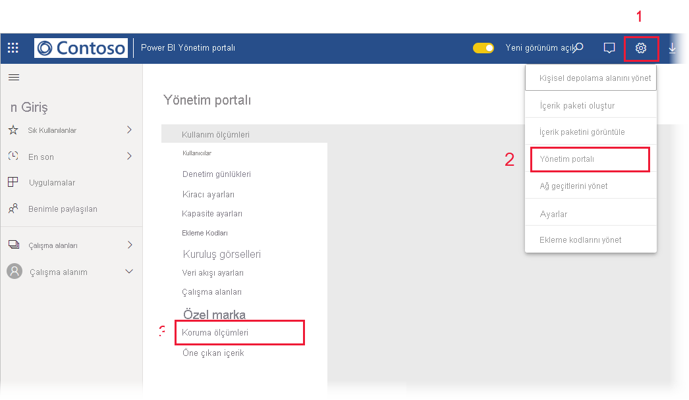

# Veri koruma ölçümleri raporu (önizleme)

## Veri koruma ölçümleri raporu nedir?
Veri koruma ölçümleri raporu [Power BI yöneticilerinin](../service-admin-role.md) kiracılarında veri duyarlılık etiketi kullanımını ve benimsenmesini izlemek için kullanabildiği özel bir rapordur.

 
Raporun özellikleri:
* Kiracıda son 7, 30 veya 90 gün içinde gündelik duyarlılık etiketi kullanımını gösteren %100 yığılmış sütun grafik. Bu grafik, zaman içinde farklı etiket türlerinin göreli kullanımını izlemeyi kolaylaştırır.
* Halka grafikler kiracıda panolar, raporlar, veri kümeleri ve veri akışları için duyarlılık etiketi kullanımının geçerli durumunu gösterir.
* Power BI uyarıları, risk altındaki kullanıcılar, etkinlik günlükleri ve diğer bilgilerin sağlandığı Cloud App Security portalının bağlantısı. Daha fazla bilgi için bkz. [Power BI’da Microsoft bulut uygulaması güvenlik denetimlerini kullanma (önizleme)](./service-security-using-microsoft-cloud-app-security-controls.md).

Rapor her 24 saatte bir yenilenir.

## Veri koruma ölçümleri raporunu görüntüleme

Raporu açmak ve görüntülemek için [Power BI yönetici rolünüzün](../service-admin-role.md) olması gerekir.
Raporu görüntülemek için **Ayarlar > Yönetici portalı**'na gidin ve **Koruma ölçümleri (önizleme)** öğesini seçin.

 
 
Veri koruma ölçümleri raporunu ilk kez açtığınızda raporun yüklenmesi birkaç saniye sürebilir. Özel ortamınızdaki "Çalışma alanım" altında **Veri koruma ölçümleri (otomatik olarak oluşturuldu)** başlıklı bir rapor ve veri kümesi oluşturulacaktır. Burada görüntülenmesini önermeyiz çünkü bu tam özellikli bir rapor değildir. Bunun yerine raporu yukarıda açıklandığı gibi Yönetici portalında görüntüleyin.

> [!CAUTION]
> Zaman zaman raporun yeni sürümleri dağıtılacağı ve yeni sürüme güncelleştirdiğinizde özgün raporda yaptığınız değişikliklerin üzerine yazılacağı için, raporu veya veri kümesini hiçbir şekilde değiştirmeyin.

## Rapor güncelleştirmeleri

Veri koruma ölçümleri raporunun geliştirilmiş sürümleri düzenli olarak kullanıma sunulmaktadır. Yeni bir sürüm sağlanmışsa, raporu açtığınızda yeni sürümü açmak isteyip istemediğiniz sorulur. "Evet" derseniz, raporun yeni sürümü yüklenir ve eski sürümün üzerine yazılır. Eski raporda ve/veya veri kümesinde yapmış olabileceğiniz tüm değişiklikler kaybolur. Yeni sürümü açmamayı seçebilirsiniz ama bu durumda yeni sürümün geliştirmelerinden yararlanamazsınız. 
## Notlar ve önemli noktalar
* Veri koruma ölçümleri raporunun başarıyla oluşturulabilmesi için, kiracınızda [bilgi koruması](./service-security-enable-data-sensitivity-labels.md) etkinleştirilmiş ve [duyarlılık etiketleri uygulanmış](../designer/service-security-apply-data-sensitivity-labels.md) olmalıdır. 
* Cloud App Security bilgilerine erişmek için kuruluşunuzun uygun [Cloud App Security lisansı](https://docs.microsoft.com/power-bi/admin/service-security-using-microsoft-cloud-app-security-controls#microsoft-cloud-app-security-licensing) olmalıdır.
* Veri koruma ölçümleri raporundaki bilgileri Power BI yöneticisi olmayan bir kullanıcıyla paylaşmaya karar verirseniz, bu raporun kuruluşunuz hakkında hassas bilgiler içerdiğini aklınızda bulundurun.
* Veri korum ölçümleri raporu özel bir tür rapordur ve "Benimle paylaşılan", "Son kullanılanlar" ve "Sık kullanılanlar" listelerinde gösterilmez.
* Veri koruma ölçümleri raporu [dış kullanıcılara (Azure Active Directory B2B konuk kullanıcıları)](../service-admin-azure-ad-b2b.md) sağlanmaz.
## Sonraki adımlar
* [Power BI’da veri koruma (önizleme)](./service-security-data-protection-overview.md)
* [Power BI’da Microsoft bulut uygulaması güvenlik denetimlerini kullanma (önizleme)](./service-security-using-microsoft-cloud-app-security-controls.md)
* [Power BI hizmet yöneticisi rolünü anlama](../service-admin-role.md)
* [Power BI'da veri duyarlılığı etiketlerini etkinleştirme](./service-security-enable-data-sensitivity-labels.md)