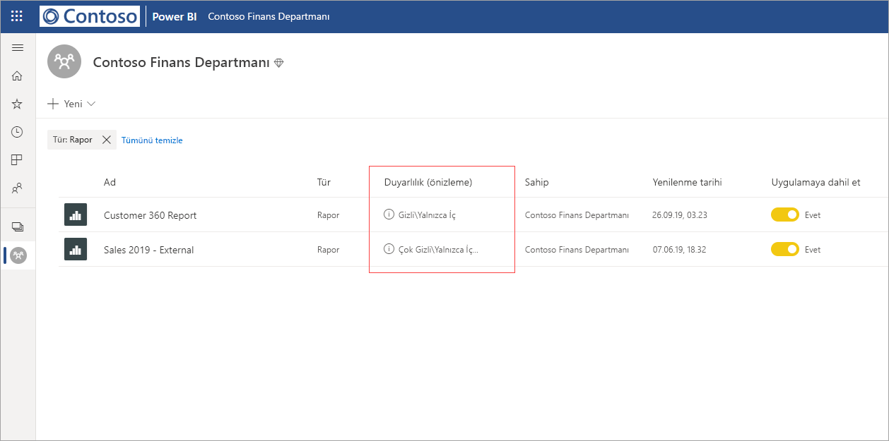
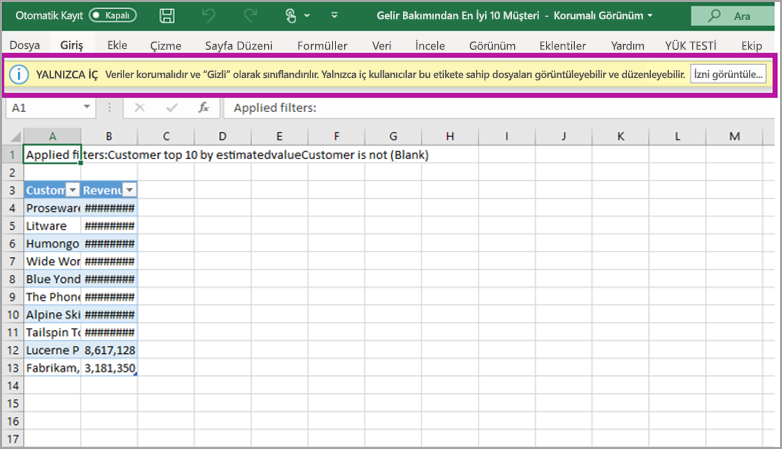

# Power BI’da veri koruma (önizleme)

Modern kuruluşlar, hassas verilerini işleme ve koruma hakkında katı iş düzenlemeleri ve gereksinimleri uygular. Power BI, Power BI’daki hassas veriler üzerinde daha fazla denetim ve görünürlük sağlamak için Microsoft Information Protection ve Microsoft Cloud App Security ile tümleştirilebilir. 

Power BI için veri koruma ile aşağıdakileri yapabilirsiniz:

* Office 365’te dosyaları sınıflandırmak ve korumak için kullanılan taksonomiyi kullanarak, Power BI hizmetindeki içeriği (panolar, raporlar, veri kümesi ve veri akışları) sınıflandırmak ve etiketlemek için Microsoft’un duyarlılık etiketlerini kullanın. 

* İçeriğin duyarlılık etiketini ve korumasını (Excel, PowerPoint ve PDF) uygulayarak, Power BI hizmetinden dosyalara veri aktarırken şifreleme veya filigranlar gibi koruma ayarlarını uygulayın. 

  Örneğin, kullanıcılarınız Power BI’da bir rapora Gizli etiket uygulayabilir. Daha sonra, veriler bir Excel dosyasına aktarıldığında Power BI Gizli etiketi dosyaya uygular. Etiket, içeriği şifreleyebilir ve bir Gizli filigran uygulayabilir.

* Power BI’daki etkinlikleri izlemek, güvenlik sorunlarını araştırmak ve Microsoft Cloud App Security Koşullu Erişim Uygulama Denetimi ile Power BI’daki içeriği korumak için Microsoft Cloud App Security kullanın. 

## Power BI'da duyarlılık etiketleri

Duyarlılık etiketleri [Microsoft 365 güvenlik merkezi](https://security.microsoft.com/) ya da [Microsoft 365 uyumluluk merkezi](https://compliance.microsoft.com/) içinde oluşturulur ve yönetilir.

Bu merkezlerin birinde duyarlılık etiketlerine erişmek için **Sınıflandırma > Duyarlılık etiketleri**'ne gidin. Bu duyarlılık etiketleri Azure Information Protection, Office uygulamaları ve Office 365 hizmetleri gibi birden çok Microsoft hizmeti tarafından kullanılabilir.

> [!IMPORTANT]
> Duyarlılık etiketlerinin Power BI’da kullanılabilmesi için Azure Information Protection müşterilerinin daha önce listelenen hizmetlerden birine etiketleri geçirmesi gerekir. Buna ek olarak, duyarlılık etiketleri yalnızca genel bulutlarda desteklenir ve bağımsız bulutlar gibi bulutlar içindeki kiracılar için desteklenmez.
>
> [Duyarlılık etiketlerini Microsoft Information Protection’a geçirme](https://docs.microsoft.com/azure/information-protection/configure-policy-migrate-labels) hakkında daha fazla bilgi edinin.

## Duyarlılık etiketlerinin işleyişi

Bir Power BI panosuna, raporuna, veri kümesine veya veri akışına duyarlılık etiketi uyguladığınızda, kaynağa aşağıdaki avantajları getiren bir *etiket* uygulamaya benzer:
* **Özelleştirilebilir** - Kuruluşunuzda Kişisel, Ortak, Genel, Gizli ve Çok Gizli gibi farklı düzeylerde hassas içerikler için kategoriler oluşturabilirsiniz.
* **Düz metin** - Etiket düz metin biçiminde olduğundan, kullanıcıların duyarlılık etiketi yönergelerine uygun olarak içeriğin nasıl işleneceğini anlaması kolaydır.
* **Kalıcı** - Duyarlılık etiketi bir içeriğe uygulandıktan sonra, aşağıdaki desteklenen dosya türlerine aktarıldığında o içerikle birlikte gider: Excel, PowerPoint ve PDF. 

  Bu durum, duyarlılık etiketinin, koruma ayarları dahil olmak üzere içeriği takip ettiği ve ilkeleri uygulama ve zorlama dayanağı olduğu anlamına gelir. 

## Duyarlılık etiketi örneği 

Power BI’da duyarlılık etiketinin işleyişi hakkında kısa bir örnek aşağıda verilmiştir.

1. Power BI hizmetinde bir rapora **Çok Gizli - Sadece Şirket İçi** duyarlılık etiketi uygulanır.

   

2. Veriler bu rapordan bir Excel dosyasına aktarıldığında, duyarlılık etiketi ve koruması dışarıya aktarılmış Excel dosyasına uygulanır.

   

Microsoft Office uygulamalarında duyarlılık etiketi, yukarıdaki görüntüye benzer şekilde e-posta veya belge üzerinde etiket olarak görünür.

Ayrıca, kullanılan ve paylaşılan içerikle kalıcı hale gelip dolaşan içeriğe bir sınıflandırma (etiket gibi) atayabilirsiniz. Bu sınıflandırmayı kullanarak kullanım raporları oluşturabilir ve hassas içeriğiniz için etkinlik verilerini görebilirsiniz. Bu bilgilere göre, koruma ayarlarını uygulamayı daha sonra dilediğiniz zaman seçebilirsiniz.

## Power BI'da duyarlılık etiketlerini kullanma

Power BI'da duyarlılık etiketlerinizin etkinleştirilebilmesi için önce aşağıdaki önkoşulları gerçekleştirmeniz gerekir: 

* Duyarlılık etiketlerinin [Microsoft 365 güvenlik merkezi](https://security.microsoft.com/) ya da [Microsoft 365 uyumluluk merkezi](https://compliance.microsoft.com/) içinde oluşturulup yönetildiğinden emin olun. 
* Power BI’da [Duyarlılık etiketlerini etkinleştirin](service-security-enable-data-sensitivity-labels.md) (Önizleme).
* Kullanıcıların uygun lisansa sahip olduğundan emin olun;
  * Power BI’da etiketleri uygulamak veya görüntülemek için kullanıcıların bir Azure Information Protection Premium P1 veya Premium P2 lisansına sahip olması gerekir. Microsoft Azure Information Protection tek başına ya da Microsoft lisanslama paketlerinden biri aracılığıyla satın alınabilir. Ayrıntılı bilgi için [Azure Information Protection fiyatlandırmasına](https://azure.microsoft.com/pricing/details/information-protection/) bakın.
  * Power BI kaynaklarına etiketler uygulamak için, kullanıcının yukarıda bahsedilen Azure Information Protection lisanslarından birine ek olarak Power BI Pro lisansına sahip olması gerekir. 

## Microsoft Cloud App Security kullanarak içeriği koruma

Microsoft Cloud App Security kullanarak Power BI’daki içeriği istenmeyen sızıntılara veya ihlallere karşı koruyabilirsiniz. Microsoft Cloud App Security ayarlanıp yapılandırıldıktan sonra güvenlik yöneticileri kullanıcı erişimini ve etkinliğini izleyebilir, gerçek zamanlı risk analizi gerçekleştirebilir ve etikete özel denetimler belirleyebilir.

Örneğin, kuruluşlar kullanıcıların Power BI’daki hassas içerikleri yönetilmeyen cihazlara indirmesini önleyen bir ilke yapılandırmak üzere Microsoft Cloud App Security’yi kullanabilir. Bu tür bir yapılandırma, kullanıcıların üretkenliğini sürdürmesine ve Power BI’a her yerden bağlanmasına, diğer yandan kullanıcı eylemlerinin güvenliğinin aşılmasını önlemek için Microsoft Cloud App Security kullanmasına ve tüm bunları gerçek zamanlı olarak yapmasına olanak tanır. 

### Gereksinimler

Duyarlılık etiketlerinizin Microsoft Cloud App Security kullanabilmesi için aşağıdaki önkoşulların karşılanması gerekir: 

* Cloud App Security ve Azure Information Protection, [kiracınız için etkinleştirilmelidir](https://docs.microsoft.com/cloud-app-security/azip-integration).
* Uygulama [Microsoft Cloud App Security’ye bağlanmalıdır](https://docs.microsoft.com/cloud-app-security/enable-instant-visibility-protection-and-governance-actions-for-your-apps).

## Önemli noktalar ve sınırlamalar

Aşağıdaki listede, Power BI’daki duyarlılık etiketlerinin bazı sınırlamaları verilmiştir:

* Power BI’da Microsoft Azure Information Protection duyarlılık etiketlerini uygulamak ve görüntülemek için bir Azure Information Protection Premium P1 veya Premium P2 lisansı gerekir. Microsoft Azure Information Protection tek başına ya da Microsoft lisanslama paketlerinden biri aracılığıyla satın alınabilir. Ayrıntılı bilgi için [Azure Information Protection fiyatlandırmasına](https://azure.microsoft.com/pricing/details/information-protection/) bakın.
* Duyarlılık etiketleri yalnızca panolara, raporlara, veri kümelerine ve veri akışlarına uygulanabilir.
* Dışarı aktarılan dosyalar üzerinde etiket ve koruma denetimlerinin uygulanması yalnızca Excel, PowerPoint ve PDF dosyaları için desteklenir. Veriler .CSV dosyalarına, Abonelik e-postasına, Ekleme görsellerine ve çıktısına aktarıldığında etiket ve koruma uygulanmaz.
* Power BI’dan dosya aktaran kullanıcının, duyarlık etiketi ayarlarına uygun olarak bu dosyaya erişme ve dosyayı düzenleme izinleri vardır. Verileri dışarı aktaran kullanıcı, dosya üzerinde sahip izinleri almaz. 
* Duyarlılık etiketleri şu anda [sayfalandırılmış raporlar]( https://docs.microsoft.com/power-bi/paginated-reports-report-builder-power-bi) ve çalışma kitapları için kullanılamaz.
* Power BI varlıkları üzerindeki duyarlılık etiketleri yalnızca çalışma alanı listesinde ve veri kökeni görünümlerinde görünür; etiketler şu anda sık kullanılanlar, benimle paylaşılan, son kullanılanlar veya uygulama görünümlerinde görünmemektedir. Ancak, görünür olmasa bile, Power BI varlığına uygulanmış bir etiketin Excel, PowerPoint ve PDF dosyalarına aktarılmış veriler üzerinde her zaman kalıcı olacağını unutmayın.
* [Microsoft 365 güvenlik merkezi](https://security.microsoft.com/) veya [Microsoft 365 uyumluluk merkezi](https://compliance.microsoft.com/) içinde yapılandırılmış *dosya Şifreleme ayarı* duyarlılık etiketi yalnızca Power BI’dan *dışarı aktarılmış* dosyalara uygulanır; Power BI *içinde* uygulanmaz.
* [HYOK koruması](https://docs.microsoft.com/azure/information-protection/configure-adrms-restrictions), Power BI’da uygulanan etiketler için desteklenmez.
* Office uygulamalarında etiketleri görüntülemek ve uygulamak için [lisanslama gereksinimleri](https://docs.microsoft.com/microsoft-365/compliance/get-started-with-sensitivity-labels#subscription-and-licensing-requirements-for-sensitivity-labels) mevcuttur.
* Duyarlılık etiketleri yalnızca genel (ortak) buluttaki kiracılar için desteklenir. Duyarlılık etiketleri diğer bulutlardaki kiracılar için desteklenmez.
* Veri duyarlılık etiketleri şablon uygulamaları için desteklenmez. Şablon uygulama oluşturucu tarafından ayarlanan duyarlılık etiketleri, uygulama ayıklandığında ve yüklendiğinde kaldırılır ve yüklü bir şablon uygulamada uygulama tüketicisi tarafından yapıtlara eklenen duyarlılık etiketleri, uygulama güncelleştirildiğinde kaybolur (sıfırlanır).
* Power BI, **İletme** ve **Özel** koruma türlerine ilişkin duyarlılık etiketlerini desteklemez.

## Sonraki adımlar

Bu makalede, Power BI'da veri korumasına genel bakış sunulmuştur. Aşağıdaki makalelerde Power BI’da veri koruma hakkında daha fazla bilgi verilmektedir. 

* [Power BI'da veri duyarlılığı etiketlerini etkinleştirme](service-security-enable-data-sensitivity-labels.md)
* [Power BI'da veri duyarlılığı etiketleri uygulama](../designer/service-security-apply-data-sensitivity-labels.md)
* [Power BI’da Microsoft Cloud App Security denetimlerini kullanma](service-security-using-microsoft-cloud-app-security-controls.md)
* [Veri koruma ölçümleri raporu](service-security-data-protection-metrics-report.md)