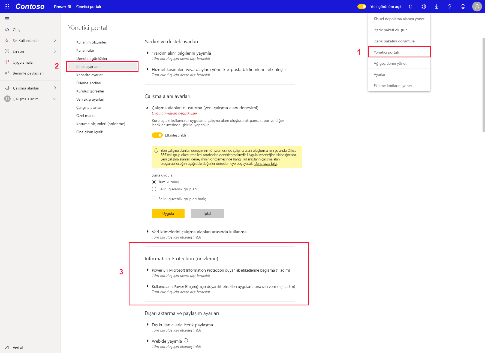
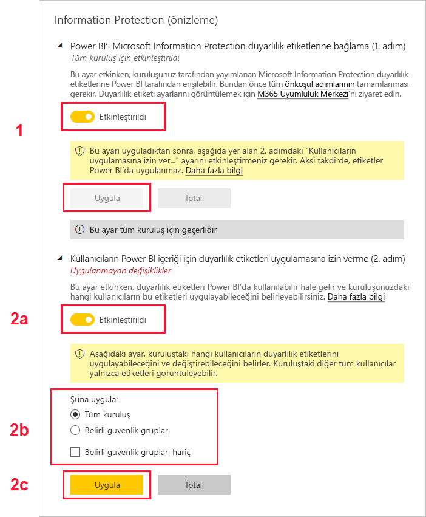

# Power BI'da veri duyarlılığı etiketlerini etkinleştirme (önizleme)

Power BI’da [Microsoft Information Protection veri duyarlılığı etiketleri](https://docs.microsoft.com/microsoft-365/compliance/sensitivity-labels) etkinleştirildiğinde aşağıdaki durumlar geçerli olur:

* Bir kuruluştaki belirli kullanıcılar ve güvenlik grupları, duyarlılık etiketlerini sınıflandırıp Power BI panolarına, raporlarına, veri kümelerine ve veri akışlarına (bundan böyle [varlıklar](../designer/service-security-apply-data-sensitivity-labels.md) olarak anılacak) *uygulayabilir*.
* Kuruluşun tüm üyeleri bu etiketleri görebilir.

Veri duyarlılığı etiketleri, Power BI yazarları ile tüketicilerini veri duyarlılığı konusunda bilgilendirirken sınıflandırmanın ne anlama geldiği ve bir sınıflandırmaya giren verilerin nasıl ele alınması gerektiği hakkında bilgiler sağlayarak veri korumayı destekler.

Veri duyarlılığı etiketine sahip Power BI verileri bir Excel, PowerPoint veya PDF dosyasına aktarıldığında, veri duyarlılığı etiketi de onunla birlikte gider. Bunun anlamı, etiketlenmiş verilere erişim izni olmayan bir kullanıcının, duyarlılık etiketi ilkeleri nedeniyle dosyaları Power BI *dışında* (Excel, PowerPoint veya PDF uygulamalarında) açamayacak olmasıdır.

Veri duyarlılığı etiketlerinin etkinleştirilmesi için Azure Information Protection lisansı gerekir. Daha fazla bilgi için bkz. [Lisanslama](#licensing).

## Veri duyarlılığı etiketlerini etkinleştirme

Power BI’da Microsoft Information Protection veri duyarlılığı etiketlerini etkinleştirmek için Power BI Yönetim portalına gidin, Kiracı ayarları bölmesini açın ve Information Protection bölümünü bulun.

**Information Protection** bölümünde aşağıdaki adımları uygulayın:
1.  **Microsoft Information Protection duyarlılık etiketlerini etkinleştirin** düğmesini etkinleştirin ve **Uygula** düğmesine basın. Bu adım *yalnızca* duyarlılık etiketlerini kuruluşunuzun tamamında görünür hale getirir; herhangi bir etiket uygulamaz. Bu etiketleri Power BI’da kimlerin uygulayabileceğini tanımlamak için Adım 2’yi uygulamanız gerekir.
2.  Power BI varlıklarında duyarlılık etiketlerini kimlerin uygulayabileceğini ve değiştirebileceğini tanımlayın. Bu adım üç işlem içerir:
    1.  **Power BI içeriği ve verilerine yönelik duyarlılık etiketlerini ayarlayın** düğmesini etkinleştirin.
    2.  İlgili güvenlik gruplarını seçin. Varsayılan olarak, kuruluşunuzdaki herkes duyarlılık etiketlerini uygulayabilecektir. Bununla birlikte, yalnızca belirli kullanıcılar veya güvenlik grupları için duyarlılık etiketlerini etkinleştirmeyi seçebilirsiniz. Tüm kuruluş veya belirli güvenlik grupları seçili olduğunda, belirli kullanıcı alt kümelerini veya güvenlik gruplarını hariç bırakabilirsiniz.
    * Kuruluş genelinde duyarlılık etiketleri etkinleştirildiğinde, özel durumlar genellikle güvenlik gruplarıdır.
    * Duyarlılık etiketleri yalnızca belirli kullanıcılar veya güvenlik grupları için etkinleştirildiğinde, özel durumlar genellikle belirli kullanıcılardır.  
    Bu yaklaşım, duyarlılık etiketleri uygulama izinlerine sahip bir gruba ait olsalar bile belirli kullanıcıların Power BI’da duyarlılık etiketi uygulamasını önlemeyi mümkün hale getirir.
    
    3. **Uygula** düğmesine basın.

> [!IMPORTANT]
> Yalnızca varlık üzerinde *oluştur* ve *düzenle* izinlerine sahip olan ve bu bölümde ayarlanmış ilgili güvenlik grubuna dahil olan Power BI Pro kullanıcıları, duyarlılık etiketlerini ayarlayabilir ve düzenleyebilir. Bu gruba dahil olmayan kullanıcılar etiketleri ayarlayamaz veya düzenleyemez. 

## Önemli noktalar ve sınırlamalar

Power BI, Microsoft Information Protection duyarlılık etiketlerini kullanır. Bu nedenle, duyarlılık etiketlerini etkinleştirmeye çalışırken bir hata iletisiyle karşılaşırsanız bunun nedeni aşağıdakilerden biri olabilir:

* Azure Information Protection [lisansınız](#licensing) yoktur.
* Duyarlılık etiketleri, Power BI tarafından desteklenen Microsoft Information Protection sürümüne geçirilmemiştir. [Duyarlılık etiketlerini geçirme](https://docs.microsoft.com/azure/information-protection/configure-policy-migrate-labels) hakkında daha fazla bilgi edinin.
* Kuruluşta hiçbir Microsoft Information Protection duyarlılık etiketi tanımlanmamıştır. Ayrıca, etiketin kullanılabilir olması için etiketin yayımlanmış bir ilkenin parçası olması gerekir. [Duyarlılık etiketleri hakkında daha fazla bilgi edinin](https://docs.microsoft.com/Office365/SecurityCompliance/sensitivity-labels) veya [Microsoft güvenlik ve uyumluluk merkezini](https://sip.protection.office.com/sensitivity?flight=EnableMIPLabels) ziyaret ederek etiketleri tanımlama ve kuruluşunuz için ilkeler yayımlama hakkında bilgi edinin.

## Lisanslama

* Power BI’da Microsoft Information Protection etiketlerini görüntülemek veya uygulamak için kullanıcıların bir Azure Information Protection Premium P1 veya Premium P2 lisansına sahip olması gerekir. Microsoft Azure Information Protection tek başına ya da Microsoft lisanslama paketlerinden biri aracılığıyla satın alınabilir. Ayrıntılı bilgi için [Azure Information Protection fiyatlandırmasına](https://azure.microsoft.com/pricing/details/information-protection/) bakın.
* Power BI varlıklarına etiket uygulaması gereken kullanıcıların bir Power BI Pro Lisansı olmalıdır.

## Sonraki adımlar

Bu makalede, Power BI'da veri duyarlılığı etiketlerini etkinleştirme işlemi açıklanmıştır. Aşağıdaki makalelerde Power BI’da veri koruma hakkında daha fazla bilgi verilmektedir. 

* [Power BI’da veri korumasına genel bakış](service-security-data-protection-overview.md)
* [Power BI'da veri duyarlılığı etiketleri uygulama](../designer/service-security-apply-data-sensitivity-labels.md)
* [Power BI’da Microsoft Cloud App Security denetimlerini kullanma](service-security-using-microsoft-cloud-app-security-controls.md)
* [Veri koruma ölçümleri raporu](service-security-data-protection-metrics-report.md)