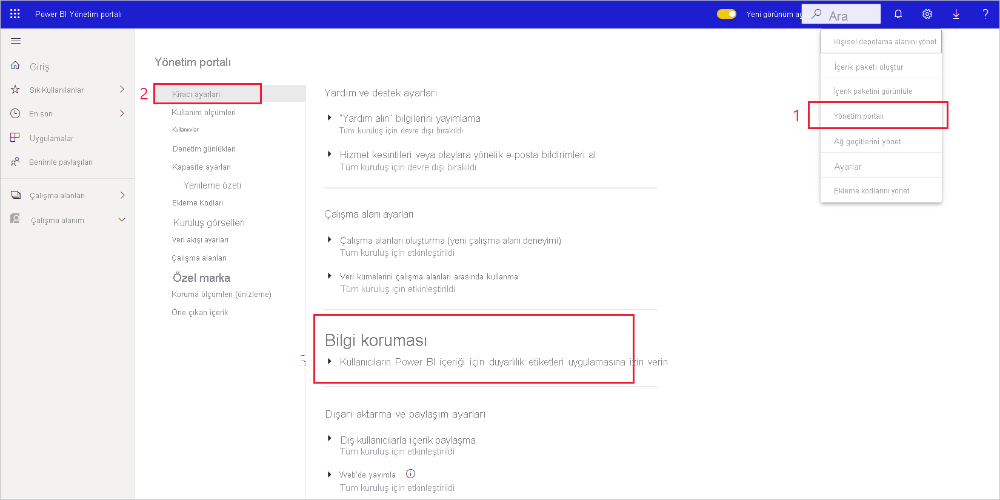
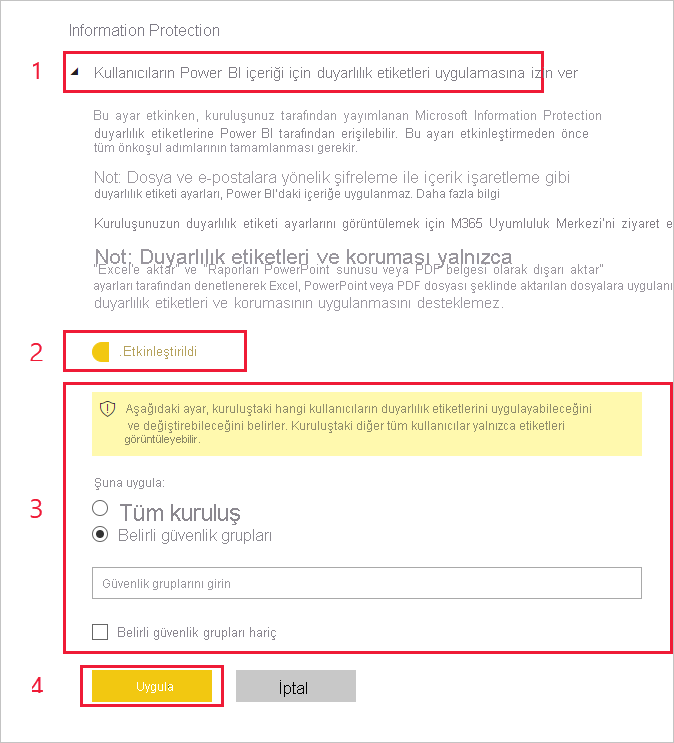

# Power BI'da veri duyarlılığı etiketlerini etkinleştirme

[Microsoft Information Protection veri duyarlılığı etiketlerinin](https://docs.microsoft.com/microsoft-365/compliance/sensitivity-labels) Power BI’da kullanılabilmesi için kiracıda etkinleştirilmeleri gerekir. Bu makalede, Power BI kiracı yöneticilerinin bunu nasıl yapılacağı gösterilmektedir. Power BI’da duyarlılık etiketlerine ilişkin genel bakış için bkz. [Power BI’da veri koruması](service-security-data-protection-overview.md). Power BI’da duyarlılık etiketlerini uygulama hakkında bilgi için bkz. [Duyarlılık etiketleri uygulama](../collaborate-share/service-security-apply-data-sensitivity-labels.md) 

Duyarlılık etiketleri etkinleştirildiğinde:

* Kuruluştaki belirli kullanıcılar ve güvenlik grupları Power BI rapor, pano, veri kümesi ve veri akışlarına [duyarlılık etiketleri uygulayabilir](../collaborate-share/service-security-apply-data-sensitivity-labels.md) ve bu etiketleri sınıflandırabilir.
* Kuruluşun tüm üyeleri bu etiketleri görebilir.

Veri duyarlılığı etiketlerinin etkinleştirilmesi için Azure Information Protection lisansı gerekir. Ayrıntılar için bkz. [Lisanslama](service-security-data-protection-overview.md#licensing).

## Veri duyarlılığı etiketlerini etkinleştirme

Power BI **Yönetici portalına** gidin, **Kiracı ayarları** bölmesini açın ve **Bilgi koruma** bölümünü bulun.

**Information Protection** bölümünde aşağıdaki adımları uygulayın:
1. **Kullanıcıların Power BI içeriği için duyarlılık etiketleri uygulamasına izin ver**’i açın.
1. Düğmeyi etkinleştirin.
1. Power BI varlıklarında duyarlılık etiketlerini kimlerin uygulayabileceğini ve değiştirebileceğini tanımlayın. Varsayılan olarak, kuruluşunuzdaki herkes duyarlılık etiketlerini uygulayabilecektir. Bununla birlikte, yalnızca belirli kullanıcılar veya güvenlik grupları için duyarlılık etiketlerini etkinleştirmeyi seçebilirsiniz. Tüm kuruluş veya belirli güvenlik grupları seçili olduğunda, belirli kullanıcı alt kümelerini veya güvenlik gruplarını hariç bırakabilirsiniz.
   
   * Kuruluş genelinde duyarlılık etiketleri etkinleştirildiğinde, özel durumlar genellikle güvenlik gruplarıdır.
   * Duyarlılık etiketleri yalnızca belirli kullanıcılar veya güvenlik grupları için etkinleştirildiğinde, özel durumlar genellikle belirli kullanıcılardır.  
    Bu yaklaşım, duyarlılık etiketleri uygulama izinlerine sahip bir gruba ait olsalar bile belirli kullanıcıların Power BI’da duyarlılık etiketi uygulamasını önlemeyi mümkün hale getirir.

1. **Uygula** düğmesine basın.

> [!IMPORTANT]
> Yalnızca varlık üzerinde *oluştur* ve *düzenle* izinlerine sahip olan ve bu bölümde ayarlanmış ilgili güvenlik grubuna dahil olan Power BI Pro kullanıcıları, duyarlılık etiketlerini ayarlayabilir ve düzenleyebilir. Bu gruba dahil olmayan kullanıcılar etiketleri ayarlayamaz veya düzenleyemez.  

## Sorun giderme

Power BI, Microsoft Information Protection duyarlılık etiketlerini kullanır. Bu nedenle, duyarlılık etiketlerini etkinleştirmeye çalışırken bir hata iletisiyle karşılaşırsanız bunun nedeni aşağıdakilerden biri olabilir:

* Azure Information Protection [lisansınız](service-security-data-protection-overview.md#licensing) yoktur.
* Duyarlılık etiketleri, Power BI tarafından desteklenen Microsoft Information Protection sürümüne geçirilmemiştir. [Duyarlılık etiketlerini geçirme](https://docs.microsoft.com/azure/information-protection/configure-policy-migrate-labels) hakkında daha fazla bilgi edinin.
* Kuruluşta hiçbir Microsoft Information Protection duyarlılık etiketi tanımlanmamıştır. Etiketin kullanılabilir olması için etiketin yayımlanmış bir ilkenin parçası olması gerektiğini unutmayın. [Duyarlılık etiketleri hakkında daha fazla bilgi edinin](https://docs.microsoft.com/Office365/SecurityCompliance/sensitivity-labels) veya [Microsoft güvenlik ve uyumluluk merkezini](https://sip.protection.office.com/sensitivity?flight=EnableMIPLabels) ziyaret ederek etiketleri tanımlama ve kuruluşunuz için ilkeler yayımlama hakkında bilgi edinin.

## Önemli noktalar ve sınırlamalar

Aşağıdaki listede, Power BI’daki duyarlılık etiketlerinin bazı sınırlamaları verilmiştir:

**Genel**
* Duyarlılık etiketleri yalnızca panolara, raporlara, veri kümelerine ve veri akışlarına uygulanabilir. Bunlar, şu anda [sayfalandırılmış raporlar](../paginated-reports/report-builder-power-bi.md) ve çalışma kitapları için kullanılamaz.
* Power BI varlıklarındaki duyarlılık etiketleri çalışma alanı listesi, veri kökeni, sık kullanılanlar, son kullanılanlar ve uygulama görünümlerinde görünür durumdadır. Etiketler şu anda “benimle paylaşılan” görünümünde görünür değildir. Ancak, görünür olmasa bile, Power BI varlığına uygulanmış bir etiketin Excel, PowerPoint ve PDF dosyalarına aktarılmış veriler üzerinde her zaman kalıcı olacağını unutmayın.
* Duyarlılık etiketleri yalnızca genel (ortak) buluttaki kiracılar için desteklenir. Duyarlılık etiketleri diğer bulutlardaki kiracılar için desteklenmez.
* Veri duyarlılık etiketleri şablon uygulamaları için desteklenmez. Şablon uygulama oluşturucu tarafından ayarlanan duyarlılık etiketleri, uygulama ayıklandığında ve yüklendiğinde kaldırılır ve yüklü bir şablon uygulamada uygulama tüketicisi tarafından yapıtlara eklenen duyarlılık etiketleri, uygulama güncelleştirildiğinde kaybolur (sıfırlanır).
* Power BI [İletme](https://docs.microsoft.com/microsoft-365/compliance/encryption-sensitivity-labels?view=o365-worldwide#let-users-assign-permissions), [kullanıcı tanımlı](https://docs.microsoft.com/microsoft-365/compliance/encryption-sensitivity-labels?view=o365-worldwide#let-users-assign-permissions) ve [HYOK](https://docs.microsoft.com/azure/information-protection/configure-adrms-restrictions) koruma türlerinin duyarlılık etiketlerini desteklemez. İletme ve kullanıcı tanımlı koruma türleri [Microsoft 365 güvenlik merkezinde](https://security.microsoft.com/) ve [Microsoft 365 uyumluluk merkezinde](https://compliance.microsoft.com/) tanımlanan etiketleri ifade eder.
* Kullanıcıların Power BI’da üst etiketler uygulamaları önerilmez. İçeriğe bir üst etiket uygulandıysa bu içerikten bir dosyaya (Excel, PowerPoint ve PDF) veri aktarma işlemi başarısız olur. Bkz. [Alt etiketler (gruplandırma etiketleri)](https://docs.microsoft.com/microsoft-365/compliance/sensitivity-labels?view=o365-worldwide#sublabels-grouping-labels).

**Dışarı Aktarma**
* Etiket ve koruma denetimleri yalnızca veriler Excel, PowerPoint ve PDF dosyalarına aktarıldığında zorlanır. Veriler .csv veya .pbix dosyalarına, Excel’de Analiz Et’e veya başka bir dışarı aktarma yoluna aktarıldığında etiket ve koruma zorlanmaz.
* Dışarı aktarılan bir dosyaya duyarlılık etiketi ve koruma uygulandığında, dosyaya içerik işaretlemesi eklenmez. Ancak, etiket içerik işaretlemelerini uygulayacak şekilde yapılandırıldıysa dosya Office masaüstü uygulamalarında açıldığında içerik işaretlemeleri Azure Information Protection birleşik etiketleme istemcisi tarafından otomatik olarak uygulanır. Masaüstü uygulamaları, mobil uygulamalar ve web uygulamaları için yerleşik etiketleme kullandığınızda içerik işaretlemeleri otomatik olarak uygulanmaz. Diğer ayrıntılar için bkz. [Office uygulamaları içerik işaretlemesini ve şifrelemeyi ne zaman uygular?](https://docs.microsoft.com/microsoft-365/compliance/sensitivity-labels-office-apps?view=o365-worldwide#when-office-apps-apply-content-marking-and-encryption).
* Power BI’dan dosya aktaran kullanıcının, duyarlık etiketi ayarlarına uygun olarak bu dosyaya erişme ve dosyayı düzenleme izinleri vardır. Verileri dışarı aktaran kullanıcı, dosya üzerinde sahip izinleri almaz.
* Veriler bir dosyaya dışarı aktarıldığında etiket uygulanamıyorsa dışarı aktarma işlemi başarısız olur. Dışarı aktarma işleminin etiket uygulanamadığından başarısız olup olmadığını denetlemek için başlık çubuğunun ortasındaki rapor veya pano adına tıklayın ve açılan bilgi menüsünde “Duyarlılık etiketi yüklenemiyor” yazıp yazmadığına bakın. Bu, uygulanan etiket güvenlik yöneticisi tarafından yayımdan kaldırıldıysa veya silindiyse ya da geçici bir sistem sorununun sonucu olarak oluşur.

## Sonraki adımlar

Bu makalede, Power BI'da veri duyarlılığı etiketlerini etkinleştirme işlemi açıklanmıştır. Aşağıdaki makalelerde Power BI’da veri koruma hakkında daha fazla bilgi verilmektedir. 

* [Power BI’da veri korumasına genel bakış](service-security-data-protection-overview.md)
* [Power BI'da veri duyarlılığı etiketleri uygulama](../collaborate-share/service-security-apply-data-sensitivity-labels.md)
* [Power BI’da Microsoft Cloud App Security denetimlerini kullanma](service-security-using-microsoft-cloud-app-security-controls.md)
* [Veri koruma ölçümleri raporu](service-security-data-protection-metrics-report.md)