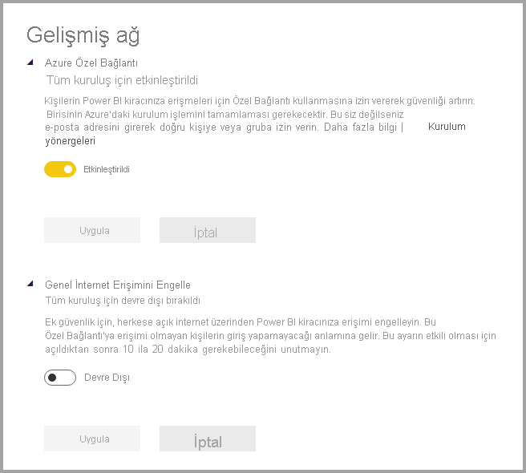
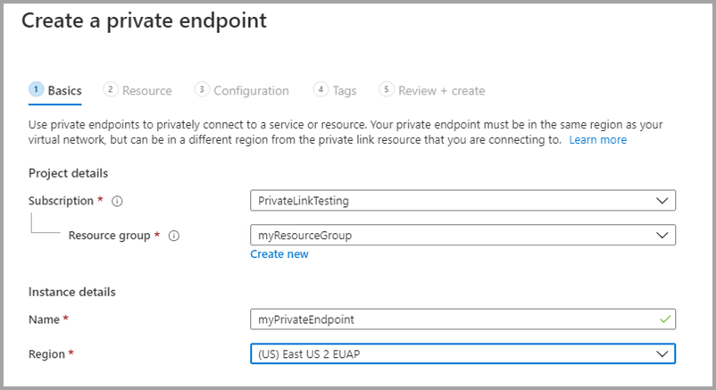

# <a name="private-links-for-accessing-power-bi"></a>Power BI’a erişmek için özel bağlantılar

Power BI’da, kuruluşunuzun Power BI’a özel olarak erişmesini sağlayan bir uç nokta yapılandırıp kullanabilirsiniz. Özel bağlantılar yapılandırmak için Power BI yöneticisi olmanız, Azure’da Sanal Makineler ve Sanal Ağlar gibi kaynaklar oluşturma ve yapılandırma iznine sahip olmanız gerekir. 

Özel bağlantılardan Power BI’a güvenli şekilde erişmenizi sağlayan adımlar şunlardır:

1. [Power BI için özel bağlantıları etkinleştirme](#enable-private-links-for-power-bi)
2. [Azure portalda Power BI kaynağı oluşturma](#create-a-power-bi-resource-in-the-azure-portal)
3. [Sanal ağ oluşturma](#create-a-virtual-network)
4. [Sanal makine (VM) oluşturma](#create-a-virtual-machine-vm)
5. [Özel uç nokta oluşturma](#create-a-private-endpoint)
6. [Uzak Masaüstü (RDP) kullanarak bir sanal makineye bağlanma](#connect-to-a-vm-using-remote-desktop-rdp)
7. [Sanal makineden Power BI’a özel olarak erişme](#access-power-bi-privately-from-the-vm)
8. [Power BI için genel erişimi devre dışı bırakma](#disable-public-access-for-power-bi)

Aşağıdaki bölümlerde, her bir adım için ek bilgiler sağlanmaktadır.

## <a name="enable-private-links-for-power-bi"></a>Power BI için özel bağlantıları etkinleştirme

Başlamak için app.powerbi.com adresine gidip Power BI’da yönetici olarak oturum açın ve Yönetici portalına gidin. **Kiracı ayarları**’nı seçip **Gelişmiş Ağ**’a gidin ve aşağıdaki resimde gösterildiği gibi **Azure Özel Bağlantı**’yı açmak için radyo düğmesinin durumunu değiştirin. 

Kiracınız için özel bağlantının yapılandırılması yaklaşık 15 dakika sürer. Kiracının Power BI hizmetleriyle özel olarak iletişim kurması için ayrı bir FQDN yapılandırılması da buna dahildir.



Tamamlandıktan sonra bir sonraki adıma geçebilirsiniz.

## <a name="create-a-power-bi-resource-in-the-azure-portal"></a>Azure portalda Power BI kaynağı oluşturma

Daha sonra [Azure portalda](https://portal.azure.com) oturum açın ve bir **Azure Şablonu** kullanarak Power BI kaynağı oluşturun. Power BI kaynağı oluşturmak için, aşağıdaki tabloda gösterildiği gibi ARM şablonu örneğindeki parametreleri değiştirin.


|**Parametre**  |**Değer**  |
|---------|---------|
|```<resource-name>```    | myPowerBIResource         |
|```<tenant-object-id>```     | 52d40f65-ad6d-48c3-906f-1ccf598612d4         |

ARM şablonu oluşturma 

```
{
  "$schema": "http://schema.management.azure.com/schemas/2015-01-01/deploymentTemplate.json#",
  "contentVersion": "1.0.0.0",
  "parameters": {},
  "resources": [
      {
          "type":"Microsoft.PowerBI/privateLinkServicesForPowerBI",
          "apiVersion": "2020-06-01",
          "name" : "<resource-name>",
          "location": "global",
          "properties" : 
          {
               "tenantId": "<tenant-object-id>"
          }
      }
  ]
}
```

Görüntülenen iletişim kutusunda, hüküm ve koşulları kabul etmek için onay kutusunu işaretleyip **Satın Al**’ı seçin.


## <a name="create-a-virtual-network"></a>Sanal ağ oluşturma

Sonraki adım, sanal ağ ve alt ağ oluşturmaktır. Bir sanal ağ ve alt ağ oluşturmak için, aşağıdaki tabloda yer alan örnek parametreleri kendinizinkilerle değiştirin.

| Parametre |   Değer| 
|---------|---------|
| ```<resource-group-name>```   | myResourceGroup |
| ```<virtual-network-name>```  | myVirtualNetwork |
| ```<region-name>```   | Orta ABD  |
| ```<IPv4-address-space>```    | 10.1.0.0/16 |
| ```<subnet-name>```   | mySubnet |
| ```<subnet-address-range>```  | 10.1.0.0/24 |

1. Ekranın sol üst kısmındaki **Kaynak oluştur > Ağ > Sanal ağ** seçeneğini belirleyin veya arama kutusuna **Sanal ağ** yazarak arama yapın.
2. **Sanal ağ oluştur** bölümündeki **Temel Bilgiler** sekmesinde aşağıdaki bilgileri seçin:

    |Ayarlar | Değer |
    |-------------------|---------|
    |**Proje ayrıntıları**|
    |Abonelik | Azure Aboneliğinizi seçin |
    |Kaynak Grubu |   **Yeni oluştur** seçeneğini belirleyin, ```<resource-group-name>``` değerini girin, ardından **Tamam**’ı seçin veya parametrelere göre var olan bir ```<resource-group-name>``` seçin. |
    |**Örnek ayrıntıları** |
    | Name  | ```<virtual-network-name>``` değerini girin |
    |Region | ```<region-name>``` seçeneğini belirleyin |
    
    Aşağıdaki resimde **Temel Bilgiler** sekmesi gösterilmektedir.
    
    


3. Ardından **IP Adresleri** sekmesini veya formun en altındaki **Sonraki: IP Adresleri düğmesini** seçin. IP Adresleri sekmesinde şu bilgileri girin:

    |Ayarlar | Değer |
    |-------------------|---------|
    |IPv4 adres alanı |```<IPv4-address-space>``` değerini girin |
    
    
    

4. **Alt ağ adı** bölümünde *varsayılan* sözcüğünü seçin ve **Alt ağı düzenle** bölümünde aşağıdaki bilgileri girin:

    |Ayarlar | Değer |
    |-------------------|---------|
    | Alt ağ adı |```<subnet-name>``` değerini girin |
    | Alt ağ adres aralığı | ```<subnet-address-range>``` değerini girin |
    
    
    

5. Ardından **Kaydet**’i ve sonra **Gözden geçir ve oluştur** sekmesini seçin veya **Gözden geçir ve oluştur** düğmesini seçin. 

6. Ardından **Oluştur**’u seçin.

Bu adımları tamamladıktan sonra, bir sonraki bölümde açıklandığı gibi bir sanal makine (VM) oluşturabilirsiniz.

## <a name="create-a-virtual-machine-vm"></a>Sanal makine (VM) oluşturma


Bir sonraki adım, sanal ağ ve sanal makinenin barındırılacağı alt ağın oluşturulmasıdır.

1. Azure portalınızdaki ekranın sol üst tarafında **Kaynak oluştur > İşlem > Sanal Makine** seçeneğini belirleyin.

2. **Sanal makine oluştur - Temel Bilgiler** bölümünde aşağıdaki bilgileri seçin:

    |Ayarlar | Değer |
    |-------------------|---------|
    |**Proje ayrıntıları**||
    |Abonelik | Azure Aboneliğinizi seçin |
    |Kaynak Grubu |   Önceki bölümde oluşturduğunuz **myResourceGroup** öğesini seçin. |
    |**Örnek ayrıntıları** ||
    |Name | **myVm** değerini girin |
    |Region | **Orta ABD**’yi seçin |
    |Kullanılabilirlik seçenekleri| Varsayılan **Altyapı yedekliliği gerekmez** değerini değiştirmeyin |
    |Görüntü | **Windows 10 Pro**’yu seçin |
    |Boyut | Varsayılan **Standart DS1 v2** değerini değiştirmeyin |
    |YÖNETİCİ HESABI ||
    |Kullanıcı adı |Seçtiğiniz bir kullanıcı adını girin |
    |Parola | Seçtiğiniz bir parolayı girin. Parola en az 12 karakter uzunluğunda olmalı ve [belirlenen karmaşıklık gereksinimlerini](/azure/virtual-machines/windows/faq#what-are-the-password-requirements-when-creating-a-vm) karşılamalıdır |
    |Parolayı Onayla | Parolayı yeniden girin |
    |GELEN BAĞLANTI NOKTASI KURALLARI ||
    |Genel gelen bağlantı noktaları | Varsayılan **Yok** değerini değiştirmeyin |
    |TASARRUF EDİN ||
    |Zaten bir Windows lisansınız var mı? |  Varsayılan **Hayır** değerini değiştirmeyin |

3. Ardından şunu seçin: **İleri: Diskler**
4. **Sanal makine oluştur - Diskler** bölümünde varsayılan değerleri değiştirmeyin ve **Sonraki: Ağ** seçeneğini belirleyin.
5. **Sanal makine oluştur - Ağ** bölümünde aşağıdaki bilgileri seçin:

    |Ayarlar | Değer |
    |-------------------|---------|
    |Sanal ağ|   Varsayılan **MyVirtualNetwork** değerini değiştirmeyin|
    |Adres alanı| Varsayılan **10.1.0.0/24** değerini değiştirmeyin|
    |Alt ağ |Varsayılan **mySubnet (10.1.0.0/24)** değerini değiştirmeyin|
    |Genel IP| Varsayılan **(new) myVm-ip** değerini değiştirmeyin|
    |Genel gelen bağlantı noktaları|  **Seçilenlere izin ver** seçeneğini belirleyin|
    |Gelen bağlantı noktalarını seçin|  **RDP**’yi seçin|

6. **Gözden geçir ve oluştur**’u seçin. Azure’ın yapılandırmanızı doğrulayacağı **Gözden geçir ve oluştur** sayfasına yönlendirilirsiniz.
7. **Doğrulama başarılı** iletisini gördüğünüzde **Oluştur**’u seçin.


## <a name="create-a-private-endpoint"></a>Özel uç nokta oluşturma

Bu bölümde açıklanan sonraki bölüm, Power BI için özel bir uç nokta oluşturulmasına yöneliktir.

1. Azure portal ekranının sol üst tarafında **Kaynak oluştur > Ağ > Özel Bağlantı Merkezi (Önizleme)** seçeneklerini belirleyin.
2. **Özel Bağlantı Merkezi - Genel Bakış** bölümünde, **Bir hizmetle özel bağlantı oluşturma** seçeneğinde **Özel uç nokta oluştur** seçeneğini belirleyin.
3. **Özel uç nokta oluştur (Önizleme) - Temel Bilgiler** bölümünde aşağıdaki bilgileri girin veya seçin:

    |Ayarlar | Değer |
    |-------------------|---------|
    |**Proje ayrıntıları** ||
    |Abonelik|  Azure Aboneliğinizi seçin|
    |Kaynak Grubu|    **myResourceGroup** öğesini seçin. Önceki bölümde bunu oluşturdunuz|
    |**Örnek ayrıntıları** ||
    |Name|  *myPrivateEndpoint* değerini girin. Bu ad daha önce alındıysa benzersiz bir ad oluşturun|
    |Region|    **Orta ABD**’yi seçin|
    
    Aşağıdaki resimde **Özel uç nokta oluşturma - Temel Bilgiler** penceresi gösterilmektedir.
    
    

4. Bu bilgiler tamamlandıktan sonra **Sonraki: Kaynak** seçeneğini belirleyin ve **Özel uç nokta oluşturma - Kaynak** sayfasında aşağıdaki bilgileri girin veya seçin:

    |Ayarlar | Değer |
    |-------------------|---------|
    |Bağlantı yöntemi| Dizininizde bir Azure kaynağına bağlanın seçeneğini belirleyin|
    |Abonelik|  Aboneliğinizi seçin|
    |Kaynak türü| **Microsoft.PowerBI/privateLinkServicesForPowerBI** öğesini seçin |
    |Kaynak|  myPowerBIResource|
    |Hedef alt kaynak|   Kiracı|
    
    Aşağıdaki resimde **Özel uç nokta oluşturma - Kaynak** penceresi gösterilmektedir.
    
    

5. Bu bilgiler düzgün şekilde seçildikten sonra **Sonraki: Yapılandırma** seçeneğini belirleyin ve **Özel uç nokta oluştur (Önizleme) - Yapılandırma** bölümünde aşağıdaki bilgileri girin veya seçin:

    |Ayarlar | Değer |
    |-------------------|---------|
    |**AĞ** ||
    |Sanal ağ|   *myVirtualNetwork* öğesini seçin |
    |Alt ağ |*mySubnet* öğesini seçin |
    |**ÖZEL DNS TÜMLEŞTİRMESİ** ||
    |Özel DNS bölgesi ile tümleştirme|   **Evet**’i seçin |
    |Özel DNS Bölgesi   |Şunu seçin: <br> *(New)privatelink.analysis.windows.net* <br> *(New)privatelink.pbidedicated.windows.net* <br> *(New)privatelink.tip1.powerquery.microsoft.com* |
    
    Aşağıdaki resimde **Özel uç nokta oluşturma - Yapılandırma** penceresi gösterilmektedir.
    
    
    
    Ardından **Gözden geçir ve oluştur** seçeneğini belirleyin. Böylece Azure’ın yapılandırmanızı doğrulayacağı **Gözden geçir ve oluştur** sayfası görüntülenir. **Doğrulama başarılı** iletisini gördüğünüzde **Oluştur**’u seçin.

## <a name="connect-to-a-vm-using-remote-desktop-rdp"></a>Uzak Masaüstü (RDP) kullanarak sanal makineye bağlanma

**myVM** adlı sanal makinenizi oluşturduktan sonra, aşağıdaki adımları kullanarak İnternet’ten buna bağlanın:

1. Portalın arama çubuğuna *myVm* değerini girin.
2. **Bağlan** düğmesini seçin. **Bağlan** düğmesini seçtikten sonra **Sanal makineye bağlan** sayfası açılır.
3. **RDP Dosyasını İndir**’i seçin. Azure bir Uzak Masaüstü Protokolü (.rdp) dosyası oluşturur ve bunu bilgisayarınıza indirir.
4. İndirilen .rdp dosyasını açın.
5. İstendiğinde **Bağlan**’ı seçin.
6. Önceki adımda sanal makine oluştururken belirttiğiniz kullanıcı adını ve parolayı girin.
7. **Tamam**’ı seçin.
8. Oturum açma işlemi sırasında bir sertifika uyarısı alabilirsiniz. Bir sertifika uyarısı alırsanız **Evet**’i veya **Devam**’ı seçin.

## <a name="access-power-bi-privately-from-the-vm"></a>Sanal makineden özel olarak Power BI’a erişme

Bir sonraki adım, aşağıdaki adımlar kullanılarak, önceki adımda oluşturduğunuz sanal makineden özel olarak Power BI’a erişilmesidir: 

1. myVM sanal makinesinin Uzak Masaüstünde PowerShell’i açın.
2. nslookup 52d40f65ad6d48c3906f1ccf598612d4-api.privatelink.analysis.windows.net değerini girin.
3. Şuna benzer bir ileti alırsınız:

    ```
    Server:  UnKnown
    Address:  168.63.129.16
    
    Non-authoritative answer:
    Name:    52d40f65ad6d48c3906f1ccf598612d4-api.privatelink.analysis.windows.net
    Address:  10.1.0.4
    ```

4. Tarayıcıyı açın ve app.powerbi.com adresine giderek Power BI’a özel olarak erişin.

## <a name="disable-public-access-for-power-bi"></a>Power BI için genel erişimi devre dışı bırakma

Son olarak, Power BI için genel erişimi devre dışı bırakmanız gerekir. 

App.powerbi.com adresinde yönetici olarak oturum açın ve **Yönetici portalı**’na gidin. **Kiracı ayarları**’nı seçip **Gelişmiş ağ** bölümüne gidin. Aşağıdaki resimde gösterildiği gibi, **Genel İnternet Erişimini Engelle** bölümünde açma/kapatma düğmesini etkinleştirin. Sistemin, kuruluşunuzun genel İnternet’ten Power BI’a erişimini devre dışı bırakması yaklaşık 15 dakika sürer.

Hepsi bu kadar. Bu adımlar izlendikten sonra kurumlarınız için Power BI’a yalnızca özel bağlantılardan erişilebilir ve genel İnternet’ten erişilemez. 

## <a name="considerations-and-limitations"></a>Önemli noktalar ve sınırlamalar

Power BI’da özel bağlantılarla çalışılırken dikkate alınması gereken birkaç önemli nokta vardır:

* Özel bağlantı ortamı kullanılırken dış resimler veya temalar kullanılamaz ve bunlar özel görselleri etkileyebilir
* Özel bağlantı ortamı kullanılırken PDF’ye dışarı aktarma, rapordan Excel’e dışarı aktarma gibi dışarı aktarma hizmetleri ve diğer dışarı aktarma hizmetleri çalışmaz
* Genellikle RDL dosyaları (*.rdl biçiminde dosyalar) olarak bilinen SQL Server Reporting Services raporları, özel bağlantı ortamlarında işlenmez
* İnternet erişimi devre dışıysa ve veri kümesi ya da veri akışı, veri kaynağı olarak bir Power BI veri kümesine veya veri akışına bağlanıyorsa bağlantı başarısız olur


## <a name="next-steps"></a>Sonraki adımlar

- [Kuruluşunuzda Power BI'ı yönetme](service-admin-administering-power-bi-in-your-organization.md)  
- [Power BI yönetici rolünü anlama](service-admin-role.md)  
- [Kuruluşunuzda Power BI'ı denetleme](service-admin-auditing.md)  

Başka bir sorunuz mu var? [Power BI Topluluğu'na sorun](https://community.powerbi.com/)
