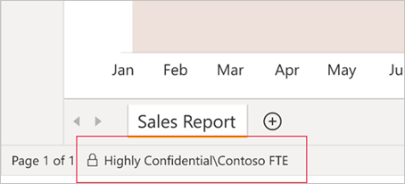

# Power BI'da duyarlılık etiketleri

Bu makalede Power BI'daki Microsoft Information Protection duyarlılık etiketlerinin işlevleri anlatılmaktadır.

Lisanslama gereksinimleri ve önkoşulları dahil olmak üzere kiracınızda duyarlılık etiketlerini etkinleştirme hakkında bilgi için bkz. [Power BI’da veri duyarlılığı etiketlerini etkinleştirme](service-security-enable-data-sensitivity-labels.md).

Duyarlılık etiketlerini Power BI içeriğinize ve dosyalarınıza uygulama hakkında bilgi için bkz. [Power BI'da duyarlılık etiketleri uygulama](./service-security-apply-data-sensitivity-labels.md).

>[!NOTE]
>Power BI Desktop'ta duyarlılık etiketi desteği şu anda önizleme aşamasındadır.

## Giriş

Microsoft Information Protection duyarlılık etiketleri, kullanıcılarınızın Power BI'daki kritik içeriği üretkenliği veya işbirliğini etkilemeden sınıflandırmasına yardımcı olan kolay bir yöntem sunar. Bunların hem Power BI Desktop'a (önizleme) hem de Power BI hizmetine uygulanabilmesi, içeriğinizi geliştirmeye ilk başladığınız andan canlı bağlantı yoluyla Excel'den bu içeriğe erişilene kadar hassas verilerinizin korunabilmesini mümkün kılar. İçeriğinizi .pbix dosyaları biçiminde Desktop ile hizmet arasında taşırken duyarlılık etiketleri korunur.

Power BI hizmetinde duyarlılık etiketleri veri kümelerine, raporlara, panolara ve veri akışlarına uygulanabilir. Etiketlenmiş veriler Excel, PowerPoint, PDF veya .pbix dosyalarına dışarı aktarılarak ya da Excel’de Analiz veya Excel’deki PivotTable’lara canlı bağlantı gibi diğer desteklenen dışarı aktarma senaryoları aracılığıyla Power BI’dan çıktığında, Power BI dışarı aktarılan dosyaya etiketi otomatik olarak uygular ve etiketin dosya şifreleme ayarlarına göre bu dosyayı korur. Bu şekilde hassas verileriniz Power BI'dan ayrıldığında bile koruma altında tutulabilir.

Buna ek olarak duyarlılık etiketleri Power BI Desktop'ta .pbix dosyalarına uygulanabildiğinden, verileriniz ve içeriğiniz Power BI hizmetinde yayımlanmadan önce bile Power BI'ın dışında paylaşıldığında güvenlidir (örneğin, paylaşılmış veya e-postaya eklenmiş olan bir gizli .pbix dosyasını yalnızca kuruluşunuzun içindeki kullanıcılar açabilir). Diğer ayrıntılar için bkz. [Şifreleme uygulamak için duyarlılık etiketlerini kullanarak içeriğe erişimi kısıtlama](https://docs.microsoft.com/microsoft-365/compliance/encryption-sensitivity-labels?view=o365-worldwide).

Rapor, pano, veri kümesi ve veri akışlarındaki duyarlılık etiketleri, Power BI hizmetindeki birçok noktada görünür. Raporlardaki ve panolardaki duyarlılık etiketleri ayrıca Power BI iOS ve Android mobil uygulamalarında ve başka yerlere eklenen görsellerde de görülebilir. Desktop'ta duyarlılık etiketini durum çubuğunda görebilirsiniz.

Power BI yönetim portalında bulunan [koruma ölçümleri raporu](service-security-data-protection-metrics-report.md), Power BI yöneticilerine Power BI kiracısındaki hassas veriler üzerinde tam görünürlük sağlar. Ayrıca Power BI denetim günlükleri de etiket uygulama, kaldırma ve değiştirme gibi etkinliklerin yanı sıra raporları ve panoları görüntüleme gibi etkinlikler hakkında duyarlılık etiketi bilgileri sunar. Bu sayede Power BI ve güvenlik yöneticileri izleme, araştırma ve güvenlik uyarıları amacıyla hassas verilerin kullanımı üzerinde görünürlük sahibi olur.

## Önemli noktalar

Power BI hizmetinde duyarlılık etiketi uygulamak içeriğe erişimi **etkilemez**. Hizmette içeriğe erişim yalnızca Power BI izinleriyle yönetilir. Etiketler görünür olduğundan, ilişkili şifreleme ayarlarının ([Microsoft 365 güvenlik merkezinde](https://security.microsoft.com/) veya [Microsoft 365 uyumluluk merkezinde](https://compliance.microsoft.com/) yapılandırılan) hiçbiri uygulanmaz. Bunlar yalnızca Excel, PowerPoint veya PDF dosyalarına aktarma ve .pbix dosyasına indirme gibi desteklenen bir dışarı aktarma yoluyla hizmetten çıkan verilere uygulanır.

Power BI Desktop'ta (önizleme) şifreleme ayarları olan duyarlılık etiketleri içeriğe erişimi **etkiler**. .Pbix dosyasındaki duyarlılık etiketinin şifreleme ayarlarına göre kullanıcının [izinleri](#power-bi-desktop-preview) yeterli değilse, dosyayı açamaz. Ayrıca Desktop'ta çalışmanızı kaydettiğinizde, eklediğiniz duyarlılık etiketi ve bu etiketle ilişkilendirilmiş şifreleme ayarları kaydedilen .pbix dosyasına uygulanır.

Duyarlılık etiketleri ve dosya şifreleme, desteklenmeyen dışarı aktarma yollarında **uygulanmaz**. Power BI yöneticisi, desteklenmeyen dışarı aktarma yollarından dışarı aktarmayı engelleyebilir.

>[!NOTE]
> [Satır düzeyi güvenlik (RLS)](./service-admin-rls.md), erişimlerini kısıtlamadığı sürece, bir rapora erişim izni verilen kullanıcılara temeldeki veri kümesinin tamamına erişim izni verilmiş olur. Rapor yazarları, duyarlılık etiketlerini kullanarak raporları sınıflandırıp etiketleyebilir. Duyarlılık etiketinde koruma ayarları varsa, rapor verileri Excel, PowerPoint veya PDF'ye dışarı aktarma, .pbix'e indirme ve **Kaydetme** (Desktop) gibi desteklenen bir dışarı aktarma yolunu izleyerek Power BI'dan çıkarken Power BI bu koruma ayarlarını uygular. Korumalı dosyaları yalnızca yetkili kullanıcılar açabilir.

### Desteklenen dışarı aktarma yolları
Duyarlılık etiketlerini ve ilgili korumaları Power BI hizmetinden çıkan verilere uygulama işlemi şu anda aşağıdaki dışarı aktarma yolları için desteklenmektedir:
* Excel, PDF dosyaları (yalnızca Hizmet) ve PowerPoint'e aktarma.
* Power BI veri kümesine canlı bağlantı içeren Excel dosyasındaki bir indirmeyi tetikleyen Power BI hizmetindeki Excel’de Analiz.
* M365 E3 ve üzerine sahip kullanıcılar için Power BI veri kümesine canlı bağlantı içeren Excel’deki PivotTable.
* .pbix dosyasına indirme (Hizmet)

>[!NOTE]
>Power BI hizmetinde **.pbix dosyasına indirme** özelliği kullanıldığında, indirilen raporun ve onun veri kümesinin etiketleri farklıysa .pbix dosyasına daha kısıtlayıcı olan etiket uygulanır. 

## Duyarlılık etiketlerinin Power BI’daki işleyişi

Power BI içeriğine ve dosyalarına duyarlılık etiketi uygulamanız, bu kaynağa aşağıdaki avantajlara sahip bir etiket uygulamaya benzer:
* **Özelleştirilebilir** - Kuruluşunuzda Kişisel, Ortak, Genel, Gizli ve Çok Gizli gibi farklı düzeylerde hassas içerikler için kategoriler oluşturabilirsiniz.
* **Düz metin** - Etiket düz metin biçiminde olduğundan, kullanıcıların duyarlılık etiketi yönergelerine uygun olarak içeriğin nasıl işleneceğini anlaması kolaydır.
* **Kalıcı**: İçeriğe bir duyarlılık etiketi uygulandıktan sonra Excel, PowerPoint ve PDF dosyalarına dışarı aktarılan, .pbix dosyasına indirilen veya kaydedilen (Desktop'ta) içeriğe eşlik eder ve ilkelerin uygulanıp zorunlu tutulmasına yönelik bir temel oluşturur.

Aşağıda Power BI’da duyarlılık etiketinin işleyişi hakkında kısa bir örnek verilmiştir. Aşağıdaki görüntü bir duyarlılık etiketinin Power BI hizmetinde bir rapora uygulanmasını, ardından rapordaki verilerin bir Excel dosyasına aktarılmasını ve son olarak duyarlılık etiketinin ve korumalarının dışarı aktarılan dosyada mevcut olduğunu göstermektedir.

İçeriğe uyguladığınız duyarlılık etiketleri, Power BI genelinde kullanılıp paylaşıldığından içerikle birlikte dolaşımda kalır. Etiketlemeyi kullanarak kullanım raporları oluşturabilir ve hassas içeriğiniz için etkinlik verilerini görebilirsiniz.

## Power BI Desktop'ta duyarlılık etiketleri (önizleme)

Duyarlılık etiketleri Power BI Desktop'ta da uygulanabilir. Bu sayede içeriğinizi geliştirmeye ilk başladığınız andan itibaren verilerinizi korumak mümkün olur. Çalışmanızı Desktop'ta kaydettiğinizde, uyguladığınız duyarlılık etiketi tüm ilişkili şifreleme ayarlarıyla birlikte sonuçta elde edilen .pbix dosyasına uygulanır. Etiketin şifreleme ayarları varsa dosya nereye giderse gitsin ve nasıl iletilirse iletilsin korunur. Yalnızca [gerekli RMS izinlerine](#power-bi-desktop-preview) sahip olanlar dosyayı açabilir.

>[!NOTE]
>* Bu önizleme sürümünde bazı sınırlamalar geçerli olabilir. [Sınırlamalar](#limitations) konusuna bakın.
>* Bilgi Koruması önizleme özelliğini kabul ettikten sonraki ilk 48 saat boyunca **duyarlılık etiketlerinin uygulandığı .pbix dosyalarında sorunlarla karşılaşabilirsiniz (örneğin .pbix dosyasını hizmete yayımlarken, hizmetten .pbix dosyasını indirirken)** . Bunlar beklenen sorunlardır ve 48 saat içinde otomatik olarak çözülür.

Desktop'ta duyarlılık etiketi uygularsanız, çalışmanızı hizmette yayımladığınızda veya söz konusu çalışmanın .pbix dosyasını hizmete yüklediğinizde etiket de verilerle birlikte hizmete gider. Hizmette dosyayla birlikte aldığınız hem veri kümesine hem de rapora etiket uygulanır. Veri kümesinin ve raporun zaten duyarlılık etiketleri varsa, o etiketlerin üzerine Desktop'tan gelen etiket yazılır.
 
Daha önce hizmette hiç yayımlanmamış olan ve hizmette önceden mevcut olan bir rapor veya veri kümesiyle aynı adı taşıyan bir .pbix dosyasını karşıya yüklerseniz, karşıya yükleme işleminin başarılı olması için karşıya yükleyen kullanıcının etiketi değiştirmek için gereken RMS izinlerine sahip olması gerekir.

Ters yönde de aynı durum geçerlidir; hizmette .pbix dosyasına indirdiğinizde ve ardından .pbix dosyasını Desktop'a yüklediğinizde, hizmetteki etiket indirilen .pbix dosyasına uygulanır ve oradan Desktop'a yüklenir. Hizmetteki raporun ve veri kümesinin farklı etiketleri varsa, indirilen .pbix dosyasına bu iki etiketten daha kısıtlayıcı olan uygulanır.

Desktop'ta etiket uyguladığınızda, bu etiket durum çubuğunda gösterilir.

[Power BI içeriğine ve dosyalarına duyarlılık etiketlerini uygulamayı öğrenin](./service-security-apply-data-sensitivity-labels.md).

## Yeni içerik oluşturulduğunda duyarlılık etiketinin devralınması

Power BI hizmetinde oluşturulan yeni raporlar ve panolar, otomatik olarak üst veri kümesine veya rapora önceden uygulanmış olan duyarlılık etiketini devralır. Örneğin "Çok Gizli" duyarlılık etiketine sahip olan bir veri kümesinden oluşturulan yeni rapora da otomatik olarak "Çok Gizli" etiketi uygulanır.

Aşağıdaki görüntüde veri kümesinin duyarlılık etiketinin, veri kümesinden oluşturulan yeni rapora otomatik olarak nasıl uygulandığı gösterilmiştir.

>[!NOTE]
>Herhangi bir nedenden dolayı duyarlık etiketi yeni rapor veya panoya uygulanamazsa, Power BI yeni öğenin oluşturulmasını **engellemez**.

## Dışarı aktarılan verilerde duyarlılık etiketleri ve koruma

Veriler Power BI'dan Excel, PDF dosyaları (yalnızca hizmet) veya PowerPoint dosyalarına aktarıldığında, Power BI dışarı aktarılan dosyaya otomatik olarak bir duyarlılık etiketi uygular ve etiketin sağladığı dosya şifreleme ayarlarına göre dosyayı korur. Bu şekilde verileriniz nerede olursa olsun koruma altında olmaya devam eder.

Power BI’dan dosya aktaran kullanıcının, duyarlık etiketi ayarlarına uygun olarak bu dosyaya erişme ve dosyayı düzenleme izinleri vardır. Kullanıcıya dosya için sahip izinleri verilmez.

>[!NOTE]
>Power BI hizmetinde **.pbix dosyasına indirme** özelliği kullanıldığında, indirilen raporun ve onun veri kümesinin etiketleri farklıysa .pbix dosyasına daha kısıtlayıcı olan etiket uygulanır. 

Veriler .csv dosyalarına veya başka bir desteklenmeyen dışarı aktarma yoluna aktarıldığında duyarlılık etiketleri ve koruma uygulanmaz.

Dışarı aktarılan bir dosyaya duyarlılık etiketi ve koruma uygulandığında, dosyaya içerik işaretlemesi eklenmez. Ancak, etiket içerik işaretlemelerini uygulayacak şekilde yapılandırıldıysa dosya Office masaüstü uygulamalarında açıldığında içerik işaretlemeleri Azure Information Protection birleşik etiketleme istemcisi tarafından otomatik olarak uygulanır. Masaüstü uygulamaları, mobil uygulamalar ve web uygulamaları için yerleşik etiketleme kullandığınızda içerik işaretlemeleri otomatik olarak uygulanmaz. Diğer ayrıntılar için bkz. [Office uygulamaları içerik işaretlemesini ve şifrelemeyi ne zaman uygular?](/microsoft-365/compliance/sensitivity-labels-office-apps#when-office-apps-apply-content-marking-and-encryption).

Veriler bir dosyaya dışarı aktarıldığında etiket uygulanamıyorsa dışarı aktarma işlemi başarısız olur. Dışarı aktarma işleminin etiket uygulanamadığından başarısız olup olmadığını denetlemek için başlık çubuğunun ortasındaki rapor veya pano adına tıklayın ve açılan bilgi menüsünde “Duyarlılık etiketi yüklenemiyor” yazıp yazmadığına bakın. Bu durum, geçici bir sistem sorununun sonucunda veya uygulanan etiket güvenlik yöneticisi tarafından yayımdan kaldırıldıysa ortaya çıkabilir.

## Excel’de Çözümle seçeneğinde duyarlılık etiketi devralma

Power BI veri kümesine canlı bağlantıyla Excel’de bir PivotTable oluşturduğunuzda (Power BI’dan [Excel’de Çözümle](../collaborate-share/service-analyze-in-excel.md) seçeneğiyle veya [Excel](https://support.microsoft.com/office/create-a-pivottable-from-power-bi-datasets-31444a04-9c38-4dd7-9a45-22848c666884?ui=en-US&rs=en-US&ad=US)’den bunu yapabilirsiniz), veri kümesinin duyarlılık etiketi devralınır ve ilişkili koruma ile birlikte Excel dosyanıza uygulanır. Daha sonra veri kümesindeki etiket daha kısıtlayıcı bir etiketle değiştirilirse, bağlantılı Excel dosyasında uygulanan etiket, veri yenilemesinden sonra otomatik olarak güncelleştirilir.

 
Excel’de el ile ayarlanmış olan duyarlılık etiketlerinin üzerine, veri kümesinin duyarlılık etiketi tarafından otomatik olarak yazılmaz. Bunun yerine bir başlık, veri kümesinin duyarlılık etiketi içerdiğini size bildirir ve bunu uygulamanızı önerir.

>[!NOTE]
>Veri kümesinin duyarlılık etiketi, Excel dosyasının duyarlılık etiketinden daha az kısıtlayıcıysa, etiket devralma veya güncelleştirme işlemi gerçekleşmez. Excel dosyası hiçbir zaman daha az kısıtlayıcı bir duyarlılık etiketini devralmaz.

## Eklenen raporlarda ve panolarda duyarlılık etiketi kalıcılığı

Power BI raporlarını, panolarını ve görsellerini Microsoft Teams ve SharePoint gibi iş uygulamalarına veya bir kuruluşun web sitesine ekleyebilirsiniz. Eklediğiniz görsele, rapora veya panoya bir duyarlılık etiketi uygulanmışsa ilgili duyarlılık etiketi eklenmiş görünümde görünür ve veriler Excel'e aktarıldığında hem etiket hem de koruma düzeyi kalıcı olur.

Aşağıdaki ekleme senaryoları desteklenir:
* [Kuruluşunuz için ekleme](../developer/embedded/embed-sample-for-your-organization.md)
* Microsoft 365 uygulamaları (örneğin, [Teams](../collaborate-share/service-embed-report-microsoft-teams.md) ve [SharePoint](../collaborate-share/service-embed-report-spo.md))
* [Güvenli URL ekleme](../collaborate-share/service-embed-secure.md) (Power BI hizmetinden ekleme) 

## Power BI mobil uygulamalarında duyarlılık etiketleri

Duyarlılık etiketleri, Power BI mobil uygulamalarından açılan raporlar ve panolarda görüntülenebilir. Raporun veya panonun adının yanında görünen bir simgeyle ilgili öğeye duyarlılık etiketi uygulanmış olduğu gösterilir. Etiketin türü ve açıklaması, raporun veya panonun bilgi kutusunda yer alır.

## Desteklenen bulutlar
Duyarlılık etiketleri yalnızca küresel (genel) bulutlardaki kiracılarda desteklenir, ulusal bulutlar gibi bulutlar içindeki kiracılar için desteklenmez.

## Lisanslama ve gereksinimler

Bkz. [Lisanslama ve gereksinimler](service-security-enable-data-sensitivity-labels.md#licensing-and-requirements).

## Duyarlılık etiketi oluşturma ve yönetme

Duyarlılık etiketleri [Microsoft 365 güvenlik merkezi](https://security.microsoft.com/) ya da [Microsoft 365 uyumluluk merkezi](https://compliance.microsoft.com/) içinde oluşturulur ve yönetilir.

Bu merkezlerin birinde duyarlılık etiketlerine erişmek için **Sınıflandırma > Duyarlılık etiketleri**’ne gidin. Bu duyarlılık etiketleri Azure Information Protection, Office uygulamaları ve Office 365 hizmetleri gibi birden çok Microsoft hizmeti tarafından kullanılabilir.

>[!Important]
> Kuruluşunuzda Azure Information Protection duyarlılık etiketleri kullanılıyorsa bunları Power BI’da kullanılabilmeleri için önceden listelenen hizmetlerden birine [geçirmeniz](/azure/information-protection/configure-policy-migrate-labels) gerekir.

## Sınırlamalar

### Genel

* Kullanıcıların Power BI’da üst etiketleri uygulamasına izin vermeniz önerilmez. (Bir etiket, yalnızca alt etiketleri varsa üst etiket olarak kabul edilir.) İçeriğe bir üst etiket uygulandıysa bu içerikten bir dosyaya (Excel, PowerPoint ve PDF) veri aktarma işlemi başarısız olur. Bkz. [Alt etiketler (gruplandırma etiketleri)](/microsoft-365/compliance/sensitivity-labels#sublabels-grouping-labels).

* Veri duyarlılık etiketleri şablon uygulamaları için desteklenmez. Şablon uygulama oluşturucu tarafından ayarlanan duyarlılık etiketleri, uygulama ayıklandığında ve yüklendiğinde kaldırılır ve yüklü bir şablon uygulamada uygulama tüketicisi tarafından yapıtlara eklenen duyarlılık etiketleri, uygulama güncelleştirildiğinde kaybolur (sıfırlanır).

* Power BI hizmetinde veri kümesinin etiketi etiket yönetim merkezinden silinmişse, verileri dışarı aktaramaz veya indiremezsiniz. Excel'de Analiz Et özelliğinde bir uyarı gönderilir ve veriler duyarlılık etiketi olmayan bir .odc dosyasına aktarılır. Desktop'ta .pbix dosyasının böyle geçersiz bir etiketi varsa dosyayı kaydedemezsiniz.

* Power BI [İletme](/microsoft-365/compliance/encryption-sensitivity-labels#let-users-assign-permissions), [kullanıcı tanımlı](/microsoft-365/compliance/encryption-sensitivity-labels#let-users-assign-permissions) ve [HYOK](/azure/information-protection/configure-adrms-restrictions) koruma türlerinin duyarlılık etiketlerini desteklemez. İletme ve kullanıcı tanımlı koruma türleri [Microsoft 365 güvenlik merkezinde](https://security.microsoft.com/) ve [Microsoft 365 uyumluluk merkezinde](https://compliance.microsoft.com/) tanımlanan etiketleri ifade eder.

### Power BI hizmeti

* Duyarlılık etiketleri yalnızca panolara, raporlara, veri kümelerine ve veri akışlarına uygulanabilir. Bunlar, şu anda [sayfalandırılmış raporlar](../paginated-reports/report-builder-power-bi.md) ve çalışma kitapları için kullanılamaz.

* Power BI varlıklarındaki duyarlılık etiketleri çalışma alanı listesi, veri kökeni, sık kullanılanlar, son kullanılanlar ve uygulama görünümlerinde görünür durumdadır. Etiketler şu anda “benimle paylaşılan” görünümünde görünür değildir. Ancak, görünür olmasa bile, Power BI varlığına uygulanmış bir etiketin Excel, PowerPoint ve PDF dosyalarına aktarılmış veriler üzerinde her zaman kalıcı olacağını unutmayın.

### Power BI Desktop (önizleme)

* Korumalı .pbix dosyaları yalnızca dosyanın RMS sahibi olan (başlangıçta dosyaya etiketi uygulayan) kullanıcı tarafından veya ilgili etiket üzerinde [**Tam denetim** ve/veya **Dışarı aktarma** kullanım haklarına](https://docs.microsoft.com/microsoft-365/compliance/encryption-sensitivity-labels?view=o365-worldwide) sahip olan kullanıcı tarafından açılabilir ve/veya yayımlanabilir. RMS sahibinin Tam denetimi vardır ve hiçbir zaman kilitlenemez. [Diğer ayrıntıları görüntüleyin](https://docs.microsoft.com/azure/information-protection/configure-usage-rights#rights-management-issuer-and-rights-management-owner)

* .pbix dosyasına uygulanan etiket Microsoft 365 güvenlik merkezinde veya Microsoft 365 uyumluluk merkezinde kullanıcıya yayımlanmamışsa, kullanıcı Desktop'ta dosyayı kaydedemez.

* Power BI Desktop kullanıcıları İnternet bağlantısı kesildiğinde, çevrimdışına geçtikten sonra çalışmalarını kaydetmekte sorun yaşayabilirler. İnternet bağlantısı olmadığında duyarlılık etiketleri ve hak yönetimi ile ilgili bazı eylemler düzgün tamamlanmayabilir. Bu gibi durumlarda, yeniden çevrimiçi olmanız ve kaydetmeyi bir kez daha denemeniz önerilir.

* Büyük bir model oluşturduysanız ve sonuçta elde edilen korumalı .pbix dosyası fazla büyükse (2 GB'ın üzerinde), kaydetmeye veya açmaya çalıştığınızda dosya kilitlenebilir. Bu soruna geçici bir çözüm olarak, .pbix dosyasının korumasını kaldırmayı ve dosya Power BI hizmetine yayımlandıktan sonra yeniden koruma uygulamayı göz önünde bulundurun.

    Genel olarak, şifreleme uygulayan bir duyarlılık etiketine sahip dosyaları korurken disk belleği şifrelemesi, NTFS şifrelemesi, BitLocker ve kötü amaçlı yazılımdan koruma yazılımı gibi bir şifreleme yöntemi daha kullanmak iyi bir yöntemdir.

* Geçici dosyalar şifrelenmez.

* **Veri al** seçeneği yalnızca yerel olan korumalı dosyaları karşıya yükleyebilir. SharePoint Online veya OneDrive İş gibi çevrimiçi hizmetlerdeki korumalı dosyalar karşıya yüklenemez. Korumalı dosyayı yerel cihazınızdan karşıya yükleyebilir veya önce Power BI Desktop'ta dosyanın etiketini kaldırıp ardından çevrimiçi hizmetlerden birinden karşıya yükleyebilirsiniz.

* **PDF'ye aktar** seçeneği duyarlılık etiketlerini desteklemez. Duyarlılık etiketi olan bir dosyayı PDF'ye aktarırsanız, PDF etiketi almaz ve hiçbir koruma uygulanmaz.

* Power BI Desktop'taki bilgi koruması **B2B** ve **çok kiracılı senaryoları** desteklemez.

## Sonraki adımlar

Bu makalede, Power BI'da veri korumasına genel bakış sunulmuştur. Aşağıdaki makalelerde Power BI’da veri koruma hakkında daha fazla bilgi verilmektedir. 

* [Power BI’da duyarlılık etiketlerini etkinleştirme](service-security-enable-data-sensitivity-labels.md)
* [Power BI'da duyarlılık etiketlerini uygulama](service-security-apply-data-sensitivity-labels.md)
* [Power BI’da Microsoft Cloud App Security denetimlerini kullanma](service-security-using-microsoft-cloud-app-security-controls.md)
* [Koruma ölçümleri raporu](service-security-data-protection-metrics-report.md)