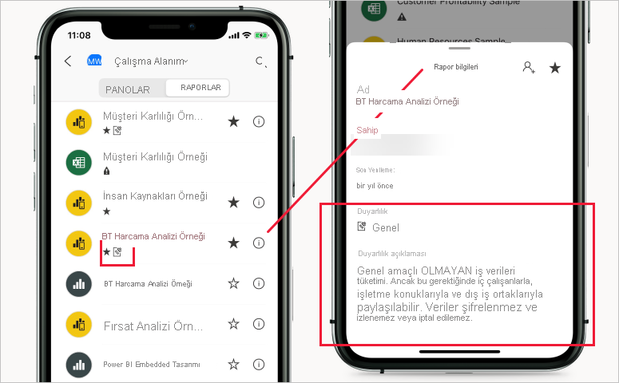

# Power BI'da duyarlılık etiketleri

Bu makalede Power BI'daki [Microsoft Information Protection duyarlılık etiketlerinin](https://docs.microsoft.com/microsoft-365/compliance/sensitivity-labels?view=o365-worldwide) işlevleri anlatılmaktadır. Duyarlılık etiketlerini Power BI raporlarına, panolarına, veri kümelerine ve veri akışlarına uygulama hakkında bilgi için bkz. [Power BI'da duyarlılık etiketleri uygulama](./service-security-apply-data-sensitivity-labels.md). Kiracınızda duyarlılık etiketlerini etkinleştirme hakkında bilgi için bkz. [Power BI'da veri duyarlılığı etiketlerini etkinleştirme](service-security-enable-data-sensitivity-labels.md).

Microsoft Information Protection duyarlılık etiketleri, kullanıcılarınızın Power BI'daki kritik içeriği üretkenliği veya işbirliğini etkilemeden sınıflandırmasına yardımcı olan kolay bir yöntem sunar.

Duyarlılık etiketleri veri kümelerine, raporlara, panolara ve veri akışlarına uygulanabilir. Excel, PowerPoint veya PDF dosyalarından Power BI'a veri aktarıldığında, bu veriler Power BI'dan dışarı aktarılırken otomatik olarak bir duyarlılık etiketi uygulanır ve etiketin sağladığı dosya şifreleme ayarlarına göre koruma sağlanır. Bu şekilde verileriniz nerede olursa olsun koruma altında olmaya devam eder.

Power BI raporlarına, panolarına, veri kümelerine ve veri akışlarına uygulanan duyarlılık etiketleri, Power BI hizmetindeki birçok noktada görünür. Raporlardaki ve panolardaki duyarlılık etiketleri ayrıca Power BI iOS ve Android mobil uygulamalarında ve başka yerlere eklenen görsellerde de görülebilir.

Power BI yönetim portalında bulunan [koruma ölçümleri raporu](service-security-data-protection-metrics-report.md), Power BI yöneticilerine Power BI kiracısındaki hassas veriler üzerinde tam görünürlük sağlar. Ayrıca Power BI denetim günlükleri de etiket uygulama, kaldırma ve değiştirme gibi etkinliklerin yanı sıra raporları ve panoları görüntüleme gibi etkinlikler hakkında duyarlılık etiketi bilgileri sunar. Bu sayede Power BI ve güvenlik yöneticileri izleme, araştırma ve güvenlik uyarıları amacıyla hassas verilerin kullanımı üzerinde görünürlük sahibi olur.

## Önemli noktalar

Duyarlılık etiketlemesi Power BI’daki içeriğe erişimi **etkilemez**. Power BI’daki içeriğe erişim yalnızca Power BI izinleri tarafından yönetilir. Etiketler görünür olduğundan, ilişkili şifreleme ayarlarının ([Microsoft 365 güvenlik merkezinde](https://security.microsoft.com/) veya [Microsoft 365 uyumluluk merkezinde](https://compliance.microsoft.com/) yapılandırılan) hiçbiri uygulanmaz. Yalnızca Excel, PowerPoint ve PDF dosyalarına dışarı aktarılan verilere uygulanırlar.

Duyarlılık etiketleri ve dosya şifreleme Excel, PowerPoint ve PDF’ye dışarı aktarmalar dışındaki hiçbir dışarı aktarma yoluna **uygulanmaz**. Power BI kiracı yöneticisi, duyarlılık etiketlerinin ve bu etiketlerle ilişkili dosya şifreleme ayarlarının uygulanmasını desteklemeyen dışarı aktarma yollarının bir kısmını veya tamamını devre dışı bırakabilir.

>[!NOTE]
> [Satır düzeyi güvenlik (RLS)](./service-admin-rls.md), erişimlerini kısıtlamadığı sürece, bir rapora erişim izni verilen kullanıcılara temeldeki veri kümesinin tamamına erişim izni verilmiş olur. Rapor yazarları, duyarlılık etiketlerini kullanarak raporları sınıflandırıp etiketleyebilir. Duyarlılık etiketinde koruma ayarları varsa Power BI bu koruma ayarlarını rapor verilerini Excel’e, PowerPoint’e veya PDF dosyalarına aktardığında uygular. Korumalı dosyaları yalnızca yetkili kullanıcılar açabilir.

## Duyarlılık etiketlerinin Power BI’daki işleyişi

Bir Power BI panosuna, raporuna, veri kümesine veya veri akışına duyarlılık etiketi uygulamanız, bu kaynağa aşağıdaki avantajlara sahip bir etiket uygulamaya benzer:
* **Özelleştirilebilir** - Kuruluşunuzda Kişisel, Ortak, Genel, Gizli ve Çok Gizli gibi farklı düzeylerde hassas içerikler için kategoriler oluşturabilirsiniz.
* **Düz metin** - Etiket düz metin biçiminde olduğundan, kullanıcıların duyarlılık etiketi yönergelerine uygun olarak içeriğin nasıl işleneceğini anlaması kolaydır.
* **Kalıcı**: İçeriğe bir duyarlılık etiketi uygulandıktan sonra Excel, PowerPoint ve PDF dosyalarına dışarı aktarılan içeriğe eşlik eder ve ilkelerin uygulanıp zorunlu tutulmasına yönelik bir temel oluşturur.

Aşağıda Power BI’da duyarlılık etiketinin işleyişi hakkında kısa bir örnek verilmiştir. Aşağıdaki görüntü bir duyarlılık etiketinin Power BI hizmetinde bir rapora uygulanmasını, ardından rapordaki verilerin bir Excel dosyasına aktarılmasını ve son olarak duyarlılık etiketinin ve korumalarının dışarı aktarılan dosyada mevcut olduğunu göstermektedir.

Microsoft Office uygulamalarında duyarlılık etiketi, yukarıdaki görüntüdekine benzer şekilde e-posta veya belge üzerinde etiket olarak görünür.

Ayrıca, Power BI genelinde kullanılan ve paylaşılan içerikle kalıcı hale gelip dolaşan içeriğe bir sınıflandırma (etiket gibi) atayabilirsiniz. Bu sınıflandırmayı kullanarak kullanım raporları oluşturabilir ve hassas içeriğiniz için etkinlik verilerini görebilirsiniz. Bu bilgilere göre, koruma ayarlarını uygulamayı daha sonra dilediğiniz zaman seçebilirsiniz.

## Yeni içerik oluşturulduğunda duyarlılık etiketinin devralınması

Power BI hizmetinde oluşturulan yeni raporlar ve panolar, otomatik olarak üst veri kümesine veya rapora önceden uygulanmış olan duyarlılık etiketini devralır. Örneğin "Çok Gizli" duyarlılık etiketine sahip olan bir veri kümesinden oluşturulan yeni rapora da otomatik olarak "Çok Gizli" etiketi uygulanır.

Aşağıdaki görüntüde veri kümesinin duyarlılık etiketinin, veri kümesinden oluşturulan yeni rapora otomatik olarak nasıl uygulandığı gösterilmiştir.

>[!NOTE]
>Herhangi bir nedenden dolayı duyarlık etiketi yeni rapor veya panoya uygulanamazsa, Power BI yeni öğenin oluşturulmasını **engellemez**.

## Dışarı aktarılan verilerde duyarlılık etiketleri ve koruma

Excel, PowerPoint veya PDF dosyalarından Power BI'a veri aktarıldığında, bu veriler Power BI'dan dışarı aktarılırken otomatik olarak bir duyarlılık etiketi uygulanır ve etiketin sağladığı dosya şifreleme ayarlarına göre koruma sağlanır. Bu şekilde verileriniz nerede olursa olsun koruma altında olmaya devam eder.

Power BI’dan dosya aktaran kullanıcının, duyarlık etiketi ayarlarına uygun olarak bu dosyaya erişme ve dosyayı düzenleme izinleri vardır. Kullanıcıya dosya için sahip izinleri verilmez.

Veriler .csv veya .pbix dosyalarına veya başka bir dışarı aktarma yoluna aktarıldığında duyarlılık etiketleri ve koruma uygulanmaz.

Dışarı aktarılan bir dosyaya duyarlılık etiketi ve koruma uygulandığında, dosyaya içerik işaretlemesi eklenmez. Ancak, etiket içerik işaretlemelerini uygulayacak şekilde yapılandırıldıysa dosya Office masaüstü uygulamalarında açıldığında içerik işaretlemeleri Azure Information Protection birleşik etiketleme istemcisi tarafından otomatik olarak uygulanır. Masaüstü uygulamaları, mobil uygulamalar ve web uygulamaları için yerleşik etiketleme kullandığınızda içerik işaretlemeleri otomatik olarak uygulanmaz. Diğer ayrıntılar için bkz. [Office uygulamaları içerik işaretlemesini ve şifrelemeyi ne zaman uygular?](https://docs.microsoft.com/microsoft-365/compliance/sensitivity-labels-office-apps?view=o365-worldwide#when-office-apps-apply-content-marking-and-encryption).

Veriler bir dosyaya dışarı aktarıldığında etiket uygulanamıyorsa dışarı aktarma işlemi başarısız olur. Dışarı aktarma işleminin etiket uygulanamadığından başarısız olup olmadığını denetlemek için başlık çubuğunun ortasındaki rapor veya pano adına tıklayın ve açılan bilgi menüsünde “Duyarlılık etiketi yüklenemiyor” yazıp yazmadığına bakın. Bu durum, geçici bir sistem sorununun sonucunda veya uygulanan etiket güvenlik yöneticisi tarafından yayımdan kaldırıldıysa ortaya çıkabilir.

## Excel’de Çözümle seçeneğinde duyarlılık etiketi devralma

Power BI veri kümesine canlı bağlantıyla Excel’de bir PivotTable oluşturduğunuzda (Power BI’dan [Excel’de Çözümle](../collaborate-share/service-analyze-in-excel.md) seçeneğiyle veya [Excel](https://support.microsoft.com/office/create-a-pivottable-from-power-bi-datasets-31444a04-9c38-4dd7-9a45-22848c666884?ui=en-US&rs=en-US&ad=US)’den bunu yapabilirsiniz), veri kümesinin duyarlılık etiketi devralınır ve ilişkili koruma ile birlikte Excel dosyanıza uygulanır. Daha sonra veri kümesindeki etiket daha kısıtlayıcı bir etiketle değiştirilirse, bağlantılı Excel dosyasında uygulanan etiket, veri yenilemesinden sonra otomatik olarak güncelleştirilir.

 
Excel’de el ile ayarlanmış olan duyarlılık etiketlerinin üzerine, veri kümesinin duyarlılık etiketi tarafından otomatik olarak yazılmaz. Bunun yerine bir başlık, veri kümesinin duyarlılık etiketi içerdiğini size bildirir ve bunu uygulamanızı önerir.

>[!NOTE]
>Veri kümesinin duyarlılık etiketi, Excel dosyasının duyarlılık etiketinden daha az kısıtlayıcıysa, etiket devralma veya güncelleştirme işlemi gerçekleşmez. Excel dosyası hiçbir zaman daha az kısıtlayıcı bir duyarlılık etiketini devralmaz.

## Eklenen raporlarda ve panolarda duyarlılık etiketi kalıcılığı

Power BI raporlarını, panolarını ve görsellerini Microsoft Teams ve SharePoint gibi iş uygulamalarına veya bir kuruluşun web sitesine ekleyebilirsiniz. Eklediğiniz görsele, rapora veya panoya bir duyarlılık etiketi uygulanmışsa ilgili duyarlılık etiketi eklenmiş görünümde görünür ve veriler Excel'e aktarıldığında hem etiket hem de koruma düzeyi kalıcı olur.

Aşağıdaki ekleme senaryoları desteklenir:
* [Kuruluşunuz için ekleme](../developer/embedded/embed-sample-for-your-organization.md)
* Microsoft 365 uygulamaları (örneğin, [Teams](../collaborate-share/service-embed-report-microsoft-teams.md) ve [SharePoint](../collaborate-share/service-embed-report-spo.md))
* [Güvenli URL ekleme](../collaborate-share/service-embed-secure.md) (Power BI hizmetinden ekleme) 

## Power BI mobil uygulamalarında duyarlılık etiketleri

Duyarlılık etiketleri, Power BI mobil uygulamalarından açılan raporlar ve panolarda görüntülenebilir. Raporun veya panonun adının yanında görünen bir simgeyle ilgili öğeye duyarlılık etiketi uygulanmış olduğu gösterilir. Etiketin türü ve açıklaması, raporun veya panonun bilgi kutusunda yer alır.

## Desteklenen bulutlar
Duyarlılık etiketleri yalnızca küresel (genel) bulutlardaki kiracılarda desteklenir, ulusal bulutlar gibi bulutlar içindeki kiracılar için desteklenmez.

## Lisanslama ve gereksinimler

Bkz. [Lisanslama ve gereksinimler](service-security-enable-data-sensitivity-labels.md#licensing-and-requirements).

## Duyarlılık etiketi oluşturma ve yönetme

Duyarlılık etiketleri [Microsoft 365 güvenlik merkezi](https://security.microsoft.com/) ya da [Microsoft 365 uyumluluk merkezi](https://compliance.microsoft.com/) içinde oluşturulur ve yönetilir.

Bu merkezlerin birinde duyarlılık etiketlerine erişmek için **Sınıflandırma > Duyarlılık etiketleri**’ne gidin. Bu duyarlılık etiketleri Azure Information Protection, Office uygulamaları ve Office 365 hizmetleri gibi birden çok Microsoft hizmeti tarafından kullanılabilir.

>[!Important]
> Kuruluşunuzda Azure Information Protection duyarlılık etiketleri kullanılıyorsa bunları Power BI’da kullanılabilmeleri için önceden listelenen hizmetlerden birine [geçirmeniz](https://docs.microsoft.com/azure/information-protection/configure-policy-migrate-labels) gerekir.

## Sınırlamalar

Aşağıdaki listede, Power BI’daki duyarlılık etiketlerinin bazı sınırlamaları verilmiştir:

* Duyarlılık etiketleri yalnızca panolara, raporlara, veri kümelerine ve veri akışlarına uygulanabilir. Bunlar, şu anda [sayfalandırılmış raporlar](../paginated-reports/report-builder-power-bi.md) ve çalışma kitapları için kullanılamaz.
* Power BI varlıklarındaki duyarlılık etiketleri çalışma alanı listesi, veri kökeni, sık kullanılanlar, son kullanılanlar ve uygulama görünümlerinde görünür durumdadır. Etiketler şu anda “benimle paylaşılan” görünümünde görünür değildir. Ancak, görünür olmasa bile, Power BI varlığına uygulanmış bir etiketin Excel, PowerPoint ve PDF dosyalarına aktarılmış veriler üzerinde her zaman kalıcı olacağını unutmayın.
* Veri duyarlılık etiketleri şablon uygulamaları için desteklenmez. Şablon uygulama oluşturucu tarafından ayarlanan duyarlılık etiketleri, uygulama ayıklandığında ve yüklendiğinde kaldırılır ve yüklü bir şablon uygulamada uygulama tüketicisi tarafından yapıtlara eklenen duyarlılık etiketleri, uygulama güncelleştirildiğinde kaybolur (sıfırlanır).
* Power BI [İletme](https://docs.microsoft.com/microsoft-365/compliance/encryption-sensitivity-labels?view=o365-worldwide#let-users-assign-permissions), [kullanıcı tanımlı](https://docs.microsoft.com/microsoft-365/compliance/encryption-sensitivity-labels?view=o365-worldwide#let-users-assign-permissions) ve [HYOK](https://docs.microsoft.com/azure/information-protection/configure-adrms-restrictions) koruma türlerinin duyarlılık etiketlerini desteklemez. İletme ve kullanıcı tanımlı koruma türleri [Microsoft 365 güvenlik merkezinde](https://security.microsoft.com/) ve [Microsoft 365 uyumluluk merkezinde](https://compliance.microsoft.com/) tanımlanan etiketleri ifade eder.
* Kullanıcıların Power BI’da üst etiketler uygulamaları önerilmez. İçeriğe bir üst etiket uygulandıysa bu içerikten bir dosyaya (Excel, PowerPoint ve PDF) veri aktarma işlemi başarısız olur. Bkz. [Alt etiketler (gruplandırma etiketleri)](https://docs.microsoft.com/microsoft-365/compliance/sensitivity-labels?view=o365-worldwide#sublabels-grouping-labels).

## Sonraki adımlar

Bu makalede, Power BI'da veri korumasına genel bakış sunulmuştur. Aşağıdaki makalelerde Power BI’da veri koruma hakkında daha fazla bilgi verilmektedir. 

* [Power BI’da duyarlılık etiketlerini etkinleştirme](service-security-enable-data-sensitivity-labels.md)
* [Power BI'da duyarlılık etiketlerini uygulama](service-security-apply-data-sensitivity-labels.md)
* [Power BI’da Microsoft Cloud App Security denetimlerini kullanma](service-security-using-microsoft-cloud-app-security-controls.md)
* [Koruma ölçümleri raporu](service-security-data-protection-metrics-report.md)