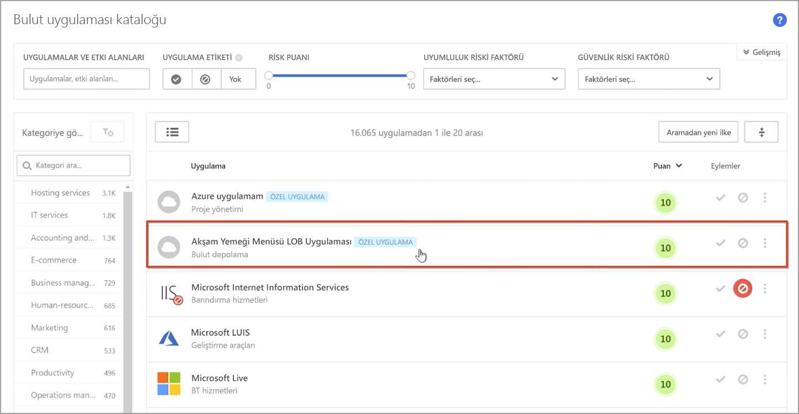
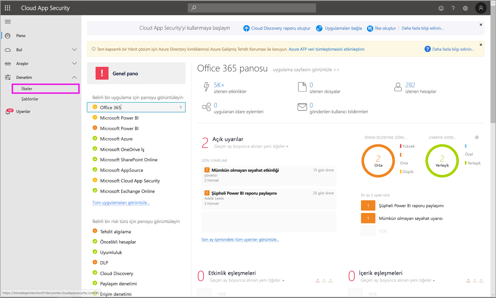
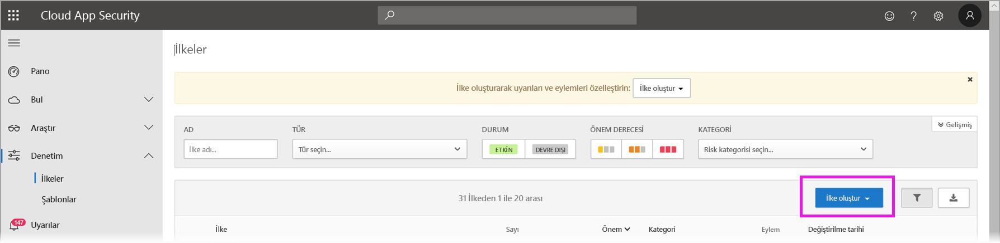
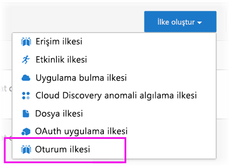
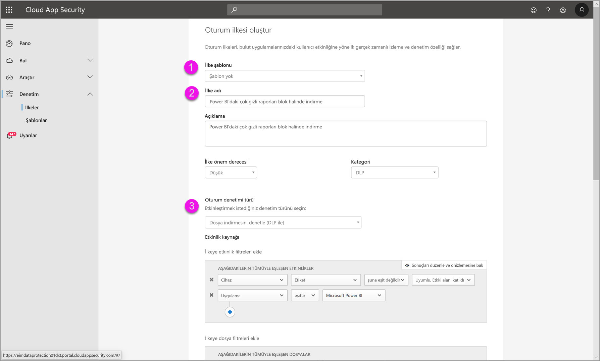
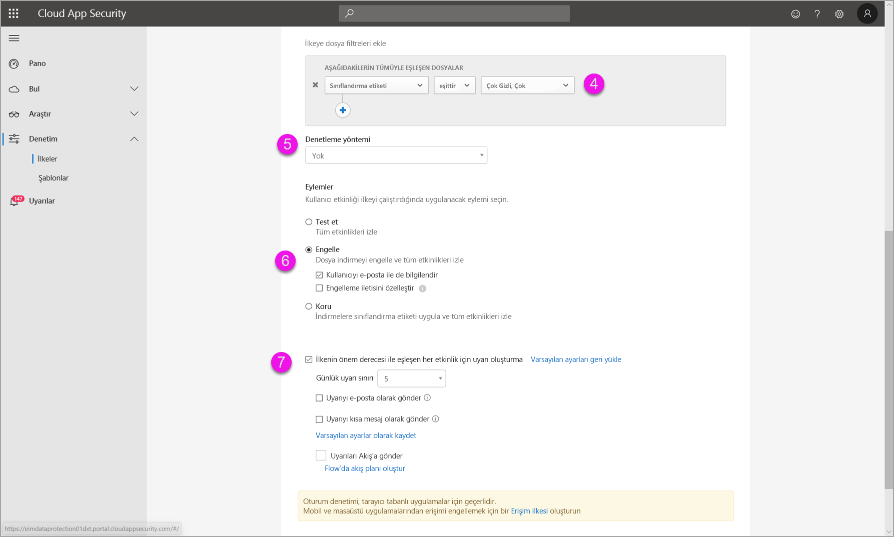
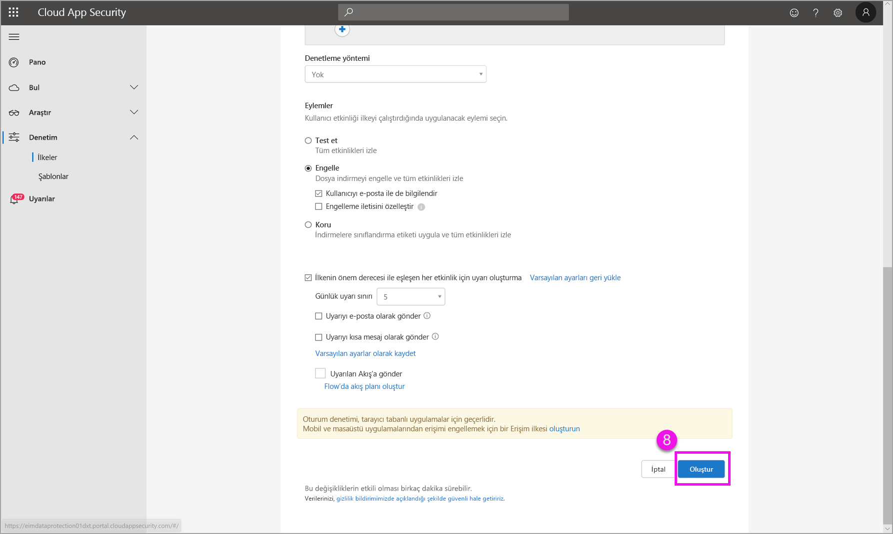

# Power BI’da Microsoft bulut uygulaması güvenlik denetimlerini kullanma (önizleme)

Power BI ile Microsoft Cloud App Security’yi kullanarak Power BI raporlarınızı, verilerinizi ve hizmetlerinizi istenmeyen sızıntı veya ihlallerden korumaya yardımcı olabilirsiniz. Cloud App Security sayesinde, Azure Active Directory’deki (Azure AD) gerçek zamanlı oturum denetimlerini kullanarak kuruluşunuzun verileri için Power BI analizlerinin güvenli olmasına yardımcı olacak koşullu erişim ilkeleri oluşturabilirsiniz. Bu ilkeler ayarlandıktan sonra yöneticiler kullanıcı erişimini ve etkinliğini izleyebilir, gerçek zamanlı risk analizi gerçekleştirebilir ve etikete özel denetimler belirleyebilir. 

Microsoft Cloud App Security’yi yalnızca Power BI değil, her türlü uygulama ve hizmet için yapılandırabilirsiniz. Cloud App Security, uygulamaları ve cihazları koruyan bir Microsoft hizmetidir ve kendi panosu üzerinden yönetilir. Power BI verileriniz ve analizlerinizin Cloud App Security korumalarının avantajlarından yararlanması için Cloud App Security’yi Power BI ile çalışacak şekilde yapılandırmanız gerekir. İşleyişi, panosu ve uygulama risk puanları dahil olmak üzere Cloud App Security hakkında daha fazla bilgi için [Microsoft Cloud App Security](https://docs.microsoft.com/cloud-app-security/) belgelerine bakın.

## Power BI ile Microsoft Cloud App Security kullanma

Power BI ile Microsoft Cloud App Security’yi kullanmak için, bazıları Power BI dışında ayarlanan ilgili Microsoft güvenlik hizmetlerini kullanmanız ve yapılandırmanız gerekir.

### Microsoft Cloud App Security lisansı

Kiracınızda Microsoft Cloud App Security’yi kullanmak için aşağıdaki lisanslardan birine sahip olmanız gerekir:
* MCAS: EMS E5 ve M365 E5 paketlerinin bir parçası olarak tüm desteklenen uygulamalar için OCAS özellikleri sağlar.
* CAS-D: Yalnızca MCAS Bulmayı sağlar.
* OCAS: Yalnızca Office E5 Suite'in bir parçası olarak Office 365 için MCAS özellikleri sağlar.
* İsteğe bağlı: Başlıca Microsoft Cloud App Security özelliklerinden faydalanmak için AAD P1 ve AIP P1.

Aşağıdaki bölümlerde Power BI’da Microsoft Cloud App Security kullanma adımları açıklanır.

### Azure Active Directory'de oturum ilkelerini ayarlama (gerekli)
Oturum denetimlerini ayarlamak için gereken adımlar, Azure AD ve Microsoft Cloud App Security portallarında tamamlanır. Azure AD portalında Power BI için bir koşullu erişim ilkesi oluşturup Microsoft Cloud App Security hizmeti aracılığıyla Power BI kullanılan oturumları yönlendirebilirsiniz. 

Microsoft Cloud App Security, bir ters ara sunucu mimarisi kullanarak çalışır ve Power BI kullanıcı etkinliğini gerçek zamanlı olarak izlemek için Azure AD koşullu erişimiyle tümleşiktir. Aşağıdaki adımlar, işlemi anlamanıza yardımcı olmak için verilmiştir ve aşağıdaki adımların her birinde bağlantısı verilen içerikte ayrıntılı adım adım yönergeler sunulmaktadır. İşlemin tamamını açıklayan bu [Cloud App Security makalesini](https://docs.microsoft.com/cloud-app-security/proxy-deployment-aad) de okuyabilirsiniz.

1.  [Azure AD koşullu erişim testi ilkesi oluşturma](https://docs.microsoft.com/cloud-app-security/proxy-deployment-aad#add-azure-ad)
2.  [İlke kapsamındaki bir kullanıcıyı kullanarak her bir uygulamada oturum açma](https://docs.microsoft.com/cloud-app-security/proxy-deployment-aad#sign-in-scoped)
3.  [Uygulamaların erişim ve oturum denetimlerini kullanacak şekilde yapılandırıldığını doğrulama](https://docs.microsoft.com/cloud-app-security/proxy-deployment-aad#portal)
4.  [Dağıtımı test etme](https://docs.microsoft.com/cloud-app-security/proxy-deployment-aad#step-4-test-the-deployment)

Oturum ilkelerini ayarlama işlemi, [Oturum ilkeleri](https://docs.microsoft.com/cloud-app-security/session-policy-aad) makalesinde ayrıntılı olarak açıklanmıştır. 

### PBI etkinliklerini izlemek için anomali algılama ilkelerini ayarlama (önerilir)
Yalnızca ilkeye dahil etmek ve ilkeden dışlamak istediğiniz kullanıcılar ve gruplar için geçerli olacak şekilde bağımsız kapsamlı olabilecek anomali Power BI algılama ilkeleri tanımlayabilirsiniz. [Daha fazla bilgi edinin](https://docs.microsoft.com/cloud-app-security/anomaly-detection-policy#scope-anomaly-detection-policies).

Cloud App Security, Power BI için iki ayrılmış iki yerleşik algılamaya sahiptir. [Ayrıntılı bilgi için bu belgenin ilerleyen kısımlarındaki bölüme bakın](#built-in-microsoft-cloud-app-security-detections-for-power-bi).

### Microsoft Information Protection duyarlılık etiketlerini kullanma (önerilir)

Duyarlılık etiketleri, kuruluşunuzdaki kullanıcıların kuruluşunuzun dışındaki iş ortaklarıyla işbirliği yapabilmesi yaparken gizli içerik ve veriler konusunda dikkatli ve bilinçli olmaya devam etmesi için gizli içerikleri sınıflandırmanızı sağlar ve korumaya yardımcı olur. 

Power BI için duyarlılık etiketlerini kullanma işlemiyle ilgili ayrıntılı bilgiler veren [Power BI’da duyarlılık etiketleri](../designer/service-security-apply-data-sensitivity-labels.md) makalesini okuyun. [Duyarlılık etiketlerini temel alan bir Power BI ilkesi örneği](#example) için aşağıya bakın.

## Power BI için yerleşik Microsoft Cloud App Security algılamaları

Microsoft Cloud App Security algılamaları, yöneticilerin izlenen bir uygulamanın belirli etkinliklerini izlemesini sağlar. Power BI için şu anda iki tane ayrılmış ve yerleşik Cloud App Security algılaması vardır: 

* **Şüpheli paylaşım** – bir kullanıcı bilinmeyen (kuruluşa dışından) bir e-posta ile hassas bir raporu paylaştığında algılar. Hassas rapor, duyarlılık etiketi **YALNIZCA ŞİRKET İÇİ** olarak ayarlanmış bir rapordur. 

* **Raporların toplu paylaşımı** – bir kullanıcı tek oturumda çok sayıda farklı rapor paylaştığında algılar.

Bu algılamaların ayarları Cloud App Security portalında yapılandırılır. [Daha fazla bilgi edinin](https://docs.microsoft.com/cloud-app-security/anomaly-detection-policy#unusual-activities-by-user). 

## Microsoft Cloud App Security’de Power BI yönetici rolü

Power BI ile Microsoft Cloud App Security kullanılırken Power BI yöneticileri için yeni bir rol oluşturulur. [Cloud App Security portalında](https://portal.cloudappsecurity.com/) Power BI yöneticisi olarak oturum açtığınızda, Power-BI ile ilgili verilere, uyarılara, risk altındaki kullanıcılara, etkinlik günlüklerine ve diğer bilgilere erişiminiz sınırlıdır.

## Önemli noktalar ve sınırlamalar 
Power BI ile Cloud App Security kullanımı, kullanıcı oturumlarını ve etkinliklerini izleyen algılamalarla birlikte kuruluşunuzun içerik ve verilerinin güvenliğini sağlamaya yardımcı olmak için tasarlanmıştır. Power BI ile Cloud App Security kullanırken aklınızda tutmanız gereken bazı noktalar ve sınırlamalar vardır:

* Microsoft Cloud App Security yalnızca Excel, PowerPoint ve PDF dosyalarında çalışabilir.
* Power BI için oturum ilkelerinizde duyarlılık etiketleri özelliklerini kullanmak istiyorsanız, bir Azure Information Protection Premium P1 veya Premium P2 lisansına sahip olmanız gerekir. Microsoft Azure Information Protection tek başına ya da Microsoft lisanslama paketlerinden biri aracılığıyla satın alınabilir. Ayrıntılı bilgi için [Azure Information Protection fiyatlandırmasına](https://azure.microsoft.com/pricing/details/information-protection/) bakın. Ayrıca, duyarlılık etiketlerinin Power BI varlıklarınıza uygulanmış olması gerekir.
* Oturum denetimi her işletim sistemi üzerinde, her platforma her tarayıcı için kullanılabilir. Internet Explorer 11, Microsoft Edge (en son), Google Chrome (en son), Mozilla Firefox (en son) veya Apple Safari (en son) kullanmanızı öneririz. Power BI genel API çağrıları ve tarayıcı tabanlı olmayan diğer oturumlar, Microsoft Cloud App Security oturum denetiminin bir parçası olarak desteklenmez. [Ek ayrıntıları görüntüleyin](https://docs.microsoft.com/cloud-app-security/proxy-intro-aad#supported-apps-and-clients).

> [!CAUTION]
> * Microsoft Cloud App Security üzerindeki *içerik denetleme* ilkesi şu anda bir Excel dosya ilkesi uygulanırken Power BI’da kullanılamamaktadır; bu nedenle bu ilkeyi Power BI için ayarlamayın.
> * Oturum ilkesinde, "Eylem" bölümündeki "koru" özelliği yalnızca öğede bir etiket yoksa çalışır. Zaten bir etiket varsa "koru" eylemi uygulanmaz; Power BI’de bir öğeye zaten uygulanmış olan mevcut bir etiketi geçersiz kılamazsınız.

## Örnek

Aşağıdaki örnek, Power BI ile Microsoft Cloud App Security kullanarak yeni bir oturum ilkesi oluşturmayı göstermektedir.

İlk olarak yeni bir oturum ilkesi oluşturun. **Cloud App Security** portalında soldaki menüden **İlkeler**’i seçin.

Görüntülenen pencerede **İlke Oluştur** açılır listesini seçin.

Açılan listedeki seçenekler listesinden **Oturum ilkesi**'ni seçin.

Görüntülenen pencerede oturum ilkesini oluşturun. Numaralandırılmış adımlarda aşağıdaki görüntünün ayarları açıklanır.

  1. **İlke şablonu** açılır penceresinde *Şablon yok*'u seçin.
  2. **İlke adı** kutusunda oturum ilkeniz için ilgili bir ad belirtin.
  3. **Oturum denetim türü** için *Denetim dosyası indirildi (DLP ile)* seçeneğini belirleyin.

      **Etkinlik kaynağı** bölümünde ilgili engelleme ilkelerini seçin. Yönetilmeyen ve uyumlu olmayan cihazların engellenmesini öneririz. Oturum Power BI’da olduğunda indirmeleri engellemeyi seçin.

        

        Sayfayı aşağı kaydırdığınızda daha fazla seçenek görürsünüz. Aşağıdaki görüntüde, ek örneklerle birlikte bu seçenekler gösterilmektedir. 

  4. *Gizlilik etiketi*’ni *son derece gizli* olarak veya kuruluşunuza en uygun seçenek olarak belirleyin.
  5. **Denetleme yöntemi**’ni *hiçbiri* olarak değiştirin.
  6. İhtiyaçlarınıza uyan **Engelle** seçeneğini belirleyin.
  7. Böyle bir eylem için uyarı oluşturduğunuzdan emin olun.

        

        

  8. Son olarak, oturum ilkesini oluşturmak için **Oluştur** düğmesini seçtiğinizden emin olun.

        

> [!CAUTION]
> Power BI Excel dosyaları üzerinde bir **İçerik İnceleme** ilkesi oluşturmadığınızdan emin olun. Bu sınırlama, bu *önizleme* sürümünün bilinen bir sınırlamasıdır.

## Sonraki adımlar
Bu makalede Microsoft Cloud App Security’nin Power BI için veri ve içerik korumalarını nasıl sağlayabileceği açıklanmıştır. Power BI için Veri Koruma ve onu etkinleştiren Azure hizmetleri için destekleyici içerikleri açıklayan aşağıdaki makaleler de ilginizi çekebilir.

* [Power BI’da veri korumasına genel bakış](service-security-data-protection-overview.md)
* [Power BI'da veri duyarlılığı etiketlerini etkinleştirme](service-security-enable-data-sensitivity-labels.md)
* [Power BI'da veri duyarlılığı etiketleri uygulama](../designer/service-security-apply-data-sensitivity-labels.md)

Aşağıdaki Azure ve güvenlik makaleleri de ilginizi çekebilir:

* [Microsoft Cloud App Security Koşullu Erişim Uygulama Denetimi ile uygulamaları koruma](https://docs.microsoft.com/cloud-app-security/proxy-intro-aad)
* [Öne çıkan uygulamalar için Koşullu Erişim Uygulama Denetimi dağıtma](https://docs.microsoft.com/cloud-app-security/proxy-deployment-aad)
* [Oturum ilkeleri](https://docs.microsoft.com/cloud-app-security/session-policy-aad)
* [Duyarlılık etiketlerine genel bakış](https://docs.microsoft.com/microsoft-365/compliance/sensitivity-labels)
* [Veri koruma ölçümleri raporu](service-security-data-protection-metrics-report.md)