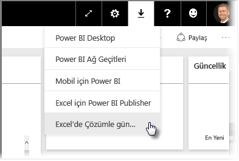
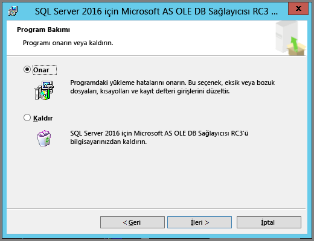
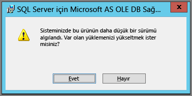

# Excel'de Çözümle özelliği ile ilgili sorunları giderme

Excel'de Çözümle özelliğini kullanırken beklemediğiniz bir sonuç aldığınız veya özelliğin beklediğiniz şekilde çalışmadığı durumlarla karşılaşabilirsiniz. Bu sayfada, Excel'de Çözümle özelliği ile ilgili olarak sık karşılaşılan sorunların çözümleri açıklanmaktadır.

> [!NOTE]
> [Excel'de Çözümle](service-analyze-in-excel.md) özelliğinin açıklandığı ve bu özelliği etkinleştirme konusunda bilgilerin sunulduğu ayrı bir sayfa daha bulunur.
> 
> Aşağıda belirtilmemiş bir senaryoyla karşılaşırsanız ve bu durum sorun yaratırsa daha fazla yardım almak için [topluluk sitesine](https://community.powerbi.com/) başvurabilir veya bir [destek bileti](https://powerbi.microsoft.com/support/) oluşturabilirsiniz.
> 
> 

Bu makale, aşağıdaki sorun giderme bölümlerini içermektedir:

* OLE DB sağlayıcısı için Excel kitaplıklarını güncelleştirme
* Excel kitaplıklarının güncelleştirilmesi gerekip gerekmediğini belirleme
* Bağlantı kurulamıyor hatası
* Yasak hatası
* Veri modeli bulunmaması
* Belirtecin süresi doldu hatası
* Şirket içi Analysis Services'e erişilememesi
* PivotTable Değerleri alanına (ölçü yok) herhangi bir öğenin sürüklenememesi

## OLE DB sağlayıcısı için Excel kitaplıklarını güncelleştirme
**Excel'de Çözümle** özelliğini kullanabilmeniz için bilgisayarınızda güncel bir AS OLE DB sağlayıcısı yüklü olmalıdır. Bu [topluluk gönderisi](https://community.powerbi.com/t5/Service/Analyze-in-Excel-Initialization-of-the-data-source-failed/m-p/30837#M8081), OLE DB sağlayıcısı yüklemenizi doğrulamak veya yeni bir sürüm indirmek için mükemmel bir kaynaktır.

Excel kitaplıkları, Windows sürümünüzle bit düzeyi bakımından eşleşmelidir. 64 bit Windows yüklüyse 64 bit OLE DB sağlayıcısını yüklemeniz gerekir.

En son Excel kitaplıklarını indirmek için Power BI'ı açın ve Power BI hizmetinin sağ üst köşesindeki **aşağı ok** simgesine tıklayarak **Excel'de Çözümle güncelleştirmeleri** seçeneğini belirleyin.

Açılan iletişim kutusunda **İndir (önizleme)** seçeneğini belirleyin.

## Excel kitaplıklarının güncelleştirilmesi gerekip gerekmediğini belirleme
Önceki bölümde verilen bağlantılardan Excel OLE DB sağlayıcısı kitaplıklarının en son sürümünü indirebilirsiniz. Uygun OLE DB sağlayıcısı kitaplığını indirip yüklemeyi başlatmanızın ardından, yüklü sürümünüze yönelik denetimler gerçekleştirilir.

Excel OLE DB sağlayıcısı istemci kitaplıklarınız güncelse aşağıdaki gibi bir iletişim kutusu açılır:

Alternatif olarak, yüklemekte olduğunuz yeni sürüm, bilgisayarınızda yüklü olan sürümden daha yeniyse aşağıdaki iletişim kutusu görüntülenir:

Yükseltme yapmanızı isteyen iletişim kutusunu görürseniz bilgisayarınıza OLE DB sağlayıcısının en yeni sürümünün yüklenmesini sağlamak için, yükleme işlemine devam etmeniz gerekir.

## Bağlantı kurulamıyor hatası
*Bağlantı kurulamıyor* hatasının birincil nedeni bilgisayarınızdaki OLE DB sağlayıcısı istemci kitaplıklarının güncel olmamasıdır. Doğru güncelleştirmenin nasıl belirleneceği ve indirme bağlantıları hakkında bilgi için bu makalenin **OLE DB sağlayıcısı için Excel kitaplıklarını güncelleştirme** bölümüne başvurun.

## Yasak hatası
Bazı kullanıcılar birden çok Power BI hesabına sahiptir ve Excel mevcut kimlik bilgileriyle Power BI'a bağlanmaya çalıştığında, erişmek istediğiniz veri kümesi veya rapora erişimi olmayan kimlik bilgilerini kullanabilir.

Böyle bir durumda **Yasak** başlıklı bir hata alabilirsiniz. Bu hata, söz konusu veri kümesine erişim izni bulunmayan kimlik bilgileriyle oturum açmış olabileceğiniz anlamına gelir. **Yasak** hatasıyla karşılaştıktan sonra kimlik bilgilerinizi girmeniz istendiğinde, kullanmaya çalıştığınız veri kümesine erişim izni olan kimlik bilgilerini kullanın.

Hata almaya devam ediyorsanız erişim izni olan hesabınızla Power BI'da oturum açın ve Excel'de erişmeye çalıştığınız veri kümesini Power BI'da görüntüleyebildiğinizi ve veri kümesine erişebildiğinizi doğrulayın.

## Veri modeli bulunmaması
**Can't find OLAP cube model** (OLAP küp modeli bulunamıyor) hatası alıyorsanız bu, erişmeye çalıştığınız veri kümesinin, veri modeli içermediği için Excel'de çözümlenemediği anlamına gelir.

## Belirtecin süresi doldu hatası
**Token expired** (Belirtecin süresi doldu) hatası alıyorsanız bu, **Excel'de Çözümle** özelliğini, çalıştığınız bilgisayarda son zamanlarda kullanmadığınız anlamına gelir. Kimlik bilgilerinizi tekrar girdiğinizde veya dosyayı yeniden açtığınızda hatanın kaybolması gerekir.

## Şirket içi Analysis Services'e erişilememesi
Şirket içi Analysis Services verilerine bağlantısı bulunan bir veri kümesine erişmeye çalışıyorsanız hata iletisiyle karşılaşabilirsiniz. **Excel'de Çözümle** özelliği, bir bağlantı dizesiyle şirket içi **Analysis Services**'deki veri kümelerine ve raporlara bağlanmayı desteklememektedir. Bunun için bilgisayarınızın **Analysis Services** sunucusuyla aynı etki alanında olması ve hesabınızın söz konusu **Analysis Services** sunucusuna erişimi olması gerekir.

## PivotTable Değerleri alanına (ölçü yok) herhangi bir öğenin sürüklenememesi
**Excel'de Çözümle** özelliği bir dış OLAP modeline bağlandığında (bu, Excel'in Power BI'a bağlanma yöntemidir) tüm hesaplamalar sunucu üzerinde yapıldığından *PivotTable* için **ölçülerin** dış modelde tanımlanması gerekir. Bu, bir yerel veri kaynağı ile çalışılması durumundan (Excel'deki tablolarla veya **Power BI Desktop**'ta ya da **Power BI hizmetinde** veri kümeleriyle çalışmak gibi) farklıdır. Böyle bir durumda, tablo modeli yerel olarak kullanılabilir ve dinamik olarak oluşturulup veri modelinde depolanmayan [örtük ölçülerden yararlanabilirsiniz](https://support.microsoft.com/en-us/office/measures-in-power-pivot-86484821-a324-4da3-803b-82fd2e5033f4). Bu tür durumlarda Excel'deki davranış, **Power BI Desktop** veya **Power BI hizmetinde** görülenden farklıdır: Veriler, Power BI'da ölçü olarak işlenebilen ancak Excel'de değer (ölçü) olarak kullanılamayan sütunlar içerebilir.

Bu sorunu gidermeye yönelik birkaç seçenek bulunmaktadır:

1. [Ölçüleri **Power BI Desktop**'taki veri modelinizde](../transform-model/desktop-tutorial-create-measures.md) oluşturun, ardından veri modelini **Power BI hizmetinde** yayımlayın ve yayımlanan veri kümesine Excel'den erişin.
2. [Excel PowerPivot veri modelinizde ölçüler](https://support.office.com/article/Create-a-Measure-in-Power-Pivot-d3cc1495-b4e5-48e7-ba98-163022a71198) oluşturun.
3. Verileri yalnızca tablolar içeren (veri modeli içermeyen) bir Excel çalışma kitabından içeri aktardıysanız veri modelinizde ölçüler oluşturmak için [tabloları veri modeline ekleyebilir](https://support.office.com/article/Add-worksheet-data-to-a-Data-Model-using-a-linked-table-d3665fc3-99b0-479d-ba09-a37640f5be42) ve ardından hemen yukarıdaki 2. seçenekte sunulan adımları uygulayabilirsiniz.

Ölçüleriniz Power BI hizmetindeki modelde tanımlandıktan sonra Excel PivotTable'larının **Değerler** alanında kullanılabilir duruma gelir.

## Sonraki adımlar
[Excel'de Çözümle](service-analyze-in-excel.md)

[Öğretici: Power BI Desktop'ta kendi ölçülerinizi oluşturma](../transform-model/desktop-tutorial-create-measures.md)

[PowerPivot'ta Ölçüler](https://support.microsoft.com/en-us/office/measures-in-power-pivot-86484821-a324-4da3-803b-82fd2e5033f4)

[Create a Measure in PowerPivot (PowerPivot'ta bir Ölçü oluşturma)](https://support.office.com/article/Create-a-Measure-in-Power-Pivot-d3cc1495-b4e5-48e7-ba98-163022a71198)

[Add worksheet data to a Data Model using a linked table (Çalışma sayfası verilerini bağlantılı tablo kullanarak bir Veri Modeline ekleme)](https://support.office.com/article/Add-worksheet-data-to-a-Data-Model-using-a-linked-table-d3665fc3-99b0-479d-ba09-a37640f5be42)
