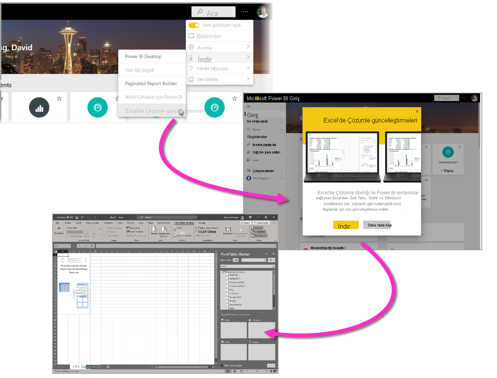
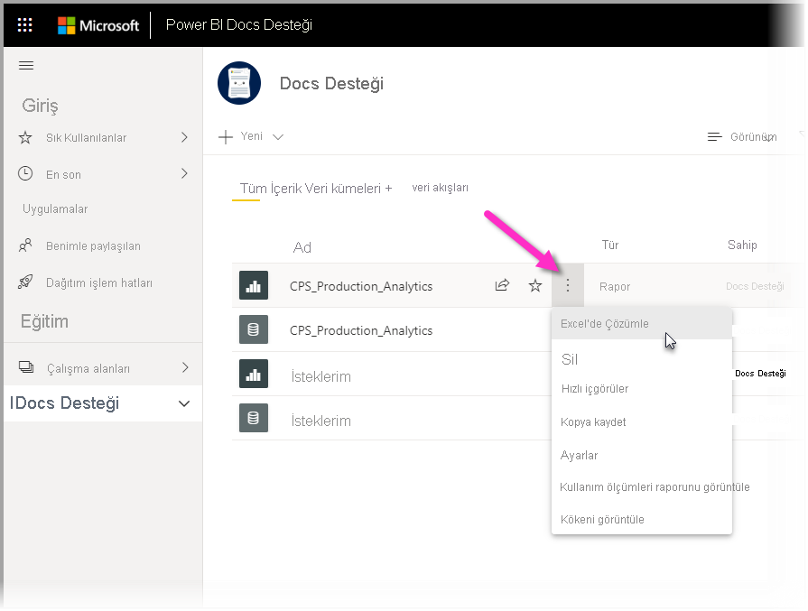
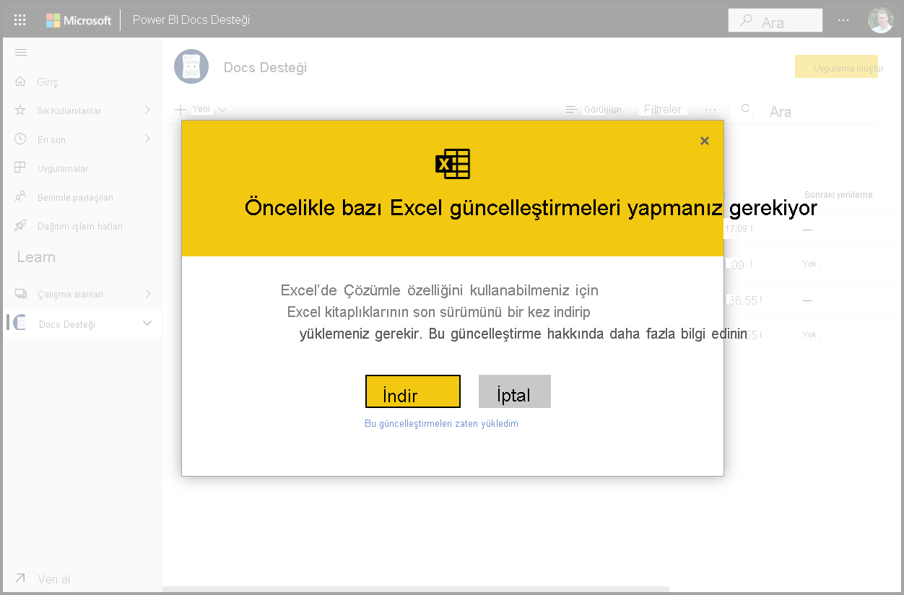
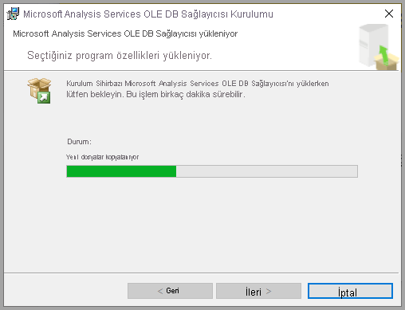
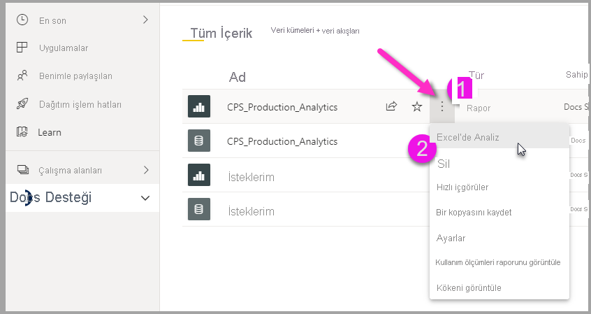
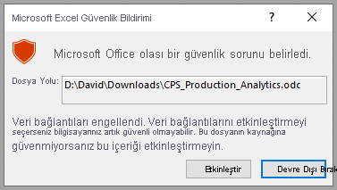
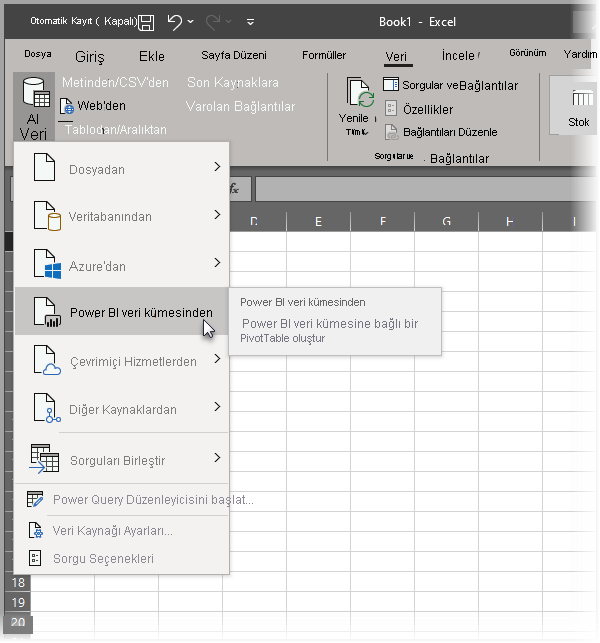

# Excel’de çözümleme
**Excel’de Çözümle** ile Power BI veri kümelerini Excel’e getirebilir, ardından PivotTable’ları, grafikleri, dilimleyicileri ve diğer Excel özelliklerini kullanarak bu verileri görüntüleyebilir ve bunlarla etkileşimli çalışabilirsiniz. **Excel’de Çözümle** özelliğini kullanmak için önce özelliği Power BI’dan indirmeniz, yüklemeniz ve ardından Excel’de kullanmak üzere bir veya birden fazla veri kümesi seçmeniz gerekir. 

Bu makalede Excel’de Çözümle özelliğini nasıl yükleyip kullanacağınız gösterilir, sınırlamaları açıklanır ve sonraki bazı adımlar sağlanır. Şunları öğreneceksiniz:

* [Excel’de Çözümle özelliğini yükleme](#install-analyze-in-excel)
* [Power BI verilerine bağlanma](#connect-to-power-bi-data)
* [Excel’i kullanarak verileri analiz etme](#use-excel-to-analyze-the-data)
* [Çalışma kitabınızı kaydetme ve paylaşma](#saving-and-sharing-your-new-workbook)
* [Gereksinimler](#requirements)

Şimdi işe girişelim ve yükleme işlemini başlatalım.

## Excel’de Çözümle özelliğini yükleme

**Excel’de Çözümle** özelliğini Power BI hizmetinde sağlanan bağlantılardan yüklemeniz gerekir. Power BI bilgisayarınızdaki Excel’in sürümünü algılar ve uygun sürümü (32 bit veya 64 bit) otomatik olarak indirir. Power BI hizmeti, tarayıcı üzerinden çalışır. Aşağıdaki bağlantıyı kullanarak Power BI’da oturum açabilirsiniz:

* [Power BI’da oturum açma](https://app.powerbi.com)

Oturum açtıktan sonra Power BI hizmeti tarayıcınızda çalışırken sağ üst köşedeki **Diğer seçenekler** öğesini (...) seçin ve sonra da **İndir > Excel'de Çözümle güncelleştirmeleri**’ni seçin. Bu menü öğesi Excel’de Çözümle güncelleştirmelerinin yeni yüklemeleri için geçerlidir.

Alternatif olarak, Power BI hizmetinde analiz etmek istediğiniz veri kümesine gidebilir ve veri kümesi, rapor veya başka bir Power BI öğesi için **Diğer seçenekler**’i seçebilirsiniz. Aşağıdaki resimde gösterildiği gibi, görüntülenen menüde **Excel’de Çözümle**’yi seçin.

Her iki şekilde de Power BI Excel’de Çözümle özelliğini yükleyip yüklemediğinizi algılar, yüklemediyseniz indirmeniz istenir. 

İndirmeyi seçerseniz Power BI yüklediğiniz Excel’in sürümünü algılar ve Excel’de Çözümle yükleyicisinin uygun sürümünü indirir. Tarayıcınızın alt kısmında veya tarayıcı indirmenin ilerleme durumunu gösterdiği konumda indirme durumunu görürsünüz. 

İndirme işlemi tamamlandığında yükleyiciyi (.msi) çalıştırarak Excel’de Çözümle’yi yükleyin. Yükleme işleminin adı Excel’de Çözümle özelliğinin adından farklıdır; bu ad **Microsoft Analysis Services OLE DB Sağlayıcısı** veya benzer bir ad olacaktır.

Tamamlandıktan sonra Power BI hizmetinde bir rapor (veya başka bir Power BI veri öğesi, örneğin bir veri kümesi) seçip bunu Excel’de analiz etmeye hazır olursunuz.

## Power BI verilerine bağlanma

Power BI hizmetinde Excel’de analiz etmek istediğiniz veri kümesine veya rapora gidin ve **Diğer seçenekler** menüsünü (...) seçerek **Excel’de Çözümle** menü seçeneğini bulun. Aşağıdaki resimde rapor seçimi gösterilir.

Veri kümesini Power BI hizmetinden Excel’e alma işlemi birkaç adımdan oluşur:

1. **Diğer seçenekler** menüsünü seçin.
2. Görüntülenen menü öğeleri arasından **Excel’de Çözümle** öğesini seçin.

    Ardından Power BI hizmeti, veri kümesinin **Excel’de Çözümle** özelliğiyle kullanılmak üzere tasarlanan (ve yapılandırılan), .ODC dosya uzantısına sahip bir dosyasını oluşturur. Dosya oluşturulur ve tarayıcınızda otomatik olarak bir indirme işlemi başlar.
    
    
    
    Dosya adı, türetildiği veri kümesi (ya da rapor veya başka bir veri kaynağı) ile eşleşir. Bu nedenle raporun adı *Latest-Sales* olduğunda indirilen dosya **Latest-Sales.ODC** olacaktır.

3. .ODC dosyasını başlatma

Dosya zaten **Excel’de Çözümle** özelliğiyle ilişkilendirilmiştir, dolayısıyla bu .ODC dosyasını seçtiğinizde veya başlattığınızda Excel başlatılır ve otomatik olarak .ODC dosyasını yüklemeye başlar. Bununla birlikte büyük olasılıkla bir dış veri kaynağı tehdidi hakkında uyarı görürsünüz:

**Excel’de Çözümle** özelliğine .ODC dosyasını yüklemek için **Etkinleştir**’i seçin; Excel dosyayı yükler. 

## Excel’i kullanarak verileri analiz etme

Siz Güvenlik Bildirimi’nde **Etkinleştir**’i seçerek .ODC dosyasının yüklenmesine izin verdikten sonra, Excel size Power BI’dan boş ve analiz edilmeye hazır bir **PivotTable** ve **Alanlar** listesi gösterir.

.ODC dosyası, Power BI'daki veri kümenize bağlanan bir MSOLAP bağlantı dizesi içeriyor. Siz verilerle çalışırken veya verileri çözümlerken Excel, söz konusu veri kümesini Power BI'da sorgular ve sonuçları Excel'e döndürür. Söz konusu veri kümesi DirectQuery kullanarak canlı bir veri kaynağına bağlanırsa Power BI, veri kaynağını sorgular ve sonuçları Excel'e döndürür.

Power BI’daki verilere bağlantı artık kurulduğundan, Excel'de tıpkı yerel bir veri kümesiyle çalışır gibi söz konusu veritabanını analiz edebilir, PivotTable'lar ve grafikler oluşturabilirsiniz.

**Excel’de Çözümle**, özellikle şu veri kaynaklarına bağlanan veri kümeleri ve raporlar için yararlıdır:

* *Analysis Services Tablosal* veya *Çok Boyutlu* veri kaynakları
* Veri Çözümleme İfadeleri (DAX) kullanılarak oluşturulan model ölçülerinin bulunduğu veri modelleri içeren Excel çalışma kitapları veya Power BI Desktop dosyaları.

> [!IMPORTANT]
> **Excel'de Çözümle** özelliğinin kullanılması, verileri tüm ayrıntı düzeylerinde veri kümesine erişim izni olan tüm kullanıcıların kullanımına sunar.

Excel’de Çözümle özelliğini kullanmaya başladığınızda dikkate alınması gereken ve çözülmesi için fazladan bir veya iki adım gerektirebilen bir dizi öğe vardır. Bu olasılıklar aşağıdaki bölümlerde açıklanmıştır. 

### Power BI'da oturum açma
Tarayıcınız üzerinden Power BI'da oturum açmış olsanız da ilk kez Excel'de yeni bir .ODC dosyasını açtığınız zaman Power BI hesabınızla Power BI'da oturum açmanız istenebilir. Bu, Excel ile Power BI arasındaki bağlantının kimliğini doğrular.

### Birden çok Power BI hesabı olan kullanıcılar
Bazı kullanıcıların birden fazla Power BI hesabı vardır. Siz de bunlardan biriyseniz, bir hesapla Power BI’da oturum açmış olabilirsiniz ama Excel’de Çözülme özelliğinde kullanılan veri kümesine erişimizin olan hesap diğer hesabınız olabilir. Bu durumda, bir **Yasak** hatası ya da Excel'de Çözümle'de kullanılmakta olan bir veri kümesine erişim sağlamaya çalışırken oturum açma hatası görebilirsiniz.

Bu durum gerçekleşirse yeniden oturum açma fırsatı size sağlanacaktır. Bu fırsat sağlandığında, Excel'de Çözümle'nin erişmekte olduğu veri kümesine erişimi olan Power BI hesabınızla oturum açabilirsiniz. Ayrıca Excel'deki üst şeritte, şu anda oturum açılan hesabı belirleyen adınızı da seçebilirsiniz. Oturumu kapatın ve diğer hesabınızla yeniden oturum açın.

## Yeni çalışma kitabınızı kaydetme ve paylaşma

Power BI veri kümesiyle oluşturduğunuz Excel çalışma kitabını, aynı diğer çalışma kitapları gibi **kaydedebilirsiniz**. Ancak Power BI'da yayımlanabilen ve içeri aktarılabilen çalışma kitapları sadece veriyi tablolarda bulunduran veya bir veri modeli olan çalışma kitapları olabileceği için çalışma kitabını Power BI'da yayımlayamazsınız veya içeri aktaramazsınız. Yeni çalışma kitabının Power BI'daki veri kümesine sadece bağlantısı olduğundan, bu çalışma kitabını Power BI'da yayımlamak veya içeri aktarmak, yerimizde saymak olur.

Çalışma kitabınızı kaydettikten sonra kuruluşunuzdaki diğer Power BI kullanıcılarıyla paylaşabilirsiniz. 

Çalışma kitabınızı paylaştığınız bir kullanıcı bunu açtığında, PivotTable'larınızı ve verilerinizi çalışma kitabının en son kaydedilme anındaki gibi görür ve bu, verilerin son sürümü olmayabilir. En son verileri almak için kullanıcıların **Veri** şeridindeki **Yenile** düğmesini kullanmaları gerekir. Çalışma kitabı Power BI'daki bir veri kümesine bağlandığı için, çalışma kitabını yenilemeye çalışan kullanıcıların Power BI'da oturum açması ve bu yöntemle ilk kez güncelleştirme yapacakları zaman gerekli Excel güncelleştirmelerini yüklemesi gerekir.

Kullanıcıların veri kümesini yenilemeleri gerektiğinden ve Excel Online'da dış bağlantıları yenileme desteklenmediğinden kullanıcıların çalışma kitabını bilgisayarlarındaki Excel masaüstü sürümüyle açması önerilir.

> [!NOTE]
> Power BI kiracılarının yöneticileri, *Power BI Yönetici Portalı*'nı kullanarak, Analysis Services (AS) veritabanlarında barındırılan şirket içi veri kümelerinde **Excel'de Çözümle** kullanımını devre dışı bırakabilir. Bu seçenek devre dışı bırakıldığında **Excel'de Çözümle** AS veritabanları için devre dışı olur ancak diğer veri kümeleri için kullanılabilir olmaya devam eder.

## Excel’den Power BI veri kümelerine erişmenin diğer yolları
Belirli Office SKU’larına sahip kullanıcılar Excel’deki **Veri Al** özelliğini kullanarak da Excel’in içinden Power BI veri kümelerine bağlanabilir. SKU’nuz bu özelliği desteklemiyorsa **Veri Al** menü seçeneği görüntülenmez.

Aşağıdaki resimde gösterildiği gibi **Veri** şerit menüsünde **Veri Al > Power BI veri kümesinden** öğesini seçin.

Bir bölme görüntülenir. Bu bölmede erişiminiz olan veri kümelerine göz atabilir, veri kümelerinin onaylandığını veya yükseltildiğini görebilir ve söz konusu veri kümelerine veri koruma etiketlerinin uygulanıp uygulanmadığını saptayabilirsiniz. 

Verileri bu yolla Excel’e alma hakkında daha fazla bilgi için, Excel belgelerinde [Power BI veri kümelerinden PivotTable oluşturma](https://support.office.com/article/31444a04-9c38-4dd7-9a45-22848c666884) konusuna bakın.

Ayrıca Excel’de **Veri Türleri** galerisindeki **öne çıkan tablolara** erişebilirsiniz. Öne çıkan tablolar hakkında daha fazla bilgi edinmek ve bu tablolara erişmeyi öğrenmek için bkz. [Excel’de Power BI öne çıkan tablolarına erişme (önizleme)](service-excel-featured-tables.md).

## Gereksinimler
**Excel'de Çözümle**'yi kullanmak için birkaç gereksinim vardır:

* **Excel'de Çözümle**, Microsoft Excel 2010 SP1 ve sonraki sürümlerde desteklenir.

* Excel PivotTable'ları, sayısal alanların sürükle ve bırak ile toplama özelliğini desteklemez. Power BI'daki veri kümenizin *önceden tanımlanmış ölçülere sahip olması gerekir*. [Ölçü oluşturma](../transform-model/desktop-measures.md) hakkında bilgi edinin.
* Bazı kuruluşların Grup İlkesi kuralları, Excel'e gerekli olan **Excel'de Çözümle** güncelleştirmelerinin yüklenmesini engelleyebilir. Güncelleştirmeleri yükleyemiyorsanız yöneticinizle görüşün.
* **Excel'de Çözümle** özelliği, veri kümesinin Power BI Premium’da olmasını veya kullanıcının Power BI Pro lisansına sahip olmasını gerektirir. Lisans türleri arasındaki işlevsellik farkları hakkında daha fazla bilgi edinmek için _Power BI fiyatlandırması_ konusunun [Power BI özelliklerinin karşılaştırması](https://powerbi.microsoft.com/pricing/) bölümüne bakın.
* Kullanıcılar, temel alınan veri kümesi üzerinde izinleri varsa Excel’de Çözümle özelliği aracılığıyla veri kümelerine bağlanabilir.  Kullanıcı bu izine; veri kümesini içeren çalışma alanında Üye rolüne sahip olmak, veri kümesini kullanan bir raporun veya panonun kendileriyle paylaşılması veya veri kümesini içeren bir çalışma alanında veya uygulamada veri kümesi için Oluşturma iznine sahip olmak gibi birkaç yöntemle sahip olabilir. [Veri kümeleri için oluşturma izni](../connect-data/service-datasets-build-permissions.md) hakkında daha fazla bilgi edinin.
* Konuk kullanıcılar, başka bir kiracıdan gönderilen (kaynaklanan) veri kümeleri için **Excel’de Çözümle** özelliğini kullanamaz. 
* **Excel’de Çözümle** bir Power BI hizmeti özelliğidir ve Power BI Rapor Sunucusu’nda veya Power BI Embedded’da sunulmaz. 
* **Excel’de Çözümle** seçeneği yalnızca Microsoft Windows çalıştıran bilgisayarlarda desteklenir.

**Excel’de Çözümle** özelliğini kaldırması gereken kullanıcılar için, Windows bilgisayarındaki **Program ekle veya kaldır** sistem ayarı kullanılarak bu yapılabilir.

## Sorun giderme
Excel'de Çözümle özelliğini kullanırken beklemediğiniz bir sonuç aldığınız veya özelliğin beklediğiniz şekilde çalışmadığı durumlarla karşılaşabilirsiniz. [Bu sayfada, Excel'de Çözümle özelliği kullanılırken sık karşılaşılan sorunlara çözümler sunulmaktadır](desktop-troubleshooting-analyze-in-excel.md).

## Sonraki adımlar

Aşağıdaki makaleler de ilginizi çekebilir:

* [Power BI Desktop'ta çapraz rapor detaylandırma özelliğini kullanma](../create-reports/desktop-cross-report-drill-through.md)
* [Power BI Desktop’ta dilimleyicileri kullanma](../visuals/power-bi-visualization-slicers.md)
* [Excel'de Çözümleme sorunlarını giderme](desktop-troubleshooting-analyze-in-excel.md)
* [Excel’de Power BI öne çıkan tablolarına erişme (önizleme)](service-excel-featured-tables.md).

