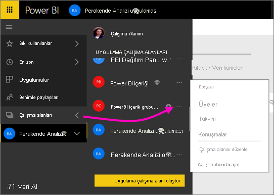
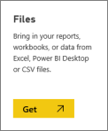

# Power BI çalışma alanınız için OneDrive'da depolanan dosyalara bağlanma
[Power BI'da bir çalışma alanı oluşturduğunuzda](service-create-workspaces.md) ilişkilendirilmiş bir OneDrive İş kaynağına sahip bir Microsoft 365 grubu da oluşturmuş olursunuz. Bu makalede Excel, CSV ve Power BI Desktop dosyalarınızı ilgili OneDrive İş kaynağında depolama ve güncel tutma adımları açıklanmaktadır. Bu güncelleştirmeler dosyalara bağlı olarak Power BI raporlarına ve panolarına otomatik olarak yansır.

> [!NOTE]
> Yeni çalışma alanı deneyimi, Power BI çalışma alanlarıyla Microsoft 365 grupları arasındaki ilişkileri değiştiriyor. Yeni çalışma alanlarından birini her oluşturduğunuzda otomatik olarak bir Microsoft 365 grubu oluşturmazsınız. [Yeni çalışma alanları oluşturma](service-create-the-new-workspaces.md) hakkında bilgi edinin

Çalışma alanınıza dosya eklemek iki adımlı bir işlemdir: 

1. Çalışma alanınız için öncelikle [OneDrive İş'e dosyaları yüklersiniz](#1-upload-files-to-the-onedrive-for-business-for-your-workspace).
2. Ardından [Power BI'da bu dosyalara bağlanırsınız](#2-import-excel-files-as-datasets-or-as-excel-online-workbooks).

> [!NOTE]
> Çalışma alanları yalnızca bir [Power BI Pro lisansı](../fundamentals/service-features-license-type.md) ile kullanılabilir.
> 

## 1 Çalışma alanınız için OneDrive İş'e dosya yükleme
1. Power BI hizmetinde Çalışma Alanı'nın yanındaki oku ve ardından çalışma alanı adınızın yanındaki üç nokta ( **…** ) simgesini seçin. 
   
   
2. Microsoft 365'te çalışma alanınız için OneDrive İş'i açmak üzere **Dosyalar**'ı seçin.
   
   > [!NOTE]
   > Çalışma alanı menüsünde **Dosyalar**'ı görmüyorsanız çalışma alanınız için OneDrive İş'i açmak üzere **Üyeler**'i seçin. Burada, **Dosyalar** seçeneğini belirleyin. Microsoft 365, uygulamanızın grup çalışma alanı dosyaları için bir OneDrive depolama konumu ayarlar. Bu işlem biraz zaman alabilir.
   > 
   > 
3. Buradan çalışma alanınız için OneDrive İş'e dosyalarınızı yükleyebilirsiniz. **Karşıya Yükle**'yi seçip dosyalarınıza gidin.
   
   

## 2 Excel dosyalarını veri kümeleri veya Excel Online çalışma kitapları olarak içeri aktarma
Dosyalarınız artık çalışma alanınız için OneDrive İş'te olduğuna göre bir tercih yapabilirsiniz. Seçenekleriniz şunlardır: 

* [Excel çalışma kitabından verileri bir veri kümesi olarak içeri aktarın](../connect-data/service-get-data-from-files.md). Ardından web tarayıcısında veya mobil cihazlarda görüntüleyebileceğiniz raporlar ile panolar oluşturmak için verileri kullanın.
* [Power BI'da Excel çalışma kitabının tamamına bağlanma](../connect-data/service-excel-workbook-files.md) ve bu çalışma kitabını tam olarak Excel Online'da göründüğü şekilde görüntüleme.

### Çalışma alanınızdaki dosyaları içeri aktarma veya bu dosyalara bağlanma
1. Power BI'da, çalışma alanı adının sol üst köşede bulunduğu çalışma alanına geçin. 
2. Gezinti bölmesinin alt kısmında bulunan **Veri Al**'ı seçin. 
   
   
3. **Dosyalar** kutusunda **Al**'ı seçin.
   
   
4. **OneDrive** - *Çalışma Alanı Adınız*'ı seçin.
   
    
5. İstediğiniz dosyayı seçip **Bağlan** seçeneğini belirleyin.
   
    Bu noktada [Excel çalışma kitabındaki verileri içeri aktarmak](../connect-data/service-get-data-from-files.md) veya [Excel çalışma kitabının tamamına bağlanmak](../connect-data/service-excel-workbook-files.md) istediğinize karar verin.
6. **İçeri Aktar** veya **Bağlan** seçeneğini belirleyin.
   
    
7. **İçeri Aktar** seçeneğini belirlerseniz çalışma kitabı **Veri Kümeleri** sekmesinde görünür. 
   
    
   
    **Bağlan** seçeneğini belirlerseniz çalışma kitabı **Çalışma Kitapları** sekmesinde yer alır.
   
    

## Sonraki adımlar
* [Power BI'da uygulama ve çalışma alanı oluşturma](../collaborate-share/service-create-distribute-apps.md)
* [Excel çalışma kitaplarındaki verileri içeri aktarma](../connect-data/service-get-data-from-files.md)
* [Excel çalışma kitaplarının tamamına bağlanma](../connect-data/service-excel-workbook-files.md
* Başka bir sorunuz mu var? [Power BI Topluluğu'na başvurun](https://community.powerbi.com/)
* Geri bildirimde bulunmak ister misiniz? [Power BI Ideas](https://ideas.powerbi.com/forums/265200-power-bi) sayfasını ziyaret edin
